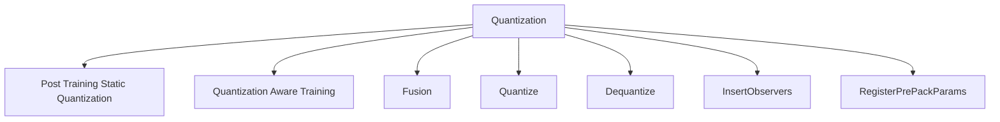

# Introduction to Quantization

Quantization refers to techniques for performing computations and storing tensors at lower bitwidths than floating point precision. A quantized model executes some or all of the operations on tensors with reduced precision rather than full precision (floating point) values. This allows for a more compact model representation and the use of high-performance vectorized operations on many hardware platforms. <SwmToken path="tools/nightly.py" pos="306:1:1" line-data="    pytorch, platform = &quot;&quot;, &quot;&quot;">`pytorch`</SwmToken> supports <SwmToken path="torch/_C/_onnx.pyi" pos="11:1:1" line-data="    INT8 = ...">`INT8`</SwmToken> quantization compared to typical <SwmToken path="torch/ao/ns/fx/utils.py" pos="26:1:1" line-data="    FP32 = enum.auto()  # torch.float">`FP32`</SwmToken> models, allowing for a 4x reduction in model size and memory bandwidth requirements. Hardware support for <SwmToken path="torch/_C/_onnx.pyi" pos="11:1:1" line-data="    INT8 = ...">`INT8`</SwmToken> computations is typically 2 to 4 times faster compared to <SwmToken path="torch/ao/ns/fx/utils.py" pos="26:1:1" line-data="    FP32 = enum.auto()  # torch.float">`FP32`</SwmToken> compute. Quantization is primarily a technique to speed up inference, and only the forward pass is supported for quantized operators.

# Post Training Static Quantization

Post-training static quantization involves preparing the model, calibrating it, and then converting it to a quantized version. This method is useful when you have a pre-trained model and want to optimize it for inference without retraining.

# Quantization Aware Training

Quantization-aware training involves preparing the model for training with quantization, running the training loop, and then converting the trained model to a quantized version. This method is beneficial when you want to maintain higher accuracy by simulating quantization effects during training.

# Fusion

Fusion is a technique used in quantization to combine multiple operations into a single operation to improve performance. For example, combining convolution and batch normalization layers can reduce the computational overhead and improve inference speed.

# Main Functions

There are several main functions in quantization. Some of them are Quantize and Dequantize. We will dive a little into Quantize and Dequantize.

## Quantize

The <SwmToken path="torch/backends/_nnapi/serializer.py" pos="110:1:1" line-data="    QUANTIZE = 72">`QUANTIZE`</SwmToken> function converts a floating-point tensor to a quantized tensor. This can be done per tensor, per channel, or dynamically. This function is essential for reducing the model size and improving inference speed.

## Dequantize

The <SwmToken path="torch/backends/_nnapi/serializer.py" pos="44:1:1" line-data="    DEQUANTIZE = 6">`DEQUANTIZE`</SwmToken> function converts a quantized tensor back to a floating-point tensor. This is useful for operations that require floating-point precision.

# Quantization <SwmToken path="test/functorch/discover_coverage.py" pos="91:1:1" line-data="    apis = get_public_overridable_apis()">`apis`</SwmToken>

Quantization <SwmToken path="test/functorch/discover_coverage.py" pos="91:1:1" line-data="    apis = get_public_overridable_apis()">`apis`</SwmToken> provide the necessary tools to implement quantization in your models. Two important <SwmToken path="test/functorch/discover_coverage.py" pos="91:1:1" line-data="    apis = get_public_overridable_apis()">`apis`</SwmToken> are <SwmToken path="torch/csrc/jit/passes/quantization/insert_observers.h" pos="38:4:4" line-data="TORCH_API Module InsertObservers(">`InsertObservers`</SwmToken> and <SwmToken path="torch/csrc/jit/passes/quantization/register_packed_params.h" pos="12:11:11" line-data="TORCH_API std::unordered_set&lt;std::string&gt; RegisterPrePackParams(">`RegisterPrePackParams`</SwmToken>.

<SwmSnippet path="/torch/csrc/jit/passes/quantization/insert_observers.h" line="38">

---

## <SwmToken path="torch/csrc/jit/passes/quantization/insert_observers.h" pos="38:4:4" line-data="TORCH_API Module InsertObservers(">`InsertObservers`</SwmToken>

The <SwmToken path="torch/csrc/jit/passes/quantization/insert_observers.h" pos="38:4:4" line-data="TORCH_API Module InsertObservers(">`InsertObservers`</SwmToken> function inserts observer modules and observer function calls for tensors that need to be observed. This is crucial for quantization as it allows the model to collect statistics on the tensors during the forward pass, which are later used to determine the quantization parameters.

```c
TORCH_API Module InsertObservers(
    Module& module,
    const std::string& method_name,
    const QConfigDict& qconfig_dict,
    bool inplace,
    QuantType quant_type = QuantType::STATIC);
```

---

</SwmSnippet>

<SwmSnippet path="/torch/csrc/jit/passes/quantization/register_packed_params.h" line="12">

---

## <SwmToken path="torch/csrc/jit/passes/quantization/register_packed_params.h" pos="12:11:11" line-data="TORCH_API std::unordered_set&lt;std::string&gt; RegisterPrePackParams(">`RegisterPrePackParams`</SwmToken>

The <SwmToken path="torch/csrc/jit/passes/quantization/register_packed_params.h" pos="12:11:11" line-data="TORCH_API std::unordered_set&lt;std::string&gt; RegisterPrePackParams(">`RegisterPrePackParams`</SwmToken> function registers pre-packed parameters for a given module and method. This is used to optimize the model by pre-packing weights and other parameters, which can then be reused during inference to speed up computation.

```c
TORCH_API std::unordered_set<std::string> RegisterPrePackParams(
    Module& m,
    const std::string& method_name,
    const PrePackParamFilterFn& is_packed_param,
    const std::string& attr_prefix);
```

---

</SwmSnippet>

&nbsp;

*This is an auto-generated document by Swimm AI 🌊 and has not yet been verified by a human*

<SwmMeta version="3.0.0" repo-id="Z2l0aHViJTNBJTNBcHl0b3JjaC1hdXRvZG9jcy1kZW1vJTNBJTNBU3dpbW0tRGVtbw==" repo-name="pytorch-autodocs-demo"><sup>Powered by [Swimm](/)</sup></SwmMeta>
