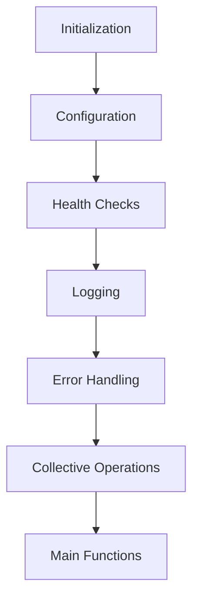

# Getting Started with Unified Communication X Process Group

The UCC Process Group is a component within the <SwmToken path="test/inductor/test_snode_runtime.py" pos="17:0:0" line-data="c10d = torch.ops.c10d_functional">`c10d`</SwmToken> namespace that facilitates collective communication operations using the Unified Communication X (UCX) library. It manages the configuration and initialization of communication resources, ensuring efficient data transfer across different devices, including CPUs and <SwmToken path="torch/csrc/distributed/c10d/ProcessGroupUCC.cpp" pos="1199:3:3" line-data="            &quot; GPUs available. &quot;,">`GPUs`</SwmToken>. The UCC Process Group also handles various collective operations such as allgather, allreduce, and broadcast, providing a unified interface for these operations. It includes mechanisms for error handling, logging, and health checks to ensure robust and reliable communication. The UCC Process Group is designed to optimize performance by sharing communication resources among multiple process groups and using advanced techniques like allgatherv.

## Configuration and Initialization

The <SwmToken path="torch/csrc/distributed/c10d/ProcessGroupUCC.cpp" pos="209:0:0" line-data="ProcessGroupUCC::WorkUCC::~WorkUCC() {">`ProcessGroupUCC`</SwmToken> constructor initializes the communication resources and reads the configuration settings.

<SwmSnippet path="/torch/csrc/distributed/c10d/ProcessGroupUCC.cpp" line="566">

---

The <SwmToken path="torch/csrc/distributed/c10d/ProcessGroupUCC.cpp" pos="566:0:0" line-data="ProcessGroupUCC::ProcessGroupUCC(">`ProcessGroupUCC`</SwmToken> constructor initializes the communication resources and reads the configuration settings.

```c++
ProcessGroupUCC::ProcessGroupUCC(
    const c10::intrusive_ptr<Store>& store,
    int rank,
    int size,
    std::chrono::duration<float> timeout)
    : Backend(rank, size), timeout_(timeout) {
  c10::call_once(torch_ucc_config.flag, read_config);
  oob = std::make_shared<torch_ucc_oob_coll_info_t>();
  oob->rank = rank;
  oob->size = size;
  oob->store = store;
  comm = nullptr;
  cuda_ee = nullptr;
  static uint32_t id = 0;
  uint32_t pg_id = id++;

  logger = c10::make_intrusive<ProcessGroupUCCLogger>(
      c10::str("[Rank ", rank_, "]", "[ProcessGroupUCC-", pg_id, "]"),
      TORCH_UCC_INIT);
  TORCH_UCC_LOG_INFO(
      TORCH_UCC_INIT,
```

---

</SwmSnippet>

## Health Checks

The <SwmToken path="torch/csrc/distributed/c10d/ProcessGroupUCC.cpp" pos="654:4:4" line-data="void ProcessGroupUCC::runHealthCheck() {">`runHealthCheck`</SwmToken> function performs health checks to ensure that the communication resources are functioning correctly.

<SwmSnippet path="/torch/csrc/distributed/c10d/ProcessGroupUCC.cpp" line="654">

---

The <SwmToken path="torch/csrc/distributed/c10d/ProcessGroupUCC.cpp" pos="654:4:4" line-data="void ProcessGroupUCC::runHealthCheck() {">`runHealthCheck`</SwmToken> function performs health checks to ensure that the communication resources are functioning correctly.

```c++
void ProcessGroupUCC::runHealthCheck() {
  // Run health check in a separate thread and wait on CV to handle timeouts.
  // This design allows us to handle hangs.

  // When size_ is 1, there is no need to do any communication at all.
  if (size_ == 1)
    return;

  struct HealthCheckData {
    std::mutex healthCheckMutex;
    std::condition_variable healthCheckCv;
    bool uccHealthCheckSuccess = false;
    std::exception_ptr healthCheckException;
  } healthCheckData;

  auto t = std::thread([&healthCheckData, this]() {
    std::list<c10::Device> devices{c10::kCPU};
#ifdef USE_CUDA
    c10::cuda::OptionalCUDAGuard gpuGuard;
    if (at::cuda::is_available()) {
      devices.emplace_front(getCUDADeviceForRank(rank_));
```

---

</SwmSnippet>

## Logging

The <SwmToken path="torch/csrc/distributed/c10d/UCCTracing.cpp" pos="15:4:4" line-data="void ProcessGroupUCCLogger::initCommsTracer() {">`initCommsTracer`</SwmToken> function initializes the communication tracer for logging purposes.

<SwmSnippet path="/torch/csrc/distributed/c10d/UCCTracing.cpp" line="15">

---

The <SwmToken path="torch/csrc/distributed/c10d/UCCTracing.cpp" pos="15:4:4" line-data="void ProcessGroupUCCLogger::initCommsTracer() {">`initCommsTracer`</SwmToken> function initializes the communication tracer for logging purposes.

```c++
void ProcessGroupUCCLogger::initCommsTracer() {
  trace_generator = std::make_shared<CommTraceLogger>();
  initialized_CommTraceLogger = true;
}
```

---

</SwmSnippet>

## Error Handling

The `~WorkUCC` destructor handles the cleanup of resources and ensures that any exceptions are properly managed.

<SwmSnippet path="/torch/csrc/distributed/c10d/ProcessGroupUCC.cpp" line="209">

---

The `~WorkUCC` destructor handles the cleanup of resources and ensures that any exceptions are properly managed.

```c++
ProcessGroupUCC::WorkUCC::~WorkUCC() {
#ifdef USE_CUDA
  if (fence && ep) {
    std::lock_guard<std::mutex> lock(ep->event_pool_mutex);
    ep->event_pool.push(std::move(fence));
  }
#endif
}
```

---

</SwmSnippet>

## Collective Operations

The <SwmToken path="torch/csrc/distributed/c10d/ProcessGroupUCC.cpp" pos="855:9:9" line-data="c10::intrusive_ptr&lt;Work&gt; ProcessGroupUCC::allgather(">`allgather`</SwmToken> function is an example of a collective operation managed by the UCC Process Group.

<SwmSnippet path="/torch/csrc/distributed/c10d/ProcessGroupUCC.cpp" line="855">

---

The <SwmToken path="torch/csrc/distributed/c10d/ProcessGroupUCC.cpp" pos="855:9:9" line-data="c10::intrusive_ptr&lt;Work&gt; ProcessGroupUCC::allgather(">`allgather`</SwmToken> function is an example of a collective operation managed by the UCC Process Group.

```c++
c10::intrusive_ptr<Work> ProcessGroupUCC::allgather(
    std::vector<std::vector<at::Tensor>>& outputTensors,
    std::vector<at::Tensor>& inputTensors,
    const AllgatherOptions& /* unused */) {
  auto& tensor = inputTensors[0];
  check_device(tensor.device(), outputTensors[0][0].device());
  initComm(tensor.device());

  if (tensor.device().is_cpu() || torch_ucc_config.use_allgatherv) {
    AllgathervWorkData* data = new AllgathervWorkData(size_);
    for (int i = 0; i < size_; i++) {
      data->recv_lengths[i] = tensor.element_size() * tensor.numel();
      data->recv_offsets[i] = (uint64_t)outputTensors[0][i].data_ptr();
    }
    ucc_coll_args_t coll;
    coll.mask = UCC_COLL_ARGS_FIELD_FLAGS;
    coll.flags =
        UCC_COLL_ARGS_FLAG_COUNT_64BIT | UCC_COLL_ARGS_FLAG_DISPLACEMENTS_64BIT;
    coll.coll_type = UCC_COLL_TYPE_ALLGATHERV;
    coll.src.info.buffer = tensor.data_ptr();
    coll.src.info.count = tensor.element_size() * tensor.numel();
```

---

</SwmSnippet>

## Main Functions

There are several main functions in this folder. Some of them are <SwmToken path="torch/csrc/distributed/c10d/ProcessGroupUCC.cpp" pos="63:2:2" line-data="ucc_reduction_op_t to_ucc_reduceOp(">`to_ucc_reduceOp`</SwmToken>, <SwmToken path="torch/csrc/distributed/c10d/ProcessGroupUCC.cpp" pos="150:2:2" line-data="void read_config() {">`read_config`</SwmToken>, <SwmToken path="torch/csrc/distributed/c10d/ProcessGroupUCC.cpp" pos="764:9:9" line-data="c10::intrusive_ptr&lt;Work&gt; ProcessGroupUCC::collective_post(">`collective_post`</SwmToken>, <SwmToken path="torch/csrc/distributed/c10d/ProcessGroupUCC.cpp" pos="855:9:9" line-data="c10::intrusive_ptr&lt;Work&gt; ProcessGroupUCC::allgather(">`allgather`</SwmToken>, <SwmToken path="torch/csrc/distributed/c10d/ProcessGroupUCC.cpp" pos="997:9:9" line-data="c10::intrusive_ptr&lt;Work&gt; ProcessGroupUCC::allreduce(">`allreduce`</SwmToken>, <SwmToken path="torch/csrc/distributed/c10d/ProcessGroupUCC.cpp" pos="1180:9:9" line-data="c10::intrusive_ptr&lt;Work&gt; ProcessGroupUCC::barrier(const BarrierOptions&amp; opts) {">`barrier`</SwmToken>, <SwmToken path="torch/distributed/_tensor/ops/_view_ops.py" pos="69:2:2" line-data="class Broadcast(DimSpec):">`Broadcast`</SwmToken>, <SwmToken path="torch/backends/_nnapi/serializer.py" pos="89:1:1" line-data="    GATHER = 51">`GATHER`</SwmToken>, <SwmToken path="torch/_C/_distributed_c10d.pyi" pos="373:3:3" line-data="    def reduce(">`reduce`</SwmToken>, <SwmToken path="torch/_inductor/ir.py" pos="648:2:2" line-data="class Scatter(Pointwise):">`Scatter`</SwmToken>, <SwmToken path="torch/_dynamo/symbolic_convert.py" pos="3324:3:3" line-data="    def SEND(self, inst):">`SEND`</SwmToken>, and <SwmToken path="torch/csrc/distributed/c10d/ProcessGroupUCC.cpp" pos="779:10:10" line-data="  if (opType == OpType::RECV) {">`RECV`</SwmToken>.

### <SwmToken path="torch/csrc/distributed/c10d/ProcessGroupUCC.cpp" pos="63:2:2" line-data="ucc_reduction_op_t to_ucc_reduceOp(">`to_ucc_reduceOp`</SwmToken>

<SwmSnippet path="/torch/csrc/distributed/c10d/ProcessGroupUCC.cpp" line="63">

---

The <SwmToken path="torch/csrc/distributed/c10d/ProcessGroupUCC.cpp" pos="63:2:2" line-data="ucc_reduction_op_t to_ucc_reduceOp(">`to_ucc_reduceOp`</SwmToken> function maps the <SwmToken path="torch/csrc/distributed/c10d/ProcessGroupUCC.cpp" pos="64:3:3" line-data="    const ReduceOp _op,">`ReduceOp`</SwmToken> to the corresponding UCC reduction operation. It handles different data types and ensures the correct operation is used.

```c++
ucc_reduction_op_t to_ucc_reduceOp(
    const ReduceOp _op,
    const at::ScalarType _dt) {
  if (_dt == at::kBool) {
    if (_op == ReduceOp::SUM) {
      // bitwise or
      return UCC_OP_MAX;
    } else if (_op == ReduceOp::PRODUCT) {
      // bitwise and
      return UCC_OP_MIN;
    } else if (_op == ReduceOp::AVG) {
      TORCH_CHECK(false, "Cannot use ReduceOp.AVG with boolean inputs");
    }
  }

  try {
    return ucc_op_map.at(_op);
  } catch (const std::out_of_range&) {
    TORCH_CHECK(false, "Not supported ReduceOp for UCC");
  }
}
```

---

</SwmSnippet>

### <SwmToken path="torch/csrc/distributed/c10d/ProcessGroupUCC.cpp" pos="150:2:2" line-data="void read_config() {">`read_config`</SwmToken>

<SwmSnippet path="/torch/csrc/distributed/c10d/ProcessGroupUCC.cpp" line="150">

---

The <SwmToken path="torch/csrc/distributed/c10d/ProcessGroupUCC.cpp" pos="150:2:2" line-data="void read_config() {">`read_config`</SwmToken> function reads the configuration settings for the UCC Process Group from environment variables and updates the configuration map accordingly.

```c++
void read_config() {
  // default configuration
  torch_ucc_config.blocking_wait.fill(false);
  torch_ucc_config.use_future = true;
  torch_ucc_config.shared_comm = false;
  torch_ucc_config.use_allgatherv = false;
  torch_ucc_config.enable_health_check = false;
  torch_ucc_config.enable_comms_logger = false;

  // read all torch_ucc env. variables and update the map
  char* env;
  for (auto& torch_ucc_env : torch_ucc_envs_map) {
    env = std::getenv(torch_ucc_env.first.c_str());
    if (env) {
      torch_ucc_envs_map[torch_ucc_env.first] = std::string(env);
    }
  }

  auto blocking_wait_str = torch_ucc_envs_map.at("TORCH_UCC_BLOCKING_WAIT");
  for (auto op : parse_blocking_wait(blocking_wait_str)) {
    torch_ucc_config.blocking_wait[(std::uint8_t)op] = true;
```

---

</SwmSnippet>

### <SwmToken path="torch/csrc/distributed/c10d/ProcessGroupUCC.cpp" pos="764:9:9" line-data="c10::intrusive_ptr&lt;Work&gt; ProcessGroupUCC::collective_post(">`collective_post`</SwmToken>

<SwmSnippet path="/torch/csrc/distributed/c10d/ProcessGroupUCC.cpp" line="764">

---

The <SwmToken path="torch/csrc/distributed/c10d/ProcessGroupUCC.cpp" pos="764:9:9" line-data="c10::intrusive_ptr&lt;Work&gt; ProcessGroupUCC::collective_post(">`collective_post`</SwmToken> function is responsible for posting collective operations. It sets the timeout, prepares the work object, and enqueues the collective operation.

```c++
c10::intrusive_ptr<Work> ProcessGroupUCC::collective_post(
    OpType opType,
    PreProcess preproc,
    PostProcess postproc,
    ucc_coll_args_t& coll,
    std::unique_ptr<ProcessGroupUCC::WorkData> data,
    c10::Device dev,
    std::vector<at::Tensor>& inputTensors,
    std::vector<at::Tensor>& outputTensors,
    const char* prof_title) {
  seq_++;
  set_timeout(coll);
  auto work = c10::make_intrusive<ProcessGroupUCC::WorkUCC>(
      opType, seq_, prof_title, inputTensors, logger);

  if (opType == OpType::RECV) {
    work->sourceRank_ = coll.root;
  }

  RECORD_COMMS_TRACE(
      logger->trace_generator,
```

---

</SwmSnippet>

### allgather

<SwmSnippet path="/torch/csrc/distributed/c10d/ProcessGroupUCC.cpp" line="855">

---

The <SwmToken path="torch/csrc/distributed/c10d/ProcessGroupUCC.cpp" pos="855:9:9" line-data="c10::intrusive_ptr&lt;Work&gt; ProcessGroupUCC::allgather(">`allgather`</SwmToken> function performs the allgather collective operation. It checks the device, initializes the communication, and posts the collective operation.

```c++
c10::intrusive_ptr<Work> ProcessGroupUCC::allgather(
    std::vector<std::vector<at::Tensor>>& outputTensors,
    std::vector<at::Tensor>& inputTensors,
    const AllgatherOptions& /* unused */) {
  auto& tensor = inputTensors[0];
  check_device(tensor.device(), outputTensors[0][0].device());
  initComm(tensor.device());

  if (tensor.device().is_cpu() || torch_ucc_config.use_allgatherv) {
    AllgathervWorkData* data = new AllgathervWorkData(size_);
    for (int i = 0; i < size_; i++) {
      data->recv_lengths[i] = tensor.element_size() * tensor.numel();
      data->recv_offsets[i] = (uint64_t)outputTensors[0][i].data_ptr();
    }
    ucc_coll_args_t coll;
    coll.mask = UCC_COLL_ARGS_FIELD_FLAGS;
    coll.flags =
        UCC_COLL_ARGS_FLAG_COUNT_64BIT | UCC_COLL_ARGS_FLAG_DISPLACEMENTS_64BIT;
    coll.coll_type = UCC_COLL_TYPE_ALLGATHERV;
    coll.src.info.buffer = tensor.data_ptr();
    coll.src.info.count = tensor.element_size() * tensor.numel();
```

---

</SwmSnippet>

### allreduce

<SwmSnippet path="/torch/csrc/distributed/c10d/ProcessGroupUCC.cpp" line="997">

---

The <SwmToken path="torch/csrc/distributed/c10d/ProcessGroupUCC.cpp" pos="997:9:9" line-data="c10::intrusive_ptr&lt;Work&gt; ProcessGroupUCC::allreduce(">`allreduce`</SwmToken> function performs the allreduce collective operation. It checks the tensor, initializes the communication, and posts the collective operation.

```c++
c10::intrusive_ptr<Work> ProcessGroupUCC::allreduce(
    std::vector<at::Tensor>& tensors,
    const AllreduceOptions& opts) {
  check_tensor(tensors);
  auto& tensor = tensors[0];
  initComm(tensor.device());
  WorkData* data = new WorkData();

  ucc_coll_args_t coll;
  coll.mask = UCC_COLL_ARGS_FIELD_FLAGS;
  coll.flags = UCC_COLL_ARGS_FLAG_IN_PLACE;
  coll.coll_type = UCC_COLL_TYPE_ALLREDUCE;
  coll.op = to_ucc_reduceOp(opts.reduceOp, tensor.scalar_type());
  coll.src.info.buffer = nullptr;
  coll.src.info.count = tensor.numel();
  coll.src.info.datatype = to_ucc_dType(tensor);
  coll.src.info.mem_type = to_ucc_memType(tensor.device().type());
  coll.dst.info.buffer = tensor.data_ptr();
  coll.dst.info.count = tensor.numel();
  coll.dst.info.datatype = to_ucc_dType(tensor);
  coll.dst.info.mem_type = to_ucc_memType(tensor.device().type());
```

---

</SwmSnippet>

### barrier

<SwmSnippet path="/torch/csrc/distributed/c10d/ProcessGroupUCC.cpp" line="1180">

---

The <SwmToken path="torch/csrc/distributed/c10d/ProcessGroupUCC.cpp" pos="1180:9:9" line-data="c10::intrusive_ptr&lt;Work&gt; ProcessGroupUCC::barrier(const BarrierOptions&amp; opts) {">`barrier`</SwmToken> function performs the barrier collective operation. It initializes the communication and posts the barrier operation.

```c++
c10::intrusive_ptr<Work> ProcessGroupUCC::barrier(const BarrierOptions& opts) {
  c10::Device device = c10::Device(c10::DeviceType::CPU);
#ifdef USE_CUDA
  auto numGPUs = c10::cuda::device_count();
  if (!opts.device_ids.empty()) {
    device = c10::Device(c10::DeviceType::CUDA, opts.device_ids.front());
  } else if (comm && comm->cuda_device_index != TORCH_UCC_DEVICE_NOT_SET) {
    device = c10::Device(c10::DeviceType::CUDA, comm->cuda_device_index);
  } else if (numGPUs > 0) {
    int8_t deviceIdx = static_cast<int8_t>(c10::cuda::current_device());
    // if current device is 0, likely the device is not set, use the best guess
    if (0 == (int)deviceIdx) {
      deviceIdx = static_cast<int8_t>(this->getRank() % numGPUs);
    }
    TORCH_UCC_LOG_INFO(
        TORCH_UCC_COLL_POST,
        c10::str(
            "post barrier before specifying any GPU while there are ",
            numGPUs,
            " GPUs available. ",
```

---

</SwmSnippet>

&nbsp;

*This is an auto-generated document by Swimm AI 🌊 and has not yet been verified by a human*

<SwmMeta version="3.0.0" repo-id="Z2l0aHViJTNBJTNBcHl0b3JjaC1hdXRvZG9jcy1kZW1vJTNBJTNBU3dpbW0tRGVtbw==" repo-name="pytorch-autodocs-demo"><sup>Powered by [Swimm](https://app.swimm.io/)</sup></SwmMeta>
