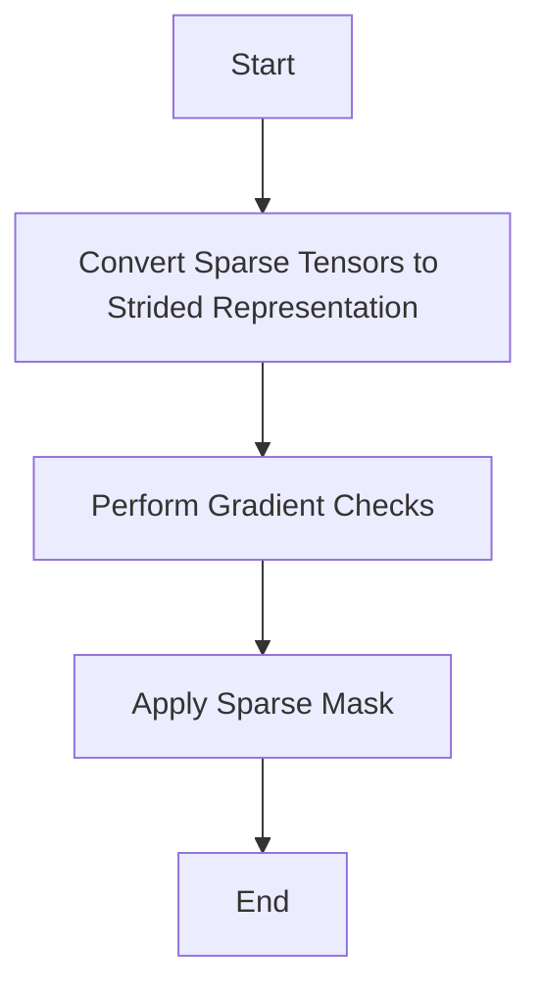

This document will cover the Gradient Checking for Sparse Tensors feature, which includes:

1. Converting Sparse Tensors to Strided Representation
2. Performing Gradient Checks
3. Applying Sparse Mask

Technical document: <SwmLink doc-title="Gradient Checking for Sparse Tensors">[Gradient Checking for Sparse Tensors](/.swm/gradient-checking-for-sparse-tensors.7iqome21.sw.md)</SwmLink>

# [Converting Sparse Tensors to Strided Representation](https://app.swimm.io/repos/Z2l0aHViJTNBJTNBcHl0b3JjaC1hdXRvZG9jcy1kZW1vJTNBJTNBU3dpbW0tRGVtbw==/docs/7iqome21#convert_to_strided_representation)

The first step in the gradient checking process for sparse tensors is to convert them into a strided representation. Sparse tensors are efficient for storing data with many zero values, but for gradient checking, we need to work with a format that supports gradient computations. This conversion ensures that the tensors are compatible with the gradient checking functions. The process involves transforming the sparse tensor into a dense format while retaining the necessary gradient information.

# [Performing Gradient Checks](https://app.swimm.io/repos/Z2l0aHViJTNBJTNBcHl0b3JjaC1hdXRvZG9jcy1kZW1vJTNBJTNBU3dpbW0tRGVtbw==/docs/7iqome21#gradcheck)

Once the sparse tensors are converted to a strided representation, the next step is to perform gradient checks. Gradient checking is a validation technique used to ensure that the gradients computed by the model are correct. This is done by comparing the analytical gradients (computed by the model) with numerical gradients (computed using finite differences). The `gradcheck` function is responsible for this comparison. It takes the function to be checked and its inputs, computes the gradients, and verifies their correctness. This step is crucial for ensuring the reliability of gradient-based optimization algorithms, which are fundamental in training machine learning models.

# [Applying Sparse Mask](https://app.swimm.io/repos/Z2l0aHViJTNBJTNBcHl0b3JjaC1hdXRvZG9jcy1kZW1vJTNBJTNBU3dpbW0tRGVtbw==/docs/7iqome21#sparse_mask)

After performing the gradient checks, the final step is to apply a sparse mask to the tensor. The sparse mask ensures that only the relevant elements of the tensor are retained, effectively filtering out the unnecessary zero values. This step is important for maintaining the efficiency of sparse tensors while ensuring that the gradient information is accurate. The sparse mask operation helps in focusing the computations on the significant parts of the data, thereby optimizing the performance of the model.

&nbsp;

*This is an auto-generated document by Swimm AI 🌊 and has not yet been verified by a human*

<SwmMeta version="3.0.0" repo-id="Z2l0aHViJTNBJTNBcHl0b3JjaC1hdXRvZG9jcy1kZW1vJTNBJTNBU3dpbW0tRGVtbw==" repo-name="pytorch-autodocs-demo">Powered by [Swimm](https://app.swimm.io/)</SwmMeta>
