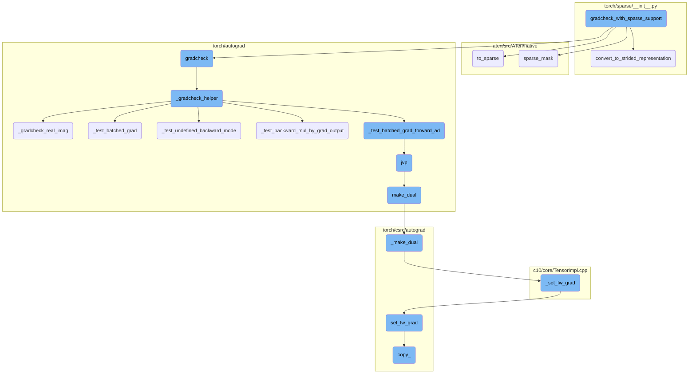
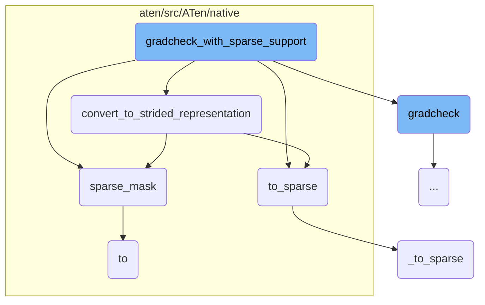
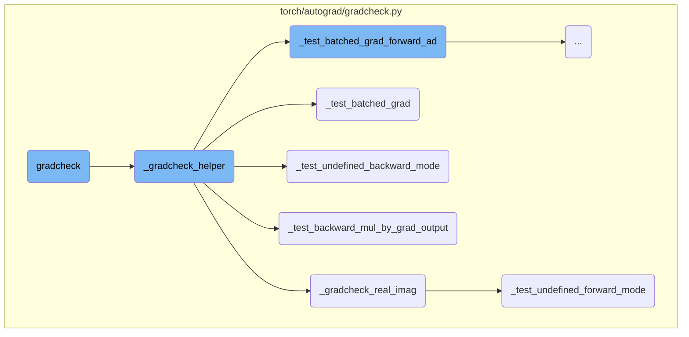
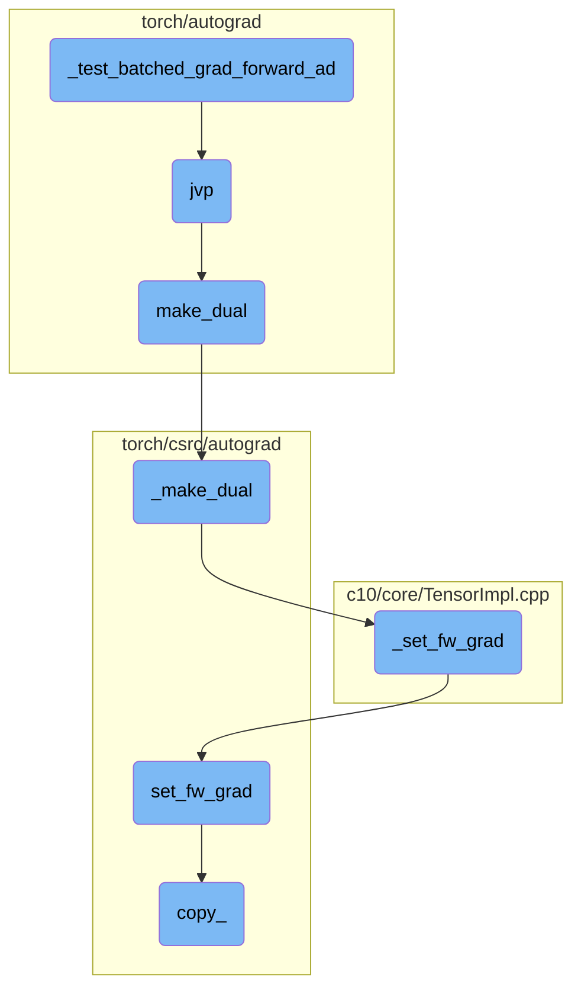

This document provides an overview of the `gradcheck_with_sparse_support` function. It explains how this function is used to handle gradient checking for operations involving sparse tensors. The document also covers the conversion of tensors to a strided representation, the application of sparse masks, and the verification of gradients.

The flow starts with the `gradcheck_with_sparse_support` function, which ensures that inputs are converted to a strided representation necessary for gradient computation. It then converts dense tensors to sparse format if needed and applies sparse masks to zero out unspecified elements. Finally, it verifies the correctness of gradients by comparing numerical and analytical gradients, ensuring that the gradients used in optimization are accurate.

Here is a high level diagram of the flow, showing only the most important functions:



# Flow drill down

First, we'll zoom into this section of the flow:



<SwmSnippet path="/torch/sparse/__init__.py" line="546">

---

## gradcheck_with_sparse_support

The function `gradcheck_with_sparse_support` is designed to handle gradient checking for functions that involve sparse tensors. It ensures that the inputs are converted to a strided representation, which is necessary for gradient computation. This function is crucial for validating the correctness of gradients in operations involving sparse tensors.

```python
    def gradcheck_with_sparse_support(func, inputs, **kwargs):
        """
        Create gradcheck with support for sparse tensors.

        Same as :func:`torch.autograd.gradcheck` but with sparse tensors inputs and outputs support.
        """
        masked = kwargs.pop("masked", False)
        sparse_layouts = {
            torch.sparse_coo,
            torch.sparse_csr,
            torch.sparse_csc,
            torch.sparse_bsr,
            torch.sparse_bsc,
        }
        sparse_compressed_layouts = {
            torch.sparse_csr,
            torch.sparse_csc,
            torch.sparse_bsr,
            torch.sparse_bsc,
        }
        sparse_block_layouts = {torch.sparse_bsr, torch.sparse_bsc}
```

---

</SwmSnippet>

<SwmSnippet path="/torch/sparse/__init__.py" line="569">

---

## convert_to_strided_representation

The function `convert_to_strided_representation` converts differentiable non-strided tensors into a representation that contains differentiable strided tensors. This conversion is essential for performing gradient checks on sparse tensors, as it materializes unspecified elements with zero values and prepares the tensor for gradient computation.

```python
        def convert_to_strided_representation(args):
            """Convert differentiable non-strided tensors to a representation containing differentiable strided tensors."""
            if not isinstance(args, (list, tuple)):
                args = (args,)
            new_args: List[Any] = []
            for obj in args:
                if (
                    isinstance(obj, torch.Tensor)
                    and obj.requires_grad
                    and obj.layout in sparse_layouts
                ):
                    d = dict(layout=obj.layout, shape=obj.shape)
                    if not masked:
                        # Materialize unspecified elements with zero values
                        batch_dim = obj.ndim - obj.dense_dim() - obj.sparse_dim()
                        blocksize = (
                            obj.values().shape[batch_dim + 1 : batch_dim + 3]
                            if obj.layout in sparse_block_layouts
                            else None
                        )
                        full_mask = torch.ones(
```

---

</SwmSnippet>

<SwmSnippet path="/aten/src/ATen/native/TensorConversions.cpp" line="1961">

---

## to_sparse

The function `to_sparse` converts a dense tensor to a sparse tensor format. If the tensor is already in a sparse format, it simply returns the tensor. Otherwise, it calls `_to_sparse` to perform the conversion. This function is important for ensuring that tensors are in the correct format for operations that require sparse tensors.

```c++
Tensor to_sparse(const Tensor& self, const int64_t sparse_dim) {
  auto layout_to = kSparse;
  if (self.layout() == layout_to) {
    _to_sparse_check_arguments("to_sparse", self, sparse_dim);
    return self;
  }
  return self._to_sparse(sparse_dim);
}
```

---

</SwmSnippet>

<SwmSnippet path="/aten/src/ATen/native/sparse/SparseTensor.cpp" line="780">

---

## sparse_mask

The function `sparse_mask` applies a sparse mask to a tensor, effectively zeroing out elements that are not specified in the mask. This function is used to create a masked version of the tensor, which is useful for operations that need to ignore certain elements.

```c++
SparseTensor sparse_mask(const Tensor& t, const SparseTensor& mask) {
  TORCH_CHECK(
      mask.sizes().equals(t.sizes()),
      "sparse_mask(): operands have incompatible sizes; self has size ",
      t.sizes(),
      " but mask has size ",
      mask.sizes());

  if (t.is_same(mask)) {
    return t;
  }

  if (!mask.numel() || !mask._nnz()) {
    return mask.clone().to(t.device(), t.scalar_type());
  }

  if (t.layout() == at::kSparse) {
    if (!t._nnz()) {
      auto res = mask.clone().to(t.device(), t.scalar_type());
      res._values().zero_();
      return res;
```

---

</SwmSnippet>

<SwmSnippet path="/aten/src/ATen/native/TensorConversions.cpp" line="472">

---

## to

The function `to` is a general-purpose function for converting a tensor to a specified data type, layout, device, and memory format. It is used to ensure that tensors are in the correct format for subsequent operations.

```c++
Tensor to(
  const Tensor& self,
    std::optional<ScalarType> dtype,
    std::optional<Layout> layout,
    std::optional<Device> device,
    std::optional<bool> pin_memory,
  bool non_blocking,
  bool copy,
  std::optional<c10::MemoryFormat> optional_memory_format
) {
  return to_impl(
      self,
      dtype,
      layout,
      ensure_has_index(device),
      pin_memory,
      non_blocking,
      copy,
      optional_memory_format);
}
```

---

</SwmSnippet>

<SwmSnippet path="/torch/masked/maskedtensor/_ops_refs.py" line="427">

---

## \_to_sparse

The function `_to_sparse` is a helper function that converts a masked tensor to a sparse tensor format. It checks the arguments and ensures that the input is a tensor. If the tensor is not already in a sparse format, it creates a new sparse tensor with the appropriate mask and data.

```python
def _to_sparse(func, *args, **kwargs):
    _check_args_kwargs_length(
        args, kwargs, f"__torch_dispatch__, {func}", len_args=1, len_kwargs=0
    )
    if not torch.is_tensor(args[0]):
        raise TypeError("__torch_dispatch__, {func}: expected args[0] to be a tensor")
    mt = args[0]
    if not is_masked_tensor(mt):
        mt = MaskedTensor(mt, torch.ones_like(mt, dtype=torch.bool))
    if mt.is_sparse_coo():
        return mt
    new_mask = func(_maybe_get_mask(args[0])).coalesce()
    new_data = _get_data(args[0]).sparse_mask(new_mask)
    return MaskedTensor(new_data, new_mask)
```

---

</SwmSnippet>

Now, lets zoom into this section of the flow:



<SwmSnippet path="/torch/autograd/gradcheck.py" line="1950">

---

## gradcheck

The `gradcheck` function verifies the correctness of gradients computed by a function. It compares numerical gradients obtained via finite differences with analytical gradients. This function is crucial for ensuring that the gradients used in optimization are accurate.

```python
def gradcheck(
    func: Callable[..., Union[_TensorOrTensors]],  # See Note [VarArg of Tensors]
    inputs: _TensorOrTensors,
    *,
    eps: float = 1e-6,
    atol: float = 1e-5,
    rtol: float = 1e-3,
    raise_exception: bool = True,
    nondet_tol: float = 0.0,
    check_undefined_grad: bool = True,
    check_grad_dtypes: bool = False,
    check_batched_grad: bool = False,
    check_batched_forward_grad: bool = False,
    check_forward_ad: bool = False,
    check_backward_ad: bool = True,
    fast_mode: bool = False,
    masked: Optional[bool] = None,
) -> bool:  # noqa: D400,D205
    r"""Check gradients computed via small finite differences against analytical
    gradients wrt tensors in :attr:`inputs` that are of floating point or complex type
    and with ``requires_grad=True``.
```

---

</SwmSnippet>

<SwmSnippet path="/torch/autograd/gradcheck.py" line="2055">

---

## \_gradcheck_helper

The `_gradcheck_helper` function assists `gradcheck` by performing the actual gradient comparisons. It handles different types of gradient checks, including batched gradients and undefined gradients, ensuring comprehensive verification.

```python
def _gradcheck_helper(
    func,
    inputs,
    eps,
    atol,
    rtol,
    nondet_tol,
    check_undefined_grad,
    check_grad_dtypes,
    check_batched_grad,
    check_batched_forward_grad,
    check_forward_ad,
    check_backward_ad,
    fast_mode,
    masked,
):
    tupled_inputs = _as_tuple(inputs)
    _check_inputs(tupled_inputs)

    func_out = func(*tupled_inputs)
    outputs = _differentiable_outputs(func_out)
```

---

</SwmSnippet>

<SwmSnippet path="/torch/autograd/gradcheck.py" line="1439">

---

## \_gradcheck_real_imag

The `_gradcheck_real_imag` function handles gradient checks for functions with complex outputs. It separates the real and imaginary components and verifies their gradients independently, ensuring correctness for complex-valued functions.

```python
def _gradcheck_real_imag(
    gradcheck_fn,
    func,
    func_out,
    tupled_inputs,
    outputs,
    eps,
    rtol,
    atol,
    check_grad_dtypes,
    check_forward_ad,
    check_backward_ad,
    nondet_tol,
    check_undefined_grad,
):
    complex_out_indices = [i for i, o in enumerate(outputs) if o.is_complex()]
    has_any_complex_output = any(o.is_complex() for o in _as_tuple(func_out))
    if check_backward_ad:
        if has_any_complex_output:
            real_fn, imag_fn = _real_and_imag_output(func)

```

---

</SwmSnippet>

<SwmSnippet path="/torch/autograd/gradcheck.py" line="1117">

---

## \_test_batched_grad

The `_test_batched_grad` function tests the correctness of batched gradients. It compares gradients computed with and without batching, ensuring that the batched gradient computation is accurate.

```python
def _test_batched_grad(input, output, output_idx) -> bool:
    # NB: _test_batched_grad compares two autograd.grad invocations with a single
    # vmap(autograd.grad) invocation. It's not exactly a "gradcheck" in the
    # sense that we're not comparing an analytical jacobian with a numeric one,
    # but it is morally similar (we could have computed a full analytic jac
    # via vmap, but that is potentially slow)
    diff_input_list = list(_iter_tensors(input, True))
    grad = functools.partial(
        torch.autograd.grad,
        output,
        diff_input_list,
        retain_graph=True,
        allow_unused=True,
    )

    def vjp(v):
        results = grad(v)
        results = tuple(
            grad
            if grad is not None
            else torch.zeros([], dtype=inp.dtype, device=inp.device).expand(inp.shape)
```

---

</SwmSnippet>

<SwmSnippet path="/torch/autograd/gradcheck.py" line="1293">

---

## \_test_undefined_backward_mode

The `_test_undefined_backward_mode` function checks the handling of undefined gradients in backward mode. It ensures that functions correctly handle cases where some gradients are undefined, which is important for robustness.

```python
def _test_undefined_backward_mode(func, outputs, inputs) -> bool:
    diff_input_list: List[torch.Tensor] = list(_iter_tensors(inputs, True))
    if not diff_input_list:
        raise GradcheckError("no Tensors requiring grad found in input")

    def warn_bc_breaking():
        warnings.warn(
            "Backwards compatibility: New undefined gradient support checking "
            "feature is enabled by default, but it may break existing callers "
            "of this function. If this is true for you, you can call this "
            'function with "check_undefined_grad=False" to disable the feature'
        )

    def check_undefined_grad_support(output_to_check):
        grads_output = [
            torch.zeros_like(o, memory_format=torch.legacy_contiguous_format)
            for o in output_to_check
        ]
        try:
            grads_input = torch.autograd.grad(
                output_to_check, diff_input_list, grads_output, allow_unused=True
```

---

</SwmSnippet>

<SwmSnippet path="/torch/autograd/gradcheck.py" line="1172">

---

## \_test_backward_mul_by_grad_output

The `_test_backward_mul_by_grad_output` function verifies that the backward pass correctly multiplies by the gradient output. This check ensures that the gradient propagation is accurate and consistent.

```python
def _test_backward_mul_by_grad_output(outputs, inputs, masked) -> bool:
    # Tests that backward is multiplied by grad_output
    diff_input_list: List[torch.Tensor] = list(_iter_tensors(inputs, True))
    if not diff_input_list:
        raise GradcheckError("no Tensors requiring grad found in input")
    grads_input = torch.autograd.grad(
        outputs,
        diff_input_list,
        [
            torch.zeros_like(o, memory_format=torch.legacy_contiguous_format)
            for o in outputs
        ],
        allow_unused=True,
    )
    for gi, di in zip(grads_input, diff_input_list):
        if gi is None:
            continue
        if isinstance(gi, torch.Tensor) and gi.layout != torch.strided:
            if gi.layout != di.layout:
                raise GradcheckError(
                    "grad is incorrect layout ("
```

---

</SwmSnippet>

<SwmSnippet path="/torch/autograd/gradcheck.py" line="1226">

---

## \_test_undefined_forward_mode

The `_test_undefined_forward_mode` function checks the handling of undefined gradients in forward mode. It ensures that functions correctly handle cases where some gradients are undefined during the forward pass.

```python
def _test_undefined_forward_mode(func, outputs, inputs):
    fwAD = torch.autograd.forward_ad

    inp_tensors_idx, inp_tensors = _get_inp_tensors(inputs)
    all_v, all_u, all_u_dense = _make_vectors(inp_tensors, outputs, use_forward_ad=True)

    tensor_inputs = tuple(i for i in inputs if is_tensor_like(i) and i.requires_grad)

    with fwAD.dual_level():
        fw_grads = []
        dual_inputs = []
        tensor_indices = set()
        for i, inp in enumerate(inputs):
            if is_tensor_like(inp) and inp.requires_grad:
                if inp.layout == torch._mkldnn:  # type: ignore[attr-defined]
                    raise ValueError(
                        "MKLDNN inputs are not support for forward AD gradcheck."
                    )

                inp = fwAD.make_dual(inp.detach(), torch.zeros_like(inp))
                # If inp is a differentiable view, the dual might not be the tangent given to
```

---

</SwmSnippet>

Now, lets zoom into this section of the flow:



<SwmSnippet path="/torch/autograd/gradcheck.py" line="1058">

---

## \_test_batched_grad_forward_ad

The function `_test_batched_grad_forward_ad` is responsible for testing the batched gradient computation using forward-mode automatic differentiation (AD). It iterates over the inputs, checks if they require gradients, and computes the Jacobian-vector product (JVP) for each input. The function ensures that the computed batched gradients are close to the expected values, raising an error if they are not.

```python
def _test_batched_grad_forward_ad(func, inputs) -> bool:
    fwAD = torch.autograd.forward_ad  # To avoid early import issues (do we need this?)
    assert isinstance(inputs, tuple)

    for input_idx, current_input in enumerate(inputs):
        if not (is_tensor_like(current_input) and current_input.requires_grad):
            continue

        def jvp(tangent: torch.Tensor):
            with fwAD.dual_level():
                dual = fwAD.make_dual(current_input.detach(), tangent)
                inputs_with_dual = tuple(
                    dual
                    if idx == input_idx
                    else (inp.detach() if is_tensor_like(inp) else inp)
                    for idx, inp in enumerate(inputs)
                )
                dual_outputs = _as_tuple(func(*inputs_with_dual))
                ret = []
                for dual_output in dual_outputs:
                    if dual_output is None:
```

---

</SwmSnippet>

<SwmSnippet path="/torch/autograd/gradcheck.py" line="1066">

---

### jvp

The `jvp` function computes the Jacobian-vector product for a given tangent vector. It creates a dual tensor using `make_dual`, runs the function with the dual tensor as input, and unpacks the dual outputs to extract the tangent outputs. This function is called within `_test_batched_grad_forward_ad` to compute the expected and actual batched gradients.

```python
        def jvp(tangent: torch.Tensor):
            with fwAD.dual_level():
                dual = fwAD.make_dual(current_input.detach(), tangent)
                inputs_with_dual = tuple(
                    dual
                    if idx == input_idx
                    else (inp.detach() if is_tensor_like(inp) else inp)
                    for idx, inp in enumerate(inputs)
                )
                dual_outputs = _as_tuple(func(*inputs_with_dual))
                ret = []
                for dual_output in dual_outputs:
                    if dual_output is None:
                        continue
                    primal_out, tangent_out = fwAD.unpack_dual(dual_output)
                    if tangent_out is not None:
                        ret.append(tangent_out)
                    else:
                        ret.append(
                            torch.zeros(
                                [], dtype=primal_out.dtype, device=primal_out.device
```

---

</SwmSnippet>

<SwmSnippet path="/torch/autograd/forward_ad.py" line="70">

---

## make_dual

The `make_dual` function creates a dual tensor by associating a tensor value with its tangent. This dual tensor is used for forward-mode AD gradient computation. The function ensures that the tensor and tangent are either floating point or complex and returns a new tensor with the tangent embedded as an attribute.

```python
def make_dual(tensor, tangent, *, level=None):
    r"""Associate a tensor value with its tangent to create a "dual tensor" for forward AD gradient computation.

    The result is a new tensor aliased to :attr:`tensor` with :attr:`tangent` embedded
    as an attribute as-is if it has the same storage layout or copied otherwise.
    The tangent attribute can be recovered with :func:`unpack_dual`.

    This function is backward differentiable.

    Given a function `f` whose jacobian is `J`, it allows one to compute the Jacobian-vector product (`jvp`)
    between `J` and a given vector `v` as follows.

    Example::

        >>> # xdoctest: +SKIP("Undefined variables")
        >>> with dual_level():
        ...     inp = make_dual(x, v)
        ...     out = f(inp)
        ...     y, jvp = unpack_dual(out)

    Please see the `forward-mode AD tutorial <https://pytorch.org/tutorials/intermediate/forward_ad_usage.html>`__
```

---

</SwmSnippet>

<SwmSnippet path="/torch/csrc/autograd/VariableTypeManual.cpp" line="147">

---

## \_make_dual

The `_make_dual` function in C++ creates a dual tensor that holds a tangent for forward mode gradients. It ensures that the primal tensor does not already have a forward gradient at the same level and sets the forward gradient for the result tensor.

```c++
// NB: We need a manual variable type kernel so that set_fw_grad properly
// detects that _make_dual is not a forward-differentiable view
//
// This function can be used to create a dual Tensor that holds a tangent to
// compute forward mode gradients. Note that the dual Tensor's primal is a view
// of the given primal and the given tangent is used as-is. This function is
// backward differentiable.
Tensor _make_dual(
    c10::DispatchKeySet ks,
    const Tensor& primal,
    const Tensor& tangent,
    int64_t level) {
  TORCH_CHECK(
      !primal._fw_grad(level).defined(),
      "Making a dual Tensor based on a Tensor that "
      "already has a forward gradient at the same level ",
      level,
      " is not supported.");
  auto& primal_ = unpack(primal, "primal", 0);
  auto& tangent_ = unpack(tangent, "tangent", 0);
  std::shared_ptr<ViewBackward0> grad_fn;
```

---

</SwmSnippet>

<SwmSnippet path="/c10/core/TensorImpl.cpp" line="67">

---

## \_set_fw_grad

The `_set_fw_grad` method sets the forward gradient for a tensor. It initializes the autograd metadata if it is not already present and sets the forward gradient using the provided new gradient, tensor, and level.

```c++
void TensorImpl::_set_fw_grad(
    const at::TensorBase& new_grad,
    const at::TensorBase& self,
    uint64_t level,
    bool is_inplace_op) {
  if (!autograd_meta_)
    autograd_meta_ = impl::GetAutogradMetaFactory()->make();
  autograd_meta_->set_fw_grad(new_grad, self, level, is_inplace_op);
}
```

---

</SwmSnippet>

<SwmSnippet path="/torch/csrc/autograd/autograd_meta.cpp" line="144">

---

## set_fw_grad

The `set_fw_grad` method ensures that the forward gradient is properly set as a view of the base tensor for in-place operations. It performs various checks to ensure the validity of the forward gradient and handles the case where the tensor is a view.

```c++
// This function is will ensure that the fw_grad_ is properly a view of the base
// for inplace ops on Tensors that do not have forward grad originally.
void AutogradMeta::set_fw_grad(
    const at::TensorBase& new_grad_base,
    const at::TensorBase& self_base,
    uint64_t level,
    bool is_inplace_op) {
  TORCH_CHECK(
      !new_grad_base._fw_grad(level).defined(),
      "Setting a forward grad that "
      "itself has a forward gradient at the same level",
      level,
      " is not supported.");
  TORCH_INTERNAL_ASSERT(
      (new_grad_base.is_floating_point() || new_grad_base.is_complex()) &&
          (self_base.is_floating_point() || self_base.is_complex()),
      "Expected both tensor and its forward grad to be floating point or complex");
  // Lazy initialization
  {
    std::lock_guard<std::mutex> lock(mutex_);
    if (!fw_grad_) {
```

---

</SwmSnippet>

<SwmSnippet path="/torch/csrc/autograd/VariableTypeManual.cpp" line="189">

---

## copy\_

The `copy_` method performs an in-place copy of the source tensor to the destination tensor. It handles the autograd metadata and ensures that the forward gradient is properly propagated during the copy operation.

```c++
// We don't have an outplace copy, so this can't be generated automatically
Tensor& copy_(
    c10::DispatchKeySet ks,
    Tensor& self,
    const Tensor& src,
    bool non_blocking) {
  // TODO: once copy is exposed in Declarations.yaml we may be able to bind
  // it automatically
  auto& self_ = unpack(self, "self", 0);
  auto& src_ = unpack(src, "src", 1);
  std::shared_ptr<CopyBackwards> grad_fn;
  auto requires_grad = compute_requires_grad(self, src);
  requires_grad &= isDifferentiableType(self.scalar_type());
  check_inplace(self, requires_grad);
  if (requires_grad) {
    grad_fn = std::make_shared<CopyBackwards>();
    grad_fn->set_next_edges(collect_next_edges(self, src));
    grad_fn->src_options = src.options();
  }
  {
    at::AutoDispatchBelowAutograd mode;
```

---

</SwmSnippet>

&nbsp;

*This is an auto-generated document by Swimm AI 🌊 and has not yet been verified by a human*

<SwmMeta version="3.0.0" repo-id="Z2l0aHViJTNBJTNBcHl0b3JjaC1hdXRvZG9jcy1kZW1vJTNBJTNBU3dpbW0tRGVtbw==" repo-name="pytorch-autodocs-demo"><sup>Powered by [Swimm](https://app.swimm.io/)</sup></SwmMeta>
