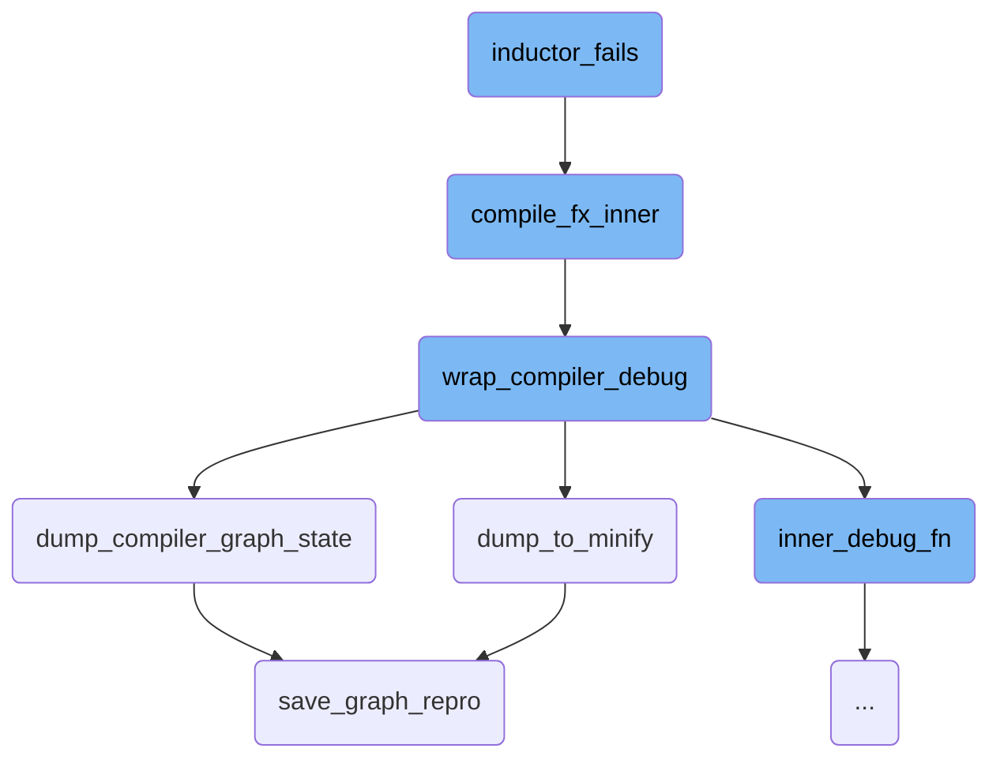
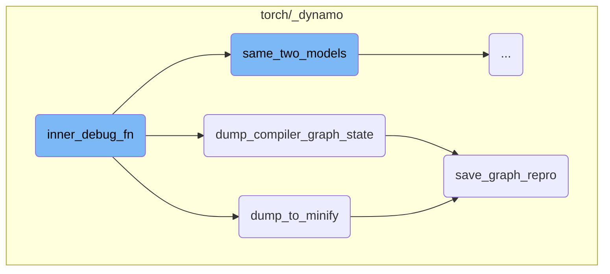
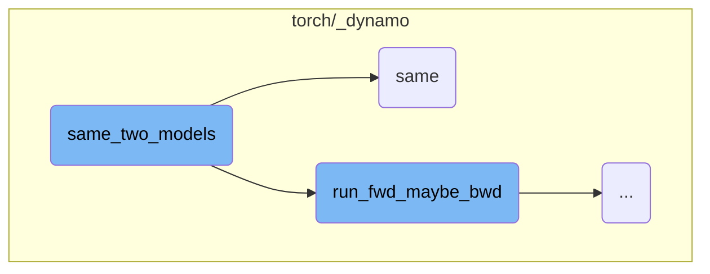

```mermaid
graph TD;
      subgraph torchdynamo["torch/_dynamo"]
45d3914ff219ac59d8791edb23592ffcf2198e42f21e9d2fa8d458122697dfbf(run_fwd_maybe_bwd):::mainFlowStyle --> b849fa0d966995c95bcc0dd289d11300f269a476fb0a889509ae0149e18ed3ef(reduce_to_scalar_loss):::mainFlowStyle
end

subgraph torchdynamo["torch/_dynamo"]
b849fa0d966995c95bcc0dd289d11300f269a476fb0a889509ae0149e18ed3ef(reduce_to_scalar_loss):::mainFlowStyle --> 155e3cc2d5c50ff89e280b9cdc1c9ae4e009632d190253b8d3364f817aed44c4(numel):::mainFlowStyle
end

subgraph torchdynamo["torch/_dynamo"]
155e3cc2d5c50ff89e280b9cdc1c9ae4e009632d190253b8d3364f817aed44c4(numel):::mainFlowStyle --> 0fe776e548d42ed0d2169b9051562848ccfee29509461e7e993ce542426370a7(call_function):::mainFlowStyle
end

subgraph torchdynamo["torch/_dynamo"]
0fe776e548d42ed0d2169b9051562848ccfee29509461e7e993ce542426370a7(call_function):::mainFlowStyle --> fde83ab941c6a2749f130ece53e7f65af2928d91723a63a01273d4e430a433bb(call_method):::mainFlowStyle
end

subgraph torchdynamo["torch/_dynamo"]
fde83ab941c6a2749f130ece53e7f65af2928d91723a63a01273d4e430a433bb(call_method):::mainFlowStyle --> 458008e74f18ebce47c64da5a4233a63dc2fd42ac18b14ae3f3aaea47313241b(inline_user_function_return):::mainFlowStyle
end

subgraph torchdynamo["torch/_dynamo"]
458008e74f18ebce47c64da5a4233a63dc2fd42ac18b14ae3f3aaea47313241b(inline_user_function_return):::mainFlowStyle --> fcd883700fffa007b56c5d346195884dc971b221f81f7154a62efec44b035ea5(inline_call):::mainFlowStyle
end

subgraph torchdynamo["torch/_dynamo"]
fcd883700fffa007b56c5d346195884dc971b221f81f7154a62efec44b035ea5(inline_call):::mainFlowStyle --> 15971f1e27fd627308a99bae241ac3eb113c6830b15353374d03323c5a30959c(inline_call_):::mainFlowStyle
end

subgraph torchdynamo["torch/_dynamo"]
15971f1e27fd627308a99bae241ac3eb113c6830b15353374d03323c5a30959c(inline_call_):::mainFlowStyle --> edf27ab967b775dcd6f62cb8a0fb2a87177da9406db5a99aad72cc627af839ac(run):::mainFlowStyle
end

subgraph torchdynamo["torch/_dynamo"]
edf27ab967b775dcd6f62cb8a0fb2a87177da9406db5a99aad72cc627af839ac(run):::mainFlowStyle --> 99e91bca7ea856f56e3f34579d72219ce35debd0d03d0aee37dedaffe5ac2a22(step):::mainFlowStyle
end

subgraph torchdynamo["torch/_dynamo"]
99e91bca7ea856f56e3f34579d72219ce35debd0d03d0aee37dedaffe5ac2a22(step):::mainFlowStyle --> a8cb423a5d16e220218eb2e3c35a54f64a0aaab6b5233dd0b33a8dae3657ca81(step_graph_break):::mainFlowStyle
end

subgraph torchdynamo["torch/_dynamo"]
a8cb423a5d16e220218eb2e3c35a54f64a0aaab6b5233dd0b33a8dae3657ca81(step_graph_break):::mainFlowStyle --> 2ba345a88495baf48df3654780e05d6be290f7d7a9d8f157cc7acee764a6ff02(compile_subgraph):::mainFlowStyle
end

subgraph torchdynamo["torch/_dynamo"]
2ba345a88495baf48df3654780e05d6be290f7d7a9d8f157cc7acee764a6ff02(compile_subgraph):::mainFlowStyle --> f04eb3af86dd9d49cdf4b5a53e7e367822569119516fff5eea0fed07fa4cd321(compile_and_call_fx_graph):::mainFlowStyle
end


      classDef mainFlowStyle color:#000000,fill:#7CB9F4
classDef rootsStyle color:#000000,fill:#00FFF4
classDef Style1 color:#000000,fill:#00FFAA
classDef Style2 color:#000000,fill:#FFFF00
classDef Style3 color:#000000,fill:#AA7CB9
```

This document explains the process of handling compilation failures using the `inductor_fails` function. The process involves checking for CUDA tensors, attempting to execute a function graph, and handling exceptions. If an exception occurs, the function returns `False`. If the execution is successful, it proceeds to compile the function graph and execute the compiled module. Additional debugging steps are taken if exceptions occur during this process.

The flow starts by checking if any of the inputs are CUDA tensors. If they are, a flag is set. The function then tries to run a given function graph with the provided inputs. If it fails, it returns `False`. If it succeeds, it moves on to compile the function graph and run the compiled version. If any errors happen during this step, it checks the error message for specific strings and decides whether to return `False` or print the error and return `True`. This helps in identifying and debugging issues during the compilation process.

Here is a high level diagram of the flow, showing only the most important functions:

```mermaid
graph TD;
      subgraph torchinductorcompilefxpy["torch/_inductor/compile_fx.py"]
d20eab09e5b4540df5313fa6003c6a684a4681e649e980aa7d6724017216ce20(inductor_fails):::mainFlowStyle --> bc12a3bd952be6c9ded03cd147a216d91f7633e6b12bbc073023f774aec871cf(compile_fx_inner):::mainFlowStyle
end

subgraph torchdynamo["torch/_dynamo"]
bc12a3bd952be6c9ded03cd147a216d91f7633e6b12bbc073023f774aec871cf(compile_fx_inner):::mainFlowStyle --> cadb1021ea8be6dee559a8129b2f7f4b280a023977d3635868eec76a99448616(wrap_compiler_debug):::mainFlowStyle
end

subgraph torchdynamo["torch/_dynamo"]
cadb1021ea8be6dee559a8129b2f7f4b280a023977d3635868eec76a99448616(wrap_compiler_debug):::mainFlowStyle --> 4703e6ad8b428492edd9853148b75320a722949d547cf4cba2c4cd474e0cc195(dump_to_minify)
end

subgraph torchdynamo["torch/_dynamo"]
cadb1021ea8be6dee559a8129b2f7f4b280a023977d3635868eec76a99448616(wrap_compiler_debug):::mainFlowStyle --> cb634a00add2101934984dd33490166d61260c6d0e53443c52b4957fb21fb994(dump_compiler_graph_state)
end

subgraph torchdynamo["torch/_dynamo"]
cadb1021ea8be6dee559a8129b2f7f4b280a023977d3635868eec76a99448616(wrap_compiler_debug):::mainFlowStyle --> 9cecb781467cb293906b507dc37dadcc34e9be6d975365c8a3e3da265a364d5b(inner_debug_fn):::mainFlowStyle
end

subgraph torchdynamo["torch/_dynamo"]
9cecb781467cb293906b507dc37dadcc34e9be6d975365c8a3e3da265a364d5b(inner_debug_fn):::mainFlowStyle --> 4703e6ad8b428492edd9853148b75320a722949d547cf4cba2c4cd474e0cc195(dump_to_minify)
end

subgraph torchdynamo["torch/_dynamo"]
9cecb781467cb293906b507dc37dadcc34e9be6d975365c8a3e3da265a364d5b(inner_debug_fn):::mainFlowStyle --> cb634a00add2101934984dd33490166d61260c6d0e53443c52b4957fb21fb994(dump_compiler_graph_state)
end

subgraph torchdynamo["torch/_dynamo"]
9cecb781467cb293906b507dc37dadcc34e9be6d975365c8a3e3da265a364d5b(inner_debug_fn):::mainFlowStyle --> aeeefd782d30030b62d9079ee5b0d799932c917b6dddae9559db7cdbe67518ac(same_two_models):::mainFlowStyle
end

subgraph torchdynamo["torch/_dynamo"]
aeeefd782d30030b62d9079ee5b0d799932c917b6dddae9559db7cdbe67518ac(same_two_models):::mainFlowStyle --> eb0a9eb1d39824546c9563680642925b0af55a6c9bef3822592742b5943437b6(same)
end

subgraph torchdynamo["torch/_dynamo"]
aeeefd782d30030b62d9079ee5b0d799932c917b6dddae9559db7cdbe67518ac(same_two_models):::mainFlowStyle --> 45d3914ff219ac59d8791edb23592ffcf2198e42f21e9d2fa8d458122697dfbf(run_fwd_maybe_bwd):::mainFlowStyle
end

subgraph torchdynamo["torch/_dynamo"]
45d3914ff219ac59d8791edb23592ffcf2198e42f21e9d2fa8d458122697dfbf(run_fwd_maybe_bwd):::mainFlowStyle --> b849fa0d966995c95bcc0dd289d11300f269a476fb0a889509ae0149e18ed3ef(reduce_to_scalar_loss):::mainFlowStyle
end

subgraph torchdynamo["torch/_dynamo"]
b849fa0d966995c95bcc0dd289d11300f269a476fb0a889509ae0149e18ed3ef(reduce_to_scalar_loss):::mainFlowStyle --> 155e3cc2d5c50ff89e280b9cdc1c9ae4e009632d190253b8d3364f817aed44c4(numel):::mainFlowStyle
end

subgraph torchdynamo["torch/_dynamo"]
155e3cc2d5c50ff89e280b9cdc1c9ae4e009632d190253b8d3364f817aed44c4(numel):::mainFlowStyle --> 0fe776e548d42ed0d2169b9051562848ccfee29509461e7e993ce542426370a7(call_function):::mainFlowStyle
end

subgraph torchdynamo["torch/_dynamo"]
0fe776e548d42ed0d2169b9051562848ccfee29509461e7e993ce542426370a7(call_function):::mainFlowStyle --> fde83ab941c6a2749f130ece53e7f65af2928d91723a63a01273d4e430a433bb(call_method):::mainFlowStyle
end

subgraph torchdynamo["torch/_dynamo"]
fde83ab941c6a2749f130ece53e7f65af2928d91723a63a01273d4e430a433bb(call_method):::mainFlowStyle --> 458008e74f18ebce47c64da5a4233a63dc2fd42ac18b14ae3f3aaea47313241b(inline_user_function_return):::mainFlowStyle
end

subgraph torchdynamo["torch/_dynamo"]
458008e74f18ebce47c64da5a4233a63dc2fd42ac18b14ae3f3aaea47313241b(inline_user_function_return):::mainFlowStyle --> fcd883700fffa007b56c5d346195884dc971b221f81f7154a62efec44b035ea5(inline_call):::mainFlowStyle
end

subgraph torchdynamo["torch/_dynamo"]
fcd883700fffa007b56c5d346195884dc971b221f81f7154a62efec44b035ea5(inline_call):::mainFlowStyle --> 15971f1e27fd627308a99bae241ac3eb113c6830b15353374d03323c5a30959c(inline_call_):::mainFlowStyle
end

subgraph torchdynamo["torch/_dynamo"]
15971f1e27fd627308a99bae241ac3eb113c6830b15353374d03323c5a30959c(inline_call_):::mainFlowStyle --> edf27ab967b775dcd6f62cb8a0fb2a87177da9406db5a99aad72cc627af839ac(run):::mainFlowStyle
end

subgraph torchdynamo["torch/_dynamo"]
edf27ab967b775dcd6f62cb8a0fb2a87177da9406db5a99aad72cc627af839ac(run):::mainFlowStyle --> 99e91bca7ea856f56e3f34579d72219ce35debd0d03d0aee37dedaffe5ac2a22(step):::mainFlowStyle
end

subgraph torchdynamo["torch/_dynamo"]
99e91bca7ea856f56e3f34579d72219ce35debd0d03d0aee37dedaffe5ac2a22(step):::mainFlowStyle --> a8cb423a5d16e220218eb2e3c35a54f64a0aaab6b5233dd0b33a8dae3657ca81(step_graph_break):::mainFlowStyle
end

subgraph torchdynamo["torch/_dynamo"]
a8cb423a5d16e220218eb2e3c35a54f64a0aaab6b5233dd0b33a8dae3657ca81(step_graph_break):::mainFlowStyle --> 2ba345a88495baf48df3654780e05d6be290f7d7a9d8f157cc7acee764a6ff02(compile_subgraph):::mainFlowStyle
end

subgraph torchdynamo["torch/_dynamo"]
2ba345a88495baf48df3654780e05d6be290f7d7a9d8f157cc7acee764a6ff02(compile_subgraph):::mainFlowStyle --> f04eb3af86dd9d49cdf4b5a53e7e367822569119516fff5eea0fed07fa4cd321(compile_and_call_fx_graph):::mainFlowStyle
end


      classDef mainFlowStyle color:#000000,fill:#7CB9F4
classDef rootsStyle color:#000000,fill:#00FFF4
classDef Style1 color:#000000,fill:#00FFAA
classDef Style2 color:#000000,fill:#FFFF00
classDef Style3 color:#000000,fill:#AA7CB9
```



# Flow drill down

First, we'll zoom into this section of the flow:



<SwmSnippet path="/torch/_dynamo/repro/after_aot.py" line="408">

---

## Handling Compilation Failures

The function `inductor_fails` is responsible for handling compilation failures. It first checks if any of the arguments are CUDA tensors and sets a flag accordingly. It then attempts to execute the given function graph with the provided arguments. If an exception occurs, it returns `False`. If the execution is successful, it proceeds to compile the function graph using `compile_fx_inner` and executes the compiled module. If any exceptions occur during this process, it checks if a specific string is present in the exception message and returns `False` if not. Otherwise, it prints the exception and returns `True`.

```python
def inductor_fails(fx_g, args, check_str=None):
    has_cuda = False
    for arg in args:
        if isinstance(arg, torch.Tensor) and arg.is_cuda:
            has_cuda = True
            break

    def sync():
        if has_cuda:
            # Ensures that segfaults are surfaced
            torch.cuda.synchronize()

    from torch._inductor.compile_fx import compile_fx_inner

    try:
        result = fx_g(*args)
        assert isinstance(result, (tuple, list))
        assert not any(isinstance(x, (tuple, list)) for x in result)
    except Exception:
        return False

```

---

</SwmSnippet>

<SwmSnippet path="/torch/_inductor/compile_fx.py" line="456">

---

## Inner Compilation Process

The function `compile_fx_inner` handles the inner compilation process. It sets up several context managers to manage the compilation environment, including disabling current modes and using a lazy graph module. It then wraps the actual compilation function `_compile_fx_inner` with debugging capabilities using `wrap_compiler_debug` and returns the wrapped function.

```python
def compile_fx_inner(*args, **kwargs):
    # Need with_fresh_cache_if_config for compile_fx_inner even if we already have one for
    # compile_fx. The reason is the compilation for backward graph may happen after
    # compile_fx return and we may want to use the _LazyGraphModule for compiling
    # the backward graph as well.
    with contextlib.ExitStack() as stack:
        stack.enter_context(torch.utils._python_dispatch._disable_current_modes())
        stack.enter_context(_use_lazy_graph_module(dynamo_config.use_lazy_graph_module))
        stack.enter_context(
            dynamo_utils.dynamo_timed(
                "compile_fx_inner", phase_name="inductor_compile", fwd_only=False
            )
        )
        stack.enter_context(with_fresh_cache_if_config())
        stack.enter_context(DebugContext())

        return wrap_compiler_debug(_compile_fx_inner, compiler_name="inductor")(
            *args, **kwargs
        )
```

---

</SwmSnippet>

<SwmSnippet path="/torch/_dynamo/repro/after_aot.py" line="59">

---

## Wrapping Compiler with Debugging

The function `wrap_compiler_debug` wraps the given compiler function with additional debugging capabilities. It defines an inner function `debug_wrapper` that handles the actual debugging process. This includes setting up a partial function for the compiler and defining an inner function `inner_debug_fn` that manages the inputs and calls the compiler function. This setup allows for detailed debugging and error handling during the compilation process.

```python
def wrap_compiler_debug(unconfigured_compiler_fn, compiler_name: str):
    """
    Minifier for Fx Graph modules after Aot Autograd has finished. We wrap both
    forward and backward call separately with the backend compiler_fn - like
    inductor or nvfuser. Intercepting after Aot Autograd presents neat
    abstraction, where all the params are lifted as graph inputs, making it easy
    to save the graph as a string.
    """

    @functools.wraps(unconfigured_compiler_fn)
    def debug_wrapper(gm, example_inputs, **kwargs):
        from torch._subclasses import FakeTensorMode

        compiler_fn = functools.partial(unconfigured_compiler_fn, **kwargs)

        from torch._functorch.aot_autograd import get_aot_graph_name

        graph_name = get_aot_graph_name()

        # TODO: why do we need to deepcopy the original graph?
        orig_graph = copy.deepcopy(gm.graph)
```

---

</SwmSnippet>

<SwmSnippet path="/torch/_dynamo/repro/after_aot.py" line="333">

---

## Dumping Minified Graph

The function `dump_to_minify` is responsible for dumping the function graph to a minified format for debugging purposes. It creates a subdirectory for checkpoints if it doesn't already exist and then calls `save_graph_repro` to save the graph representation. This helps in reproducing and debugging the issue later.

```python
def dump_to_minify(gm, args, compiler_name: str):
    out = io.StringIO()
    # TODO: factor this out
    subdir = os.path.join(minifier_dir(), "checkpoints")
    if not os.path.exists(subdir):
        os.makedirs(subdir, exist_ok=True)
    save_graph_repro(out, gm, args, compiler_name, save_dir=subdir, command="minify")
    return helper_for_dump_minify(out.getvalue())
```

---

</SwmSnippet>

<SwmSnippet path="/torch/_dynamo/repro/after_aot.py" line="305">

---

## Dumping Compiler Graph State

The function `dump_compiler_graph_state` saves the current state of the compiler graph to a file. It creates a checkpoint directory and writes the graph state to a file. It also copies the file to a convenient location for easier access and debugging. This function helps in preserving the state of the graph at the point of failure for later analysis.

```python
def dump_compiler_graph_state(gm, args, compiler_name, *, accuracy=None):
    subdir = os.path.join(minifier_dir(), "checkpoints")
    if not os.path.exists(subdir):
        os.makedirs(subdir, exist_ok=True)
    file_name = os.path.join(subdir, f"{len(gm.graph.nodes)}.py")
    log.warning(
        "Writing checkpoint with %s nodes to %s", len(gm.graph.nodes), file_name
    )
    with open(file_name, "w") as fd:
        save_graph_repro(
            fd, gm, args, compiler_name, save_dir=subdir, accuracy=accuracy
        )
    curdir = os.getcwd()
    repro_path = os.path.join(curdir, "repro.py")
    try:
        shutil.copyfile(file_name, repro_path)
        log.warning("Copying repro file for convenience to %s", repro_path)
        if use_buck:
            BuckTargetWriter(file_name).write()
    except OSError:
        log.warning("No write permissions for %s", repro_path)
```

---

</SwmSnippet>

<SwmSnippet path="/torch/_dynamo/repro/after_aot.py" line="257">

---

## Saving Graph Representation

The function `save_graph_repro` generates and saves a string representation of the function graph. It writes the graph representation to the provided file descriptor and includes additional information such as accuracy and tracing mode. This function is crucial for creating reproducible test cases for debugging and analysis.

```python
def save_graph_repro(
    fd,
    gm,
    args,
    compiler_name,
    *,
    stable_output=False,
    save_dir=None,
    command="run",
    accuracy=None,
    tracing_mode=None,
    check_str=None,
):
    if any(
        isinstance(arg, torch.fx.experimental._backward_state.BackwardState)
        for arg in args
    ):
        fd.write(
            "Repro is not generated due to existence of BackwardState in graph input"
        )
        return
```

---

</SwmSnippet>

Now, lets zoom into this section of the flow:



<SwmSnippet path="/torch/_dynamo/repro/after_aot.py" line="116">

---

## Purpose of inner_debug_fn

The function `inner_debug_fn` is designed to handle the invocation of compiled functions with real tensors, even when the initial inputs might be fake tensors. This is crucial for ensuring that the actual compiled function operates correctly with real data.

```python
        def inner_debug_fn(real_inputs):
            """
            Aot Autograd fw_compiler and bw_compiler can have fake tensors. So,
            example_inputs can be fake tensors. We can call compiler_fn (which is
            inductor or nvfuser) with fake tensors but the actually compiled_fn
            should be called with real tensors. Therefore, the actual invocation
            is deferred.
            """
```

---

</SwmSnippet>

<SwmSnippet path="/torch/_dynamo/repro/after_aot.py" line="124">

---

## Handling Fake Tensors

The function begins by copying tensor attributes like shape and stride by converting the inputs to fake tensors. This step is necessary because the inductor clears the tensor list during code generation, and the example inputs are only available during the first invocation.

```python
            # Copy the tensor attrs like shape, stride etc by converting to Fake Tensor
            # because inductor clears the tensor list in its codegen. And example_inputs
            # are available only for the first invocation.
            fake_mode = FakeTensorMode()
            copy_tensor_attrs = [
                fake_mode.from_tensor(x) if isinstance(x, torch.Tensor) else x
                for x in real_inputs
            ]
```

---

</SwmSnippet>

<SwmSnippet path="/torch/_dynamo/repro/after_aot.py" line="132">

---

## Dumping and Accuracy Checks

Depending on the `repro_level` configuration, the function may dump the original module for debugging purposes or perform accuracy checks by comparing two models. If accuracy fails, it logs a warning and dumps the compiler graph state for further investigation.

```python
            if config.repro_level == 3:
                # Always dump the original module in case we have segfaults
                dump_to_minify(
                    fx.GraphModule(gm, orig_graph), real_inputs, compiler_name
                )

            if config.repro_level == 4:
                if compiler_name != "inductor":
                    raise NotImplementedError(
                        "Accuracy minification is supported for inductor only"
                    )
                failed = not same_two_models(
                    gm,
                    inner_compiled_fn,
                    real_inputs,
                    only_fwd=True,
                    ignore_non_fp=config.repro_ignore_non_fp,
                )

                if failed:
                    log.warning(
```

---

</SwmSnippet>

<SwmSnippet path="/torch/_dynamo/repro/after_aot.py" line="132">

---

### Dumping the Original Module

If `repro_level` is set to 3, the function always dumps the original module to help diagnose issues like segmentation faults.

```python
            if config.repro_level == 3:
                # Always dump the original module in case we have segfaults
                dump_to_minify(
                    fx.GraphModule(gm, orig_graph), real_inputs, compiler_name
                )
```

---

</SwmSnippet>

<SwmSnippet path="/torch/_dynamo/repro/after_aot.py" line="138">

---

### Accuracy Minification

If `repro_level` is set to 4 and the compiler is 'inductor', the function checks for accuracy by comparing two models. If the models do not match, it logs a warning and dumps the compiler graph state and the module for further analysis.

```python
            if config.repro_level == 4:
                if compiler_name != "inductor":
                    raise NotImplementedError(
                        "Accuracy minification is supported for inductor only"
                    )
                failed = not same_two_models(
                    gm,
                    inner_compiled_fn,
                    real_inputs,
                    only_fwd=True,
                    ignore_non_fp=config.repro_ignore_non_fp,
                )

                if failed:
                    log.warning(
                        "Accuracy failed for the AOT Autograd graph %s", graph_name
                    )
                    dump_compiler_graph_state(
                        fx.GraphModule(gm, orig_graph),
                        real_inputs,
                        f"{compiler_name}_accuracy",
```

---

</SwmSnippet>

<SwmSnippet path="/torch/_dynamo/repro/after_aot.py" line="167">

---

## Invocation of Compiled Function

Finally, the function attempts to call the compiled function with real inputs. If an exception occurs, it handles it based on the `repro_level` configuration by dumping the compiler graph state or the module for debugging.

```python
                    # Call the compiled function with real inputs
                    return inner_compiled_fn(real_inputs)
            else:
                try:
                    # Call the compiled function with real inputs
                    out = inner_compiled_fn(real_inputs)
                    # sync cuda kernels to ensure IMA detection
                    for arg in example_inputs:
                        if isinstance(arg, torch.Tensor) and arg.is_cuda:
                            torch.cuda.synchronize()
                            break
                    return out
                except Exception as e:
                    if config.repro_level == 1:
                        dump_compiler_graph_state(
                            fx.GraphModule(gm, orig_graph),
                            copy_tensor_attrs,
                            compiler_name,
                        )
                    elif config.repro_level == 2:
                        dump_to_minify(
```

---

</SwmSnippet>

Now, lets zoom into this section of the flow:



<SwmSnippet path="/torch/_dynamo/debug_utils.py" line="334">

---

## Comparing Model Outputs

The function `same_two_models` is responsible for checking if two models produce the same outputs given the same inputs. It runs the forward (and optionally backward) pass for both models and compares their outputs using the `same` function. If the configuration requires, it also attempts to generate and compare outputs in fp64 precision.

```python
def same_two_models(
    gm,
    opt_gm,
    example_inputs,
    only_fwd=False,
    *,
    require_fp64=False,
    ignore_non_fp=False,
):
    """
    Check two models have same accuracy.

    require_fp64: if True, raise an error if we unable to calculate the fp64 reference
    ignore_non_fp: if True, do not compare outputs which are not floating point.  This
        is mostly useful for the minifier (which wants to avoid quantizing floating point
        error into integer/boolean error)
    """
    from .utils import same

    ref = run_fwd_maybe_bwd(gm, example_inputs, only_fwd)

```

---

</SwmSnippet>

<SwmSnippet path="/torch/_dynamo/debug_utils.py" line="353">

---

### Running Forward and Backward Passes

The function `run_fwd_maybe_bwd` is called to execute the forward (and optionally backward) pass for both the original and optimized models. This is crucial for obtaining the outputs that will be compared.

```python
    ref = run_fwd_maybe_bwd(gm, example_inputs, only_fwd)

    fp64_ref = None
    if config.same_two_models_use_fp64:
        try:
            fp64_model, fp64_examples = cast_to_fp64(
                copy.deepcopy(gm), clone_inputs_retaining_gradness(example_inputs)
            )
            fp64_ref = run_fwd_maybe_bwd(fp64_model, fp64_examples, only_fwd)
        except Exception:
            if require_fp64:
                raise RuntimeError("Could not generate fp64 outputs")  # noqa: B904
            log.warning("Could not generate fp64 outputs")

    try:
        res = run_fwd_maybe_bwd(opt_gm, example_inputs, only_fwd)
    except Exception as e:
```

---

</SwmSnippet>

<SwmSnippet path="/torch/_dynamo/debug_utils.py" line="369">

---

### Handling Exceptions

If an exception occurs while running the optimized model, it is logged, and the function returns `True`, indicating that the models are not comparable due to an unrelated issue.

```python
    except Exception as e:
        # This means that the minified graph is bad/exposes a different problem.
        # As we are checking accuracy here, lets log the exception and return True.
        log.exception(
            "While minifying the program in accuracy minification mode, "
            "ran into a runtime exception which is likely an unrelated issue."
            " Skipping this graph."
        )
        return True
```

---

</SwmSnippet>

<SwmSnippet path="/torch/_dynamo/utils.py" line="1487">

---

## Checking Output Accuracy

The function `same` is used to compare the outputs of the two models. It checks for various conditions such as type mismatches, length mismatches, and value mismatches. It also handles special cases like sparse tensors, dictionaries, and specific model output types.

```python
def same(
    ref,
    res,
    fp64_ref=None,
    cos_similarity=False,
    tol=1e-4,
    equal_nan=False,
    exact_dtype=True,
    relax_numpy_equality=False,
    ignore_non_fp=False,
    log_error=log.error,
    use_larger_multiplier_for_smaller_tensor=False,
):
    """Check correctness to see if ref and res match"""
    if fp64_ref is None:
        fp64_ref = ref
    if isinstance(ref, (list, tuple, torch.nn.ParameterList, torch.Size)):
        assert isinstance(res, (list, tuple)), f"type mismatch {type(ref)} {type(res)}"
        if len(ref) != len(res):
            log_error("Length mismatch")
            return False
```

---

</SwmSnippet>

<SwmSnippet path="/torch/_dynamo/utils.py" line="1503">

---

### Handling Different Data Types

The function `same` includes logic to handle different data types such as lists, tuples, dictionaries, and sets. It ensures that the outputs are compared accurately regardless of their data structure.

```python
    if isinstance(ref, (list, tuple, torch.nn.ParameterList, torch.Size)):
        assert isinstance(res, (list, tuple)), f"type mismatch {type(ref)} {type(res)}"
        if len(ref) != len(res):
            log_error("Length mismatch")
            return False
        return len(ref) == len(res) and all(
            same(
                ai,
                bi,
                fp64_refi,
                cos_similarity,
                tol,
                equal_nan,
                exact_dtype,
                relax_numpy_equality,
                ignore_non_fp,
                log_error=log_error,
                use_larger_multiplier_for_smaller_tensor=use_larger_multiplier_for_smaller_tensor,
            )
            for ai, bi, fp64_refi in zip(ref, res, fp64_ref)
        )
```

---

</SwmSnippet>

<SwmSnippet path="/torch/_dynamo/utils.py" line="1569">

---

### Comparing Tensors

For tensor comparisons, the function checks for dtype mismatches and uses `torch.allclose` to determine if the tensors are within a specified tolerance. It also includes logic for handling boolean tensors and cosine similarity checks.

```python
    elif isinstance(ref, (torch.Tensor, float)):
        assert not isinstance(ref, torch._subclasses.FakeTensor)
        assert not isinstance(res, torch._subclasses.FakeTensor)

        def to_tensor(t):
            return t if isinstance(t, torch.Tensor) else torch.tensor(t)

        ref, res, fp64_ref = (to_tensor(val) for val in (ref, res, fp64_ref))

        if ref.is_sparse:
            assert res.is_sparse
            ref = ref.to_dense()
            res = res.to_dense()
        assert isinstance(res, torch.Tensor), f"type mismatch {type(ref)} {type(res)}"
        if exact_dtype:
            if ref.dtype != res.dtype:
                log_error("dtype mismatch %s, %s", ref.dtype, res.dtype)
                return False
            if ref.dtype == torch.bool:
                if ignore_non_fp:
                    return True
```

---

</SwmSnippet>

Now, lets zoom into this section of the flow:



<SwmSnippet path="/torch/_dynamo/debug_utils.py" line="307">

---

## run_fwd_maybe_bwd

The function `run_fwd_maybe_bwd` is responsible for running a forward and possibly a backward iteration for a given model and arguments. It first deep copies the model and optionally clones the input arguments to retain their gradient properties. If the model has a `zero_grad` method, it is called to reset gradients. The model is then executed with the provided arguments. If only the forward pass is required, the function returns the output. Otherwise, it checks if a backward pass is needed by calling `requires_bwd_pass` on the output. If so, it reduces the output to a scalar loss using `reduce_to_scalar_loss` and performs backpropagation by calling `loss.backward()`. Finally, it collects and returns the results.

```python
def run_fwd_maybe_bwd(gm, args, only_fwd=False, disable_clone=False):
    """
    Runs a forward and possibly backward iteration for a given mod and args.

    When disable_clone is True, we will use args as-is without cloning.
    This is higher fidelity but we may destroy the args in the process.
    """
    from .testing import collect_results, reduce_to_scalar_loss, requires_bwd_pass

    gm = copy.deepcopy(gm)
    if not disable_clone:
        args = clone_inputs_retaining_gradness(args)

    if hasattr(gm, "zero_grad"):
        gm.zero_grad(True)

    # TorchInductor returned callable expects lists. So, may need a boxed calling convention.
    out = gm(args) if hasattr(gm, "_boxed_call") else gm(*args)

    if only_fwd:
        return out
```

---

</SwmSnippet>

<SwmSnippet path="/torch/_dynamo/testing.py" line="105">

---

### reduce_to_scalar_loss

The function `reduce_to_scalar_loss` reduces the output of a model to a scalar loss. It handles various types of outputs, including tensors, lists, tuples, and specific model output types. For tensors, it computes the mean by dividing the sum of elements by the number of elements. For lists and tuples, it recursively reduces each element and averages the results. For certain model output types, it reduces the logits. For dictionaries, it reduces each value and averages the results. If the output type is not recognized, it raises a `NotImplementedError`.

```python
def reduce_to_scalar_loss(out):
    """Reduce the output of a model to get scalar loss"""
    if isinstance(out, torch.Tensor):
        # Mean does not work on integer tensors
        return out.sum() / out.numel()
    elif isinstance(out, (list, tuple)):
        return sum(reduce_to_scalar_loss(x) for x in out) / len(out)
    elif type(out).__name__ in (
        "MaskedLMOutput",
        "Seq2SeqLMOutput",
        "CausalLMOutputWithCrossAttentions",
    ):
        return reduce_to_scalar_loss(out.logits)
    elif type(out).__name__ == "SquashedNormal":
        return out.mean.sum()
    elif isinstance(out, dict):
        return sum(reduce_to_scalar_loss(value) for value in out.values()) / len(
            out.keys()
        )
    raise NotImplementedError("Don't know how to reduce", type(out))
```

---

</SwmSnippet>

&nbsp;

*This is an auto-generated document by Swimm AI 🌊 and has not yet been verified by a human*

<SwmMeta version="3.0.0" repo-id="Z2l0aHViJTNBJTNBcHl0b3JjaC1hdXRvZG9jcy1kZW1vJTNBJTNBU3dpbW0tRGVtbw==" repo-name="pytorch-autodocs-demo"><sup>Powered by [Swimm](https://app.swimm.io/)</sup></SwmMeta>
