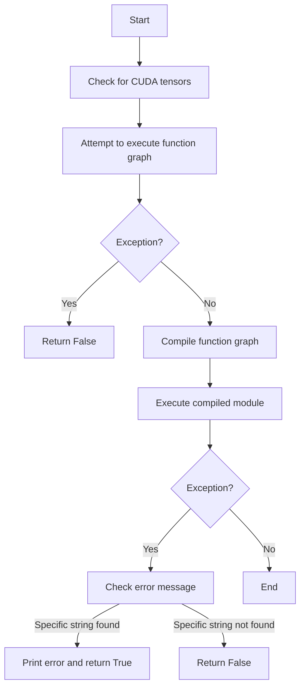

This document will cover the process of handling compilation failures, which includes:

1. Checking for CUDA tensors
2. Attempting to execute a function graph
3. Handling exceptions
4. Compiling the function graph
5. Executing the compiled module
6. Additional debugging steps if exceptions occur

Technical document: <SwmLink doc-title="Handling Compilation Failures">[Handling Compilation Failures](/.swm/handling-compilation-failures.dd4vctzm.sw.md)</SwmLink>

# [Checking for CUDA tensors](https://app.swimm.io/repos/Z2l0aHViJTNBJTNBcHl0b3JjaC1hdXRvZG9jcy1kZW1vJTNBJTNBU3dpbW0tRGVtbw==/docs/dd4vctzm#checking-for-cuda-tensors)

The process begins by examining the inputs to determine if any of them are CUDA tensors. CUDA tensors are a type of tensor that is processed using NVIDIA's CUDA technology, which allows for parallel computing. If any CUDA tensors are found, a flag is set to indicate their presence. This step is crucial because it helps in managing the synchronization of CUDA operations later in the process.

# [Attempting to execute a function graph](https://app.swimm.io/repos/Z2l0aHViJTNBJTNBcHl0b3JjaC1hdXRvZG9jcy1kZW1vJTNBJTNBU3dpbW0tRGVtbw==/docs/dd4vctzm#attempting-to-execute-a-function-graph)

Next, the function graph is executed with the provided inputs. A function graph is a representation of the computational steps required to perform a specific task. If the execution of the function graph fails, the process returns `False`, indicating that the compilation has failed. This step is essential for determining whether the initial execution of the function graph is successful before proceeding to the compilation stage.

# [Handling exceptions](https://app.swimm.io/repos/Z2l0aHViJTNBJTNBcHl0b3JjaC1hdXRvZG9jcy1kZW1vJTNBJTNBU3dpbW0tRGVtbw==/docs/dd4vctzm#handling-exceptions)

If an exception occurs during the execution of the function graph, the process immediately returns `False`. Exceptions are unexpected events that disrupt the normal flow of execution. Handling exceptions at this stage ensures that any issues are caught early, preventing further complications during the compilation process.

# [Compiling the function graph](https://app.swimm.io/repos/Z2l0aHViJTNBJTNBcHl0b3JjaC1hdXRvZG9jcy1kZW1vJTNBJTNBU3dpbW0tRGVtbw==/docs/dd4vctzm#compiling-the-function-graph)

If the function graph executes successfully, the next step is to compile it. Compilation involves translating the function graph into a form that can be executed more efficiently. This step is crucial for optimizing the performance of the function graph, making it run faster and more efficiently.

# [Executing the compiled module](https://app.swimm.io/repos/Z2l0aHViJTNBJTNBcHl0b3JjaC1hdXRvZG9jcy1kZW1vJTNBJTNBU3dpbW0tRGVtbw==/docs/dd4vctzm#executing-the-compiled-module)

After the function graph is compiled, the compiled module is executed. A compiled module is an optimized version of the function graph that can be run more efficiently. If any exceptions occur during this step, the process checks the error message for specific strings to determine the appropriate action. This step is essential for ensuring that the compiled module runs correctly and efficiently.

# [Additional debugging steps if exceptions occur](https://app.swimm.io/repos/Z2l0aHViJTNBJTNBcHl0b3JjaC1hdXRvZG9jcy1kZW1vJTNBJTNBU3dpbW0tRGVtbw==/docs/dd4vctzm#additional-debugging-steps-if-exceptions-occur)

If exceptions occur during the execution of the compiled module, additional debugging steps are taken. These steps include checking the error message for specific strings and deciding whether to return `False` or print the error and return `True`. This helps in identifying and debugging issues during the compilation process, ensuring that any problems are addressed promptly.

&nbsp;

*This is an auto-generated document by Swimm AI 🌊 and has not yet been verified by a human*

<SwmMeta version="3.0.0" repo-id="Z2l0aHViJTNBJTNBcHl0b3JjaC1hdXRvZG9jcy1kZW1vJTNBJTNBU3dpbW0tRGVtbw==" repo-name="pytorch-autodocs-demo">Powered by [Swimm](https://app.swimm.io/)</SwmMeta>
