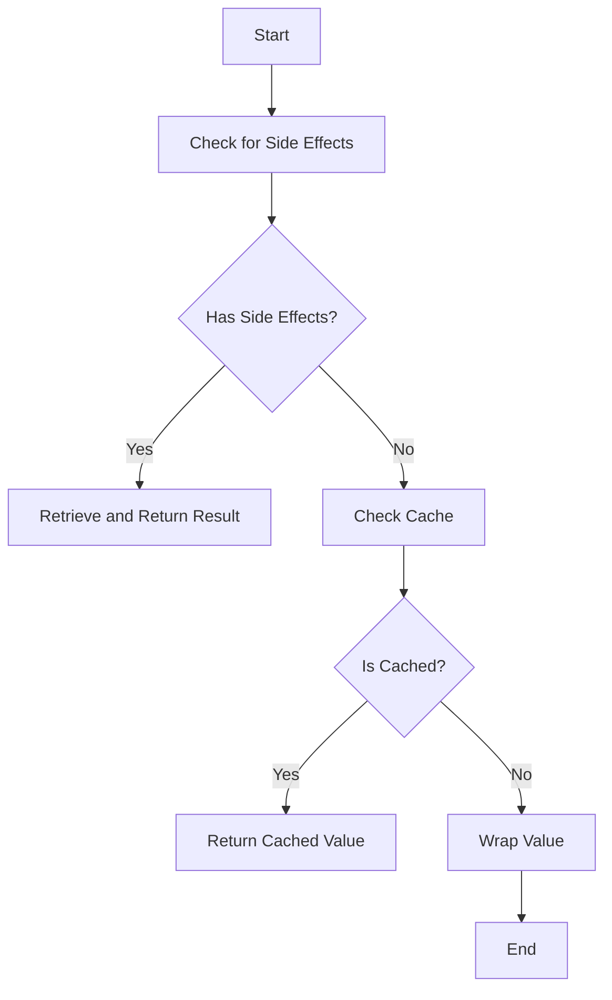

This document will cover the flow of handling input values in the system, specifically focusing on the `__call__` method. We'll cover:

1. Checking for side effects
2. Retrieving cached values
3. Wrapping values

Technical document: <SwmLink doc-title="Overview of the __call__ Method">[Overview of the \__call_\_ Method](/.swm/overview-of-the-__call__-method.wihha5kz.sw.md)</SwmLink>

# [Checking for Side Effects](https://app.swimm.io/repos/Z2l0aHViJTNBJTNBcHl0b3JjaC1hdXRvZG9jcy1kZW1vJTNBJTNBU3dpbW0tRGVtbw==/docs/wihha5kz#__call__-method)

The flow begins with the `__call__` method, which first checks if the input value has any side effects. Side effects are changes that occur as a result of processing the input value, such as modifications to global state or external dependencies. If the value has side effects, the system retrieves the result of these side effects and returns it. This ensures that any necessary changes are accounted for and the correct result is provided to the user.

# [Retrieving Cached Values](https://app.swimm.io/repos/Z2l0aHViJTNBJTNBcHl0b3JjaC1hdXRvZG9jcy1kZW1vJTNBJTNBU3dpbW0tRGVtbw==/docs/wihha5kz#__call__-method)

If the input value does not have side effects, the system then checks if the value is already cached. Caching is a mechanism to store previously computed results to avoid redundant processing. If the value is found in the cache, the system retrieves the cached result and returns it. This improves efficiency by reducing the need for repeated computations, providing faster responses to the user.

# [Wrapping Values](https://app.swimm.io/repos/Z2l0aHViJTNBJTNBcHl0b3JjaC1hdXRvZG9jcy1kZW1vJTNBJTNBU3dpbW0tRGVtbw==/docs/wihha5kz#_wrap-method)

If the input value is neither affected by side effects nor cached, the system proceeds to wrap the value using the `_wrap` method. Wrapping involves converting the input value into a form that can be tracked and managed by the system. The `_wrap` method determines the appropriate wrapping method based on the type of the value. For example, it uses specialized functions like `wrap_literal` for literal values, `wrap_numpy_ndarray` for NumPy arrays, and `wrap_module` for PyTorch modules. This ensures that all types of values are correctly integrated into the system, allowing for consistent handling and optimization.

&nbsp;

*This is an auto-generated document by Swimm AI 🌊 and has not yet been verified by a human*

<SwmMeta version="3.0.0" repo-id="Z2l0aHViJTNBJTNBcHl0b3JjaC1hdXRvZG9jcy1kZW1vJTNBJTNBU3dpbW0tRGVtbw==" repo-name="pytorch-autodocs-demo">Powered by [Swimm](https://app.swimm.io/)</SwmMeta>
