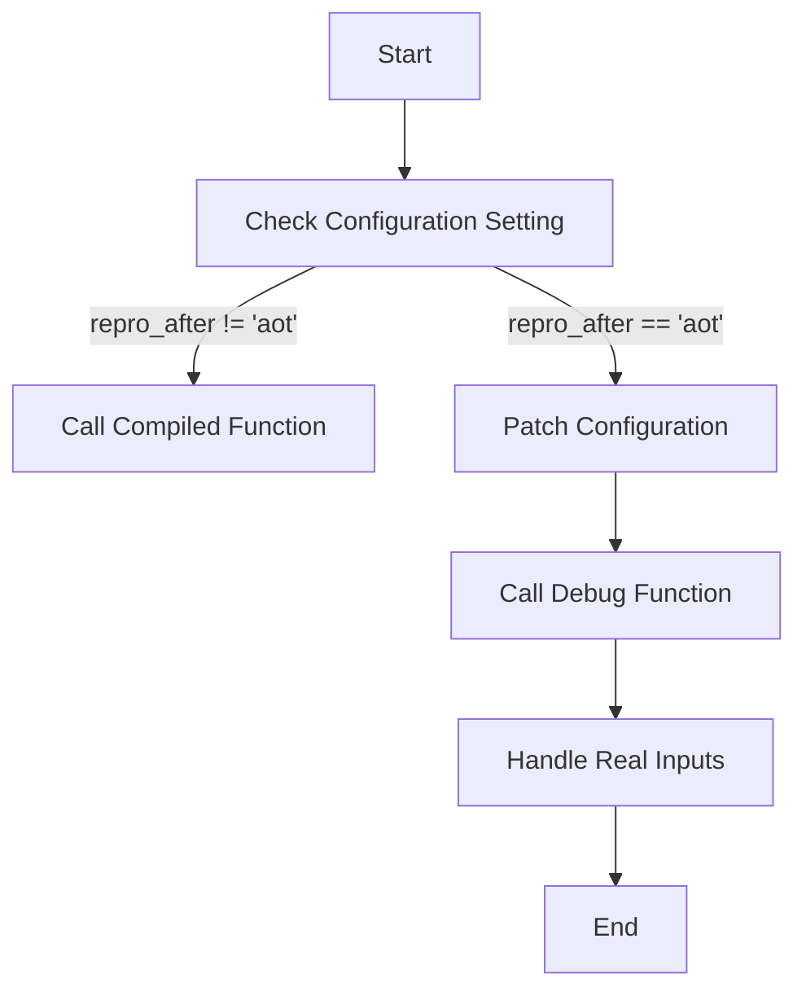

This document will cover the process of handling real inputs with deferred execution, which includes:

1. Checking configuration settings
2. Calling the appropriate function based on the configuration
3. Debugging and handling real inputs

Technical document: <SwmLink doc-title="Handling Real Inputs with Deferred Execution">[Handling Real Inputs with Deferred Execution](/.swm/handling-real-inputs-with-deferred-execution.qjkc5g1d.sw.md)</SwmLink>

# [Checking Configuration Settings](https://app.swimm.io/repos/Z2l0aHViJTNBJTNBcHl0b3JjaC1hdXRvZG9jcy1kZW1vJTNBJTNBU3dpbW0tRGVtbw==/docs/qjkc5g1d#deferred_for_real_inputs)

The process begins by checking the configuration setting `repro_after`. This setting determines whether the function should call the compiled function directly or invoke the debug function. If `repro_after` is not equal to 'aot', the compiled function is called directly with the real inputs. This ensures that the function operates under normal conditions without additional debugging steps.

# [Calling the Appropriate Function Based on the Configuration](https://app.swimm.io/repos/Z2l0aHViJTNBJTNBcHl0b3JjaC1hdXRvZG9jcy1kZW1vJTNBJTNBU3dpbW0tRGVtbw==/docs/qjkc5g1d#deferred_for_real_inputs)

If the configuration setting `repro_after` is equal to 'aot', the function patches the configuration to set `repro_after` to None. This change in configuration ensures that the debug function is called instead of the compiled function. The debug function is then invoked with the real inputs, allowing for detailed debugging and handling of the inputs.

# [Debugging and Handling Real Inputs](https://app.swimm.io/repos/Z2l0aHViJTNBJTNBcHl0b3JjaC1hdXRvZG9jcy1kZW1vJTNBJTNBU3dpbW0tRGVtbw==/docs/qjkc5g1d#inner_debug_fn)

The debug function, `inner_debug_fn`, is responsible for handling the actual invocation of the compiled function with real tensors. It ensures that tensor attributes such as shape and stride are copied correctly. This function also handles different levels of reproduction configurations, which can include dumping the original module, checking for accuracy, and handling exceptions by dumping the compiler graph state or minifying the graph. This step is crucial for accurate debugging and ensuring that the real inputs are processed correctly.

&nbsp;

*This is an auto-generated document by Swimm AI 🌊 and has not yet been verified by a human*

<SwmMeta version="3.0.0" repo-id="Z2l0aHViJTNBJTNBcHl0b3JjaC1hdXRvZG9jcy1kZW1vJTNBJTNBU3dpbW0tRGVtbw==" repo-name="pytorch-autodocs-demo">Powered by [Swimm](https://app.swimm.io/)</SwmMeta>
