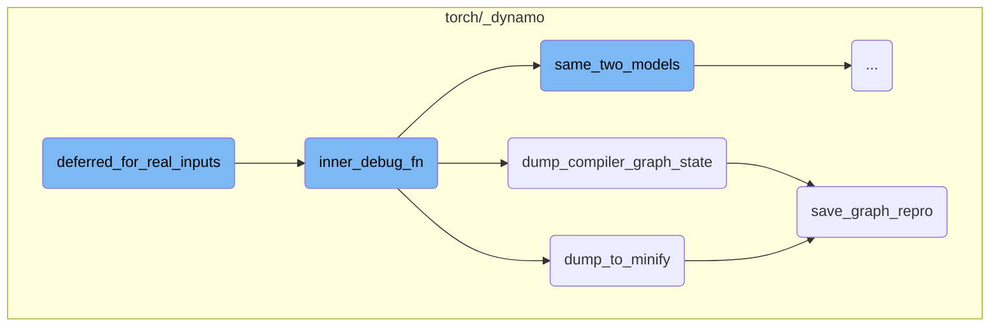
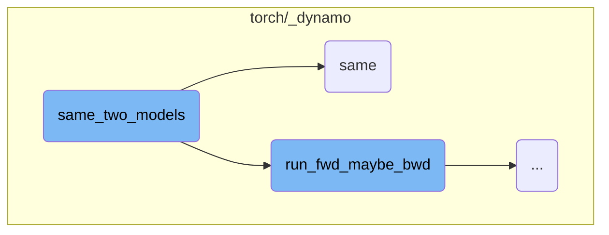

```mermaid
graph TD;
      subgraph torchdynamo["torch/_dynamo"]
45d3914ff219ac59d8791edb23592ffcf2198e42f21e9d2fa8d458122697dfbf(run_fwd_maybe_bwd):::mainFlowStyle --> b849fa0d966995c95bcc0dd289d11300f269a476fb0a889509ae0149e18ed3ef(reduce_to_scalar_loss):::mainFlowStyle
end

subgraph torchdynamo["torch/_dynamo"]
b849fa0d966995c95bcc0dd289d11300f269a476fb0a889509ae0149e18ed3ef(reduce_to_scalar_loss):::mainFlowStyle --> 155e3cc2d5c50ff89e280b9cdc1c9ae4e009632d190253b8d3364f817aed44c4(numel):::mainFlowStyle
end

subgraph torchdynamo["torch/_dynamo"]
155e3cc2d5c50ff89e280b9cdc1c9ae4e009632d190253b8d3364f817aed44c4(numel):::mainFlowStyle --> 0fe776e548d42ed0d2169b9051562848ccfee29509461e7e993ce542426370a7(call_function):::mainFlowStyle
end

subgraph torchdynamo["torch/_dynamo"]
0fe776e548d42ed0d2169b9051562848ccfee29509461e7e993ce542426370a7(call_function):::mainFlowStyle --> fde83ab941c6a2749f130ece53e7f65af2928d91723a63a01273d4e430a433bb(call_method):::mainFlowStyle
end

subgraph torchdynamo["torch/_dynamo"]
fde83ab941c6a2749f130ece53e7f65af2928d91723a63a01273d4e430a433bb(call_method):::mainFlowStyle --> 458008e74f18ebce47c64da5a4233a63dc2fd42ac18b14ae3f3aaea47313241b(inline_user_function_return):::mainFlowStyle
end

subgraph torchdynamo["torch/_dynamo"]
458008e74f18ebce47c64da5a4233a63dc2fd42ac18b14ae3f3aaea47313241b(inline_user_function_return):::mainFlowStyle --> fcd883700fffa007b56c5d346195884dc971b221f81f7154a62efec44b035ea5(inline_call):::mainFlowStyle
end

subgraph torchdynamo["torch/_dynamo"]
fcd883700fffa007b56c5d346195884dc971b221f81f7154a62efec44b035ea5(inline_call):::mainFlowStyle --> 15971f1e27fd627308a99bae241ac3eb113c6830b15353374d03323c5a30959c(inline_call_):::mainFlowStyle
end

subgraph torchdynamo["torch/_dynamo"]
15971f1e27fd627308a99bae241ac3eb113c6830b15353374d03323c5a30959c(inline_call_):::mainFlowStyle --> edf27ab967b775dcd6f62cb8a0fb2a87177da9406db5a99aad72cc627af839ac(run):::mainFlowStyle
end

subgraph torchdynamo["torch/_dynamo"]
edf27ab967b775dcd6f62cb8a0fb2a87177da9406db5a99aad72cc627af839ac(run):::mainFlowStyle --> 99e91bca7ea856f56e3f34579d72219ce35debd0d03d0aee37dedaffe5ac2a22(step):::mainFlowStyle
end

subgraph torchdynamo["torch/_dynamo"]
99e91bca7ea856f56e3f34579d72219ce35debd0d03d0aee37dedaffe5ac2a22(step):::mainFlowStyle --> a8cb423a5d16e220218eb2e3c35a54f64a0aaab6b5233dd0b33a8dae3657ca81(step_graph_break):::mainFlowStyle
end

subgraph torchdynamo["torch/_dynamo"]
a8cb423a5d16e220218eb2e3c35a54f64a0aaab6b5233dd0b33a8dae3657ca81(step_graph_break):::mainFlowStyle --> 2ba345a88495baf48df3654780e05d6be290f7d7a9d8f157cc7acee764a6ff02(compile_subgraph):::mainFlowStyle
end

subgraph torchdynamo["torch/_dynamo"]
2ba345a88495baf48df3654780e05d6be290f7d7a9d8f157cc7acee764a6ff02(compile_subgraph):::mainFlowStyle --> f04eb3af86dd9d49cdf4b5a53e7e367822569119516fff5eea0fed07fa4cd321(compile_and_call_fx_graph):::mainFlowStyle
end


      classDef mainFlowStyle color:#000000,fill:#7CB9F4
classDef rootsStyle color:#000000,fill:#00FFF4
classDef Style1 color:#000000,fill:#00FFAA
classDef Style2 color:#000000,fill:#FFFF00
classDef Style3 color:#000000,fill:#AA7CB9
```

This document explains the purpose and flow of the `deferred_for_real_inputs` function. The function is responsible for managing real inputs by either calling a compiled function directly or invoking a debug function with a patched configuration. It ensures that the appropriate function is called based on the configuration settings.

The flow starts with the function `deferred_for_real_inputs` checking the configuration setting `repro_after`. If this setting is not equal to 'aot', it directly calls the compiled function with the real inputs. Otherwise, it patches the configuration to set `repro_after` to None and then calls the debug function with the real inputs. This ensures that the correct function is invoked based on the configuration, allowing for accurate debugging and handling of real inputs.

Here is a high level diagram of the flow, showing only the most important functions:

```mermaid
graph TD;
      subgraph torchdynamo["torch/_dynamo"]
94f31cc8219001a1ff56430c79f1db0064bc2acb257e110848f60398b39c0910(deferred_for_real_inputs):::mainFlowStyle --> 9cecb781467cb293906b507dc37dadcc34e9be6d975365c8a3e3da265a364d5b(inner_debug_fn):::mainFlowStyle
end

subgraph torchdynamo["torch/_dynamo"]
9cecb781467cb293906b507dc37dadcc34e9be6d975365c8a3e3da265a364d5b(inner_debug_fn):::mainFlowStyle --> 4703e6ad8b428492edd9853148b75320a722949d547cf4cba2c4cd474e0cc195(dump_to_minify)
end

subgraph torchdynamo["torch/_dynamo"]
9cecb781467cb293906b507dc37dadcc34e9be6d975365c8a3e3da265a364d5b(inner_debug_fn):::mainFlowStyle --> cb634a00add2101934984dd33490166d61260c6d0e53443c52b4957fb21fb994(dump_compiler_graph_state)
end

subgraph torchdynamo["torch/_dynamo"]
9cecb781467cb293906b507dc37dadcc34e9be6d975365c8a3e3da265a364d5b(inner_debug_fn):::mainFlowStyle --> aeeefd782d30030b62d9079ee5b0d799932c917b6dddae9559db7cdbe67518ac(same_two_models):::mainFlowStyle
end

subgraph torchdynamo["torch/_dynamo"]
aeeefd782d30030b62d9079ee5b0d799932c917b6dddae9559db7cdbe67518ac(same_two_models):::mainFlowStyle --> eb0a9eb1d39824546c9563680642925b0af55a6c9bef3822592742b5943437b6(same)
end

subgraph torchdynamo["torch/_dynamo"]
aeeefd782d30030b62d9079ee5b0d799932c917b6dddae9559db7cdbe67518ac(same_two_models):::mainFlowStyle --> 45d3914ff219ac59d8791edb23592ffcf2198e42f21e9d2fa8d458122697dfbf(run_fwd_maybe_bwd):::mainFlowStyle
end

subgraph torchdynamo["torch/_dynamo"]
45d3914ff219ac59d8791edb23592ffcf2198e42f21e9d2fa8d458122697dfbf(run_fwd_maybe_bwd):::mainFlowStyle --> b849fa0d966995c95bcc0dd289d11300f269a476fb0a889509ae0149e18ed3ef(reduce_to_scalar_loss):::mainFlowStyle
end

subgraph torchdynamo["torch/_dynamo"]
b849fa0d966995c95bcc0dd289d11300f269a476fb0a889509ae0149e18ed3ef(reduce_to_scalar_loss):::mainFlowStyle --> 155e3cc2d5c50ff89e280b9cdc1c9ae4e009632d190253b8d3364f817aed44c4(numel):::mainFlowStyle
end

subgraph torchdynamo["torch/_dynamo"]
155e3cc2d5c50ff89e280b9cdc1c9ae4e009632d190253b8d3364f817aed44c4(numel):::mainFlowStyle --> 0fe776e548d42ed0d2169b9051562848ccfee29509461e7e993ce542426370a7(call_function):::mainFlowStyle
end

subgraph torchdynamo["torch/_dynamo"]
0fe776e548d42ed0d2169b9051562848ccfee29509461e7e993ce542426370a7(call_function):::mainFlowStyle --> fde83ab941c6a2749f130ece53e7f65af2928d91723a63a01273d4e430a433bb(call_method):::mainFlowStyle
end

subgraph torchdynamo["torch/_dynamo"]
fde83ab941c6a2749f130ece53e7f65af2928d91723a63a01273d4e430a433bb(call_method):::mainFlowStyle --> 458008e74f18ebce47c64da5a4233a63dc2fd42ac18b14ae3f3aaea47313241b(inline_user_function_return):::mainFlowStyle
end

subgraph torchdynamo["torch/_dynamo"]
458008e74f18ebce47c64da5a4233a63dc2fd42ac18b14ae3f3aaea47313241b(inline_user_function_return):::mainFlowStyle --> fcd883700fffa007b56c5d346195884dc971b221f81f7154a62efec44b035ea5(inline_call):::mainFlowStyle
end

subgraph torchdynamo["torch/_dynamo"]
fcd883700fffa007b56c5d346195884dc971b221f81f7154a62efec44b035ea5(inline_call):::mainFlowStyle --> 15971f1e27fd627308a99bae241ac3eb113c6830b15353374d03323c5a30959c(inline_call_):::mainFlowStyle
end

subgraph torchdynamo["torch/_dynamo"]
15971f1e27fd627308a99bae241ac3eb113c6830b15353374d03323c5a30959c(inline_call_):::mainFlowStyle --> edf27ab967b775dcd6f62cb8a0fb2a87177da9406db5a99aad72cc627af839ac(run):::mainFlowStyle
end

subgraph torchdynamo["torch/_dynamo"]
edf27ab967b775dcd6f62cb8a0fb2a87177da9406db5a99aad72cc627af839ac(run):::mainFlowStyle --> 99e91bca7ea856f56e3f34579d72219ce35debd0d03d0aee37dedaffe5ac2a22(step):::mainFlowStyle
end

subgraph torchdynamo["torch/_dynamo"]
99e91bca7ea856f56e3f34579d72219ce35debd0d03d0aee37dedaffe5ac2a22(step):::mainFlowStyle --> a8cb423a5d16e220218eb2e3c35a54f64a0aaab6b5233dd0b33a8dae3657ca81(step_graph_break):::mainFlowStyle
end

subgraph torchdynamo["torch/_dynamo"]
a8cb423a5d16e220218eb2e3c35a54f64a0aaab6b5233dd0b33a8dae3657ca81(step_graph_break):::mainFlowStyle --> 2ba345a88495baf48df3654780e05d6be290f7d7a9d8f157cc7acee764a6ff02(compile_subgraph):::mainFlowStyle
end

subgraph torchdynamo["torch/_dynamo"]
2ba345a88495baf48df3654780e05d6be290f7d7a9d8f157cc7acee764a6ff02(compile_subgraph):::mainFlowStyle --> f04eb3af86dd9d49cdf4b5a53e7e367822569119516fff5eea0fed07fa4cd321(compile_and_call_fx_graph):::mainFlowStyle
end


      classDef mainFlowStyle color:#000000,fill:#7CB9F4
classDef rootsStyle color:#000000,fill:#00FFF4
classDef Style1 color:#000000,fill:#00FFAA
classDef Style2 color:#000000,fill:#FFFF00
classDef Style3 color:#000000,fill:#AA7CB9
```



# Flow drill down

First, we'll zoom into this section of the flow:



<SwmSnippet path="/torch/_dynamo/repro/after_aot.py" line="107">

---

## deferred_for_real_inputs

The function `deferred_for_real_inputs` is responsible for handling real inputs in a deferred manner. It checks the configuration and decides whether to call `inner_compiled_fn` directly or to invoke `inner_debug_fn` with a patched configuration.

```python
        def deferred_for_real_inputs(real_inputs):
            # This is a bit obscure: if we recursively try to accuracy minify
            # the SAME function, this would trigger.  But most of the time
            # we should never hit this branch
            if config.repro_after != "aot":
                return inner_compiled_fn(real_inputs)
            with config.patch(repro_after=None):
                return inner_debug_fn(real_inputs)
```

---

</SwmSnippet>

<SwmSnippet path="/torch/_dynamo/repro/after_aot.py" line="116">

---

## inner_debug_fn

The function `inner_debug_fn` handles the actual invocation of the compiled function with real tensors. It ensures that tensor attributes are copied correctly and handles different levels of reproduction configurations. It can dump the original module, check for accuracy, and handle exceptions by dumping the compiler graph state or minifying the graph.

```python
        def inner_debug_fn(real_inputs):
            """
            Aot Autograd fw_compiler and bw_compiler can have fake tensors. So,
            example_inputs can be fake tensors. We can call compiler_fn (which is
            inductor or nvfuser) with fake tensors but the actually compiled_fn
            should be called with real tensors. Therefore, the actual invocation
            is deferred.
            """
            # Copy the tensor attrs like shape, stride etc by converting to Fake Tensor
            # because inductor clears the tensor list in its codegen. And example_inputs
            # are available only for the first invocation.
            fake_mode = FakeTensorMode()
            copy_tensor_attrs = [
                fake_mode.from_tensor(x) if isinstance(x, torch.Tensor) else x
                for x in real_inputs
            ]
            if config.repro_level == 3:
                # Always dump the original module in case we have segfaults
                dump_to_minify(
                    fx.GraphModule(gm, orig_graph), real_inputs, compiler_name
                )
```

---

</SwmSnippet>

<SwmSnippet path="/torch/_dynamo/repro/after_aot.py" line="333">

---

### dump_to_minify

The function `dump_to_minify` is used to save the graph and its arguments to a checkpoint directory for minification purposes. It calls `save_graph_repro` to handle the actual saving process.

```python
def dump_to_minify(gm, args, compiler_name: str):
    out = io.StringIO()
    # TODO: factor this out
    subdir = os.path.join(minifier_dir(), "checkpoints")
    if not os.path.exists(subdir):
        os.makedirs(subdir, exist_ok=True)
    save_graph_repro(out, gm, args, compiler_name, save_dir=subdir, command="minify")
    return helper_for_dump_minify(out.getvalue())
```

---

</SwmSnippet>

<SwmSnippet path="/torch/_dynamo/repro/after_aot.py" line="305">

---

### dump_compiler_graph_state

The function `dump_compiler_graph_state` saves the state of the compiler graph to a checkpoint directory. It writes the graph to a file and copies it to a convenient location for further inspection.

```python
def dump_compiler_graph_state(gm, args, compiler_name, *, accuracy=None):
    subdir = os.path.join(minifier_dir(), "checkpoints")
    if not os.path.exists(subdir):
        os.makedirs(subdir, exist_ok=True)
    file_name = os.path.join(subdir, f"{len(gm.graph.nodes)}.py")
    log.warning(
        "Writing checkpoint with %s nodes to %s", len(gm.graph.nodes), file_name
    )
    with open(file_name, "w") as fd:
        save_graph_repro(
            fd, gm, args, compiler_name, save_dir=subdir, accuracy=accuracy
        )
    curdir = os.getcwd()
    repro_path = os.path.join(curdir, "repro.py")
    try:
        shutil.copyfile(file_name, repro_path)
        log.warning("Copying repro file for convenience to %s", repro_path)
        if use_buck:
            BuckTargetWriter(file_name).write()
    except OSError:
        log.warning("No write permissions for %s", repro_path)
```

---

</SwmSnippet>

<SwmSnippet path="/torch/_dynamo/repro/after_aot.py" line="257">

---

### save_graph_repro

The function `save_graph_repro` generates a reproducible script for the given graph module and its arguments. It writes the script to a file, including necessary imports and function calls to run the reproduction.

```python
def save_graph_repro(
    fd,
    gm,
    args,
    compiler_name,
    *,
    stable_output=False,
    save_dir=None,
    command="run",
    accuracy=None,
    tracing_mode=None,
    check_str=None,
):
    if any(
        isinstance(arg, torch.fx.experimental._backward_state.BackwardState)
        for arg in args
    ):
        fd.write(
            "Repro is not generated due to existence of BackwardState in graph input"
        )
        return
```

---

</SwmSnippet>

Now, lets zoom into this section of the flow:



<SwmSnippet path="/torch/_dynamo/debug_utils.py" line="334">

---

## Comparing Two Models for Accuracy

The function `same_two_models` is responsible for checking if two models have the same accuracy. It runs the forward (and optionally backward) pass for both models and compares their outputs. If configured, it also attempts to generate and compare outputs in fp64 precision. The comparison is done using the `same` function, which checks for various conditions to ensure the outputs match within a specified tolerance.

```python
def same_two_models(
    gm,
    opt_gm,
    example_inputs,
    only_fwd=False,
    *,
    require_fp64=False,
    ignore_non_fp=False,
):
    """
    Check two models have same accuracy.

    require_fp64: if True, raise an error if we unable to calculate the fp64 reference
    ignore_non_fp: if True, do not compare outputs which are not floating point.  This
        is mostly useful for the minifier (which wants to avoid quantizing floating point
        error into integer/boolean error)
    """
    from .utils import same

    ref = run_fwd_maybe_bwd(gm, example_inputs, only_fwd)

```

---

</SwmSnippet>

<SwmSnippet path="/torch/_dynamo/utils.py" line="1487">

---

### Detailed Comparison Logic

The function `same` performs a detailed comparison between the reference and result outputs. It handles different data types, including lists, tuples, dictionaries, and tensors. The function checks for type mismatches, length mismatches, and value mismatches within a specified tolerance. It also supports cosine similarity checks and handles special cases like sparse tensors and boolean tensors.

```python
def same(
    ref,
    res,
    fp64_ref=None,
    cos_similarity=False,
    tol=1e-4,
    equal_nan=False,
    exact_dtype=True,
    relax_numpy_equality=False,
    ignore_non_fp=False,
    log_error=log.error,
    use_larger_multiplier_for_smaller_tensor=False,
):
    """Check correctness to see if ref and res match"""
    if fp64_ref is None:
        fp64_ref = ref
    if isinstance(ref, (list, tuple, torch.nn.ParameterList, torch.Size)):
        assert isinstance(res, (list, tuple)), f"type mismatch {type(ref)} {type(res)}"
        if len(ref) != len(res):
            log_error("Length mismatch")
            return False
```

---

</SwmSnippet>

Now, lets zoom into this section of the flow:



<SwmSnippet path="/torch/_dynamo/debug_utils.py" line="314">

---

## run_fwd_maybe_bwd

The function `run_fwd_maybe_bwd` is responsible for running a forward and possibly a backward iteration for a given model and arguments. It deep copies the model and clones the inputs if `disable_clone` is not set to True. If the model has a `zero_grad` method, it is called to zero out the gradients. The model is then executed with the provided arguments. If `only_fwd` is set to True, the function returns the output of the forward pass. Otherwise, it checks if a backward pass is required by calling `requires_bwd_pass` on the output. If a backward pass is needed, it reduces the output to a scalar loss using `reduce_to_scalar_loss` and calls `backward` on the loss to compute the gradients. Finally, it collects and returns the results.

```python
    from .testing import collect_results, reduce_to_scalar_loss, requires_bwd_pass

    gm = copy.deepcopy(gm)
    if not disable_clone:
        args = clone_inputs_retaining_gradness(args)

    if hasattr(gm, "zero_grad"):
        gm.zero_grad(True)

    # TorchInductor returned callable expects lists. So, may need a boxed calling convention.
    out = gm(args) if hasattr(gm, "_boxed_call") else gm(*args)

    if only_fwd:
        return out
    if requires_bwd_pass(out):
        loss = reduce_to_scalar_loss(out)
        loss.backward()
    return collect_results(gm, out, None, args)
```

---

</SwmSnippet>

<SwmSnippet path="/torch/_dynamo/testing.py" line="105">

---

### reduce_to_scalar_loss

The function `reduce_to_scalar_loss` reduces the output of a model to a scalar loss. It handles various types of outputs, including tensors, lists, tuples, and dictionaries. For tensors, it computes the mean of the tensor values. For lists and tuples, it recursively reduces each element and computes the mean. For specific output types like `MaskedLMOutput`, it reduces the `logits` attribute. If the output type is not recognized, it raises a `NotImplementedError`.

```python
def reduce_to_scalar_loss(out):
    """Reduce the output of a model to get scalar loss"""
    if isinstance(out, torch.Tensor):
        # Mean does not work on integer tensors
        return out.sum() / out.numel()
    elif isinstance(out, (list, tuple)):
        return sum(reduce_to_scalar_loss(x) for x in out) / len(out)
    elif type(out).__name__ in (
        "MaskedLMOutput",
        "Seq2SeqLMOutput",
        "CausalLMOutputWithCrossAttentions",
    ):
        return reduce_to_scalar_loss(out.logits)
    elif type(out).__name__ == "SquashedNormal":
        return out.mean.sum()
    elif isinstance(out, dict):
        return sum(reduce_to_scalar_loss(value) for value in out.values()) / len(
            out.keys()
        )
    raise NotImplementedError("Don't know how to reduce", type(out))
```

---

</SwmSnippet>

<SwmSnippet path="/torch/_dynamo/variables/lists.py" line="612">

---

### numel

The function `numel` calculates the number of elements in a list of variables. It multiplies the sizes of the variables to get the total number of elements. If the size is a constant, it multiplies it directly. If the size is a symbolic node, it delays the proxy calls until necessary. The result is either a constant or a product of symbolic sizes.

```python
    def numel(self, tx):
        from .builtin import BuiltinVariable
        from .tensor import SymNodeVariable

        const_result = 1
        sym_sizes = []

        for v in self.items:
            if isinstance(v, ConstantVariable):
                const_result *= v.value
            else:
                assert isinstance(v, SymNodeVariable), type(v)
                # Delay proxy calls  until we know it will be necessary
                sym_sizes.append(v)

        result = ConstantVariable.create(const_result)
        if sym_sizes and const_result == 1:
            # Skip multiplying by 1
            result, *sym_sizes = sym_sizes

        if not sym_sizes or const_result == 0:
```

---

</SwmSnippet>

<SwmSnippet path="/torch/_dynamo/variables/lists.py" line="966">

---

### call_function

The function `call_function` calls a method named `__call__` on the given arguments and keyword arguments. It delegates the call to the `call_method` function.

```python
    def call_function(
        self,
        tx: "InstructionTranslator",
        args: "List[VariableTracker]",
        kwargs: "Dict[str, VariableTracker]",
    ) -> "VariableTracker":
```

---

</SwmSnippet>

<SwmSnippet path="/torch/_dynamo/variables/lists.py" line="111">

---

### call_method

The function `call_method` handles various method calls on variables. It supports methods like `__getitem__`, `__contains__`, and `index`. For `__getitem__`, it retrieves the item from a tensor or a constant. For `__contains__`, it checks if an item is in the list. For `index`, it creates a sourceless builder and inlines the user function return.

```python
    def call_method(
        self,
        tx,
        name,
        args: List["VariableTracker"],
        kwargs: Dict[str, "VariableTracker"],
    ) -> "VariableTracker":
        if name == "__getitem__":
            from .tensor import TensorVariable

            assert not kwargs and len(args) == 1
            if isinstance(args[0], TensorVariable):
                value = get_fake_value(args[0].as_proxy().node, tx)
                if value.constant is not None and value.constant.numel() == 1:
                    value = variables.ConstantVariable.create(value.constant.item())
                else:
                    unimplemented("__getitem__ with non-constant tensor")
            else:
                value = args[0]
            return self.getitem_const(tx, value)
        elif name == "__contains__":
```

---

</SwmSnippet>

<SwmSnippet path="/torch/_dynamo/symbolic_convert.py" line="807">

---

### inline_user_function_return

The function `inline_user_function_return` inlines a call to a user-defined function. It uses the `InliningInstructionTranslator` to perform the inlining.

```python
    def inline_user_function_return(self, fn, args, kwargs):
        """
        A call to some user defined function by inlining it.
        """
        return InliningInstructionTranslator.inline_call(self, fn, args, kwargs)
```

---

</SwmSnippet>

<SwmSnippet path="/torch/_dynamo/symbolic_convert.py" line="2943">

---

### inline_call

The function `inline_call` is a class method that inlines a call to a function. It patches the counters and delegates the call to `inline_call_`.

```python
    @classmethod
    def inline_call(cls, parent, func, args, kwargs):
        with patch.dict(counters, {"unimplemented": counters["inline_call"]}):
            return cls.inline_call_(parent, func, args, kwargs)
```

---

</SwmSnippet>

<SwmSnippet path="/torch/_dynamo/symbolic_convert.py" line="2981">

---

### inline_call\_

The function `inline_call_` performs the actual inlining of a function call. It checks if the function is a user-defined function or a nested user-defined function. It binds the arguments and handles various special cases like `__setitem__` and `__setattr__`. It creates an `InliningInstructionTranslator` to run the inlined code and handles exceptions and side effects.

```python
    def inline_call_(
        parent, func: VariableTracker, args: List[VariableTracker], kwargs
    ):
        if isinstance(func, SkipFunctionVariable):
            unimplemented("inline with functions in skip files")
        assert isinstance(
            func,
            (UserFunctionVariable, NestedUserFunctionVariable),
        )
        result = InliningInstructionTranslator.check_inlineable(func)
        assert result.skipped is False
        try:
            sub_locals, closure_cells = func.bind_args(parent, args, kwargs)
        except TypeError as e:
            # Wrap the general TypeError during bind_args() to the internal ArgsMismatchError with detailed info
            raise ArgsMismatchError(  # noqa: B904
                "{reason}.\n  func = {func}, args = {args}, kwargs = {kwargs}".format(
                    reason=str(e),
                    func=f"'{func.get_name()}' {func.get_filename()}:{func.get_code().co_firstlineno}",
                    args=[arg.python_type() for arg in args],
                    kwargs=kwargs,
```

---

</SwmSnippet>

<SwmSnippet path="/torch/_dynamo/symbolic_convert.py" line="954">

---

### run

The function `run` executes the instruction translator. It pushes the translator to the output stack and processes instructions in a loop until `step` returns False. It handles exceptions and cleans up the output graph.

```python
    def run(self):
        with self.run_ctx_mgr():
            try:
                self.output.push_tx(self)
                while self.step():
                    pass
            except BackendCompilerFailed:
                raise
            except Exception as e:
                if self.exec_recorder:
                    e.exec_record = self.exec_recorder.get_record()  # type: ignore[attr-defined]
                raise
            finally:
                self.output.pop_tx()
                # Cleanup the outputGraph to delete the held tensors. We perform the
                # cleanup only for InstructionTranslator and not
                # InliningInstructionTranslator. The InliningInstructionTranslator
                # mutates the output object and is restored to original state if
                # there was an exception.
                if isinstance(self, InstructionTranslator):
                    self.output.cleanup()
```

---

</SwmSnippet>

<SwmSnippet path="/torch/_dynamo/symbolic_convert.py" line="842">

---

### step

The function `step` processes a single instruction. It updates the instruction pointer and handles various cases like starting a new line, compiling a partial graph, and dispatching the instruction. It also handles exceptions and returns whether the output should exit.

```python
    def step(self):
        """Process exactly one instruction, return False we should exit"""
        ip = self.instruction_pointer
        if ip is None:
            return False
        self.current_instruction = inst = self.instructions[ip]
        self.instruction_pointer = ip + 1

        if inst.starts_line:
            self.starts_line(inst.starts_line)

        if (
            not self.stack
            and self.should_compile_partial_graph()
            and self.is_non_empty_graph()
        ):
            self.current_speculation = self.speculate()
            if self.current_speculation.failed:
                return self.step_graph_break(inst)

        if trace_bytecode_log.isEnabledFor(logging.DEBUG):
```

---

</SwmSnippet>

<SwmSnippet path="/torch/_dynamo/symbolic_convert.py" line="935">

---

### step_graph_break

The function `step_graph_break` generates code from a checkpoint and compiles a subgraph. It adds output instructions to continue execution from the given instruction.

```python
    def step_graph_break(self, continue_inst):
        # generate code from checkpoint
        assert not self.output.output_instructions
        assert self.current_speculation is not None
        self.output.compile_subgraph(
            self,
            partial_convert=True,
            reason=GraphCompileReason("step_unsupported", [self.frame_summary()]),
        )
        self.output.add_output_instructions(
            [create_jump_absolute(continue_inst)] + self.instructions
        )
```

---

</SwmSnippet>

<SwmSnippet path="/torch/_dynamo/output_graph.py" line="968">

---

### compile_subgraph

The function `compile_subgraph` generates a subgraph to continue execution on user code. It restores live variables, handles random calls, and compiles the graph using the FX graph module. It also restores local variables and handles various special cases.

```python
    def compile_subgraph(
        self, tx, partial_convert=False, reason: Optional[GraphCompileReason] = None
    ):
        """
        Generate a subgraph to continue execution on user code.
        Automatically restore live variables.
        """
        assert reason is not None

        from .decorators import disable

        self.partial_convert = partial_convert
        self.compile_subgraph_reason = reason
        self.should_exit = True

        log.debug("COMPILING GRAPH due to %s", reason)

        if not all(block.can_restore() for block in tx.block_stack):
            unimplemented("compile_subgraph with block_depth != 0")

        prefix_insts: List[Instruction] = []
```

---

</SwmSnippet>

<SwmSnippet path="/torch/_dynamo/output_graph.py" line="1285">

---

### compile_and_call_fx_graph

The function `compile_and_call_fx_graph` generates code from the FX graph and returns the instructions to call the generated code. It handles tracing context, compiles the graph module, and installs the compiled function globally. It also logs the graph code and handles various special cases.

```python
    def compile_and_call_fx_graph(self, tx, rv, root):
        """
        Generate code from self.graph and return the Instruction()s to
        call that generated code.
        """
        with torch._guards.TracingContext.clear_frame():
            from .decorators import disable

            assert self.should_exit

            self.run_compiler_collective(tx)

            name = unique_id("__compiled_fn")

            assert isinstance(rv, list)
            assert isinstance(root, FakeRootModule)
            output_node = self.create_node(
                "output",
                "output",
                (self.current_tracer.create_arg(tuple(x.as_proxy() for x in rv)),),
                {},
```

---

</SwmSnippet>

&nbsp;

*This is an auto-generated document by Swimm AI 🌊 and has not yet been verified by a human*

<SwmMeta version="3.0.0" repo-id="Z2l0aHViJTNBJTNBcHl0b3JjaC1hdXRvZG9jcy1kZW1vJTNBJTNBU3dpbW0tRGVtbw==" repo-name="pytorch-autodocs-demo"><sup>Powered by [Swimm](https://app.swimm.io/)</sup></SwmMeta>
