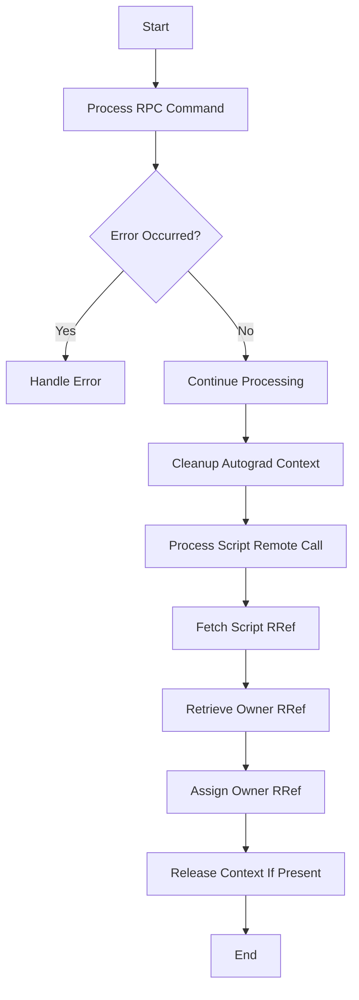

This document will cover the process of handling RPC commands and errors, which includes:

1. Processing RPC Commands
2. Handling Errors
3. Cleaning Up Autograd Context
4. Processing Script Remote Call
5. Fetching Script RRef
6. Retrieving Owner RRef
7. Assigning Owner RRef
8. Releasing Context If Present

Technical document: <SwmLink doc-title="Handling RPC Commands and Errors">[Handling RPC Commands and Errors](/.swm/handling-rpc-commands-and-errors.impwvw9l.sw.md)</SwmLink>

# [Processing RPC Commands](https://app.swimm.io/repos/Z2l0aHViJTNBJTNBcHl0b3JjaC1hdXRvZG9jcy1kZW1vJTNBJTNBU3dpbW0tRGVtbw==/docs/impwvw9l#processing-rpc-commands)

The process begins with handling an RPC command. The system identifies the type of command and delegates it to the appropriate function. This modular approach ensures that different types of RPC commands are processed efficiently. For example, a script call is processed by the `processScriptCall` function, while a Python call is handled by the `processPythonCall` function.

# [Handling Errors](https://app.swimm.io/repos/Z2l0aHViJTNBJTNBcHl0b3JjaC1hdXRvZG9jcy1kZW1vJTNBJTNBU3dpbW0tRGVtbw==/docs/impwvw9l#handling-rpc-with-errors)

If an error occurs during the processing of an RPC command, it is captured and managed appropriately. For Python-related errors, the system ensures that the Python Global Interpreter Lock (GIL) is acquired before manipulating Python objects. This is crucial for maintaining the integrity of Python operations. For standard exceptions, the error details are captured and returned, allowing the system to continue operating smoothly.

# [Cleaning Up Autograd Context](https://app.swimm.io/repos/Z2l0aHViJTNBJTNBcHl0b3JjaC1hdXRvZG9jcy1kZW1vJTNBJTNBU3dpbW0tRGVtbw==/docs/impwvw9l#cleaning-up-autograd-context)

The system handles the cleanup of autograd contexts by releasing the context if it still exists. This step ensures that any nested RPCs are managed correctly, maintaining the integrity of distributed autograd operations. If the context has already been deleted by an in-flight RPC, the system performs a no-op.

# [Processing Script Remote Call](https://app.swimm.io/repos/Z2l0aHViJTNBJTNBcHl0b3JjaC1hdXRvZG9jcy1kZW1vJTNBJTNBU3dpbW0tRGVtbw==/docs/impwvw9l#processing-script-remote-call)

When processing a remote script call, the system runs the JIT operator and assigns the owner RRef. This ensures that the remote call is executed correctly and the results are properly managed. The JIT operator is responsible for executing the script, and the owner RRef is used to manage the results.

# [Fetching Script RRef](https://app.swimm.io/repos/Z2l0aHViJTNBJTNBcHl0b3JjaC1hdXRvZG9jcy1kZW1vJTNBJTNBU3dpbW0tRGVtbw==/docs/impwvw9l#fetching-script-rref)

The system retrieves the owner RRef for a given script RRef fetch call. This step ensures that the future result is correctly handled and returned. The owner RRef is responsible for managing the state and execution of the script.

# [Retrieving Owner RRef](https://app.swimm.io/repos/Z2l0aHViJTNBJTNBcHl0b3JjaC1hdXRvZG9jcy1kZW1vJTNBJTNBU3dpbW0tRGVtbw==/docs/impwvw9l#retrieving-owner-rref)

The system retrieves the owner RRef for a given RRef ID. This step ensures that the RRef is correctly fetched and the future result is managed appropriately. The owner RRef is responsible for managing the state and execution of the RRef.

# [Assigning Owner RRef](https://app.swimm.io/repos/Z2l0aHViJTNBJTNBcHl0b3JjaC1hdXRvZG9jcy1kZW1vJTNBJTNBU3dpbW0tRGVtbw==/docs/impwvw9l#assigning-owner-rref)

The system assigns the owner RRef for a given RRef ID and fork ID. This step ensures that the value future is correctly set and any errors are handled appropriately. The owner RRef is responsible for managing the state and execution of the RRef.

# [Releasing Context If Present](https://app.swimm.io/repos/Z2l0aHViJTNBJTNBcHl0b3JjaC1hdXRvZG9jcy1kZW1vJTNBJTNBU3dpbW0tRGVtbw==/docs/impwvw9l#releasing-context-if-present)

The system releases the autograd context if it exists. This step ensures that any known worker IDs are notified to release their contexts, maintaining the consistency of distributed autograd operations. If the context does not exist, the system performs a no-op.

&nbsp;

*This is an auto-generated document by Swimm AI 🌊 and has not yet been verified by a human*

<SwmMeta version="3.0.0" repo-id="Z2l0aHViJTNBJTNBcHl0b3JjaC1hdXRvZG9jcy1kZW1vJTNBJTNBU3dpbW0tRGVtbw==" repo-name="pytorch-autodocs-demo">Powered by [Swimm](https://app.swimm.io/)</SwmMeta>
