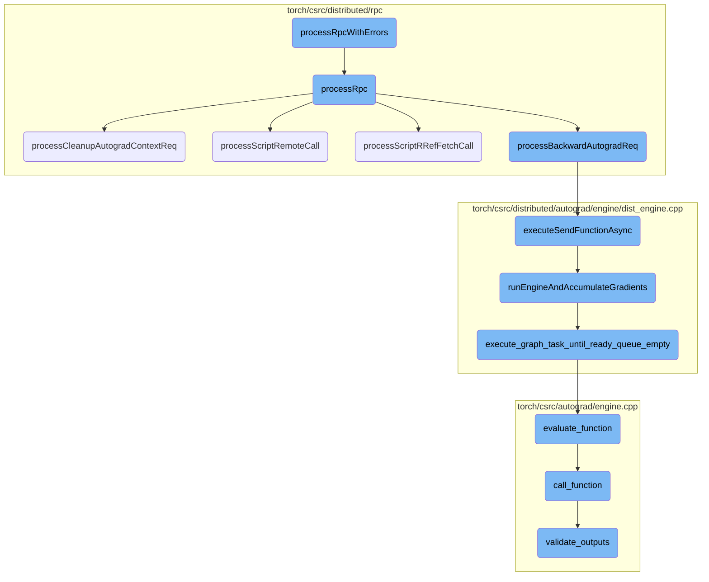
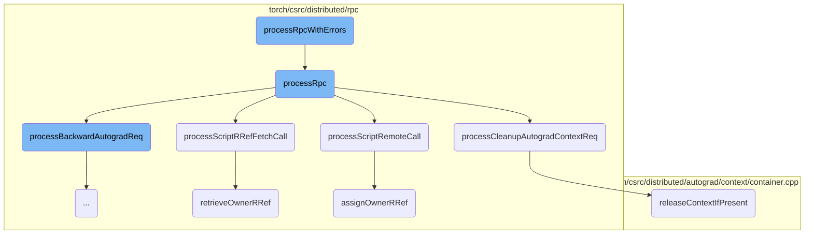
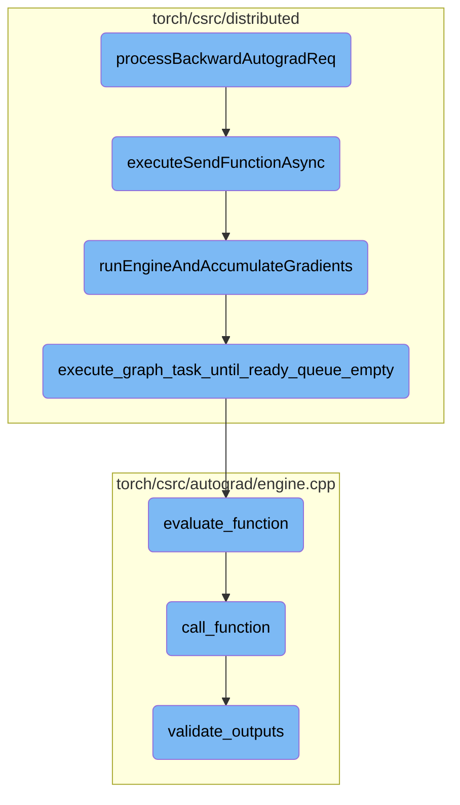

This document provides an overview of how RPC commands are processed and managed, especially focusing on error handling. It outlines the general flow of processing RPC commands, capturing and handling errors, and ensuring the integrity of distributed operations.

The process starts with attempting to handle an RPC command. If an error occurs, it is captured and managed appropriately. The system ensures that any Python-related errors are handled with the necessary interpreter locks. For other types of errors, it captures the error details and returns them. This ensures that the system can continue operating smoothly even when errors occur.

Here is a high level diagram of the flow, showing only the most important functions:



# Flow drill down

First, we'll zoom into this section of the flow:



<SwmSnippet path="/torch/csrc/distributed/rpc/request_callback_impl.cpp" line="253">

---

## Handling RPC with Errors

The function `processRpcWithErrors` is responsible for handling RPC commands and managing any errors that occur during their execution. It attempts to process the RPC command using `processRpc`. If a Python exception is encountered, it captures and handles the error, ensuring that the Python Global Interpreter Lock (GIL) is acquired before manipulating Python objects. For standard exceptions, it handles the error and returns a future with the error information.

```c++
  try {
    return processRpc(rpc, messageType, streams);
  } catch (py::error_already_set& e) {
    // Pass a dummy message ID since it will be overwritten anyways.
    auto future = asFuture(handleError(e, messageType, -1));
    // There are request callback impls in Python, where Python
    // exceptions could be thrown. For releasing Python exception
    // py::objects, GIL must be held.
    py::gil_scoped_acquire acquire;
    e.restore(); // Release ownership on py::objects and also restore
                 // Python Error Indicator.
    PyErr_Clear(); // Clear the Python Error Indicator as we has
                   // recorded the exception in the response message.
    return future;
  } catch (std::exception& e) {
    // Pass a dummy message ID since it will be overwritten anyways.
    return asFuture(handleError(e, messageType, -1));
  }
```

---

</SwmSnippet>

<SwmSnippet path="/torch/csrc/distributed/rpc/request_callback_no_python.cpp" line="503">

---

## Processing RPC Commands

The function `processRpc` processes various types of RPC commands based on the `messageType`. It uses a switch statement to delegate the processing to specific functions like `processScriptCall`, `processPythonCall`, `processScriptRemoteCall`, and others. This modular approach allows for handling different RPC command types efficiently.

```c++
  switch (messageType) {
    case MessageType::SCRIPT_CALL: {
      return processScriptCall(rpc, streams);
    }
    case MessageType::PYTHON_CALL: {
      return processPythonCall(rpc, streams);
    }
    case MessageType::SCRIPT_REMOTE_CALL: {
      return processScriptRemoteCall(rpc, streams);
    }
    case MessageType::PYTHON_REMOTE_CALL: {
      return processPythonRemoteCall(rpc, streams);
    }
    case MessageType::SCRIPT_RREF_FETCH_CALL: {
      return processScriptRRefFetchCall(rpc);
    }
    case MessageType::PYTHON_RREF_FETCH_CALL: {
      return processPythonRRefFetchCall(rpc);
    }
    case MessageType::RREF_USER_DELETE: {
      return processRRefUserDelete(rpc);
```

---

</SwmSnippet>

<SwmSnippet path="/torch/csrc/distributed/rpc/request_callback_no_python.cpp" line="388">

---

### Cleaning Up Autograd Context

The function `processCleanupAutogradContextReq` handles the cleanup of autograd contexts. It releases the context if it still exists, ensuring that any nested RPCs are managed correctly. This is crucial for maintaining the integrity of distributed autograd operations.

```c++
c10::intrusive_ptr<JitFuture> RequestCallbackNoPython::
    processCleanupAutogradContextReq(RpcCommandBase& rpc) const {
  auto& cleanupContextReq = static_cast<CleanupAutogradContextReq&>(rpc);
  auto cleanupContextId = cleanupContextReq.getContextId();
  // release the context if it still exists on this thread. We need to
  // check if it exists since it may have been deleted by an in-flight
  // RPC. This can create nested RPCs if there are other nodes that get
  // notified to clean up their context.
  DistAutogradContainer::getInstance().releaseContextIfPresent(
      cleanupContextId);
  return asFuture(CleanupAutogradContextResp().toMessage());
}
```

---

</SwmSnippet>

<SwmSnippet path="/torch/csrc/distributed/rpc/request_callback_no_python.cpp" line="203">

---

### Processing Script Remote Call

The function `processScriptRemoteCall` processes remote script calls by running the JIT operator and assigning the owner RRef. This ensures that the remote call is executed correctly and the results are properly managed.

```c++
c10::intrusive_ptr<JitFuture> RequestCallbackNoPython::processScriptRemoteCall(
    RpcCommandBase& rpc,
    const std::vector<c10::Stream>& streams) const {
  auto& scriptRemoteCall = static_cast<ScriptRemoteCall&>(rpc);

  TORCH_CHECK(
      scriptRemoteCall.hasOp(), "ScriptRemoteCall needs to have an op!");
  auto future = runJitOperator(
      *scriptRemoteCall.op(), scriptRemoteCall.stackRef(), streams);

  return assignOwnerRRef(
      scriptRemoteCall.retRRefId(), scriptRemoteCall.retForkId(), future);
}
```

---

</SwmSnippet>

<SwmSnippet path="/torch/csrc/distributed/rpc/request_callback_no_python.cpp" line="234">

---

### Fetching Script RRef

The function `processScriptRRefFetchCall` retrieves the owner RRef for a given script RRef fetch call. It ensures that the future result is correctly handled and returned.

```c++
c10::intrusive_ptr<JitFuture> RequestCallbackNoPython::
    processScriptRRefFetchCall(RpcCommandBase& rpc) const {
  auto& srf = static_cast<ScriptRRefFetchCall&>(rpc);

  auto future = retrieveOwnerRRef(srf.rrefId());

  return future->then(
      [](JitFuture& future) {
        return withStorages(ScriptRRefFetchRet({future.value()}).toMessage());
      },
      c10::getCustomClassType<c10::intrusive_ptr<Message>>());
}
```

---

</SwmSnippet>

<SwmSnippet path="/torch/csrc/distributed/rpc/request_callback_no_python.cpp" line="217">

---

### Retrieving Owner RRef

The function `retrieveOwnerRRef` retrieves the owner RRef for a given RRef ID. It ensures that the RRef is correctly fetched and the future result is managed appropriately.

```c++
c10::intrusive_ptr<JitFuture> RequestCallbackNoPython::retrieveOwnerRRef(
    const RRefId& rrefId) const {
  auto& ctx = RRefContext::getInstance();

  auto rrefFuture = ctx.getOwnerRRef(rrefId);

  at::TypePtr type = rrefFuture->elementType();
  TORCH_INTERNAL_ASSERT(type->kind() == at::RRefType::Kind);
  return rrefFuture->thenAsync(
      [](JitFuture& rrefFuture) {
        c10::intrusive_ptr<OwnerRRef> rref =
            fromRRefInterface(rrefFuture.value().toRRef());
        return rref->getFuture();
      },
      type->cast<at::RRefType>()->getElementType());
}
```

---

</SwmSnippet>

<SwmSnippet path="/torch/csrc/distributed/rpc/request_callback_no_python.cpp" line="165">

---

### Assigning Owner RRef

The function `assignOwnerRRef` assigns the owner RRef for a given RRef ID and fork ID. It ensures that the value future is correctly set and any errors are handled appropriately.

```c++
c10::intrusive_ptr<JitFuture> RequestCallbackNoPython::assignOwnerRRef(
    const RRefId& rrefId,
    const RRefId& forkId,
    const c10::intrusive_ptr<JitFuture>& valueFuture) const {
  auto& ctx = RRefContext::getInstance();

  c10::intrusive_ptr<OwnerRRef> ownerRRef;
  if (rrefId == forkId) {
    // Creating an owner RRef on self, should already exist in owners map
    ownerRRef =
        fromRRefInterface(ctx.getOwnerRRef(rrefId, /* forceCreated */ true)
                              ->constValue()
                              .toRRef());
  } else {
    ownerRRef = ctx.getOrCreateOwnerRRef(rrefId, valueFuture->elementType());
    // Caller is a user and callee is the owner, add fork
    //
    // NB: rrefId == forkId is true if and only if calling remote to self.
    // In that case both the caller and the callee will access the
    // OwnerRRef. Hence, on the callee side (here), it should not call
    // addForkOfOwner as it is not a fork. To allow callee to distinguish
```

---

</SwmSnippet>

<SwmSnippet path="/torch/csrc/distributed/autograd/context/container.cpp" line="182">

---

### Releasing Context If Present

The function `releaseContextIfPresent` releases the autograd context if it exists. It ensures that any known worker IDs are notified to release their contexts, maintaining the consistency of distributed autograd operations.

```c++
void DistAutogradContainer::releaseContextIfPresent(int64_t context_id) {
  auto& shard = getShard(context_id);
  std::unique_lock<std::mutex> lock(shard.lock);
  auto it = shard.contexts.find(context_id);

  // no-op if the context does not exist on this thread. This could happen if an
  // in-flight RPC has already released the context on this thread.
  if (it == shard.contexts.end()) {
    return;
  }

  auto knownWorkerIds = it->second->getKnownWorkerIds();
  eraseContextIdAndReset(shard, context_id);

  // Unlock since we no longer need the lock.
  lock.unlock();
  sendReleaseContextRpc(knownWorkerIds, context_id);
}
```

---

</SwmSnippet>

Now, lets zoom into this section of the flow:



<SwmSnippet path="/torch/csrc/distributed/rpc/request_callback_no_python.cpp" line="357">

---

## processBackwardAutogradReq

The function `processBackwardAutogradReq` is responsible for handling backward autograd requests in a distributed setting. It retrieves the appropriate autograd context and send function, attaches gradients to the send function, and then executes the autograd graph using the distributed engine. The response is satisfied when the RPCs come back.

```c++
  c10::MultiStreamGuard guard(streams);
  auto& gradientsCall = static_cast<PropagateGradientsReq&>(rpc);
  const auto& autogradMetadata = gradientsCall.getAutogradMetadata();

  // Retrieve the appropriate autograd context.
  auto autogradContext = DistAutogradContainer::getInstance().retrieveContext(
      autogradMetadata.autogradContextId);

  // Lookup the appropriate 'send' function to enqueue.
  std::shared_ptr<SendRpcBackward> sendFunction =
      autogradContext->retrieveSendFunction(autogradMetadata.autogradMessageId);

  // Attach the gradients to the send function.
  sendFunction->setGrads(gradientsCall.getGrads());

  // Now execute the autograd graph using the "distributed engine."
  auto execFuture = DistEngine::getInstance().executeSendFunctionAsync(
      autogradContext, sendFunction, gradientsCall.retainGraph());

  // Our response is satisfied when the rpcs come back.
  return execFuture->then(
```

---

</SwmSnippet>

<SwmSnippet path="/torch/csrc/distributed/rpc/request_callback_no_python.cpp" line="362">

---

### Retrieving Autograd Context

The autograd context is retrieved using the autograd metadata from the gradients call. This context is essential for managing the state and execution of the autograd graph.

```c++
  auto autogradContext = DistAutogradContainer::getInstance().retrieveContext(
      autogradMetadata.autogradContextId);
```

---

</SwmSnippet>

<SwmSnippet path="/torch/csrc/distributed/rpc/request_callback_no_python.cpp" line="373">

---

### Executing Send Function

The send function, which has the gradients attached, is executed asynchronously using the distributed engine. This step is crucial for propagating gradients across different nodes in the distributed setup.

```c++
  auto execFuture = DistEngine::getInstance().executeSendFunctionAsync(
      autogradContext, sendFunction, gradientsCall.retainGraph());

```

---

</SwmSnippet>

&nbsp;

*This is an auto-generated document by Swimm AI 🌊 and has not yet been verified by a human*

<SwmMeta version="3.0.0" repo-id="Z2l0aHViJTNBJTNBcHl0b3JjaC1hdXRvZG9jcy1kZW1vJTNBJTNBU3dpbW0tRGVtbw==" repo-name="pytorch-autodocs-demo"><sup>Powered by [Swimm](https://app.swimm.io/)</sup></SwmMeta>
