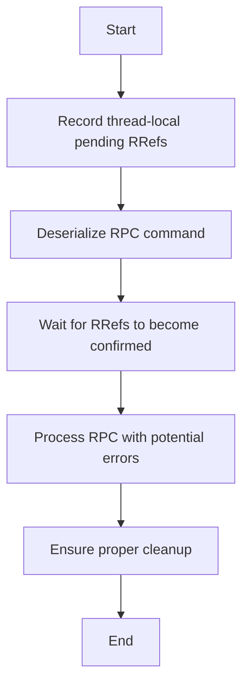

This document will cover the flow of handling RPC messages, which includes:

1. Recording thread-local pending RRefs
2. Deserializing the RPC command
3. Waiting for RRefs to become confirmed
4. Processing the RPC with potential errors
5. Ensuring proper cleanup

Technical document: <SwmLink doc-title="Handling RPC Messages">[Handling RPC Messages](/.swm/handling-rpc-messages.zjlfl5h8.sw.md)</SwmLink>

# [Recording thread-local pending RRefs](https://app.swimm.io/repos/Z2l0aHViJTNBJTNBcHl0b3JjaC1hdXRvZG9jcy1kZW1vJTNBJTNBU3dpbW0tRGVtbw==/docs/zjlfl5h8#recording-thread-local-pending-rrefs)

The first step in handling RPC messages is to record any references that are local to the thread. This ensures that any references that are pending are tracked and managed properly. This step is crucial for maintaining the integrity of the references throughout the RPC handling process.

# [Deserializing the RPC command](https://app.swimm.io/repos/Z2l0aHViJTNBJTNBcHl0b3JjaC1hdXRvZG9jcy1kZW1vJTNBJTNBU3dpbW0tRGVtbw==/docs/zjlfl5h8#deserializing-the-rpc-command)

Next, the incoming RPC command is deserialized. This means converting the command from its transmitted format into a format that can be understood and processed by the system. This step is essential for understanding what action needs to be taken based on the RPC command.

# [Waiting for RRefs to become confirmed](https://app.swimm.io/repos/Z2l0aHViJTNBJTNBcHl0b3JjaC1hdXRvZG9jcy1kZW1vJTNBJTNBU3dpbW0tRGVtbw==/docs/zjlfl5h8#waiting-for-rrefs-to-become-confirmed)

Before processing the command, the system waits for all references in the arguments to be confirmed. This ensures that all necessary references are valid and ready to be used. This step is important for preventing errors that could occur if references are not properly confirmed.

# [Processing the RPC with potential errors](https://app.swimm.io/repos/Z2l0aHViJTNBJTNBcHl0b3JjaC1hdXRvZG9jcy1kZW1vJTNBJTNBU3dpbW0tRGVtbw==/docs/zjlfl5h8#processing-rpc-with-errors)

Once everything is ready, the RPC command is processed. During this step, any errors that occur are handled appropriately. This ensures that the RPC message is processed correctly and that any issues are managed without disrupting the overall flow.

# [Ensuring proper cleanup](https://app.swimm.io/repos/Z2l0aHViJTNBJTNBcHl0b3JjaC1hdXRvZG9jcy1kZW1vJTNBJTNBU3dpbW0tRGVtbw==/docs/zjlfl5h8#managing-rref-contexts)

Finally, any necessary cleanup is performed to maintain system stability. This includes releasing any resources that were used during the RPC handling process. Proper cleanup is essential for ensuring that the system remains stable and efficient.

&nbsp;

*This is an auto-generated document by Swimm AI 🌊 and has not yet been verified by a human*

<SwmMeta version="3.0.0" repo-id="Z2l0aHViJTNBJTNBcHl0b3JjaC1hdXRvZG9jcy1kZW1vJTNBJTNBU3dpbW0tRGVtbw==" repo-name="pytorch-autodocs-demo">Powered by [Swimm](https://app.swimm.io/)</SwmMeta>
