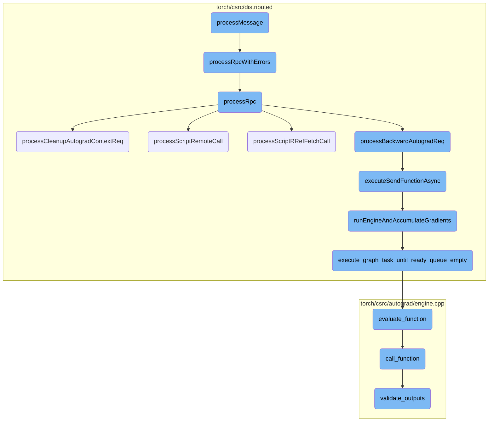
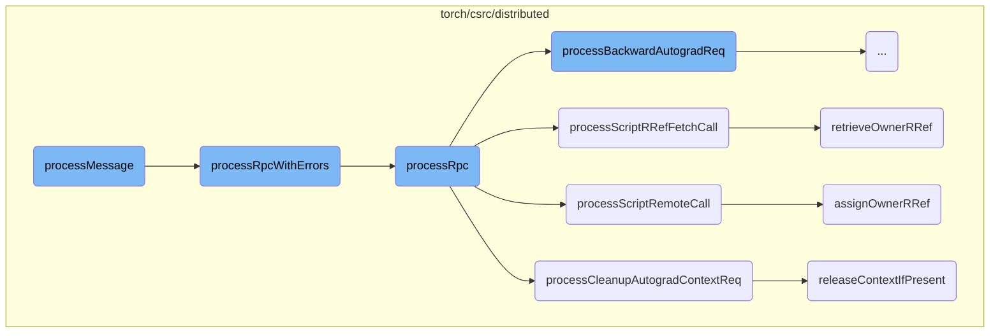
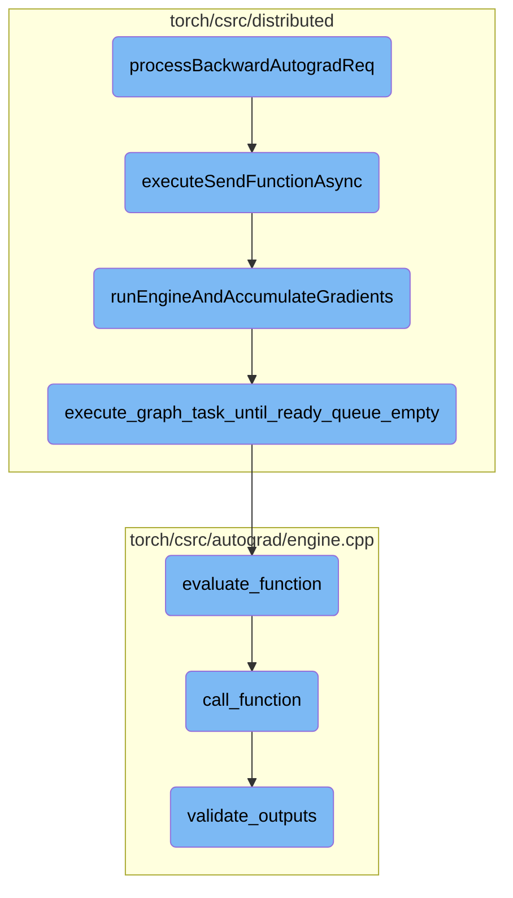

This document explains the flow of handling RPC messages. The process involves recording thread-local pending RRefs, deserializing the RPC command, waiting for RRefs to become confirmed, processing the RPC with potential errors, and ensuring proper cleanup.

The flow starts by recording any pending references that are local to the thread. Then, it deserializes the incoming RPC command to understand what action needs to be taken. Before processing the command, it waits for all references in the arguments to be confirmed. Once everything is ready, it processes the RPC command, handling any errors that might occur. Finally, it ensures that any necessary cleanup is performed to maintain system stability.

Here is a high level diagram of the flow, showing only the most important functions:



# Flow drill down

First, we'll zoom into this section of the flow:



<SwmSnippet path="/torch/csrc/distributed/rpc/request_callback_no_python.cpp" line="54">

---

## Handling RPC Messages

The `processMessage` function is responsible for handling incoming RPC messages. It first records any thread-local pending RRefs and deserializes the RPC command. It then waits for all RRefs in the arguments to become confirmed before processing the RPC with potential errors. This ensures that the RPC message is handled correctly and any necessary cleanup is performed.

```c++
c10::intrusive_ptr<JitFuture> RequestCallbackNoPython::processMessage(
    Message& request,
    std::vector<c10::Stream> streams) const {
  // We need two futures here because it could pause twice when processing a
  // RPC message:
  //  1) waiting for all RRefs in the arguments to become confirmed;
  //  2) waiting for processRpc to finish.
  auto& rrefContext = RRefContext::getInstance();
  try {
    rrefContext.recordThreadLocalPendingRRefs();
    // Deserialize PythonUDF here to trigger RRef unpickling
    std::unique_ptr<RpcCommandBase> rpc = deserializePythonRpcCommand(
        deserializeRequest(request), request.type());
    auto rrefsReadyFuture = rrefContext.waitForThreadLocalPendingRRefs();

    auto retFuture = rrefsReadyFuture->thenAsync(
        [this,
         // std::function must be copyable, hence hae to cast the unique_ptr to
         // a shared_ptr here.
         rpc = (std::shared_ptr<RpcCommandBase>)std::move(rpc),
         messageType = request.type(),
```

---

</SwmSnippet>

<SwmSnippet path="/torch/csrc/distributed/rpc/request_callback_no_python.cpp" line="124">

---

### Processing RPC with Errors

The `processRpcWithErrors` function attempts to process the RPC command and catches any exceptions that occur. If an error is encountered, it handles the error and returns a future with the error information. This function ensures that any errors during RPC processing are properly managed and do not disrupt the overall flow.

```c++
c10::intrusive_ptr<JitFuture> RequestCallbackNoPython::processRpcWithErrors(
    RpcCommandBase& rpc,
    const MessageType& messageType,
    const std::vector<c10::Stream>& streams) const {
  try {
    return processRpc(rpc, messageType, streams);
  } catch (std::exception& e) {
    // Pass a dummy message ID since it will be overwritten anyways.
    return asFuture(handleError(e, messageType, -1));
  }
}
```

---

</SwmSnippet>

<SwmSnippet path="/torch/csrc/distributed/rpc/request_callback_no_python.cpp" line="493">

---

### Processing RPC

The `processRpc` function processes different types of RPC commands based on the message type. It uses a switch statement to handle various RPC requests such as script calls, Python calls, and autograd requests. This function is crucial for executing the appropriate action based on the RPC message type.

```c++
c10::intrusive_ptr<JitFuture> RequestCallbackNoPython::processRpc(
    RpcCommandBase& rpc,
    const MessageType& messageType,
    const std::vector<c10::Stream>& streams) const {
  // TODO: RpcCommandBase should have an abstract execute() method that we can
  // call here instead of having another switch statement here. Even better we
  // could have abstract classes RpcRequest and RpcResp which inherit from
  // RpcCommandBase and RpcRequest declares the abstract method execute() that
  // we can call here. RpcResponse could have an abstract method to convert it
  // to a python object.
  switch (messageType) {
    case MessageType::SCRIPT_CALL: {
      return processScriptCall(rpc, streams);
    }
    case MessageType::PYTHON_CALL: {
      return processPythonCall(rpc, streams);
    }
    case MessageType::SCRIPT_REMOTE_CALL: {
      return processScriptRemoteCall(rpc, streams);
    }
    case MessageType::PYTHON_REMOTE_CALL: {
```

---

</SwmSnippet>

<SwmSnippet path="/torch/csrc/distributed/rpc/request_callback_no_python.cpp" line="388">

---

## Managing RRef Contexts

The `processCleanupAutogradContextReq` function handles the cleanup of autograd contexts. It releases the context if it still exists on the thread, ensuring that any resources associated with the context are properly cleaned up. This function is important for managing the lifecycle of autograd contexts in a distributed setting.

```c++
c10::intrusive_ptr<JitFuture> RequestCallbackNoPython::
    processCleanupAutogradContextReq(RpcCommandBase& rpc) const {
  auto& cleanupContextReq = static_cast<CleanupAutogradContextReq&>(rpc);
  auto cleanupContextId = cleanupContextReq.getContextId();
  // release the context if it still exists on this thread. We need to
  // check if it exists since it may have been deleted by an in-flight
  // RPC. This can create nested RPCs if there are other nodes that get
  // notified to clean up their context.
  DistAutogradContainer::getInstance().releaseContextIfPresent(
      cleanupContextId);
  return asFuture(CleanupAutogradContextResp().toMessage());
}
```

---

</SwmSnippet>

<SwmSnippet path="/torch/csrc/distributed/rpc/request_callback_no_python.cpp" line="165">

---

### Assigning Owner RRef

The `assignOwnerRRef` function assigns an owner RRef to the given RRef ID and fork ID. It ensures that the owner RRef is properly created and managed, and it handles any errors that occur during the assignment. This function is essential for managing RRefs in a distributed environment.

```c++
c10::intrusive_ptr<JitFuture> RequestCallbackNoPython::assignOwnerRRef(
    const RRefId& rrefId,
    const RRefId& forkId,
    const c10::intrusive_ptr<JitFuture>& valueFuture) const {
  auto& ctx = RRefContext::getInstance();

  c10::intrusive_ptr<OwnerRRef> ownerRRef;
  if (rrefId == forkId) {
    // Creating an owner RRef on self, should already exist in owners map
    ownerRRef =
        fromRRefInterface(ctx.getOwnerRRef(rrefId, /* forceCreated */ true)
                              ->constValue()
                              .toRRef());
  } else {
    ownerRRef = ctx.getOrCreateOwnerRRef(rrefId, valueFuture->elementType());
    // Caller is a user and callee is the owner, add fork
    //
    // NB: rrefId == forkId is true if and only if calling remote to self.
    // In that case both the caller and the callee will access the
    // OwnerRRef. Hence, on the callee side (here), it should not call
    // addForkOfOwner as it is not a fork. To allow callee to distinguish
```

---

</SwmSnippet>

<SwmSnippet path="/torch/csrc/distributed/autograd/context/container.cpp" line="182">

---

### Releasing Context if Present

The `releaseContextIfPresent` function releases the autograd context if it exists on the current thread. It ensures that any resources associated with the context are properly cleaned up and notifies other nodes to release their contexts as well. This function is important for maintaining consistency and resource management in a distributed autograd setup.

```c++
void DistAutogradContainer::releaseContextIfPresent(int64_t context_id) {
  auto& shard = getShard(context_id);
  std::unique_lock<std::mutex> lock(shard.lock);
  auto it = shard.contexts.find(context_id);

  // no-op if the context does not exist on this thread. This could happen if an
  // in-flight RPC has already released the context on this thread.
  if (it == shard.contexts.end()) {
    return;
  }

  auto knownWorkerIds = it->second->getKnownWorkerIds();
  eraseContextIdAndReset(shard, context_id);

  // Unlock since we no longer need the lock.
  lock.unlock();
  sendReleaseContextRpc(knownWorkerIds, context_id);
}
```

---

</SwmSnippet>

Now, lets zoom into this section of the flow:



<SwmSnippet path="/torch/csrc/distributed/rpc/request_callback_no_python.cpp" line="357">

---

## processBackwardAutogradReq

The function `processBackwardAutogradReq` is responsible for handling backward autograd requests in a distributed setting. It retrieves the appropriate autograd context and send function, attaches gradients to the send function, and then executes the autograd graph using the distributed engine. The response is satisfied when the RPCs come back, ensuring that the gradients are propagated correctly across the distributed nodes.

```c++
  c10::MultiStreamGuard guard(streams);
  auto& gradientsCall = static_cast<PropagateGradientsReq&>(rpc);
  const auto& autogradMetadata = gradientsCall.getAutogradMetadata();

  // Retrieve the appropriate autograd context.
  auto autogradContext = DistAutogradContainer::getInstance().retrieveContext(
      autogradMetadata.autogradContextId);

  // Lookup the appropriate 'send' function to enqueue.
  std::shared_ptr<SendRpcBackward> sendFunction =
      autogradContext->retrieveSendFunction(autogradMetadata.autogradMessageId);

  // Attach the gradients to the send function.
  sendFunction->setGrads(gradientsCall.getGrads());

  // Now execute the autograd graph using the "distributed engine."
  auto execFuture = DistEngine::getInstance().executeSendFunctionAsync(
      autogradContext, sendFunction, gradientsCall.retainGraph());

  // Our response is satisfied when the rpcs come back.
  return execFuture->then(
```

---

</SwmSnippet>

<SwmSnippet path="/torch/csrc/distributed/autograd/engine/dist_engine.cpp" line="506">

---

### executeSendFunctionAsync

The function `executeSendFunctionAsync` is called within `processBackwardAutogradReq` to execute the send function asynchronously. It handles the execution of the autograd graph task until the ready queue is empty, ensuring that all necessary gradients are accumulated and propagated.

```c++
         callbackFuture](c10::ivalue::Future& accumulateGradFuture) {
          try {
            if (accumulateGradFuture.hasError()) {
              // Perform cleanup at the end of the backward pass (before we mark
              // the future as completed).
              DistEngine::getInstance().cleanupBackwardPass(autogradContext);

              // Skip any further processing on errors.
              callbackFuture->setError(accumulateGradFuture.exception_ptr());
              return;
            }

            // Wait for all RPCs after the autograd engine is done.
            auto rpcFuture =
                autogradContext->clearAndWaitForOutstandingRpcsAsync();
            rpcFuture->addCallback([callbackFuture, autogradContext](
                                       c10::ivalue::Future& rpcFuture) {
              try {
                // Perform cleanup at the end of the backward pass (before
                // we mark the future as completed).
                DistEngine::getInstance().cleanupBackwardPass(autogradContext);
```

---

</SwmSnippet>

<SwmSnippet path="/torch/csrc/distributed/autograd/engine/dist_engine.cpp" line="402">

---

### runEngineAndAccumulateGradients

The function `runEngineAndAccumulateGradients` is responsible for running the autograd engine and accumulating gradients. It clears any previous state for outstanding RPCs, retrieves the graph task, and launches the execution of the graph task until the ready queue is empty. This ensures that all gradients are properly accumulated.

```c++
c10::intrusive_ptr<c10::ivalue::Future> DistEngine::
    runEngineAndAccumulateGradients(
        const ContextPtr& autogradContext,
        const std::shared_ptr<Node>& graphRoot,
        const edge_list& outputEdges,
        bool incrementOutstandingTasks) {
  // Cleanup previous state for outstanding RPCs. Outstanding RPCs could be
  // lingering if we're running backward multiple times and some of the
  // passes ran into errors.
  autogradContext->clearOutstandingRpcs();
  auto graphTask = autogradContext->retrieveGraphTask();
  at::launch([this, graphTask, graphRoot, incrementOutstandingTasks]() {
    execute_graph_task_until_ready_queue_empty(
        /*node_task*/ NodeTask(graphTask, graphRoot, InputBuffer(0)),
        /*incrementOutstandingTasks*/ incrementOutstandingTasks);
  });
  // Use a reference here to avoid refcount bump on futureGrads.
  auto& futureGrads = graphTask->future_result_;

  // Build a future that waits for the callbacks to execute (since callbacks
  // execute after the original future is completed). This ensures we return a
```

---

</SwmSnippet>

<SwmSnippet path="/torch/csrc/distributed/autograd/engine/dist_engine.cpp" line="346">

---

### execute_graph_task_until_ready_queue_empty

The function `execute_graph_task_until_ready_queue_empty` executes the graph task until the ready queue is empty. It initializes the device threads pool, creates a ready queue, and processes each node task in the queue. This function ensures that the autograd graph is fully executed and all tasks are completed.

```c++
void DistEngine::execute_graph_task_until_ready_queue_empty(
    NodeTask&& node_task,
    bool incrementOutstandingTasks) {
  engine_.initialize_device_threads_pool();
  // Create a ready queue per call to traverse the graph_task from
  // root_to_execute This allow concurrent execution of the same GraphTask from
  // different threads
  std::shared_ptr<ReadyQueue> cpu_ready_queue = std::make_shared<ReadyQueue>();
  auto graph_task = node_task.base_.lock();
  if (graph_task == nullptr) {
    LOG(ERROR) << "GraphTask has expired for NodeTask: "
               << node_task.fn_->name() << ", skipping execution.";
    return;
  }

  cpu_ready_queue->push(std::move(node_task), incrementOutstandingTasks);

  torch::autograd::set_device(torch::autograd::CPU_DEVICE);
  while (!cpu_ready_queue->empty()) {
    std::shared_ptr<GraphTask> local_graph_task;
    {
```

---

</SwmSnippet>

<SwmSnippet path="/torch/csrc/autograd/engine.cpp" line="991">

---

### evaluate_function

The function `evaluate_function` evaluates a single function in the autograd graph. It processes the inputs, calls the function, and handles the outputs. This function is crucial for the execution of each node in the autograd graph, ensuring that the gradients are correctly computed and propagated.

```c++
void Engine::evaluate_function(
    std::shared_ptr<GraphTask>& graph_task,
    Node* func,
    InputBuffer& inputs,
    const std::shared_ptr<ReadyQueue>& cpu_ready_queue) {
  // The InputBuffer::adds that supplied incoming grads took pains to
  // ensure they're safe to consume in the context of the present
  // func's stream (if applicable). So we guard onto that stream
  // before working with the grads in any capacity.
  auto opt_parent_stream = (*func).stream();
  c10::OptionalStreamGuard parent_stream_guard{opt_parent_stream};

  // If exec_info_ is not empty, we have to instrument the execution
  auto& exec_info_ = graph_task->exec_info_;
  if (!exec_info_.empty()) {
    auto& fn_info = exec_info_.at(func);
    variable_list new_inputs = inputs.buffer;
    if (!fn_info.needed_) {
      // We always want to call tensor pre-hooks, but want to avoid calling it
      // twice. needed_ = True indicates that we will call tensor pre-hooks
      // later.
```

---

</SwmSnippet>

<SwmSnippet path="/torch/csrc/autograd/engine.cpp" line="940">

---

### call_function

The function `call_function` is responsible for calling a specific function in the autograd graph. It handles pre-hooks, executes the function, and validates the outputs. This function is called within `evaluate_function` to perform the actual computation of gradients.

```c++
static variable_list call_function(
    std::shared_ptr<GraphTask>& graph_task,
    Node* func,
    InputBuffer& inputBuffer) {
  CheckpointValidGuard cpvguard(graph_task);
  auto& fn = *func;
  auto inputs =
      call_tensor_pre_hooks(fn, InputBuffer::variables(std::move(inputBuffer)));
  inputs = call_pre_hooks(fn, std::move(inputs));
  if (!graph_task->keep_graph_) {
    fn.will_release_variables();
  }

  const auto has_post_hooks = !fn.post_hooks().empty();
  variable_list outputs;

  if (has_post_hooks) {
    // In functions/accumulate_grad.cpp, there is some logic to check the
    // conditions under which the incoming gradient can be stolen directly
    // (which elides a deep copy) instead of cloned. One of these conditions
    // is that the incoming gradient's refcount must be 1 (nothing else is
```

---

</SwmSnippet>

<SwmSnippet path="/torch/csrc/autograd/engine.cpp" line="857">

---

### validate_outputs

The function `validate_outputs` validates the outputs of a function in the autograd graph. It checks the number of gradients, their types, and other properties to ensure they are correct. This function is called within `call_function` to ensure the integrity of the computed gradients.

```c++
void validate_outputs(
    const edge_list& edges,
    variable_list& grads,
    const std::function<std::string(const std::string&)>& format_error) {
  if (grads.size() != edges.size()) {
    std::stringstream ss;
    ss << "invalid number of gradients - expected ";
    ss << edges.size() << ", but got " << grads.size();
    TORCH_CHECK(false, format_error(ss.str()));
  }
  for (const auto i : c10::irange(grads.size())) {
    const auto& edge = edges[i];
    if (!edge.is_valid())
      continue;

    const auto& metadata = edge.function->input_metadata(edge.input_nr);
    auto& grad = grads[i];
    if (!grad.defined()) {
      // FIXME: TestJit.test_ge_optimized fails this assertion.
      // std::stringstream ss;
      // ss << "undefined gradient at index " << i;
```

---

</SwmSnippet>

&nbsp;

*This is an auto-generated document by Swimm AI 🌊 and has not yet been verified by a human*

<SwmMeta version="3.0.0" repo-id="Z2l0aHViJTNBJTNBcHl0b3JjaC1hdXRvZG9jcy1kZW1vJTNBJTNBU3dpbW0tRGVtbw==" repo-name="pytorch-autodocs-demo"><sup>Powered by [Swimm](https://app.swimm.io/)</sup></SwmMeta>
