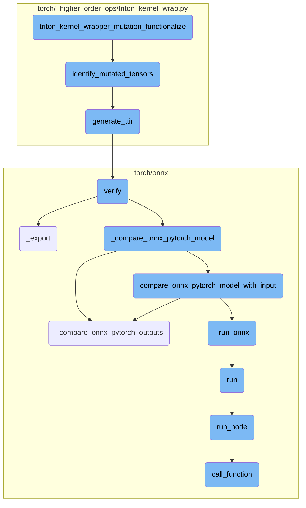
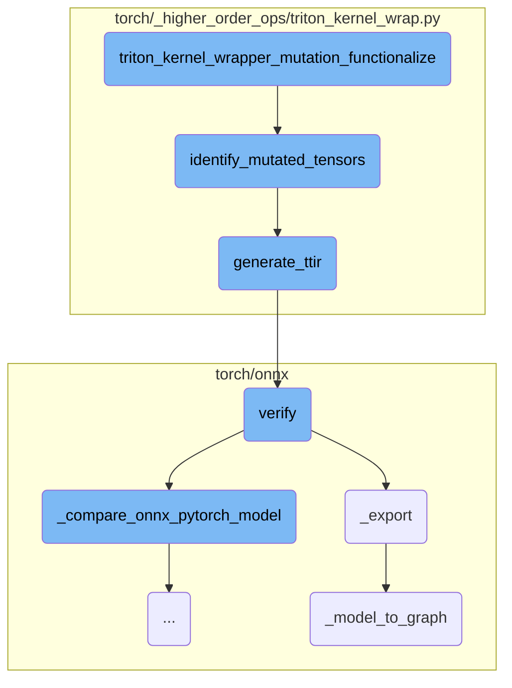
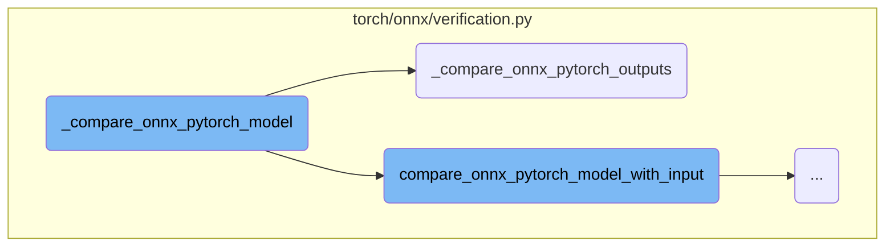
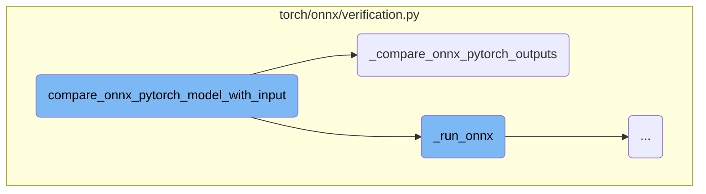
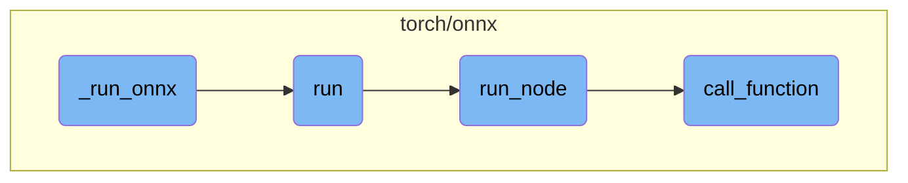

This document provides an overview of the process involved in handling tensor mutations within a Triton kernel. The flow includes identifying mutated tensors, generating the Triton Intermediate Representation (TTIR), verifying the model, and comparing the outputs of ONNX and PyTorch models.

The process starts with identifying which tensors are mutated during the execution of a Triton kernel. Once identified, the Triton Intermediate Representation (TTIR) of the kernel is generated. This representation is then verified to ensure correctness. Finally, the outputs of the ONNX model are compared with those of the original PyTorch model to ensure they match.

Here is a high level diagram of the flow, showing only the most important functions:



# Flow drill down

First, we'll zoom into this section of the flow:



<SwmSnippet path="/torch/_higher_order_ops/triton_kernel_wrap.py" line="608">

---

## Tensor Mutation Functionalization

The function `triton_kernel_wrapper_mutation_functionalize` is responsible for handling tensor mutations within a Triton kernel. It first unwraps the tensor arguments and retrieves the kernel and constant arguments. It then identifies tensors that are mutated by calling `identify_mutated_tensors`. The function proceeds to execute the kernel with the identified tensors and ensures that the mutated tensors are correctly replaced and synchronized.

```python
def triton_kernel_wrapper_mutation_functionalize(
    ctx, kernel_idx, constant_args_idx, grid, kwargs
):
    unwrapped_kwargs = ctx.unwrap_tensors(kwargs)
    kernel = kernel_side_table.get_kernel(kernel_idx)
    constant_args = kernel_side_table.get_constant_args(constant_args_idx)
    # TODO(oulgen): Preexisting bug, if two kernel inputs are views of each
    # other, and one gets mutated in kernel, and later another gets mutated,
    # they are no longer equal. Fix this by graph breaking on this condition
    # earlier in dynamo.
    tensors_to_clone = identify_mutated_tensors(
        kernel, {**unwrapped_kwargs, **constant_args}
    )
    with ctx.redispatch_to_next():
        unwrapped_outputs = triton_kernel_wrapper_functional(
            kernel_idx=kernel_idx,
            constant_args_idx=constant_args_idx,
            grid=grid,
            kwargs=unwrapped_kwargs,
            tensors_to_clone=tensors_to_clone,
        )
```

---

</SwmSnippet>

<SwmSnippet path="/torch/_higher_order_ops/triton_kernel_wrap.py" line="469">

---

### Identifying Mutated Tensors

The function `identify_mutated_tensors` analyzes a Triton kernel to detect input tensor mutations. It generates the Triton Intermediate Representation (TTIR) of the kernel, parses it to create a control flow graph, and then analyzes this graph to identify which input tensors are mutated. If an exception occurs, it assumes all input tensors are mutated.

```python
def identify_mutated_tensors(kernel, kwargs):
    """
    Given a triton kernel and the arguments for this kernel, this function
    1) Retrieves the TTIR converted version of the kernel from Triton's API.
    2) Parses the TTIR and creates a control flow graph
    3) Analyzes the graph to detect all input tensor mutations
    """

    ttir_module = None
    functions = None
    try:
        ttir_module, ordered_tensor_names = generate_ttir(kernel, kwargs)

        # extract functions from TTIR using MLIR bindings exposed by Triton code
        functions = ttir_to_functions(ttir_module)

        assert functions is not None
        kernel_name = next(iter(functions.keys()))
        # Triton codegen modifies the name
        assert kernel.fn.__name__ in kernel_name
        # Reset the cache between top level invocations
```

---

</SwmSnippet>

<SwmSnippet path="/torch/_higher_order_ops/triton_kernel_wrap.py" line="116">

---

### Generating Triton Intermediate Representation (TTIR)

The function `generate_ttir` uses Triton's internal code generation to create the Triton Intermediate Representation (TTIR) of a kernel. It prepares the kernel arguments, builds the kernel signature, and generates the TTIR module, which is then verified for correctness.

```python
def generate_ttir(kernel, kwargs):
    """
    Uses Triton's internal code generation to create TTIR
    """
    import sympy
    import triton
    from triton.compiler.compiler import ASTSource
    from triton.runtime.autotuner import Autotuner
    from triton.runtime.jit import JITFunction

    import torch
    import torch._inductor.ir
    from torch._subclasses.fake_tensor import FakeTensor

    if isinstance(kernel, Autotuner):
        if len(kernel.configs) > 0:
            # If we are autotuning, then it doesn't matter which version gets
            # picked for tracing purposes, so lets pick the first one
            kwargs = {**kwargs, **kernel.configs[0].kwargs}
        kernel = kernel.fn

```

---

</SwmSnippet>

<SwmSnippet path="/torch/onnx/verification.py" line="772">

---

## Model Verification

The function `verify` ensures that the exported ONNX model matches the original PyTorch model. It exports the model to ONNX format and compares the outputs of the ONNX model with the original PyTorch model to verify their equivalence.

```python
def verify(
    model: _ModelType,
    input_args: _InputArgsType,
    input_kwargs: _InputKwargsType | None = None,
    do_constant_folding: bool = True,
    dynamic_axes: Mapping[str, Mapping[int, str] | Mapping[str, Sequence[int]]]
    | None = None,
    input_names: Sequence[str] | None = None,
    output_names: Sequence[str] | None = None,
    training: _C_onnx.TrainingMode = _C_onnx.TrainingMode.EVAL,
    opset_version: int | None = None,
    keep_initializers_as_inputs: bool = True,
    verbose: bool = False,
    fixed_batch_size: bool = False,
    use_external_data: bool = False,
    additional_test_inputs: Sequence[_InputArgsType] | None = None,
    options: VerificationOptions | None = None,
):
    """Verify model export to ONNX against original PyTorch model.

    Args:
```

---

</SwmSnippet>

<SwmSnippet path="/torch/onnx/utils.py" line="1515">

---

### Exporting the Model

The function `_export` handles the export of a PyTorch model to ONNX format. It prepares the model and its inputs, generates the ONNX graph, and writes the ONNX model to the specified file or buffer.

```python
def _export(
    model,
    args,
    f,
    export_params=True,
    verbose=False,
    training=_C_onnx.TrainingMode.EVAL,
    input_names=None,
    output_names=None,
    operator_export_type=_C_onnx.OperatorExportTypes.ONNX,
    export_type=None,
    opset_version=None,
    do_constant_folding=True,
    dynamic_axes=None,
    keep_initializers_as_inputs=None,
    fixed_batch_size=False,
    custom_opsets=None,
    add_node_names=True,
    onnx_shape_inference=True,
    export_modules_as_functions=False,
    autograd_inlining=True,
```

---

</SwmSnippet>

<SwmSnippet path="/torch/onnx/utils.py" line="1130">

---

### Converting Model to Graph

The function `_model_to_graph` converts a PyTorch model into an ONNX graph. It creates a TorchScript IR graph with ONNX nodes, optimizes the graph, and assigns input and output names. The resulting graph, along with the parameter dictionary and model outputs, is returned for further processing.

```python
def _model_to_graph(
    model,
    args,
    verbose=False,
    input_names=None,
    output_names=None,
    operator_export_type=_C_onnx.OperatorExportTypes.ONNX,
    do_constant_folding=True,
    _disable_torch_constant_prop=False,
    fixed_batch_size=False,
    training=_C_onnx.TrainingMode.EVAL,
    dynamic_axes=None,
) -> tuple[
    _C.Graph,
    dict[str, torch.Tensor],
    torch.Tensor
    | tuple[torch.Tensor, ...]
    | list[torch.Tensor]
    | dict[str, torch.Tensor]
    | Any
    | None,
```

---

</SwmSnippet>

Now, lets zoom into this section of the flow:



<SwmSnippet path="/torch/onnx/verification.py" line="405">

---

## Comparing ONNX and PyTorch Models

The function `_compare_onnx_pytorch_model` is responsible for comparing the outputs of an ONNX model with a PyTorch model. It first sets up an ONNX backend session and then prepares the inputs for both the PyTorch and ONNX models. The function `compare_onnx_pytorch_model_with_input` is defined within it to handle the comparison for a given set of inputs. The outputs from both models are then compared using `_compare_onnx_pytorch_outputs`.

```python
    onnx_session = _onnx_backend_session(onnx_model_f, options.backend)

    def compare_onnx_pytorch_model_with_input(input_args, input_kwargs):
        pt_args, pt_kwargs = _prepare_input_for_pytorch(input_args, input_kwargs)
        # TODO: remove this and treat mutating model separately. See #77679
        pt_model_copy = _try_clone_model(pt_model)
        pt_outs = pt_model_copy(*pt_args, **pt_kwargs)

        onnx_inputs = _prepare_input_for_onnx(
            input_args, input_kwargs, options.remained_onnx_input_idx, options.flatten
        )

        onnx_outs = _run_onnx(onnx_session, onnx_inputs)

        _compare_onnx_pytorch_outputs(
            onnx_outs=onnx_outs,
            pt_outs=pt_outs,
            options=options,
        )

    compare_onnx_pytorch_model_with_input(input_args, input_kwargs)
```

---

</SwmSnippet>

<SwmSnippet path="/torch/onnx/verification.py" line="264">

---

### Comparing Outputs

The function `_compare_onnx_pytorch_outputs` is called to compare the outputs from the ONNX and PyTorch models. It ensures that the outputs are flattened and converted to numpy arrays before performing the comparison. If the outputs are not equal up to the specified precision, an `AssertionError` is raised.

```python
def _compare_onnx_pytorch_outputs(
    onnx_outs: _OutputsType,
    pt_outs: Any,
    options: VerificationOptions,
):
    """
    Compare ONNX and PyTorch outputs.

    Args:
        onnx_outs: outputs from ONNX backend.
        pt_outs: outputs from PyTorch.
        options: options for verification.

    Raises:
        AssertionError: if outputs from ONNX model and PyTorch model are not
            equal up to specified precision.
        ValueError: if arguments provided are invalid.
    """
    if options.ignore_none:
        # torch.jit._flatten filters None type
        pt_outs, _ = torch.jit._flatten(pt_outs)
```

---

</SwmSnippet>

Now, lets zoom into this section of the flow:



<SwmSnippet path="/torch/onnx/verification.py" line="407">

---

## Comparing ONNX and PyTorch model outputs

The function `compare_onnx_pytorch_model_with_input` is responsible for comparing the outputs of an ONNX model and a PyTorch model given the same inputs. It first prepares the inputs for the PyTorch model and runs the model to get the outputs. Then, it prepares the inputs for the ONNX model and runs it to get the ONNX outputs. Finally, it compares the outputs from both models using the `_compare_onnx_pytorch_outputs` function.

```python
    def compare_onnx_pytorch_model_with_input(input_args, input_kwargs):
        pt_args, pt_kwargs = _prepare_input_for_pytorch(input_args, input_kwargs)
        # TODO: remove this and treat mutating model separately. See #77679
        pt_model_copy = _try_clone_model(pt_model)
        pt_outs = pt_model_copy(*pt_args, **pt_kwargs)

        onnx_inputs = _prepare_input_for_onnx(
            input_args, input_kwargs, options.remained_onnx_input_idx, options.flatten
        )

        onnx_outs = _run_onnx(onnx_session, onnx_inputs)

        _compare_onnx_pytorch_outputs(
            onnx_outs=onnx_outs,
            pt_outs=pt_outs,
            options=options,
        )
```

---

</SwmSnippet>

Now, lets zoom into this section of the flow:



<SwmSnippet path="/torch/onnx/verification.py" line="136">

---

## \_run_onnx

The `_run_onnx` function is responsible for executing an ONNX model using the provided ONNX session and inputs. It first processes the inputs, converting them to a format compatible with ONNX. Then, it maps the inputs to the corresponding input names expected by the ONNX session. Finally, it runs the ONNX session with the prepared inputs and returns the outputs.

```python
def _run_onnx(onnx_session, inputs) -> _OutputsType:
    kw_inputs = {}
    if inputs and isinstance(inputs[-1], dict):
        kw_inputs = inputs[-1]
        inputs = inputs[:-1]
    inputs = _unpack_to_numpy(_flatten_tuples(inputs))
    ort_inputs = {}
    for input_name, input in kw_inputs.items():
        ort_inputs[input_name] = _to_numpy(input)
    inputs = _to_numpy(inputs)
    if hasattr(onnx_session, "get_inputs"):
        # onnxruntime.InferenceSession
        input_names = [i.name for i in onnx_session.get_inputs()]
    elif hasattr(onnx_session, "input_names"):
        # onnx.reference.ReferenceEvaluator
        input_names = onnx_session.input_names
    else:
        raise ValueError(f"Unknown ONNX backend type: {type(onnx_session)}.")

    for i, input in enumerate(inputs):
        if i == len(input_names) or input_names[i] in ort_inputs:
```

---

</SwmSnippet>

<SwmSnippet path="/torch/onnx/_internal/fx/fx_onnx_interpreter.py" line="473">

---

## run

The `run` function analyzes all FX nodes in a given FX graph module and triggers their ONNX translation. It creates a TorchScript graph to represent the input FX graph with ONNX symbols. The function iterates over each node in the FX graph, translating it to its ONNX counterpart using the `run_node` function.

```python
    def run(
        self,
        fx_graph_module: torch.fx.GraphModule,
        onnxfunction_dispatcher: onnxfunction_dispatcher.OnnxFunctionDispatcher,
        op_level_debug: bool,
        parent_onnxscript_graph: onnxscript_graph_building.TorchScriptGraph
        | None = None,
    ) -> onnxscript_graph_building.TorchScriptGraph:
        """Analyze all FX nodes and trigger their ONNX translation.

        Args:
            fx_graph_module: FX graph module to be translated.
            onnxfunction_dispatcher: ONNX function dispatcher.
            op_level_debug: Whether to enable op-level debug.
            parent_onnxscript_graph: The parent TorchScript graph. Must be provided if
                `fx_graph_module` is a submodule. If not provided,
                `fx_graph_module` is assumed to be the root module.
        """
        diagnostic = self.diagnostic_context.inflight_diagnostic()
        with diagnostic.log_section(logging.DEBUG, "FX Graph:"):
            diagnostic.debug(
```

---

</SwmSnippet>

<SwmSnippet path="/torch/onnx/_internal/fx/fx_onnx_interpreter.py" line="394">

---

## run_node

The `run_node` function executes a single FX node to produce its ONNX counterpart. It handles different types of nodes such as placeholders, attributes, function calls, methods, modules, and outputs. The function uses the `call_function` method to handle nodes that represent function calls.

```python
    def run_node(
        self,
        node,
        fx_graph_module: torch.fx.GraphModule,
        onnxfunction_dispatcher: onnxfunction_dispatcher.OnnxFunctionDispatcher,
        op_level_debug: bool,
        onnxscript_graph: onnxscript_graph_building.TorchScriptGraph,
        onnxscript_tracer: onnxscript_graph_building.TorchScriptTracingEvaluator,
        fx_name_to_onnxscript_value: dict[
            str,
            onnxscript_graph_building.TorchScriptTensor
            | tuple[onnxscript_graph_building.TorchScriptTensor, ...],
        ],
    ):
        """Execute a single FX node to produce its ONNX counterpart.

        Args:
            node: The FX node to be translated.
            fx_graph_module: The FX graph module containing the node.
            onnxfunction_dispatcher: The dispatcher to find the best matched ONNX op.
            op_level_debug (bool): Whether to enable op level debug.
```

---

</SwmSnippet>

<SwmSnippet path="/torch/onnx/_internal/fx/fx_onnx_interpreter.py" line="614">

---

### call_function

The `call_function` method is used within `run_node` to handle nodes that represent function calls. It maps FX inputs to ONNX inputs, fills optional inputs with default values, and dispatches the function call to the appropriate ONNX operation. The method ensures that the output is correctly typed and shaped according to the FX graph.

```python
    def call_function(
        self,
        node: torch.fx.Node,
        onnxscript_tracer: onnxscript_graph_building.TorchScriptTracingEvaluator,
        fx_name_to_onnxscript_value: dict[
            str,
            onnxscript_graph_building.TorchScriptTensor
            | tuple[onnxscript_graph_building.TorchScriptTensor, ...],
        ],
        onnxfunction_dispatcher: onnxfunction_dispatcher.OnnxFunctionDispatcher,
        op_level_debug: bool,
        fx_graph_module: torch.fx.GraphModule,
    ):
        # aten ops and other stateless functions.
        if node.target == operator.getitem and isinstance(
            fx_name_to_onnxscript_value[node.args[0].name], tuple  # type: ignore[union-attr,index]
        ):
            onnx_tensor_tuple = fx_name_to_onnxscript_value[node.args[0].name]  # type: ignore[union-attr,index]
            index = node.args[1]
            value = onnx_tensor_tuple[index]  # type: ignore[index]
            assert (
```

---

</SwmSnippet>

&nbsp;

*This is an auto-generated document by Swimm AI 🌊 and has not yet been verified by a human*

<SwmMeta version="3.0.0" repo-id="Z2l0aHViJTNBJTNBcHl0b3JjaC1hdXRvZG9jcy1kZW1vJTNBJTNBU3dpbW0tRGVtbw==" repo-name="pytorch-autodocs-demo"><sup>Powered by [Swimm](https://app.swimm.io/)</sup></SwmMeta>
