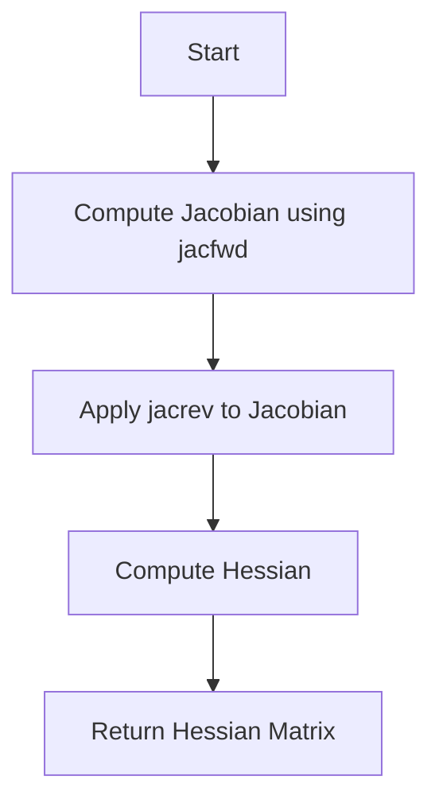

This document will cover the Hessian Function feature, which includes:

1. Overview of the Hessian Function
2. Forward-over-Reverse Strategy
3. Computing the Jacobian
4. Chunking for Efficiency

Technical document: <SwmLink doc-title="Overview of the Hessian Function">[Overview of the Hessian Function](/.swm/overview-of-the-hessian-function.ahcy61q7.sw.md)</SwmLink>

# [Overview of the Hessian Function](https://app.swimm.io/repos/Z2l0aHViJTNBJTNBcHl0b3JjaC1hdXRvZG9jcy1kZW1vJTNBJTNBU3dpbW0tRGVtbw==/docs/ahcy61q7#hessian-function)

The Hessian function computes the Hessian matrix of a given function with respect to specified arguments. The Hessian matrix is a square matrix of second-order partial derivatives. This function is essential for understanding the curvature of a function, which can be useful in optimization problems and machine learning models.

# [Forward-over-Reverse Strategy](https://app.swimm.io/repos/Z2l0aHViJTNBJTNBcHl0b3JjaC1hdXRvZG9jcy1kZW1vJTNBJTNBU3dpbW0tRGVtbw==/docs/ahcy61q7#forward-over-reverse-strategy)

The forward-over-reverse strategy involves composing two functions, jacfwd and jacrev, to compute the Hessian matrix efficiently. This method is chosen for its performance benefits. The process starts by computing the Jacobian matrix using jacfwd, then applies jacrev to this Jacobian to get the Hessian. This approach balances performance and accuracy.

# [Computing the Jacobian](https://app.swimm.io/repos/Z2l0aHViJTNBJTNBcHl0b3JjaC1hdXRvZG9jcy1kZW1vJTNBJTNBU3dpbW0tRGVtbw==/docs/ahcy61q7#jacfwd-function)

The jacfwd function computes the Jacobian of a given function with respect to specified arguments using forward-mode automatic differentiation. It returns a function that, when called with the same inputs as the original function, returns the Jacobian matrix. This function can handle auxiliary outputs and different types of randomness, making it versatile for various use cases.

# [Chunking for Efficiency](https://app.swimm.io/repos/Z2l0aHViJTNBJTNBcHl0b3JjaC1hdXRvZG9jcy1kZW1vJTNBJTNBU3dpbW0tRGVtbw==/docs/ahcy61q7#compute_jacobian_stacked)

To manage memory and computational efficiency, the Jacobian is computed in chunks. The compute_jacobian_stacked function iterates over chunks of the standard basis vectors, applies the vector-Jacobian product function to each chunk, and collects the results. This approach helps manage memory usage and computational efficiency when dealing with large inputs.

&nbsp;

*This is an auto-generated document by Swimm AI 🌊 and has not yet been verified by a human*

<SwmMeta version="3.0.0" repo-id="Z2l0aHViJTNBJTNBcHl0b3JjaC1hdXRvZG9jcy1kZW1vJTNBJTNBU3dpbW0tRGVtbw==" repo-name="pytorch-autodocs-demo">Powered by [Swimm](https://app.swimm.io/)</SwmMeta>
