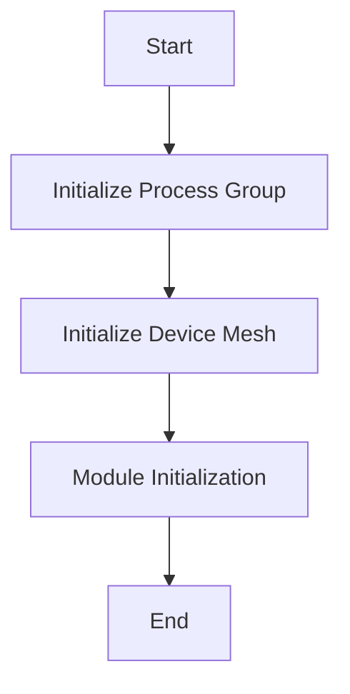

# Initialization in <SwmToken path="test/inductor/test_snode_runtime.py" pos="17:0:0" line-data="c10d = torch.ops.c10d_functional">`c10d`</SwmToken>

Initialization in <SwmToken path="test/inductor/test_snode_runtime.py" pos="17:0:0" line-data="c10d = torch.ops.c10d_functional">`c10d`</SwmToken> refers to the process of setting up the distributed environment before any distributed operations can be performed. The package needs to be initialized using the `torch.distributed.init_process_group` or `torch.distributed.device_mesh.init_device_mesh` function. Both of these functions block until all processes have joined, ensuring that the distributed environment is correctly set up.

# Process Group Initialization

Initialization is done using the `torch.distributed.init_process_group` function. This function blocks until all processes have joined, ensuring that the distributed environment is correctly set up.

# Module Initialization

By default, parameters and floating-point buffers for modules provided by `torch.nn` are initialized during module instantiation as 32-bit floating point values on the CPU using an initialization scheme determined to perform well historically for the module type. For certain use cases, it may be desired to initialize with a different dtype, device (e.g., GPU), or initialization technique.

&nbsp;

*This is an auto-generated document by Swimm AI 🌊 and has not yet been verified by a human*

<SwmMeta version="3.0.0" repo-id="Z2l0aHViJTNBJTNBcHl0b3JjaC1hdXRvZG9jcy1kZW1vJTNBJTNBU3dpbW0tRGVtbw==" repo-name="pytorch-autodocs-demo">Powered by [Swimm](/)</SwmMeta>
