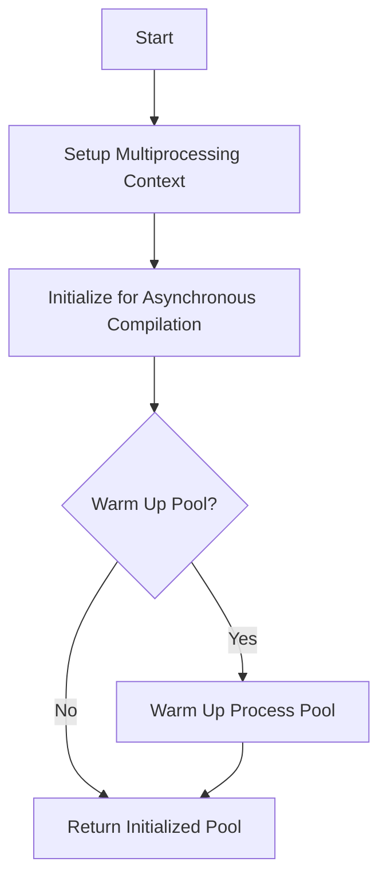

This document will cover the initialization of a new process pool, which includes:

1. Setting up the multiprocessing context
2. Initializing for asynchronous compilation
3. Warming up the process pool (if specified).

Technical document: <SwmLink doc-title="Overview of _new_pool Function">[Overview of \_new_pool Function](/.swm/overview-of-_new_pool-function.5z11hdgy.sw.md)</SwmLink>

# [Setting up the multiprocessing context](https://app.swimm.io/repos/Z2l0aHViJTNBJTNBcHl0b3JjaC1hdXRvZG9jcy1kZW1vJTNBJTNBU3dpbW0tRGVtbw==/docs/5z11hdgy#_new_pool-initialization)

The process begins by setting up the multiprocessing context. This context is essential for managing multiple processes that will run concurrently. It ensures that each process operates in its own memory space, preventing conflicts and ensuring smooth execution.

# [Initializing for asynchronous compilation](https://app.swimm.io/repos/Z2l0aHViJTNBJTNBcHl0b3JjaC1hdXRvZG9jcy1kZW1vJTNBJTNBU3dpbW0tRGVtbw==/docs/5z11hdgy#_new_pool-initialization)

Next, an initializer is set up for asynchronous compilation tasks. This step is crucial for preparing the processes to handle compilation tasks that can run in the background without blocking the main execution flow. This ensures that the system remains responsive and efficient.

# [Warming up the process pool](https://app.swimm.io/repos/Z2l0aHViJTNBJTNBcHl0b3JjaC1hdXRvZG9jcy1kZW1vJTNBJTNBU3dpbW0tRGVtbw==/docs/5z11hdgy#_new_pool-initialization)

If the 'warm' parameter is set to true, the process pool is warmed up. Warming up involves pre-loading certain tasks or data into the processes to reduce the startup time for future tasks. This step is optional but can significantly improve performance for systems that require quick task execution.

# [Returning the initialized pool](https://app.swimm.io/repos/Z2l0aHViJTNBJTNBcHl0b3JjaC1hdXRvZG9jcy1kZW1vJTNBJTNBU3dpbW0tRGVtbw==/docs/5z11hdgy#_new_pool-initialization)

Finally, the initialized process pool is returned. This pool is now ready to handle multiple asynchronous compilation tasks efficiently. The end user benefits from reduced latency and improved performance in task execution.

&nbsp;

*This is an auto-generated document by Swimm AI 🌊 and has not yet been verified by a human*

<SwmMeta version="3.0.0" repo-id="Z2l0aHViJTNBJTNBcHl0b3JjaC1hdXRvZG9jcy1kZW1vJTNBJTNBU3dpbW0tRGVtbw==" repo-name="pytorch-autodocs-demo">Powered by [Swimm](https://app.swimm.io/)</SwmMeta>
