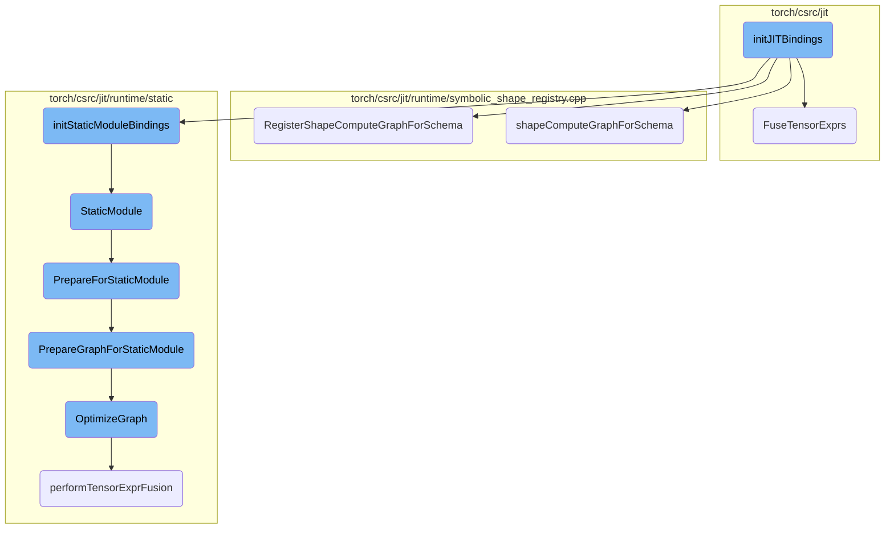
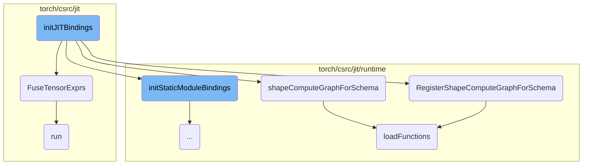

This document provides an overview of the initialization process for JIT (Just-In-Time) bindings in PyTorch. It covers the main steps involved in setting up the JIT compiler, including registering exception translators, initializing shape symbols, and configuring graph transformations and optimizations.

The initialization process for JIT bindings starts with setting up a submodule for JIT within the main module. It then registers exception translators to handle any errors that might occur during JIT compilation. Next, it initializes shape symbols and sets up various graph transformations and optimizations to ensure that the JIT compiler can efficiently execute the computational graphs. This setup is crucial for enabling advanced features like tensor expression fusion and static module bindings, which help in optimizing the performance of tensor operations.

Here is a high level diagram of the flow, showing only the most important functions:



# Flow drill down

First, we'll zoom into this section of the flow:



<SwmSnippet path="/torch/csrc/jit/python/init.cpp" line="169">

---

## initJITBindings

The `initJITBindings` function is responsible for initializing the JIT (Just-In-Time) bindings in PyTorch. This function sets up various bindings and configurations necessary for the JIT compiler to function correctly. It registers exception translators, initializes shape symbols, and sets up various graph transformations and optimizations.

```c++
void initJITBindings(PyObject* module) {
  auto m = py::handle(module).cast<py::module>();
  auto jit = m.def_submodule("_jit");

  // This is a static object, so we must leak the Python object
  // "release()" is used here to preserve 1 refcount on the
  // object, preventing it from ever being de-allocated by CPython.
  static py::handle exc =
      py::exception<JITException>(m, "JITException").release();

  py::register_exception_translator([](std::exception_ptr p) {
```

---

</SwmSnippet>

<SwmSnippet path="/torch/csrc/jit/passes/tensorexpr_fuser.cpp" line="1325">

---

## FuseTensorExprs

The `FuseTensorExprs` function is used to fuse tensor expressions within a computational graph. This optimization step helps in improving the performance of tensor operations by eliminating dead code, fusing tensor expressions, and eliminating common subexpressions. The function also handles dynamic shapes and ensures that the graph is optimized for execution.

```c++
void FuseTensorExprs(
    std::shared_ptr<Graph>& graph,
    size_t min_group_size,
    bool add_composed_op,
    bool fuse_to_dynamic_shapes) {
  GRAPH_DUMP("Before TExprFuser: ", graph);

  // Temporary change for Block code generation.
  if (tensorexpr::getTEGenerateBlockCode()) {
    min_group_size = 1;
  }

  if (add_composed_op) {
    TORCH_INTERNAL_ASSERT(
        fuse_to_dynamic_shapes, "Fusing static shapes with composed op NYI");
  }

  // Get rid of dead code so that we don't waste effort fusing it.
  EliminateDeadCode(graph);

  TensorExprFuser fuser(
```

---

</SwmSnippet>

<SwmSnippet path="/torch/csrc/jit/runtime/symbolic_shape_registry.cpp" line="412">

---

## RegisterShapeComputeGraphForSchema

The `RegisterShapeComputeGraphForSchema` function registers a shape compute graph for a given function schema. This involves transforming the shape function, linting the shape compute graph, and caching the schema-to-graph mapping. This registration is crucial for ensuring that the correct shape computations are used during graph execution.

```c++
void RegisterShapeComputeGraphForSchema(
    const FunctionSchema& schema,
    std::shared_ptr<Graph> g) {
  std::lock_guard<std::mutex> guard(lock);
  if (cached_schema_to_graph.empty()) {
    loadFunctions();
  }
  transformShapeFunction(&schema, g);
  LintShapeComputeGraph(&schema, g);

  cached_schema_to_graph[&schema] = g;
}
```

---

</SwmSnippet>

<SwmSnippet path="/torch/csrc/jit/runtime/symbolic_shape_registry.cpp" line="380">

---

## shapeComputeGraphForSchema

The `shapeComputeGraphForSchema` function retrieves the shape compute graph for a given function schema. It checks the cache for the schema-to-graph mapping and returns the corresponding graph if found. If the schema is not found in the cache, it returns an empty optional. This function ensures that the correct shape computations are available during graph execution.

```c++
std::optional<std::shared_ptr<Graph>> shapeComputeGraphForSchema(
    const FunctionSchema& schema) {
  std::lock_guard<std::mutex> guard(lock);
  if (cached_schema_to_graph.empty()) {
    loadFunctions();
  }

  GRAPH_DEBUG("Trying to find schema: ", schema);
  auto cache_it = cached_schema_to_graph.find(&schema);
  if (cache_it != cached_schema_to_graph.end()) {
    return cache_it->second;
  }
  GRAPH_DEBUG("Could not find schema: ", schema);

  return std::nullopt;
}
```

---

</SwmSnippet>

<SwmSnippet path="/torch/csrc/jit/runtime/symbolic_shape_registry.cpp" line="354">

---

## loadFunctions

The `loadFunctions` function loads the serialized shape compute functions into the compilation unit. It reads the shape compute functions, defines them in the compilation unit, and loads the module. This function is essential for initializing the shape compute functions that are used during graph execution.

```c++
void loadFunctions() {
  try {
    auto shape_compute_functions =
        GetSerializedShapeFunctions() + _xnnpack_shape_compute_functions;

    auto src = std::make_shared<Source>(shape_compute_functions);
    std::stringstream ss;
    std::vector<at::IValue> constantTable;
    auto resolver = std::make_shared<SourceImporterImpl>(
        compilation_unit,
        &constantTable,
        [&](const std::string& name) -> std::shared_ptr<Source> { return src; },
        1);
    compilation_unit->define(
        std::nullopt, shape_compute_functions, resolver, nullptr);
    loadModule(*compilation_unit);
  } catch (...) {
    // Reset the cache and compilation unit so that we don't get weird errors
    // in later tests when one of the shape functions is invalid.
    compilation_unit = std::make_shared<CompilationUnit>();
    cached_schema_to_graph.clear();
```

---

</SwmSnippet>

<SwmSnippet path="/torch/csrc/jit/passes/tensorexpr_fuser.cpp" line="549">

---

## run

The `run` function in the `FuseTensorExprs` class executes the tensor expression fusion process. It removes redundant profile nodes, creates fusion groups, inlines small fusion groups, and prepares the fusion groups for execution. This function ensures that the computational graph is optimized for efficient execution.

```c++
  void run() {
    aliasDb_ = std::make_unique<AliasDb>(graph_);
    RemoveRedundantProfiles(graph_);
    GRAPH_DUMP("After removing redundant profile nodes: ", graph_);
    createFusionGroups(graph_->block());
    GRAPH_DUMP("After creating fusion groups: ", graph_);
    // we maintain alias db correctness during initial fusion, but it is
    // difficult to maintain correctness after inlining so inline only after
    // fusion is done.
    inlineSmallFusionGroups(graph_->block());
    GRAPH_DUMP("After inlining small fusion groups: ", graph_);
    if (fuse_to_dynamic_shapes_) {
      VLOG(1) << "TensorExpr fusion with dynamic shapes is enabled" << '\n';
      generalizeFusionGroups(graph_->block());
      GRAPH_DUMP("After generalizing fusion groups: ", graph_);
    } else {
      prepareFusionGroupAndGuardOutputs(graph_->block());
      GRAPH_DUMP("After guarding fusion groups: ", graph_);
    }
  }
```

---

</SwmSnippet>

Now, lets zoom into this section of the flow:

```mermaid
graph TD;
      subgraph torchcsrcjitruntimestatic["torch/csrc/jit/runtime/static"]
abd56b287315834a04bc1789d1649e77a03deb8e9146c52ab6d5f7d900d9daa7(initStaticModuleBindings):::mainFlowStyle --> 6c4ce3010cc2fe0ca19bc24e86124ed2a85a6c09bb539cf2d04e64948cabe2aa(StaticModule):::mainFlowStyle
end

subgraph torchcsrcjitruntimestatic["torch/csrc/jit/runtime/static"]
6c4ce3010cc2fe0ca19bc24e86124ed2a85a6c09bb539cf2d04e64948cabe2aa(StaticModule):::mainFlowStyle --> 820b50d69a9895791c2dbb2582a18dce8b3d69ef5456e3bd48142c7f28379f57(PrepareForStaticModule):::mainFlowStyle
end

subgraph torchcsrcjitruntimestatic["torch/csrc/jit/runtime/static"]
820b50d69a9895791c2dbb2582a18dce8b3d69ef5456e3bd48142c7f28379f57(PrepareForStaticModule):::mainFlowStyle --> cc4dde708a3c7856b544c8602483e6fa3c0b0ccb020826934b59ac74e1b020f2(PrepareGraphForStaticModule):::mainFlowStyle
end

subgraph torchcsrcjitruntimestatic["torch/csrc/jit/runtime/static"]
cc4dde708a3c7856b544c8602483e6fa3c0b0ccb020826934b59ac74e1b020f2(PrepareGraphForStaticModule):::mainFlowStyle --> 2ffe6a0a4b1c98d278d203689909cd8371a1a42af6c1472962cc0446cc2953c6(OptimizeGraph):::mainFlowStyle
end


      classDef mainFlowStyle color:#000000,fill:#7CB9F4
classDef rootsStyle color:#000000,fill:#00FFF4
classDef Style1 color:#000000,fill:#00FFAA
classDef Style2 color:#000000,fill:#FFFF00
classDef Style3 color:#000000,fill:#AA7CB9
```



<SwmSnippet path="/torch/csrc/jit/runtime/static/init.cpp" line="122">

---

## initStaticModuleBindings

The function `initStaticModuleBindings` initializes the static module bindings by creating a `StaticModule` from a shared pointer to a `torch::jit::Graph`. This step is crucial as it sets up the static module for further processing.

```c++
       [](const std::shared_ptr<torch::jit::Graph>& g) {
         return StaticModule(g);
       })
```

---

</SwmSnippet>

<SwmSnippet path="/torch/csrc/jit/runtime/static/impl.cpp" line="529">

---

## StaticModule

The `StaticModule` constructor prepares the static module by copying the graph and applying the options provided. It calls `PrepareForStaticModule` to handle the graph preparation and optimization.

```c++
StaticModule::StaticModule(
    const std::shared_ptr<torch::jit::Graph>& g,
    const StaticModuleOptions& opts,
    std::vector<IValue> sample_inputs)
    : StaticModule(
          PrepareForStaticModule(g->copy(), opts, std::move(sample_inputs)),
          opts) {}
```

---

</SwmSnippet>

<SwmSnippet path="/torch/csrc/jit/runtime/static/impl.cpp" line="289">

---

## PrepareForStaticModule

The function `PrepareForStaticModule` prepares the module for static execution. It evaluates and freezes the module if necessary, retrieves the forward method's graph, and calls `PrepareGraphForStaticModule` to optimize the graph.

```c++
std::pair<std::shared_ptr<Graph>, std::optional<Module>> PrepareForStaticModule(
    const torch::jit::Module& m,
    bool is_frozen,
    const StaticModuleOptions& opts,
    std::vector<IValue> sample_inputs) {
  LOG(INFO) << "StaticModuleOptions: enable_out_variant "
            << opts.enable_out_variant << ", optimize_memory "
            << opts.optimize_memory << ", manage_output_tensors "
            << opts.manage_output_tensors << ", use_copy_variants "
            << opts.use_copy_variants << ", use_maybe_copy_variants "
            << opts.use_maybe_copy_variants << ", enable_tensorexpr_fusion "
            << opts.enable_tensorexpr_fusion;

  Module module = m.copy();
  if (!is_frozen) {
    module.eval();
    module = freeze_module(module);
  }

  Method method = module.get_method("forward");
  auto graph = module.get_method("forward").graph();
```

---

</SwmSnippet>

<SwmSnippet path="/torch/csrc/jit/runtime/static/impl.cpp" line="268">

---

## PrepareGraphForStaticModule

The function `PrepareGraphForStaticModule` optimizes the graph for static execution. It checks if static runtime can be enabled, calls `OptimizeGraph` for various optimizations, and ensures the graph's outputs are correctly handled.

```c++
void PrepareGraphForStaticModule(
    std::shared_ptr<torch::jit::Graph> graph,
    const StaticModuleOptions& opts,
    std::vector<IValue> sample_inputs) {
  TORCH_CHECK(canEnableStaticRuntime(graph));
  OptimizeGraph(graph, opts, std::move(sample_inputs));

  // Static runtime moves its outputs out of the runtime
  // by default. In some rare cases, this is not actually safe to
  // do - for example, if the value is a constant, static runtime
  // needs to hold onto a copy. Rather than adding special logic
  // to handle this rare case, we use this pass to detect it and
  // create an owned reference that can be safely moved out of the
  // runtime.
  CreateOwnedRefsForSpecialValues(*graph);

  // We assume that each sub-block has at least one output. If we
  // detect any that have 0, force the sub-block to return None.
  ForceNonEmptyOutputs(*graph);
}
```

---

</SwmSnippet>

<SwmSnippet path="/torch/csrc/jit/runtime/static/impl.cpp" line="156">

---

## OptimizeGraph

The function `OptimizeGraph` performs multiple optimizations on the graph, such as inlining, constant propagation, and eliminating dead code. These optimizations are essential for improving the performance and efficiency of the static runtime.

```c++
void OptimizeGraph(
    std::shared_ptr<torch::jit::Graph>& graph,
    const StaticModuleOptions& opts,
    std::vector<IValue> sample_inputs) {
  GRAPH_DUMP("Before optimizations: ", graph);
  if (opts.enable_tensorexpr_fusion) {
    if (sample_inputs.empty()) {
      VLOG(1) << "Cannot perform TensorExpr fusion - sample_inputs is empty";
    } else {
      VLOG(1) << "Performing TensorExpr fusion";
      performTensorExprFusion(graph, std::move(sample_inputs));
    }
  }
  Inline(*graph);
  ConstantPropagation(graph);
  Canonicalize(graph);
  ConstantPropagation(graph);
  RemoveTensorMutation(graph);
  ConstantPropagation(graph);
  EliminateNoOpSlice(graph);
  EliminateDeadCode(graph);
```

---

</SwmSnippet>

&nbsp;

*This is an auto-generated document by Swimm AI 🌊 and has not yet been verified by a human*

<SwmMeta version="3.0.0" repo-id="Z2l0aHViJTNBJTNBcHl0b3JjaC1hdXRvZG9jcy1kZW1vJTNBJTNBU3dpbW0tRGVtbw==" repo-name="pytorch-autodocs-demo"><sup>Powered by [Swimm](https://app.swimm.io/)</sup></SwmMeta>
