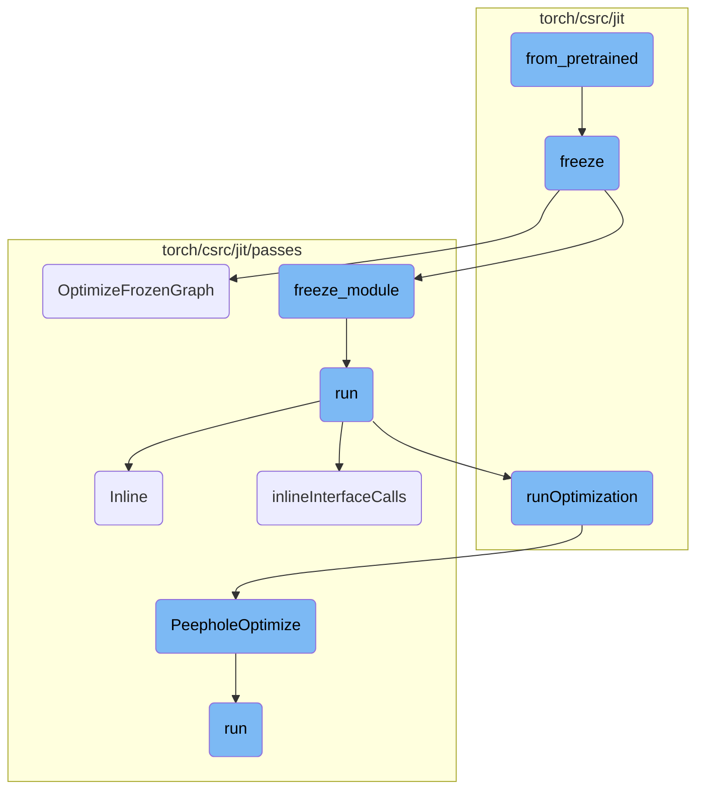
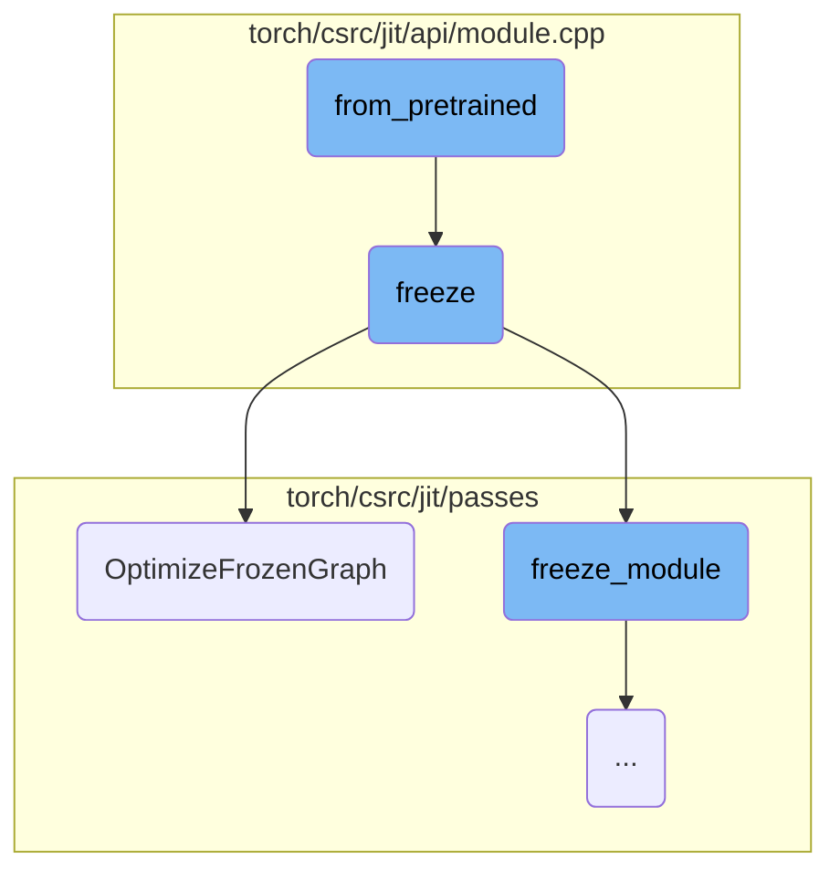
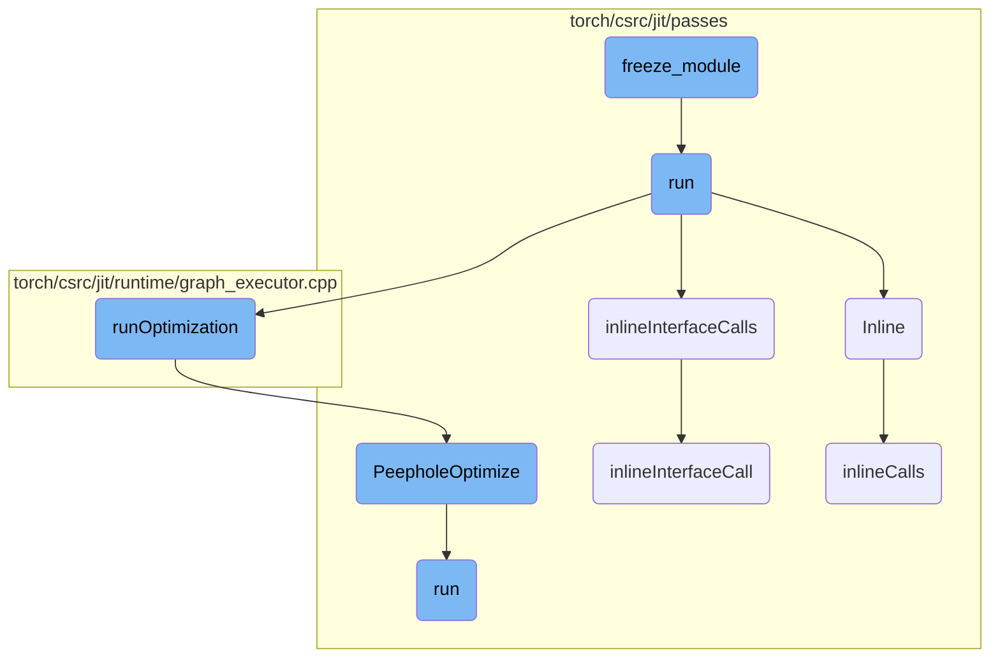

This document provides an overview of how the `from_pretrained` function initializes an embedding layer using a pre-trained tensor. It covers the key steps and options involved in this process, ensuring that the tensor is correctly formatted and various parameters are set appropriately.

The `from_pretrained` function is used to create an embedding layer from a pre-trained tensor. First, it checks that the tensor is two-dimensional. Then, it sets up the embedding layer with various options like padding index, maximum norm, normalization type, gradient scaling, and sparsity. Finally, it decides whether the weights should be updated during training based on the `freeze` option.

Here is a high level diagram of the flow, showing only the most important functions:



# Flow drill down

First, we'll zoom into this section of the flow:



<SwmSnippet path="/torch/csrc/api/include/torch/nn/modules/embedding.h" line="64">

---

## from_pretrained

The `from_pretrained` function initializes an embedding layer from a given pre-trained tensor. It ensures the tensor is 2-dimensional and sets various options such as padding index, maximum norm, normalization type, gradient scaling, and sparsity. The function also determines whether the weights require gradients based on the `freeze` option.

```c
  /// See the documentation for `torch::nn::EmbeddingFromPretrainedOptions`
  /// class to learn what optional arguments are supported for this function.
  static Embedding from_pretrained(
      const torch::Tensor& embeddings,
      const EmbeddingFromPretrainedOptions& options = {}) {
    TORCH_CHECK(
        embeddings.dim() == 2,
        "Embeddings parameter is expected to be 2-dimensional");

    // NOLINTNEXTLINE(cppcoreguidelines-init-variables)
    int64_t rows, cols;
    rows = embeddings.size(0);
    cols = embeddings.size(1);

    Embedding embedding(EmbeddingOptions(rows, cols)
                            ._weight(embeddings)
                            .padding_idx(options.padding_idx())
                            .max_norm(options.max_norm())
                            .norm_type(options.norm_type())
                            .scale_grad_by_freq(options.scale_grad_by_freq())
                            .sparse(options.sparse()));
```

---

</SwmSnippet>

<SwmSnippet path="/torch/csrc/jit/api/module.cpp" line="477">

---

## freeze

The `freeze` function converts a module into a form that can be optimized by freezing its parameters. It first checks if the module is in evaluation mode, then calls `freeze_module` to preserve certain attributes and optimize the module's graph using `OptimizeFrozenGraph`.

```c++
Module freeze(
    const Module& module,
    const std::optional<std::vector<std::string>>& preserved_attrs,
    bool optimize_numerics) {
  TORCH_CHECK(
      !module.hasattr("training") || !module.is_training(),
      "Freezing is currently only implemented for modules in eval mode. Please call .eval() before freezing");

  Module out_mod = freeze_module(
      module, preserved_attrs.value_or(std::vector<std::string>({})));
  auto graph = out_mod.get_method("forward").graph();
  OptimizeFrozenGraph(graph, optimize_numerics);
  return out_mod;
}
```

---

</SwmSnippet>

<SwmSnippet path="/torch/csrc/jit/passes/frozen_graph_optimizations.cpp" line="13">

---

## OptimizeFrozenGraph

The `OptimizeFrozenGraph` function performs various optimizations on a frozen graph. It removes dropout layers, optimizes linear concatenations, and repeatedly applies transformations to fold batch normalization and other operations into convolutional layers if numeric optimization is enabled.

```c++
void OptimizeFrozenGraph(
    std::shared_ptr<Graph>& graph,
    bool optimize_numerics) {
  removeDropout(graph);
  FrozenConcatLinear(graph);
  // run a couple times to capture Conv -> Mul -> Add etc
  if (optimize_numerics) {
    bool changed = false;
    do {
      changed = false;
      changed |= FoldFrozenConvBatchnorm(graph);
      changed |= FoldFrozenConvAddOrSub(graph);
      changed |= FoldFrozenConvMulOrDiv(graph);
      changed |= FoldFrozenLinearBatchnorm(graph);
    } while (changed);
  }
}
```

---

</SwmSnippet>

Now, lets zoom into this section of the flow:



<SwmSnippet path="/torch/csrc/jit/passes/freeze_module.cpp" line="1020">

---

## freeze_module

The `freeze_module` function is responsible for creating a frozen version of a given module. It clones the module and then uses an `AttributePropagator` to propagate attributes and freeze the module's state. This ensures that the module's parameters and attributes are fixed and cannot be modified during execution.

```c++
Module freeze_module(
    const Module& module,
    std::vector<std::string> preservedAttrs,
    bool freezeInterfaces,
    bool preserveParameters) {
  checkModuleDoesNotReturnSelf(module);

  auto moduleClone = module.clone(true);
  AttributePropagator attrPropagator(
      moduleClone, preservedAttrs, freezeInterfaces, preserveParameters);
  attrPropagator.run();
  return moduleClone;
}
```

---

</SwmSnippet>

<SwmSnippet path="/torch/csrc/jit/passes/freeze_module.cpp" line="111">

---

## run

The `run` function orchestrates the freezing process by applying inlining and optimization passes to the module's computation graph. It ensures that all necessary attributes are propagated and that the module is cleaned up after freezing.

```c++
  void run() {
    auto applyInline = [](std::shared_ptr<Graph>& subgraph) {
      Inline(*subgraph);
      ClearProfilingInformation(subgraph);
    };
    auto applyOptimizations = [](std::shared_ptr<Graph>& subgraph) {
#ifndef C10_MOBILE
      Autocast(subgraph);
#endif
      runOptimization(
          subgraph,
          /* unroll_non_constant_loops? */ false,
          /* const_prop_user_classes? */ false);
      EliminateNoOps(subgraph);
      LowerSimpleTuples(subgraph);
    };

    std::unordered_map<std::string, std::unordered_set<std::string>>
        interfacesToReassignType;

    for (auto function : preservedMethods_) {
```

---

</SwmSnippet>

<SwmSnippet path="/torch/csrc/jit/passes/inliner.cpp" line="91">

---

## Inline

The `Inline` function performs inlining on the computation graph, replacing function calls with their respective function bodies. This helps in optimizing the graph by eliminating function call overhead.

```c++
void Inline(Graph& graph) {
  GRAPH_DUMP("Before Inlining: ", &graph);
  inlineCalls(graph.block());
  GRAPH_DUMP("After Inlining: ", &graph);
}
```

---

</SwmSnippet>

<SwmSnippet path="/torch/csrc/jit/passes/freeze_module.cpp" line="492">

---

## inlineInterfaceCalls

The `inlineInterfaceCalls` function handles the inlining of interface calls within the computation graph. It ensures that interface methods are properly inlined and that any disallowed attribute modifications are detected and handled.

```c++
  //   [Note: Inlining interfaces strategy]
  // There's two structures that are relevant to freezing:
  // - the graph describing the computation in a method
  // - the module describing the data structure of the module instance.
  //
  // First, in inlineInterfaceCalls, we inline interfaces. This is done in a
  // separate step from normal inlining because CallMethod on an interface type
  // requires extra steps compared to inlining a normal CallMethod.
  //
  // Next we need to simplify the structure of the module data structure, which
  // is done for the most part by the usual steps in cleanupFrozenModule.
  //
  // However, there's a complication that comes from the fact that within a
  // method, you can change the value of an interface to another module that
  // implements that interface.
  //
  // For example:
  //
  // impl: MyInterface
  // ...
  // def forward(self, x):
```

---

</SwmSnippet>

<SwmSnippet path="/torch/csrc/jit/runtime/graph_executor.cpp" line="968">

---

## runOptimization

The `runOptimization` function applies a series of optimization passes to the computation graph. These passes include dead code elimination, common subexpression elimination, and peephole optimizations, among others. The goal is to improve the efficiency and performance of the graph.

```c++
void runOptimization(
    std::shared_ptr<Graph>& graph,
    bool unroll_non_constant_loops,
    bool const_prop_user_classes) {
  // Basic graph preprocessing to eliminate noise.
  GRAPH_DEBUG(
      "Before EliminateDeadCode (beginning of runOptimization)\n", *graph);
  EliminateDeadCode(graph);
  GRAPH_DEBUG(
      "After EliminateDeadCode, before EliminateCommonSubexpression\n", *graph);
  EliminateCommonSubexpression(graph);
  GRAPH_DEBUG(
      "After EliminateCommonSubexpression , before PeepholeOptimize\n", *graph);

  PeepholeOptimize(graph);
  GRAPH_DEBUG("After PeepholeOptimize, before ConstantPropagation\n", *graph);

  if (const_prop_user_classes) {
    ConstantPropagation(graph);
  } else {
    ConstantPropagation(graph, true);
```

---

</SwmSnippet>

<SwmSnippet path="/torch/csrc/jit/passes/peephole.cpp" line="456">

---

## PeepholeOptimize

The `PeepholeOptimize` function performs peephole optimizations on the computation graph. These optimizations look for small patterns in the graph that can be simplified or replaced with more efficient operations.

```c++
bool PeepholeOptimize(
    const std::shared_ptr<Graph>& graph,
    bool addmm_fusion_enabled) {
  PeepholeOptimizeImpl peephole(graph, addmm_fusion_enabled);
  bool changed = peephole.run();
  GRAPH_DUMP("After PeepholeOptimize: ", graph);
  // Eliminate dead code created by any peephole passes we've just done
  if (changed) {
    EliminateDeadCode(graph->block());
  }
  return changed;
}
```

---

</SwmSnippet>

<SwmSnippet path="/torch/csrc/jit/passes/freeze_module.cpp" line="465">

---

## inlineInterfaceCall

The `inlineInterfaceCall` function is invoked when the `freezeInterfaces` parameter is enabled. It retrieves the module associated with an interface and inlines the invoked method, ensuring that the interface call is replaced with the actual method body.

```c++
  // This method is invoked only when 'freezeInterfaces' parameter is on.
  // The module associated with Interface is retrieved and the invoked method
  // is inlined.
  bool inlineInterfaceCall(Node* n, const IValue& attr) {
    auto class_type = attr.type()->expect<ClassType>();
    bool inlined = false;
    for (auto use : n->output()->uses()) {
      auto user_node = use.user;
      if (user_node->kind() == prim::CallMethod) {
        const std::string& methodName = user_node->s(attr::name);
        Function& function = class_type->getMethod(methodName);
        if (auto graphFunction = tryToGraphFunction(function)) {
          GRAPH_UPDATE(
              "Inlining interface method '",
              function.name(),
              "' to ",
              *user_node);

          GRAPH_UPDATE("Function body: ", graphFunction->optimized_graph());
          inlineCallTo(user_node, graphFunction);
          inlined = true;
```

---

</SwmSnippet>

<SwmSnippet path="/torch/csrc/jit/passes/inliner.cpp" line="32">

---

## inlineCalls

The `inlineCalls` function recursively inlines function and method calls within a computation graph block. This helps in simplifying the graph and improving its execution efficiency.

```c++
static void inlineCalls(Block* block) {
  for (auto it = block->nodes().begin(), end = block->nodes().end();
       it != end;) {
    Node* cur = *it++;
    switch (cur->kind()) {
      case prim::CallFunction: {
        if (auto graphFunction = tryToGraphFunction(cur)) {
          auto function_constant = cur->input(0)->node();
          auto fun_type =
              function_constant->output()->type()->expect<FunctionType>();

          cur->removeInput(0);
          GRAPH_UPDATE(
              "Inlining function '",
              fun_type->function()->name(),
              "' to ",
              *cur);

          std::shared_ptr<Graph> g = nullptr;
          // inline optimized graph for debugging/testing purposes.
          // we only insert fallback functions in JIT optimized graphs for
```

---

</SwmSnippet>

<SwmSnippet path="/torch/csrc/jit/passes/peephole.cpp" line="31">

---

## run

The `run` function in `peephole.cpp` applies various peephole optimizations to the computation graph. It looks for specific patterns and idioms that can be optimized for better performance.

```c++
  bool run() {
    bool changed = optimizeBlock(graph_->block());
    changed |= PeepholeOptimizeListIdioms(graph_);
    changed |= PeepholeOptimizeDictIdioms(graph_);
    changed |= PeepholeOptimizeAliasSensitive(graph_, shape_peepholes_);
    changed |= PeepholeOptimizeNonTensor(graph_);
    changed |= CombineConcats(graph_);
    return changed;
  }
```

---

</SwmSnippet>

&nbsp;

*This is an auto-generated document by Swimm AI 🌊 and has not yet been verified by a human*

<SwmMeta version="3.0.0" repo-id="Z2l0aHViJTNBJTNBcHl0b3JjaC1hdXRvZG9jcy1kZW1vJTNBJTNBU3dpbW0tRGVtbw==" repo-name="pytorch-autodocs-demo"><sup>Powered by [Swimm](https://app.swimm.io/)</sup></SwmMeta>
