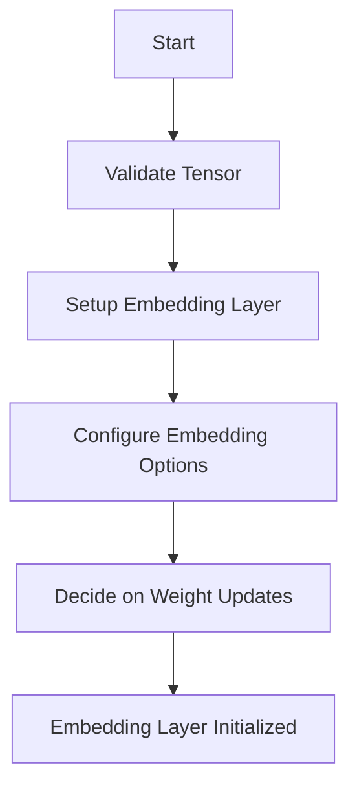

This document will cover the process of initializing an embedding layer with a pre-trained tensor. We'll cover:

1. Validating the tensor
2. Setting up the embedding layer
3. Configuring the embedding options
4. Deciding on weight updates during training.

Technical document: <SwmLink doc-title="Initializing Embedding Layer with Pre-trained Tensor">[Initializing Embedding Layer with Pre-trained Tensor](/.swm/initializing-embedding-layer-with-pre-trained-tensor.oa4oc11p.sw.md)</SwmLink>

# [Validating the Tensor](https://app.swimm.io/repos/Z2l0aHViJTNBJTNBcHl0b3JjaC1hdXRvZG9jcy1kZW1vJTNBJTNBU3dpbW0tRGVtbw==/docs/oa4oc11p#from_pretrained)

The first step in initializing an embedding layer with a pre-trained tensor is to validate the tensor. The tensor must be two-dimensional, meaning it should have rows and columns. This ensures that the tensor can be used to map input indices to embedding vectors correctly.

# [Setting Up the Embedding Layer](https://app.swimm.io/repos/Z2l0aHViJTNBJTNBcHl0b3JjaC1hdXRvZG9jcy1kZW1vJTNBJTNBU3dpbW0tRGVtbw==/docs/oa4oc11p#from_pretrained)

Once the tensor is validated, the next step is to set up the embedding layer. This involves creating an embedding layer object and associating it with the pre-trained tensor. The embedding layer will use this tensor to look up the embedding vectors for given input indices.

# [Configuring the Embedding Options](https://app.swimm.io/repos/Z2l0aHViJTNBJTNBcHl0b3JjaC1hdXRvZG9jcy1kZW1vJTNBJTNBU3dpbW0tRGVtbw==/docs/oa4oc11p#from_pretrained)

Several options need to be configured for the embedding layer to function correctly:

- **Padding Index**: Specifies which index should be used for padding.
- **Maximum Norm**: Limits the norm of the embedding vectors.
- **Normalization Type**: Defines how the embedding vectors should be normalized.
- **Gradient Scaling**: Determines if gradients should be scaled by frequency.
- **Sparsity**: Indicates if the embedding layer should use sparse gradients.

# [Deciding on Weight Updates](https://app.swimm.io/repos/Z2l0aHViJTNBJTNBcHl0b3JjaC1hdXRvZG9jcy1kZW1vJTNBJTNBU3dpbW0tRGVtbw==/docs/oa4oc11p#from_pretrained)

The final step is to decide whether the weights of the embedding layer should be updated during training. This is controlled by the `freeze` option. If `freeze` is set to true, the weights will not be updated during training, allowing the pre-trained embeddings to remain unchanged.

&nbsp;

*This is an auto-generated document by Swimm AI 🌊 and has not yet been verified by a human*

<SwmMeta version="3.0.0" repo-id="Z2l0aHViJTNBJTNBcHl0b3JjaC1hdXRvZG9jcy1kZW1vJTNBJTNBU3dpbW0tRGVtbw==" repo-name="pytorch-autodocs-demo">Powered by [Swimm](https://app.swimm.io/)</SwmMeta>
