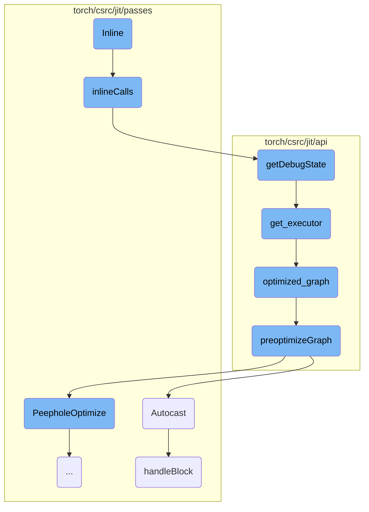
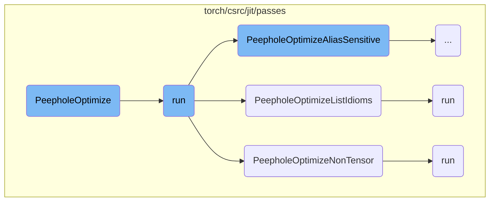
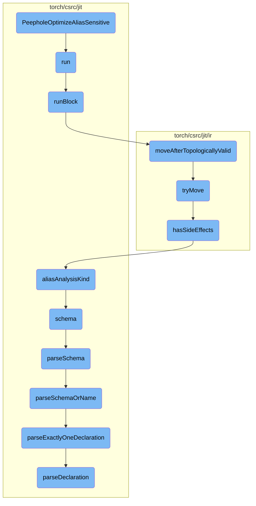

This document explains the inlining process within a computational graph. Inlining is a technique used to optimize the graph by replacing function calls with their actual implementations. This process involves several key functions that work together to ensure the graph is optimized for performance.

The inlining process starts by logging the state of the graph before any changes are made. Then, the function calls within the graph are replaced with their actual implementations. This is done by iterating over the nodes in the graph and handling different types of calls. After the inlining is complete, the state of the graph is logged again to show the changes. This process helps in optimizing the graph by reducing the overhead of function calls and improving the overall performance.

Here is a high level diagram of the flow, showing only the most important functions:

```mermaid
graph TD;
      subgraph torchcsrcjitpasses["torch/csrc/jit/passes"]
1027150c6a477f81fd0feed33572d93b8915eac047d6dc5e876a9294604d261c(Inline):::mainFlowStyle --> 020e409589c5690735d6f5cfe10f42000db83a35b04b2261656736d38cd67015(inlineCalls):::mainFlowStyle
end

subgraph torchcsrcjitapi["torch/csrc/jit/api"]
020e409589c5690735d6f5cfe10f42000db83a35b04b2261656736d38cd67015(inlineCalls):::mainFlowStyle --> 0ae2e20bb22947865de219294b9ebbc125983e06951008c62ae03c4f7e4456a6(getDebugState):::mainFlowStyle
end

subgraph torchcsrcjitapi["torch/csrc/jit/api"]
0ae2e20bb22947865de219294b9ebbc125983e06951008c62ae03c4f7e4456a6(getDebugState):::mainFlowStyle --> c8c542992d1cb5f939e2cc293e2411da1e34d5d45bf59644bba04e7f1cfc250d(get_executor):::mainFlowStyle
end

subgraph torchcsrcjitapi["torch/csrc/jit/api"]
c8c542992d1cb5f939e2cc293e2411da1e34d5d45bf59644bba04e7f1cfc250d(get_executor):::mainFlowStyle --> 01d25a6854a004be551ab2ff7122fae9e766f5b9bf84116b37e0a04abcc66cde(optimized_graph):::mainFlowStyle
end

subgraph torchcsrcjitapi["torch/csrc/jit/api"]
01d25a6854a004be551ab2ff7122fae9e766f5b9bf84116b37e0a04abcc66cde(optimized_graph):::mainFlowStyle --> 7e37a56a3a7d81dbb7863d5ddb52676ba962f36aaf6eeb6f3bef2faaadfcca3a(preoptimizeGraph):::mainFlowStyle
end

subgraph torchcsrcjitpasses["torch/csrc/jit/passes"]
7e37a56a3a7d81dbb7863d5ddb52676ba962f36aaf6eeb6f3bef2faaadfcca3a(preoptimizeGraph):::mainFlowStyle --> fa44ff9120f1fa24ae6e5f09bf07bcd2bdfb59e335f02f5da789b52352e93f7c(Autocast)
end

subgraph torchcsrcjitpasses["torch/csrc/jit/passes"]
7e37a56a3a7d81dbb7863d5ddb52676ba962f36aaf6eeb6f3bef2faaadfcca3a(preoptimizeGraph):::mainFlowStyle --> f04417319bc69291e6725df5cfe7706bbfce26b81666694e413951b04a1a9632(PeepholeOptimize):::mainFlowStyle
end

subgraph torchcsrcjitpasses["torch/csrc/jit/passes"]
f04417319bc69291e6725df5cfe7706bbfce26b81666694e413951b04a1a9632(PeepholeOptimize):::mainFlowStyle --> a6c365d8b573207e7f23f67c96c7ee729fb7033ba627e995aaddf21a02169d2b(run):::mainFlowStyle
end

subgraph torchcsrcjitpasses["torch/csrc/jit/passes"]
a6c365d8b573207e7f23f67c96c7ee729fb7033ba627e995aaddf21a02169d2b(run):::mainFlowStyle --> 85d4f5725bc0edf738b15b3301f65579b5470cf6626bb69e8632ff6bd6565803(PeepholeOptimizeNonTensor)
end

subgraph torchcsrcjitpasses["torch/csrc/jit/passes"]
a6c365d8b573207e7f23f67c96c7ee729fb7033ba627e995aaddf21a02169d2b(run):::mainFlowStyle --> 86cee32a406e9240703f05916a5584b36f68c95b9f80a690ddacdbef633741f8(PeepholeOptimizeListIdioms)
end

subgraph torchcsrcjitpasses["torch/csrc/jit/passes"]
a6c365d8b573207e7f23f67c96c7ee729fb7033ba627e995aaddf21a02169d2b(run):::mainFlowStyle --> 152b4a5b2c0d570f8e354489fd0dea4cffc26db00633107be0c64249f48353e1(PeepholeOptimizeAliasSensitive):::mainFlowStyle
end

subgraph torchcsrcjitpasses["torch/csrc/jit/passes"]
152b4a5b2c0d570f8e354489fd0dea4cffc26db00633107be0c64249f48353e1(PeepholeOptimizeAliasSensitive):::mainFlowStyle --> cfca54eae48b934037762e500ee08d7225cacf8e1e3b71963c065303ad1b910a(run):::mainFlowStyle
end

subgraph torchcsrcjitpasses["torch/csrc/jit/passes"]
cfca54eae48b934037762e500ee08d7225cacf8e1e3b71963c065303ad1b910a(run):::mainFlowStyle --> 852c7928ad3d08c41640181ea32316f9c9e00a48b7092d9cada6ff9252269424(runBlock):::mainFlowStyle
end

subgraph torchcsrcjitir["torch/csrc/jit/ir"]
852c7928ad3d08c41640181ea32316f9c9e00a48b7092d9cada6ff9252269424(runBlock):::mainFlowStyle --> 07ed00fb0be7378494a7d4d7c0647e551ab7334b30c730d07121cf535e6ce8fa(moveAfterTopologicallyValid):::mainFlowStyle
end

subgraph torchcsrcjitir["torch/csrc/jit/ir"]
07ed00fb0be7378494a7d4d7c0647e551ab7334b30c730d07121cf535e6ce8fa(moveAfterTopologicallyValid):::mainFlowStyle --> 5fd63da133a0c449fa8acbf75131e11706debcfb70b075b991bb5fc805a1a744(tryMove):::mainFlowStyle
end

subgraph torchcsrcjitir["torch/csrc/jit/ir"]
5fd63da133a0c449fa8acbf75131e11706debcfb70b075b991bb5fc805a1a744(tryMove):::mainFlowStyle --> 1c38edf2dacd8a3f91e77fc91143337145f07f0e3b562869d52318027e2590bf(hasSideEffects):::mainFlowStyle
end

subgraph torchcsrcjit["torch/csrc/jit"]
1c38edf2dacd8a3f91e77fc91143337145f07f0e3b562869d52318027e2590bf(hasSideEffects):::mainFlowStyle --> a736a56700a81a158d85da0f4985531e05a52f31bbbef0b73e28904515074669(aliasAnalysisKind):::mainFlowStyle
end

subgraph torchcsrcjit["torch/csrc/jit"]
a736a56700a81a158d85da0f4985531e05a52f31bbbef0b73e28904515074669(aliasAnalysisKind):::mainFlowStyle --> caeab7d76361bfb03c7bddcaade05907f23cf9e2ef5f32319b6a6c139973d46f(schema):::mainFlowStyle
end

subgraph torchcsrcjit["torch/csrc/jit"]
caeab7d76361bfb03c7bddcaade05907f23cf9e2ef5f32319b6a6c139973d46f(schema):::mainFlowStyle --> 8aa5ec307a0ef95c85858cfd60236a8a26c56c2d4a356e1c6c7c8952a7bf0845(parseSchema):::mainFlowStyle
end

subgraph torchcsrcjit["torch/csrc/jit"]
8aa5ec307a0ef95c85858cfd60236a8a26c56c2d4a356e1c6c7c8952a7bf0845(parseSchema):::mainFlowStyle --> f61ae85077b0eb4e98103a4aed94b43a1e883ad57a4eb1010295e7273187d5d7(parseSchemaOrName):::mainFlowStyle
end

subgraph torchcsrcjit["torch/csrc/jit"]
f61ae85077b0eb4e98103a4aed94b43a1e883ad57a4eb1010295e7273187d5d7(parseSchemaOrName):::mainFlowStyle --> 386b55c870fd23e800c5d07c349d04ff52720dd36210ecdd572f2386ae6eac83(parseExactlyOneDeclaration):::mainFlowStyle
end

subgraph torchcsrcjit["torch/csrc/jit"]
386b55c870fd23e800c5d07c349d04ff52720dd36210ecdd572f2386ae6eac83(parseExactlyOneDeclaration):::mainFlowStyle --> daf597f5162a53f7e79cbac0df453fe17c92300ffd40d0030ca8e64fb1d8687c(parseDeclaration):::mainFlowStyle
end


      classDef mainFlowStyle color:#000000,fill:#7CB9F4
classDef rootsStyle color:#000000,fill:#00FFF4
classDef Style1 color:#000000,fill:#00FFAA
classDef Style2 color:#000000,fill:#FFFF00
classDef Style3 color:#000000,fill:#AA7CB9
```



# Flow drill down

First, we'll zoom into this section of the flow:



<SwmSnippet path="/torch/csrc/jit/passes/inliner.cpp" line="91">

---

## Inline Function

The `Inline` function is responsible for inlining function calls within a given graph. It first logs the state of the graph before inlining, then calls the `inlineCalls` function to perform the actual inlining, and finally logs the state of the graph after inlining.

```c++
void Inline(Graph& graph) {
  GRAPH_DUMP("Before Inlining: ", &graph);
  inlineCalls(graph.block());
  GRAPH_DUMP("After Inlining: ", &graph);
}
```

---

</SwmSnippet>

<SwmSnippet path="/torch/csrc/jit/passes/inliner.cpp" line="32">

---

## inlineCalls Function

The `inlineCalls` function iterates over the nodes in a block and inlines function and method calls. It handles different types of calls such as `prim::CallFunction` and `prim::CallMethod`, and recursively processes sub-blocks. This function is crucial for optimizing the graph by replacing function calls with their actual implementations.

```c++
static void inlineCalls(Block* block) {
  for (auto it = block->nodes().begin(), end = block->nodes().end();
       it != end;) {
    Node* cur = *it++;
    switch (cur->kind()) {
      case prim::CallFunction: {
        if (auto graphFunction = tryToGraphFunction(cur)) {
          auto function_constant = cur->input(0)->node();
          auto fun_type =
              function_constant->output()->type()->expect<FunctionType>();

          cur->removeInput(0);
          GRAPH_UPDATE(
              "Inlining function '",
              fun_type->function()->name(),
              "' to ",
              *cur);

          std::shared_ptr<Graph> g = nullptr;
          // inline optimized graph for debugging/testing purposes.
          // we only insert fallback functions in JIT optimized graphs for
```

---

</SwmSnippet>

<SwmSnippet path="/torch/csrc/jit/api/function_impl.h" line="73">

---

## getDebugState Function

The `getDebugState` function retrieves the debug state of the graph executor. This is useful for debugging and testing purposes, as it provides insights into the execution plans of the graph.

```c
  GraphExecutorState getDebugState() {
    return get_executor().getDebugState();
  }
```

---

</SwmSnippet>

<SwmSnippet path="/torch/csrc/jit/api/function_impl.h" line="90">

---

## get_executor Function

The `get_executor` function ensures that the graph is defined and returns the graph executor. It locks the compile mutex to ensure thread safety and initializes the executor if it is not already defined.

```c
  GraphExecutor& get_executor() {
    ensure_defined();
    std::lock_guard<std::recursive_mutex> lock(compile_mutex);
    auto& executor = executors_[currentSpecialization()];
    if (executor) {
      return *executor;
    }
    check_single_output();
    const std::string& name = name_.name();
    std::shared_ptr<Graph> opt_graph = optimized_graph();
    if (!executor_execution_mode_) {
      executor = GraphExecutor(opt_graph, name);
    } else {
      executor = GraphExecutor(opt_graph, name, *executor_execution_mode_);
    }
    return *executor;
  }
```

---

</SwmSnippet>

<SwmSnippet path="/torch/csrc/jit/api/function_impl.cpp" line="95">

---

## optimized_graph Function

The `optimized_graph` function returns a copy of the optimized graph. It locks the compile mutex for thread safety and applies various optimizations to the graph if required.

```c++
std::shared_ptr<Graph> GraphFunction::optimized_graph() const {
  std::lock_guard<std::recursive_mutex> lock(compile_mutex);
  decltype(optimized_graphs_)::value_type graph;
  auto& graph_ref = !FLAGS_torch_jit_do_not_store_optimized_graph
      ? optimized_graphs_[currentSpecialization()]
      : graph;
  if (graph_ref) {
    return graph_ref;
  }
  graph_ref = graph_->copy();
  if (getGraphExecutorOptimize()) {
    preoptimizeGraph(graph_ref, force_no_amp_);
  }
  return graph_ref;
}
```

---

</SwmSnippet>

<SwmSnippet path="/torch/csrc/jit/api/function_impl.cpp" line="132">

---

## preoptimizeGraph Function

The `preoptimizeGraph` function applies a series of optimizations to the graph, including inlining, peephole optimization, constant propagation, and autocasting. These optimizations improve the performance and efficiency of the graph.

```c++
void preoptimizeGraph(std::shared_ptr<Graph>& graph, bool disable_autocast) {
  Inline(*graph);

  // Peephole Optimize cleans up many "is None" checks and creates constant prop
  // opportunities
  PeepholeOptimize(graph, true);

  // AliasDb construction can be slow, so run it just on immutable types
  // to clean up constant Ifs & other easy wins
  ConstantPropagationImmutableTypes(graph);

#ifndef C10_MOBILE
  // Inject casts for automatic mixed precision
  //
  // TODO: Ideally, this pass could run earlier, before inlining
  //  or any other optimizations. That setup is preferable because:
  //  1. The AMP pass would be self-contained and function independently
  //     of the any optimizations
  //  2. AMP transformations would benefit from followup passes's cleanup
  //
  if (!disable_autocast) {
```

---

</SwmSnippet>

<SwmSnippet path="/torch/csrc/jit/passes/autocast.cpp" line="521">

---

## Autocast Function

The `Autocast` function enables automatic mixed precision (AMP) for the graph if autocasting is enabled. It initializes the autocast context and processes the graph's blocks to apply the necessary type casts.

```c++
void Autocast(const std::shared_ptr<Graph>& graph) {
  GRAPH_DUMP("\nBefore Autocast: ", graph);
  if (autocastEnabled()) {
    AutocastContext init = {
        at::autocast::is_autocast_enabled(at::kCUDA),
        at::autocast::is_autocast_enabled(at::kCPU),
        at::autocast::get_autocast_dtype(at::kCUDA),
        at::autocast::get_autocast_dtype(at::kCPU)};
    handleBlock(graph->block(), init);
  }
  GRAPH_DUMP("\nAfter Autocast: ", graph);
}
```

---

</SwmSnippet>

<SwmSnippet path="/torch/csrc/jit/passes/autocast.cpp" line="252">

---

## handleBlock Function

The `handleBlock` function processes each node in a block to apply autocasting. It handles various types of nodes and applies the appropriate casting policies. This function ensures that the graph operates efficiently with mixed precision.

```c++
// [Note: implicit type promotion in Autocast]
//
// Casting policy below mostly follows pytorch/aten/src/ATen/autocast.cpp, with
// a few exceptions, e.g. `aten::add`, which is needed to be put to promotion
// list for JIT autocast.
// The reason is that in eager amp, some binary ops promote inputs implicitly
// inside the operation, e.g. `aten::add` with fp16 & fp32 inputs would both be
// casted to fp32. In backward, autograd would cast dgrad to match their
// scalar_type in forward graph. So inputs with mismatched scalar_type would
// get the different dgrad.
// While in JIT, autodiff doesn't do this, so implicit cast is not visible to
// autodiff and backward dgrad for mismatched inputs would ended up with dgrads
// in the same scalar_type. This has caused downstream operations, which
// expects dgrad to be the same scalar type to throw mismatch error.
//
// TODO: Use the list from AMP eager directly
void handleBlock(Block* block, AutocastContext initial_state) {
  std::stack<AutocastScope> autocast_stack;

  std::optional<bool> incompatible_amp = std::nullopt;

```

---

</SwmSnippet>

Now, lets zoom into this section of the flow:



<SwmSnippet path="/torch/csrc/jit/passes/peephole.cpp" line="456">

---

## PeepholeOptimize

The `PeepholeOptimize` function is responsible for optimizing a computational graph by applying a series of peephole optimizations. It initializes a `PeepholeOptimizeImpl` object and runs the optimization process. If any changes are made to the graph, it eliminates dead code that may have been introduced during the optimization.

```c++
bool PeepholeOptimize(
    const std::shared_ptr<Graph>& graph,
    bool addmm_fusion_enabled) {
  PeepholeOptimizeImpl peephole(graph, addmm_fusion_enabled);
  bool changed = peephole.run();
  GRAPH_DUMP("After PeepholeOptimize: ", graph);
  // Eliminate dead code created by any peephole passes we've just done
  if (changed) {
    EliminateDeadCode(graph->block());
  }
  return changed;
}
```

---

</SwmSnippet>

<SwmSnippet path="/torch/csrc/jit/passes/peephole.cpp" line="31">

---

### run

The `run` function within `PeepholeOptimize` orchestrates the various peephole optimization passes. It applies multiple optimization techniques such as `PeepholeOptimizeListIdioms`, `PeepholeOptimizeDictIdioms`, `PeepholeOptimizeAliasSensitive`, and `PeepholeOptimizeNonTensor`. This function ensures that all relevant optimizations are applied to the graph.

```c++
  bool run() {
    bool changed = optimizeBlock(graph_->block());
    changed |= PeepholeOptimizeListIdioms(graph_);
    changed |= PeepholeOptimizeDictIdioms(graph_);
    changed |= PeepholeOptimizeAliasSensitive(graph_, shape_peepholes_);
    changed |= PeepholeOptimizeNonTensor(graph_);
    changed |= CombineConcats(graph_);
    return changed;
  }
```

---

</SwmSnippet>

<SwmSnippet path="/torch/csrc/jit/passes/peephole_non_tensor.cpp" line="278">

---

## PeepholeOptimizeNonTensor

The `PeepholeOptimizeNonTensor` function focuses on optimizing non-tensor operations within the computational graph. It creates a `PeepholeOptimizeNonTensorImpl` object and runs the optimization process. After the optimization, it logs the state of the graph.

```c++
bool PeepholeOptimizeNonTensor(const std::shared_ptr<Graph>& graph) {
  PeepholeOptimizeNonTensorImpl peephole(graph);
  bool changed = peephole.run();
  GRAPH_DUMP("After PeepholeOptimize: ", graph);
  return changed;
}
```

---

</SwmSnippet>

<SwmSnippet path="/torch/csrc/jit/passes/peephole_list_idioms.cpp" line="320">

---

## PeepholeOptimizeListIdioms

The `PeepholeOptimizeListIdioms` function targets optimizations specific to list operations in the graph. It initializes a `PeepholeOptimizeListIdiomsImpl` object and executes the optimization. This function is crucial for refining list operations and improving the overall efficiency of the graph.

```c++
bool PeepholeOptimizeListIdioms(
    const std::shared_ptr<Graph>& graph,
    bool refine_list_len) {
  PeepholeOptimizeListIdiomsImpl opt(graph, refine_list_len);
  return opt.run();
}
```

---

</SwmSnippet>

<SwmSnippet path="/torch/csrc/jit/passes/peephole_list_idioms.cpp" line="35">

---

### run

The `run` function in `PeepholeOptimizeListIdioms` collects lists that need refinement and applies the necessary optimizations. If no lists require refinement, it exits early. Otherwise, it performs the refinements and returns whether any changes were made.

```c++
  bool run() {
    std::unordered_set<Value*> li_with_len_use;
    collectListsToRefine(graph_->block(), li_with_len_use);
    if (lists_to_refine_.empty()) {
      return false;
    }
    ListRefinement refinements;
    RefineListLens(graph_->block(), std::move(refinements));
    return changed_;
  }
```

---

</SwmSnippet>

<SwmSnippet path="/torch/csrc/jit/passes/peephole_non_tensor.cpp" line="97">

---

### run

The `run` function in `PeepholeOptimizeNonTensor` applies optimizations to non-tensor operations by optimizing the blocks within the graph. This function is essential for ensuring that non-tensor operations are as efficient as possible.

```c++
  bool run() {
    return optimizeBlock(graph_->block());
  }
```

---

</SwmSnippet>

Now, lets zoom into this section of the flow:



<SwmSnippet path="/torch/csrc/jit/passes/peephole_alias_sensitive.cpp" line="165">

---

## PeepholeOptimizeAliasSensitive

The function `PeepholeOptimizeAliasSensitive` initializes the optimization process by creating an instance of `PeepholeOptimizeAliasSensitiveImpl` and invoking its `run` method. This sets the stage for the subsequent optimization steps.

```c++
bool PeepholeOptimizeAliasSensitive(
    const std::shared_ptr<Graph>& graph,
    bool shape_peepholes) {
  PeepholeOptimizeAliasSensitiveImpl opt(graph, shape_peepholes);
  return opt.run();
}
```

---

</SwmSnippet>

<SwmSnippet path="/torch/csrc/jit/passes/peephole_alias_sensitive.cpp" line="24">

---

## Running the Optimization

The `run` function is responsible for starting the optimization by calling `runBlock` on the graph's main block. This function is crucial as it initiates the traversal and optimization of the graph.

```c++
  bool run() {
    return runBlock(graph_->block());
  }
```

---

</SwmSnippet>

<SwmSnippet path="/torch/csrc/jit/passes/peephole_alias_sensitive.cpp" line="40">

---

### Traversing and Optimizing Blocks

The `runBlock` function traverses each node in the block and applies specific optimizations. For instance, it handles common patterns like `dim(conv(x))` and simplifies arithmetic operations like `x + 0` or `x * 1`. This function is central to the peephole optimization process as it directly manipulates the nodes to improve performance.

```c++
  bool runBlock(Block* block) {
    bool changed = false;
    for (Node* node : block->nodes()) {
      for (Block* b : node->blocks()) {
        changed |= runBlock(b);
      }

      // dim(conv(x)) extremely common and prevents Conv->BN fusion
      if (node->kind() == aten::conv1d || node->kind() == aten::conv2d ||
          node->kind() == aten::conv3d) {
        auto dim_uses = c10::filter(node->output()->uses(), [](const Use& use) {
          return use.user->kind() == aten::dim;
        });
        if (dim_uses.empty()) {
          continue;
        }
        auto kind = node->kind();
        int64_t output_size =
            kind == aten::conv1d ? 3 : (kind == aten::conv2d ? 4 : 5);
        // This is to handle potential resize_ calls, however unlikely.
        // If we add more checks related to resize_ in the graph,
```

---

</SwmSnippet>

<SwmSnippet path="/torch/csrc/jit/ir/alias_analysis.cpp" line="1525">

---

## Validating Node Movements

The `moveAfterTopologicallyValid` function ensures that a node can be moved after another node while maintaining the graph's topological order. It calls `tryMove` to perform this validation.

```c++
bool AliasDb::moveAfterTopologicallyValid(Node* n, Node* movePoint) {
  return tryMove(n, movePoint, MoveSide::AFTER, /*dryRun=*/false);
}
```

---

</SwmSnippet>

<SwmSnippet path="/torch/csrc/jit/ir/alias_analysis.cpp" line="1734">

---

### Attempting Node Movements

The `tryMove` function attempts to move a node before or after another node while preserving value dependencies. It builds a working set of dependencies and checks if the move is possible without violating any constraints. This function is critical for ensuring that node movements do not disrupt the graph's integrity.

```c++
// Try to move `toMove` before/after `movePoint` while preserving value
// dependencies. Returns false iff such a move could not be made.
//
// If `dryRun` is set, don't actually execute the move, just check if the move
// is possible
//
// The basic approach is: have a "working set" that we are moving forward, one
// node at a time. When we can't move past a node (because it depends on the
// working set), then add it to the working set and keep moving until we hit
// `moveAfter`.
bool AliasDb::tryMove(
    Node* toMove,
    Node* movePoint,
    MoveSide moveSide,
    bool dryRun) {
  if (toMove->owningBlock() != movePoint->owningBlock()) {
    return false;
  }
  if (toMove == movePoint) {
    return true;
  }
```

---

</SwmSnippet>

<SwmSnippet path="/torch/csrc/jit/ir/ir.cpp" line="1161">

---

## Checking for Side Effects

The `hasSideEffects` function determines if a node has side effects, which is essential for deciding whether a node can be safely moved. Nodes with side effects cannot be reordered, ensuring that the graph's behavior remains consistent.

```c++
bool Node::hasSideEffects() const {
  switch (kind_) {
    case prim::PythonOp:
    case prim::IgnoredPythonOp:
    case prim::Print:
    case prim::RaiseException:
    case aten::warn:
    case aten::save:
    case aten::manual_seed:
    case prim::AddStatValue:
    case prim::TimePoint:
    case prim::CallFunction:
    case prim::CallMethod:
    case prim::BailoutTemplate:
    case prim::BailOut:
    case prim::rpc_async: // It represents RPC message sent.
    case prim::rpc_sync: // It represents RPC message sent.
    case prim::rpc_remote: // It represents RPC message sent.
    case aten::wait: // It can represent RPC message received.
#if !defined(USE_ROCM)
    case cuda::set_stream:
```

---

</SwmSnippet>

<SwmSnippet path="/torch/csrc/jit/runtime/operator.h" line="207">

---

## Alias Analysis

The `aliasAnalysisKind` function retrieves the alias analysis kind for an operator, which helps in understanding how the operator interacts with memory. This information is used to make decisions about node movements and optimizations.

```c
  c10::AliasAnalysisKind aliasAnalysisKind() const {
    const FunctionSchema& schemaRef = schema();
    c10::AliasAnalysisKind alias_analysis = schemaRef.aliasAnalysis();

    TORCH_CHECK(
        alias_analysis == AliasAnalysisKind::FROM_SCHEMA ||
            !schemaRef.hasAnyAliasInfo(),
        "In operator registration: Tried to register operator ",
        schemaRef,
        " with aliasing information in the schema but without AliasAnalysisKind::FROM_SCHEMA.");
    return alias_analysis;
  }
```

---

</SwmSnippet>

<SwmSnippet path="/torch/csrc/jit/runtime/operator.h" line="163">

---

## Retrieving Function Schema

The `schema` function retrieves the function schema for an operator, which includes information about its inputs, outputs, and aliasing behavior. This schema is crucial for understanding how the operator can be optimized.

```c
  const FunctionSchema& schema() const {
    return std::visit(
        c10::overloaded(
            [](const C10Operator& op) -> const FunctionSchema& {
              return op.handle_.schema();
            },
            [](const JitOnlyOperator& op) -> const FunctionSchema& {
              // we lazily parse schema initialized from strings so that
              // we do less work during static operator registration
              if (op.schema_.index() == 1) {
                auto& unmaterializedSchema =
                    std::get<UnparsedFunctionSchema>(op.schema_);
                FunctionSchema schema =
                    parseSchema(unmaterializedSchema.schema_string_);
                if (unmaterializedSchema.alias_analysis_.has_value()) {
                  // TODO What if it gets set later?
                  schema.setAliasAnalysis(
                      *unmaterializedSchema.alias_analysis_);
                }
                op.schema_ = std::move(schema);
              }
```

---

</SwmSnippet>

<SwmSnippet path="/torch/csrc/jit/frontend/function_schema_parser.cpp" line="416">

---

## Parsing Function Schema

The `parseSchema` function parses a function schema from a string, ensuring that the schema is correctly interpreted and can be used for optimization and analysis.

```c++
FunctionSchema parseSchema(const std::string& schema, bool allow_typevars) {
  auto parsed = parseSchemaOrName(schema, allow_typevars);
  TORCH_CHECK(
      std::holds_alternative<FunctionSchema>(parsed),
      "Tried to parse a function schema but only the operator name was given");
  return std::get<FunctionSchema>(std::move(parsed));
}
```

---

</SwmSnippet>

<SwmSnippet path="/torch/csrc/jit/frontend/function_schema_parser.cpp" line="404">

---

## Parsing Schema or Name

The `parseSchemaOrName` function parses either a function schema or an operator name from a string. This flexibility allows for handling different types of inputs during schema parsing.

```c++
std::variant<OperatorName, FunctionSchema> parseSchemaOrName(
    const std::string& schemaOrName,
    bool allow_typevars) {
  // We're ignoring aten and prim for BC reasons
  if (schemaOrName.rfind("aten::", 0) == 0 ||
      schemaOrName.rfind("prim::", 0) == 0) {
    allow_typevars = true;
  }
  return SchemaParser(schemaOrName, allow_typevars)
      .parseExactlyOneDeclaration();
}
```

---

</SwmSnippet>

<SwmSnippet path="/torch/csrc/jit/frontend/function_schema_parser.cpp" line="140">

---

## Parsing a Single Declaration

The `parseExactlyOneDeclaration` function parses exactly one function or operator declaration, ensuring that the input string is correctly interpreted as a single schema or name.

```c++
  std::variant<OperatorName, FunctionSchema> parseExactlyOneDeclaration() {
    auto result = parseDeclaration();
    L.nextIf(TK_NEWLINE);
    L.expect(TK_EOF);
    return result;
  }
```

---

</SwmSnippet>

<SwmSnippet path="/torch/csrc/jit/frontend/function_schema_parser.cpp" line="34">

---

## Parsing Declarations

The `parseDeclaration` function parses a full function or operator declaration, including its arguments and return types. This detailed parsing is essential for understanding the complete schema of an operator.

```c++
  std::variant<OperatorName, FunctionSchema> parseDeclaration() {
    OperatorName name = parseName();

    // If there is no parentheses coming, then this is just the operator name
    // without an argument list
    if (L.cur().kind != '(') {
      return OperatorName(std::move(name));
    }

    std::vector<Argument> arguments;
    std::vector<Argument> returns;
    bool kwarg_only = false;
    bool is_vararg = false;
    bool is_varret = false;
    size_t idx = 0;
    parseList('(', ',', ')', [&] {
      if (is_vararg)
        throw(
            ErrorReport(L.cur())
            << "... must be the last element of the argument list");
      if (L.nextIf('*')) {
```

---

</SwmSnippet>

# Where is this flow used?

This flow is used multiple times in the codebase as represented in the following diagram:

(Note - these are only some of the entry points of this flow)

```mermaid
graph TD;
      subgraph torchcsrcjitruntimestatic["torch/csrc/jit/runtime/static"]
b2238a1da44509bed997c96e9c4e851260c08208d09219872e02ef95be3bcd08(initJITBindings):::rootsStyle --> abd56b287315834a04bc1789d1649e77a03deb8e9146c52ab6d5f7d900d9daa7(initStaticModuleBindings)
end

subgraph torchcsrcjitruntimestatic["torch/csrc/jit/runtime/static"]
abd56b287315834a04bc1789d1649e77a03deb8e9146c52ab6d5f7d900d9daa7(initStaticModuleBindings) --> 6c4ce3010cc2fe0ca19bc24e86124ed2a85a6c09bb539cf2d04e64948cabe2aa(StaticModule)
end

subgraph torchcsrcjitruntimestatic["torch/csrc/jit/runtime/static"]
6c4ce3010cc2fe0ca19bc24e86124ed2a85a6c09bb539cf2d04e64948cabe2aa(StaticModule) --> 820b50d69a9895791c2dbb2582a18dce8b3d69ef5456e3bd48142c7f28379f57(PrepareForStaticModule)
end

subgraph torchcsrcjitruntimestatic["torch/csrc/jit/runtime/static"]
820b50d69a9895791c2dbb2582a18dce8b3d69ef5456e3bd48142c7f28379f57(PrepareForStaticModule) --> cc4dde708a3c7856b544c8602483e6fa3c0b0ccb020826934b59ac74e1b020f2(PrepareGraphForStaticModule)
end

subgraph torchcsrcjitruntimestatic["torch/csrc/jit/runtime/static"]
cc4dde708a3c7856b544c8602483e6fa3c0b0ccb020826934b59ac74e1b020f2(PrepareGraphForStaticModule) --> 2ffe6a0a4b1c98d278d203689909cd8371a1a42af6c1472962cc0446cc2953c6(OptimizeGraph)
end

subgraph torchcsrcjitruntimestatic["torch/csrc/jit/runtime/static"]
2ffe6a0a4b1c98d278d203689909cd8371a1a42af6c1472962cc0446cc2953c6(OptimizeGraph) --> 7e16374d72101b4b15e7b17f5ef4cc0913c4d1c2602c0efd0379fae5c877a186(performTensorExprFusion)
end

subgraph torchcsrcjitpasses["torch/csrc/jit/passes"]
7e16374d72101b4b15e7b17f5ef4cc0913c4d1c2602c0efd0379fae5c877a186(performTensorExprFusion) --> b8b78bd21505e9248ee44d2ce7db57dac79f5dffb183b27919e4be1357e6b847(FuseTensorExprs)
end

subgraph torchcsrcjitpasses["torch/csrc/jit/passes"]
b8b78bd21505e9248ee44d2ce7db57dac79f5dffb183b27919e4be1357e6b847(FuseTensorExprs) --> 6830fdca911fcb2c6ed701e4ce6335f9d481743302888d42575e8f35c394d71f(run)
end

subgraph torchcsrcjitpasses["torch/csrc/jit/passes"]
6830fdca911fcb2c6ed701e4ce6335f9d481743302888d42575e8f35c394d71f(run) --> f182595c922f383d98717284ac8b0d2c98e3ae683d38d12998be8e6d0bc2060c(createFusionGroups)
end

subgraph torchcsrcjitpasses["torch/csrc/jit/passes"]
f182595c922f383d98717284ac8b0d2c98e3ae683d38d12998be8e6d0bc2060c(createFusionGroups) --> bcb8e667852f0000e330a31bf2071cf5d9a560542681de9b7b663454a2115fed(scanNode)
end

subgraph torchcsrcjitpasses["torch/csrc/jit/passes"]
bcb8e667852f0000e330a31bf2071cf5d9a560542681de9b7b663454a2115fed(scanNode) --> 7cd81b11762cbceafd83b7e755538c6ccd209930a546d33dfff5e4f8b417bf58(createFusionGroup)
end

subgraph torchcsrcjitpasses["torch/csrc/jit/passes"]
7cd81b11762cbceafd83b7e755538c6ccd209930a546d33dfff5e4f8b417bf58(createFusionGroup) --> 7273e86dad66f74118a3fa06636a025eb0654838a6857d93a4162cea0ee810a2(tryMerge)
end

subgraph torchcsrcjitpasses["torch/csrc/jit/passes"]
7273e86dad66f74118a3fa06636a025eb0654838a6857d93a4162cea0ee810a2(tryMerge) --> 89f2981aee47571a6b4c8c15e4243ba5cff71928990d4dfe6b3b06741570d3a1(canMerge)
end

subgraph torchcsrcjitpasses["torch/csrc/jit/passes"]
89f2981aee47571a6b4c8c15e4243ba5cff71928990d4dfe6b3b06741570d3a1(canMerge) --> 97f1cfd3019c7712b008acc0e60f620f11752c71b3440b6fabd0fbbc3b8268f5(canHandle)
end

subgraph torchcsrcjitruntime["torch/csrc/jit/runtime"]
97f1cfd3019c7712b008acc0e60f620f11752c71b3440b6fabd0fbbc3b8268f5(canHandle) --> ba5bf7dcc196c58098d1d593230be16ca72848188aaa13ebc2015091c8b9efe9(shapeComputeGraphForSchema)
end

subgraph torchcsrcjitruntime["torch/csrc/jit/runtime"]
ba5bf7dcc196c58098d1d593230be16ca72848188aaa13ebc2015091c8b9efe9(shapeComputeGraphForSchema) --> 768fca3cb009fbbbd3950f9c0c3fa44ada41832b9834eff324a0359e57bc4a81(loadFunctions)
end

subgraph torchcsrcjitruntime["torch/csrc/jit/runtime"]
768fca3cb009fbbbd3950f9c0c3fa44ada41832b9834eff324a0359e57bc4a81(loadFunctions) --> 0840ac0b13b309038e57936ff04d29e205c548d60ccbd2dd30059ea37d610c02(loadModule)
end

subgraph torchcsrcjitruntime["torch/csrc/jit/runtime"]
0840ac0b13b309038e57936ff04d29e205c548d60ccbd2dd30059ea37d610c02(loadModule) --> efbdd09d085c59918b9eaab547a5a6da6c33de7c542b0593a12aa311b488120a(conditionally_defined_ops)
end

subgraph torchcsrcjitruntime["torch/csrc/jit/runtime"]
efbdd09d085c59918b9eaab547a5a6da6c33de7c542b0593a12aa311b488120a(conditionally_defined_ops) --> 8dccb28f3a567972da969b3ee3032f77880524cc45ac92a14dee91ffc5efc1cd(registerBoundedSchema)
end

subgraph torchcsrcjitruntime["torch/csrc/jit/runtime"]
8dccb28f3a567972da969b3ee3032f77880524cc45ac92a14dee91ffc5efc1cd(registerBoundedSchema) --> 2582adb758a6e4abda8006b4a126f81e2c43f0848bcd1254b5030f230c2ce0dc(genShapeComputeFn)
end

subgraph torchcsrcjitruntime["torch/csrc/jit/runtime"]
2582adb758a6e4abda8006b4a126f81e2c43f0848bcd1254b5030f230c2ce0dc(genShapeComputeFn) --> dfa41b72f96761b5c95d8826c13acd73b8122f80427870caf14b584030281b4f(transformShapeFunction)
end

subgraph torchcsrcjitpasses["torch/csrc/jit/passes"]
dfa41b72f96761b5c95d8826c13acd73b8122f80427870caf14b584030281b4f(transformShapeFunction) --> 1027150c6a477f81fd0feed33572d93b8915eac047d6dc5e876a9294604d261c(Inline):::mainFlowStyle
end

subgraph torchcsrcjitruntime["torch/csrc/jit/runtime"]
8ab04760966cbf3c5d1cf6b20a8d473bb5412aaf340fdcf23b12057aa154c38f(compileSpec):::rootsStyle --> 8b35da887c3da7f4b2b34c1449d241e08c5c7f83b92b8d4043dc176cb1c38fc8(runNondiffOptimization)
end

subgraph torchcsrcjitpasses["torch/csrc/jit/passes"]
8b35da887c3da7f4b2b34c1449d241e08c5c7f83b92b8d4043dc176cb1c38fc8(runNondiffOptimization) --> b8b78bd21505e9248ee44d2ce7db57dac79f5dffb183b27919e4be1357e6b847(FuseTensorExprs)
end

subgraph torchcsrcjitpasses["torch/csrc/jit/passes"]
0f0778bff9925a280633e01fe716b0e8ea199a2f4ebc51924ff571cbc36e5cde(createTensorExprOp):::rootsStyle --> 6830fdca911fcb2c6ed701e4ce6335f9d481743302888d42575e8f35c394d71f(run)
end

subgraph torchcsrcjitpasses["torch/csrc/jit/passes"]
cc58f78fc1bd8be01f1683dae735bc613e659aa305c573e6fb3839ac1ec6ec70(PropagateShapesOnGraph):::rootsStyle --> be0174e195cfa09a35d1e2fbb8b5b2fb7530be9a80dd93ab894fc870789e665e(PropagateShapesOnBlock)
end

subgraph torchcsrcjitpasses["torch/csrc/jit/passes"]
be0174e195cfa09a35d1e2fbb8b5b2fb7530be9a80dd93ab894fc870789e665e(PropagateShapesOnBlock) --> 49989659e32a52077896f39fbbf0af81133ab174ea308d132c8a0079b22b0acc(PropagateShapesWithShapeFunction)
end

subgraph torchcsrcjitpasses["torch/csrc/jit/passes"]
49989659e32a52077896f39fbbf0af81133ab174ea308d132c8a0079b22b0acc(PropagateShapesWithShapeFunction) --> 80b6e60e5cfc213ccc47f48af31cfc998153f589e14e0428ffb5fdc7c229aa23(SymbolicShapeOpAnalyzer)
end

subgraph torchcsrcjitruntime["torch/csrc/jit/runtime"]
80b6e60e5cfc213ccc47f48af31cfc998153f589e14e0428ffb5fdc7c229aa23(SymbolicShapeOpAnalyzer) --> ba5bf7dcc196c58098d1d593230be16ca72848188aaa13ebc2015091c8b9efe9(shapeComputeGraphForSchema)
end

subgraph torchcsrcjitpasses["torch/csrc/jit/passes"]
e0c7c3a750f457ebe48faca27a3b7fd4d1caef81ea08d784ef7ea387dd4cbabb(propagateShapesAndGatherPartialEvalShapeGraphs):::rootsStyle --> 49989659e32a52077896f39fbbf0af81133ab174ea308d132c8a0079b22b0acc(PropagateShapesWithShapeFunction)
end


      classDef mainFlowStyle color:#000000,fill:#7CB9F4
classDef rootsStyle color:#000000,fill:#00FFF4
classDef Style1 color:#000000,fill:#00FFAA
classDef Style2 color:#000000,fill:#FFFF00
classDef Style3 color:#000000,fill:#AA7CB9
```



&nbsp;

*This is an auto-generated document by Swimm AI 🌊 and has not yet been verified by a human*

<SwmMeta version="3.0.0" repo-id="Z2l0aHViJTNBJTNBcHl0b3JjaC1hdXRvZG9jcy1kZW1vJTNBJTNBU3dpbW0tRGVtbw==" repo-name="pytorch-autodocs-demo"><sup>Powered by [Swimm](https://app.swimm.io/)</sup></SwmMeta>
