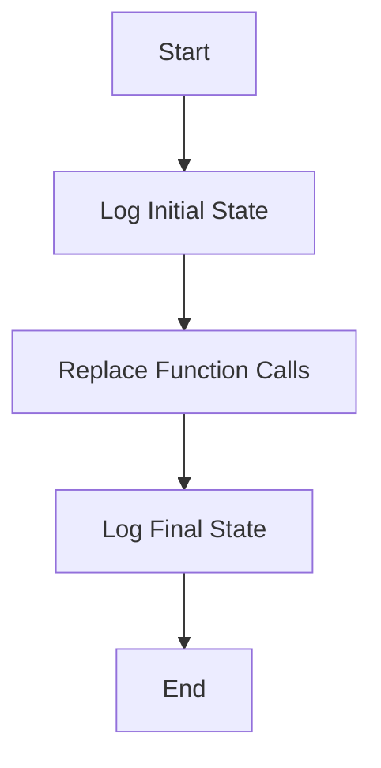

This document will cover the Inlining Process Overview, which includes:

1. Logging the initial state of the graph
2. Replacing function calls with their actual implementations
3. Logging the final state of the graph

Technical document: <SwmLink doc-title="Inlining Process Overview">[Inlining Process Overview](/.swm/inlining-process-overview.7eoikrem.sw.md)</SwmLink>

# [Logging the Initial State of the Graph](https://app.swimm.io/repos/Z2l0aHViJTNBJTNBcHl0b3JjaC1hdXRvZG9jcy1kZW1vJTNBJTNBU3dpbW0tRGVtbw==/docs/7eoikrem#inline-function)

The inlining process begins by logging the initial state of the computational graph. This step is crucial for debugging and performance analysis, as it provides a snapshot of the graph before any modifications are made. By capturing this initial state, developers can compare it with the final state to understand the impact of the inlining process.

# [Replacing Function Calls with Their Actual Implementations](https://app.swimm.io/repos/Z2l0aHViJTNBJTNBcHl0b3JjaC1hdXRvZG9jcy1kZW1vJTNBJTNBU3dpbW0tRGVtbw==/docs/7eoikrem#inlinecalls-function)

The core of the inlining process involves replacing function calls within the graph with their actual implementations. This is done by iterating over the nodes in the graph and identifying different types of function calls, such as `prim::CallFunction` and `prim::CallMethod`. Each identified call is then replaced with the corresponding function's implementation. This step reduces the overhead associated with function calls, thereby optimizing the graph for better performance.

# [Logging the Final State of the Graph](https://app.swimm.io/repos/Z2l0aHViJTNBJTNBcHl0b3JjaC1hdXRvZG9jcy1kZW1vJTNBJTNBU3dpbW0tRGVtbw==/docs/7eoikrem#inline-function)

After all function calls have been replaced with their actual implementations, the final state of the graph is logged. This step is essential for verifying that the inlining process has been completed successfully and for assessing the performance improvements. By comparing the initial and final states of the graph, developers can ensure that the inlining process has optimized the graph as intended.

&nbsp;

*This is an auto-generated document by Swimm AI 🌊 and has not yet been verified by a human*

<SwmMeta version="3.0.0" repo-id="Z2l0aHViJTNBJTNBcHl0b3JjaC1hdXRvZG9jcy1kZW1vJTNBJTNBU3dpbW0tRGVtbw==" repo-name="pytorch-autodocs-demo">Powered by [Swimm](https://app.swimm.io/)</SwmMeta>
