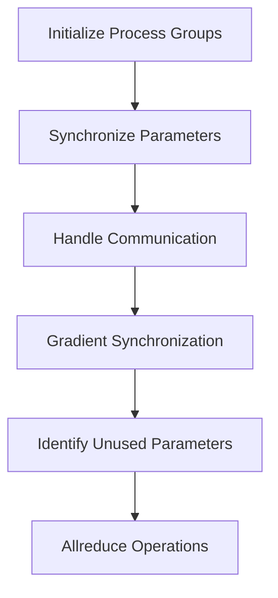

# Introduction to <SwmToken path="torch/csrc/distributed/c10d/reducer.hpp" pos="270:5:5" line-data="  c10::intrusive_ptr&lt;c10d::Work&gt; local_used_work_;">`c10d`</SwmToken>

<SwmToken path="torch/csrc/distributed/c10d/reducer.hpp" pos="270:5:5" line-data="  c10::intrusive_ptr&lt;c10d::Work&gt; local_used_work_;">`c10d`</SwmToken> is a namespace within the distributed module of <SwmToken path="tools/nightly.py" pos="306:1:1" line-data="    pytorch, platform = &quot;&quot;, &quot;&quot;">`pytorch`</SwmToken>. It provides various utilities and functionalities for distributed computing. The namespace includes definitions for Python functions, CUDA utilities, and other distributed backend options. It also contains implementations for different process groups and communication hooks. <SwmToken path="torch/csrc/distributed/c10d/reducer.hpp" pos="270:5:5" line-data="  c10::intrusive_ptr&lt;c10d::Work&gt; local_used_work_;">`c10d`</SwmToken> plays a crucial role in enabling distributed training and communication in <SwmToken path="tools/nightly.py" pos="306:1:1" line-data="    pytorch, platform = &quot;&quot;, &quot;&quot;">`pytorch`</SwmToken>.

# How to Use <SwmToken path="torch/csrc/distributed/c10d/reducer.hpp" pos="270:5:5" line-data="  c10::intrusive_ptr&lt;c10d::Work&gt; local_used_work_;">`c10d`</SwmToken>

To use <SwmToken path="torch/csrc/distributed/c10d/reducer.hpp" pos="270:5:5" line-data="  c10::intrusive_ptr&lt;c10d::Work&gt; local_used_work_;">`c10d`</SwmToken>, you would typically interact with its classes and functions to set up and manage distributed training processes. This involves initializing process groups, synchronizing parameters, and handling communication between different nodes.

<SwmSnippet path="/torch/csrc/distributed/c10d/reducer.hpp" line="223">

---

The <SwmToken path="torch/_C/_distributed_c10d.pyi" pos="39:2:2" line-data="class Reducer:">`Reducer`</SwmToken> class in <SwmToken path="torch/csrc/distributed/c10d/reducer.hpp" pos="270:5:5" line-data="  c10::intrusive_ptr&lt;c10d::Work&gt; local_used_work_;">`c10d`</SwmToken> is used to manage gradient synchronization. It includes members like <SwmToken path="torch/csrc/distributed/c10d/reducer.hpp" pos="225:3:3" line-data="  bool require_finalize_;">`require_finalize_`</SwmToken> and <SwmToken path="torch/csrc/distributed/c10d/reducer.hpp" pos="227:3:3" line-data="  size_t next_bucket_;">`next_bucket_`</SwmToken> to handle the state and progress of the reduction process.

```c++
  bool expect_autograd_hooks_;
  // NOLINTNEXTLINE(cppcoreguidelines-non-private-member-variables-in-classes)
  bool require_finalize_;
  // NOLINTNEXTLINE(cppcoreguidelines-non-private-member-variables-in-classes)
  size_t next_bucket_;
```

---

</SwmSnippet>

<SwmSnippet path="/torch/csrc/distributed/c10d/reducer.hpp" line="230">

---

The <SwmToken path="torch/csrc/distributed/c10d/reducer.hpp" pos="232:5:5" line-data="  const bool find_unused_parameters_;">`find_unused_parameters_`</SwmToken> member in the <SwmToken path="torch/_C/_distributed_c10d.pyi" pos="39:2:2" line-data="class Reducer:">`Reducer`</SwmToken> class helps in identifying and handling parameters that are not used in the backward pass, which is essential for optimizing communication.

```c++
  bool has_marked_unused_parameters_;
  // NOLINTNEXTLINE(cppcoreguidelines-non-private-member-variables-in-classes)
  const bool find_unused_parameters_;
  // NOLINTNEXTLINE(cppcoreguidelines-non-private-member-variables-in-classes)
  const bool gradient_as_bucket_view_;
```

---

</SwmSnippet>

<SwmSnippet path="/torch/csrc/distributed/c10d/reducer.hpp" line="269">

---

The <SwmToken path="torch/csrc/distributed/c10d/reducer.hpp" pos="270:10:10" line-data="  c10::intrusive_ptr&lt;c10d::Work&gt; local_used_work_;">`local_used_work_`</SwmToken> member in the <SwmToken path="torch/_C/_distributed_c10d.pyi" pos="39:2:2" line-data="class Reducer:">`Reducer`</SwmToken> class is a work handle for allreduce operations on the local used map, which is essential for synchronizing parameter usage information across nodes.

```c++
  // Work handle for allreduce on local_used_map_
  c10::intrusive_ptr<c10d::Work> local_used_work_;

  void mark_variable_ready_dense(size_t variable_index);
```

---

</SwmSnippet>

# Endpoints of <SwmToken path="torch/csrc/distributed/c10d/reducer.hpp" pos="270:5:5" line-data="  c10::intrusive_ptr&lt;c10d::Work&gt; local_used_work_;">`c10d`</SwmToken>

<SwmToken path="torch/csrc/distributed/c10d/reducer.hpp" pos="270:5:5" line-data="  c10::intrusive_ptr&lt;c10d::Work&gt; local_used_work_;">`c10d`</SwmToken> provides various endpoints for interacting with the distributed <SwmToken path="torch/csrc/distributed/c10d/init.cpp" pos="1087:4:6" line-data="Inserts the key-value pair into the store based on the supplied ``key`` and">`key-value`</SwmToken> store. These endpoints are essential for managing data across different nodes in a distributed system.

## <SwmToken path="torch/csrc/distributed/c10d/init.cpp" pos="1200:9:11" line-data="Calling :meth:`~torch.distributed.store.check` with a list of keys that">`store.check`</SwmToken>

The <SwmToken path="torch/csrc/distributed/c10d/init.cpp" pos="1200:9:11" line-data="Calling :meth:`~torch.distributed.store.check` with a list of keys that">`store.check`</SwmToken> method is used to verify whether a list of keys is stored in the store or not. This method is useful for checking the existence of multiple keys in a distributed <SwmToken path="torch/csrc/distributed/c10d/init.cpp" pos="1087:4:6" line-data="Inserts the key-value pair into the store based on the supplied ``key`` and">`key-value`</SwmToken> store.

<SwmSnippet path="/torch/csrc/distributed/c10d/init.cpp" line="1200">

---

Example usage of the <SwmToken path="torch/csrc/distributed/c10d/init.cpp" pos="1200:9:11" line-data="Calling :meth:`~torch.distributed.store.check` with a list of keys that">`store.check`</SwmToken> method to verify the existence of keys in a distributed <SwmToken path="torch/csrc/distributed/c10d/init.cpp" pos="1087:4:6" line-data="Inserts the key-value pair into the store based on the supplied ``key`` and">`key-value`</SwmToken> store.

```c++
Calling :meth:`~torch.distributed.store.check` with a list of keys that
one wants to check whether stored in the store or not.

Arguments:
    keys (lisr[str]): The keys to query whether stored in the store.

Example::
    >>> import torch.distributed as dist
    >>> from datetime import timedelta
    >>> # Using TCPStore as an example, other store types can also be used
    >>> store = dist.TCPStore("127.0.0.1", 0, 1, True, timedelta(seconds=30))
    >>> store.add("first_key", 1)
    >>> # Should return 7
    >>> store.check(["first_key"])
)")
```

---

</SwmSnippet>

## <SwmToken path="torch/csrc/distributed/c10d/init.cpp" pos="1250:27:29" line-data="be one greater than the number of keys added by :meth:`~torch.distributed.store.set`">`store.set`</SwmToken>

The <SwmToken path="torch/csrc/distributed/c10d/init.cpp" pos="1250:27:29" line-data="be one greater than the number of keys added by :meth:`~torch.distributed.store.set`">`store.set`</SwmToken> method is used to add a <SwmToken path="torch/csrc/distributed/c10d/init.cpp" pos="1087:4:6" line-data="Inserts the key-value pair into the store based on the supplied ``key`` and">`key-value`</SwmToken> pair to the store. This method is essential for inserting data into the distributed <SwmToken path="torch/csrc/distributed/c10d/init.cpp" pos="1087:4:6" line-data="Inserts the key-value pair into the store based on the supplied ``key`` and">`key-value`</SwmToken> store, which can then be accessed by other processes.

<SwmSnippet path="/torch/csrc/distributed/c10d/init.cpp" line="1250">

---

Example usage of the <SwmToken path="torch/csrc/distributed/c10d/init.cpp" pos="1250:27:29" line-data="be one greater than the number of keys added by :meth:`~torch.distributed.store.set`">`store.set`</SwmToken> method to add a <SwmToken path="torch/csrc/distributed/c10d/init.cpp" pos="1087:4:6" line-data="Inserts the key-value pair into the store based on the supplied ``key`` and">`key-value`</SwmToken> pair to the distributed <SwmToken path="torch/csrc/distributed/c10d/init.cpp" pos="1087:4:6" line-data="Inserts the key-value pair into the store based on the supplied ``key`` and">`key-value`</SwmToken> store.

```c++
be one greater than the number of keys added by :meth:`~torch.distributed.store.set`
and :meth:`~torch.distributed.store.add` since one key is used to coordinate all
the workers using the store.

.. warning::
    When used with the :class:`~torch.distributed.TCPStore`, ``num_keys`` returns the number of keys written to the underlying file. If the store is destructed and another store is created with the same file, the original keys will be retained.

Returns:
    The number of keys present in the store.

Example::
    >>> import torch.distributed as dist
    >>> from datetime import timedelta
    >>> # Using TCPStore as an example, other store types can also be used
    >>> store = dist.TCPStore("127.0.0.1", 0, 1, True, timedelta(seconds=30))
    >>> store.set("first_key", "first_value")
    >>> # This should return 2
    >>> store.num_keys()
)")
```

---

</SwmSnippet>

&nbsp;

*This is an auto-generated document by Swimm AI 🌊 and has not yet been verified by a human*

<SwmMeta version="3.0.0" repo-id="Z2l0aHViJTNBJTNBcHl0b3JjaC1hdXRvZG9jcy1kZW1vJTNBJTNBU3dpbW0tRGVtbw==" repo-name="pytorch-autodocs-demo"><sup>Powered by [Swimm](/)</sup></SwmMeta>
