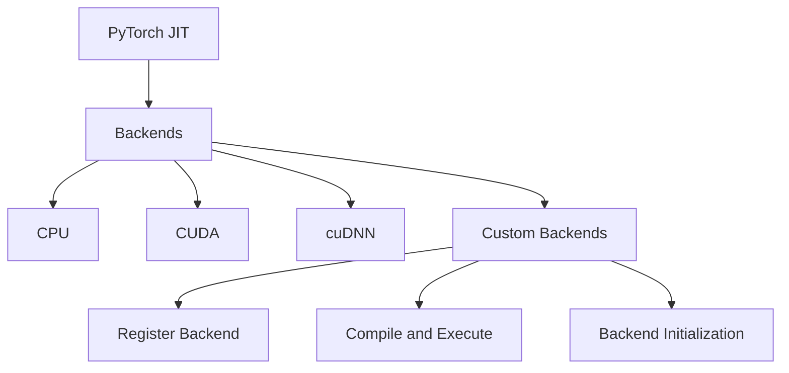

# Introduction to Jit Backends

Backends in JIT refer to the various computational backends that PyTorch supports, such as CPU, CUDA, and others. These backends control the behavior of different hardware and software configurations, enabling PyTorch to optimize performance for specific environments.

# Available Backends

The `torch.backends` module includes several specific backends like `torch.backends.cpu`, `torch.backends.cuda`, `torch.backends.cudnn`, and more. Each backend has its own set of functionalities and optimizations, which can be accessed and controlled through the `torch.backends` module.

# Backend Registration

In the JIT context, backends are used to compile and execute models, providing a flexible interface for integrating custom backends. The `backend` class in `torch::jit` is used to register new backends, define their schemas, and implement their functionalities. This class ensures that the backend adheres to the `PyTorchBackendInterface`, which defines methods like `is_available`, `compile`, and `execute`.

# Backend Initialization

The `initJitBackendBindings` function initializes Python bindings for JIT to backend functions, allowing modules to be lowered to specific backends.

<SwmSnippet path="/torch/csrc/jit/backends/backend_init.h" line="1">

---

The `initJitBackendBindings` function initializes Python bindings for JIT to backend functions, allowing modules to be lowered to specific backends.

```c
#pragma once

#include <torch/csrc/jit/python/pybind.h>
#include <torch/csrc/utils/pybind.h>

namespace torch {
namespace jit {
// Initialize Python bindings for JIT to_<backend> functions.
void initJitBackendBindings(PyObject* module);
} // namespace jit
```

---

</SwmSnippet>

# Custom Backends

Wrap your backend with `torch._dynamo.backends.common.aot_autograd` and use `torch.compile` with the `backend` kwarg as before. Backend functions wrapped by `aot_autograd` should have the same contract as before. Backend functions are passed to `aot_autograd` through the `fw_compiler` (forward compiler) or `bw_compiler` (backward compiler) kwargs. If `bw_compiler` is not specified, the backward compile function defaults to the forward compile function.

# Best Practices for Backends

The document provides best practices for implementing and using backends, ensuring optimal performance and compatibility.

# Main Functions

There are several main functions in this folder. Some of them are `torch.backends.cpu`, `torch.backends.cuda`, `torch.backends.cudnn`, `torch.backends.mha`, `torch.backends.mps`, `torch.backends.mkl`, `torch.backends.mkldnn`, `torch.backends.nnpack`, `torch.backends.openmp`, `torch.backends.opt_einsum`, and `torch.backends.xeon`. We will dive a little into `torch.backends.cpu`, `torch.backends.cuda`, and `torch.backends.cudnn`.

### torch.backends.cpu

The `torch.backends.cpu` module controls the behavior of the CPU backend in PyTorch. It allows for optimizations and configurations specific to CPU operations, ensuring efficient computation on CPU hardware.

### torch.backends.cuda

The `torch.backends.cuda` module manages the CUDA backend, which is used for GPU acceleration. This module provides functionalities to optimize and configure GPU operations, leveraging NVIDIA's CUDA platform for high-performance computing.

### torch.backends.cudnn

The `torch.backends.cudnn` module handles the cuDNN backend, which is a GPU-accelerated library for deep neural networks. This module allows PyTorch to utilize cuDNN for optimized neural network computations, enhancing performance on compatible NVIDIA GPUs.

# Backend Endpoints

Backend Endpoints

## registerBackendPreprocessFunction

The `registerBackendPreprocessFunction` endpoint is used to register a preprocessing function for a specific backend. This function takes the name of the backend and the preprocessing function itself, which is defined as a `BackendPreprocessFunction`.

<SwmSnippet path="/torch/csrc/jit/backends/backend_detail.h" line="26">

---

The `registerBackendPreprocessFunction` endpoint is used to register a preprocessing function for a specific backend. This function takes the name of the backend and the preprocessing function itself, which is defined as a `BackendPreprocessFunction`.

```c
TORCH_API void registerBackendPreprocessFunction(
    const std::string& name,
    const BackendPreprocessFunction& preprocess);
```

---

</SwmSnippet>

## codegen_backend_module

The `codegen_backend_module` endpoint is responsible for generating a backend module. It takes the backend name, the original module, a method compile specification, and a dictionary type pointer. This function is crucial for compiling and executing models on different backends.

<SwmSnippet path="/torch/csrc/jit/backends/backend_detail.h" line="34">

---

The `codegen_backend_module` endpoint is responsible for generating a backend module. It takes the backend name, the original module, a method compile specification, and a dictionary type pointer. This function is crucial for compiling and executing models on different backends.

```c
TORCH_API Module codegen_backend_module(
    const std::string& backend_name,
    const Module& orig_module,
    const c10::Dict<IValue, IValue>& method_compile_spec,
    const c10::DictTypePtr& any_dict_ty);
```

---

</SwmSnippet>

&nbsp;

*This is an auto-generated document by Swimm AI 🌊 and has not yet been verified by a human*

<SwmMeta version="3.0.0" repo-id="Z2l0aHViJTNBJTNBcHl0b3JjaC1hdXRvZG9jcy1kZW1vJTNBJTNBU3dpbW0tRGVtbw==" repo-name="pytorch-autodocs-demo"><sup>Powered by [Swimm](https://app.swimm.io/)</sup></SwmMeta>
