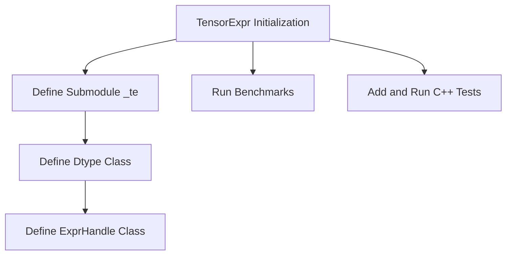

# Introduction to Tensor Expressions in JIT

TensorExpr is a component within the JIT (Just-In-Time) compilation framework of PyTorch. It provides a domain-specific language (DSL) for tensor operations, allowing for the construction and optimization of tensor expressions. The primary purpose of TensorExpr is to enable efficient code generation for tensor computations, which can be executed on various hardware backends.

TensorExpr includes functionalities for simplifying intermediate representations (IR), performing analysis, and generating code for different targets such as CPU and GPU. It is initialized and integrated into the PyTorch framework through specific bindings, making it accessible for tensor operations within the JIT environment.

## Running TensorExpr Benchmarks

To run TensorExpr benchmarks, you can use the command `python -m benchmarks.tensorexpr --help` from the root of the PyTorch repository to show documentation. An example command to start with is `python -m benchmarks.tensorexpr --device gpu --mode fwd --jit-mode trace --cuda-fuser=te`.

## Adding and Running TensorExpr C++ Tests

To add a new TensorExpr C++ test, create a new test file in the `test/cpp/tensorexpr` directory with a name starting with `test_`, like `test_foo.cpp`. Register your test in `tests.h` and re-run cmake to pick up the new test file. To run the tests, rebuild the test binary using `ninja build/bin/test_tensorexpr` and execute it with `build/bin/test_tensorexpr --gtest_filter='glob_style_filter*'`.

## Initializing TensorExpr Bindings

The function `initTensorExprBindings` initializes the Python bindings for Tensor Expressions, making various tensor operations accessible within the JIT environment. This includes defining mathematical functions like `sin`, `cos`, `tan`, and many others.

<SwmSnippet path="/torch/csrc/jit/tensorexpr/tensorexpr_init.cpp" line="65">

---

The function `initTensorExprBindings` starts by defining a submodule `_te` within the main module.

```c++
void initTensorExprBindings(PyObject* module) {
  auto m = py::handle(module).cast<py::module>();

  // Tensor Expr Classes
  auto te = m.def_submodule("_te");

```

---

</SwmSnippet>

<SwmSnippet path="/torch/csrc/jit/tensorexpr/tensorexpr_init.cpp" line="71">

---

It then defines the `Dtype` class within the `_te` submodule and sets up property accessors for various scalar types.

```c++
  auto dtype_class =
      py::class_<Dtype>(te, "Dtype").def(py::init(&parsePythonDtype));
  py::implicitly_convertible<py::object, Dtype>();

#define DTYPE_SINGLETON_ACCESSOR(ctype, name) \
  dtype_class.def_property_readonly_static(   \
      #name, [](const py::object&) { return k##name; });
  AT_FORALL_SCALAR_TYPES_AND3(Bool, Half, BFloat16, DTYPE_SINGLETON_ACCESSOR)
#undef DTYPE_SINGLETON_ACCESSOR
```

---

</SwmSnippet>

<SwmSnippet path="/torch/csrc/jit/tensorexpr/tensorexpr_init.cpp" line="81">

---

Finally, it defines the `ExprHandle` class, which includes methods for handling tensor expressions.

```c++
  auto expr_handle_class =
      py::class_<ExprHandle>(te, "ExprHandle")
          .def(
              "__str__",
              [](const ExprHandle& self) {
```

---

</SwmSnippet>

&nbsp;

*This is an auto-generated document by Swimm AI 🌊 and has not yet been verified by a human*

<SwmMeta version="3.0.0" repo-id="Z2l0aHViJTNBJTNBcHl0b3JjaC1hdXRvZG9jcy1kZW1vJTNBJTNBU3dpbW0tRGVtbw==" repo-name="pytorch-autodocs-demo"><sup>Powered by [Swimm](https://app.swimm.io/)</sup></SwmMeta>
