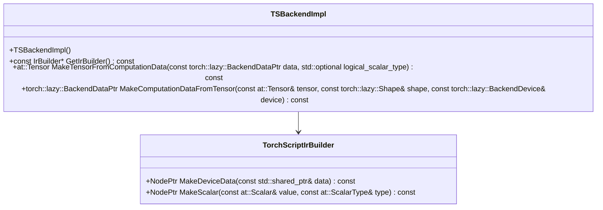

# Introduction

The TorchScript (TS) backend in Lazy is responsible for handling TorchScript operations and data within the lazy execution framework. It includes classes like `TsNode` and `TSData` which represent nodes in the computation graph and backend-specific data respectively. The `TSBackendImpl` class implements the `BackendImplInterface` and provides methods for creating data placeholders, compiling computations, and executing computations. The backend also supports eager fallback mechanisms through functions like `ts_eager_fallback` to handle operations that need immediate execution. Additionally, the TS backend manages device-specific operations and ensures that tensors are correctly handled across different devices like CPU and CUDA.

# TSBackendImpl Class

The `TSBackendImpl` class implements the `BackendImplInterface` and initializes the default device type based on environment variables or flags. It provides various methods to interact with the backend, such as creating data placeholders, compiling computations, and executing computations.

<SwmSnippet path="/torch/csrc/lazy/ts_backend/ts_backend_impl.cpp" line="42">

---

The constructor of `TSBackendImpl` initializes the default device type based on environment variables or flags.

```c++
class TSBackendImpl : public torch::lazy::BackendImplInterface {
 public:
  TSBackendImpl() {
    // TODO(whc) unify how all our flags are set and parsed as envs
    static bool env_use_cuda = std::getenv("LTC_TS_CUDA") != nullptr;
    auto type =
        (env_use_cuda || FLAGS_torch_lazy_ts_cuda) ? at::kCUDA : at::kCPU;
    default_device_type_ = std::make_shared<TSBackendDeviceType>(type);
  }
```

---

</SwmSnippet>

<SwmSnippet path="/torch/csrc/lazy/ts_backend/ts_backend_impl.cpp" line="52">

---

The `GetIrBuilder` method returns an instance of `TorchScriptIrBuilder`, which is used to build the intermediate representation (IR) for TorchScript operations.

```c++
  const IrBuilder* GetIrBuilder() const override {
    static const IrBuilder* builder = new TorchScriptIrBuilder();
    return builder;
  }
```

---

</SwmSnippet>

<SwmSnippet path="/torch/csrc/lazy/ts_backend/ts_backend_impl.cpp" line="82">

---

The `MakeTensorFromComputationData` method converts backend-specific data into a tensor.

```c++
  at::Tensor MakeTensorFromComputationData(
      const torch::lazy::BackendDataPtr data,
      std::optional<at::ScalarType> logical_scalar_type) const override {
    const auto ts_data = std::static_pointer_cast<TSData>(data);
    return ts_data->data();
  }
```

---

</SwmSnippet>

<SwmSnippet path="/torch/csrc/lazy/ts_backend/ts_backend_impl.cpp" line="89">

---

The `MakeComputationDataFromTensor` method creates backend-specific data from a tensor, handling device-specific operations.

```c++
  torch::lazy::BackendDataPtr MakeComputationDataFromTensor(
      const at::Tensor& tensor,
      const torch::lazy::Shape& shape,
      const torch::lazy::BackendDevice& device) const override {
    at::TensorOptions options = tensor.options().device(
        default_device_type_->c10Type(), device.ordinal());
    if (tensor.device().type() == default_device_type_->c10Type() &&
        default_device_type_->c10Type() == at::kCUDA) {
      return std::make_shared<TSData>(
          tensor.to(options, /*non_blocking=*/true), shape, device);
    } else if (tensor.device().type() == at::kCPU && tensor.numel() == 1) {
      // calling .item() on singleton cpu tensor is fast, and using fill is a
      // safe, async way to copy cpu to cuda for a single value
      auto device_tensor = at::full(tensor.sizes(), tensor.item(), options);
      return std::make_shared<TSData>(device_tensor, shape, device);
    } else {
      return std::make_shared<TSData>(
          tensor.to(options, /*non_blocking=*/false), shape, device);
    }
  }
```

---

</SwmSnippet>

<SwmSnippet path="/torch/csrc/lazy/ts_backend/ts_backend_impl.cpp" line="267">

---

The `GetTSBackendImpl` function returns a singleton instance of `TSBackendImpl`, ensuring that the backend implementation is initialized only once.

```c++
torch::lazy::BackendImplInterface* GetTSBackendImpl() {
  static TSBackendImpl* ts_backend_impl = new TSBackendImpl();
  return ts_backend_impl;
}
```

---

</SwmSnippet>

# TSBackendDeviceType

The `TSBackendDeviceType` class represents the device type for the TorchScript backend. It ensures that the device type is either CPU or CUDA and provides methods to convert the device type to a string or a c10 device type.

<SwmSnippet path="/torch/csrc/lazy/ts_backend/ts_backend_impl.cpp" line="26">

---

The `TSBackendDeviceType` class ensures that the device type is either CPU or CUDA and provides methods to convert the device type to a string or a c10 device type.

```c++
struct TSBackendDeviceType : public BackendDeviceType {
  TSBackendDeviceType() = delete;
  TSBackendDeviceType(c10::DeviceType deviceType)
      : BackendDeviceType((int8_t)deviceType) {
    TORCH_CHECK(deviceType == at::kCPU || deviceType == at::kCUDA);
  }

  std::string toString() const override {
    return c10::DeviceTypeName((c10::DeviceType)type);
  }

  c10::DeviceType c10Type() const {
    return (c10::DeviceType)type;
  }
};
```

---

</SwmSnippet>

# ExecuteComputation

The `ExecuteComputation` method in `TSBackendImpl` executes a given computation on the specified device. It prepares the input stack with the necessary data, runs the computation using the TorchScript graph executor, and collects the results into a vector of `BackendDataPtr`.

<SwmSnippet path="/torch/csrc/lazy/ts_backend/ts_backend_impl.cpp" line="207">

---

The `ExecuteComputation` method prepares the input stack with the necessary data, runs the computation using the TorchScript graph executor, and collects the results into a vector of `BackendDataPtr`.

```c++
std::vector<torch::lazy::BackendDataPtr> TSBackendImpl::ExecuteComputation(
    torch::lazy::ComputationPtr computation,
    c10::ArrayRef<torch::lazy::BackendDataPtr> arguments,
    const torch::lazy::BackendDevice& device) const {
  auto ts_computation =
      std::dynamic_pointer_cast<torch::lazy::TSComputation>(computation);
  TORCH_CHECK(ts_computation, "Computation isn't TSComputation");
  torch::jit::GraphExecutor& graph_executor = ts_computation->graph_executor();
  std::vector<torch::jit::IValue> stack;
  for (const auto& argument : arguments) {
    const auto ts_data = std::static_pointer_cast<TSData>(argument);
    if (ts_data->scalar.has_value()) {
      stack.emplace_back(ts_data->scalar.value());
    } else {
      // TODO(whc) should this check be made more general? it's written somewhat
      // oddly
      TORCH_CHECK(
          static_cast<c10::DeviceType>(default_device_type_->type) !=
              at::kCUDA ||
          ts_data->data().device().type() == at::kCUDA);
      stack.emplace_back(ts_data->data());
```

---

</SwmSnippet>

# Endpoints of TS Backend

The TS backend provides several endpoints for handling TorchScript operations. Two important methods are `Lower` and `Build`.

## Lower

The `Lower` method in the `TsNode` class is a backend-specific method that returns a backend-specific type. It is used to lower a node in the computation graph to a TorchScript operation.

<SwmSnippet path="/torch/csrc/lazy/ts_backend/ts_node.h" line="55">

---

The `Lower` method in the `TsNode` class returns a backend-specific type and is used to lower a node in the computation graph to a TorchScript operation.

```c
  virtual TSOpVector Lower(
      std::shared_ptr<torch::jit::GraphFunction> function,
      TSLoweringContext* loctx) const;
```

---

</SwmSnippet>

## Build

The `Build` method in the `TSLoweringContext` class constructs a `TSComputation` object by registering the outputs of the computation graph and returning a shared pointer to the `TSComputation`.

<SwmSnippet path="/torch/csrc/lazy/ts_backend/ts_lowering_context.h" line="91">

---

The `Build` method in the `TSLoweringContext` class constructs a `TSComputation` object by registering the outputs of the computation graph and returning a shared pointer to the `TSComputation`.

```c
  ComputationPtr Build() override {
    for (torch::jit::Value* output : root_tuple_) {
      graph_->block()->registerOutput(output);
    }
    return std::shared_ptr<Computation>(new TSComputation(graph_));
  }
```

---

</SwmSnippet>

&nbsp;

*This is an auto-generated document by Swimm AI 🌊 and has not yet been verified by a human*

<SwmMeta version="3.0.0" repo-id="Z2l0aHViJTNBJTNBcHl0b3JjaC1hdXRvZG9jcy1kZW1vJTNBJTNBU3dpbW0tRGVtbw==" repo-name="pytorch-autodocs-demo"><sup>Powered by [Swimm](https://app.swimm.io/)</sup></SwmMeta>
