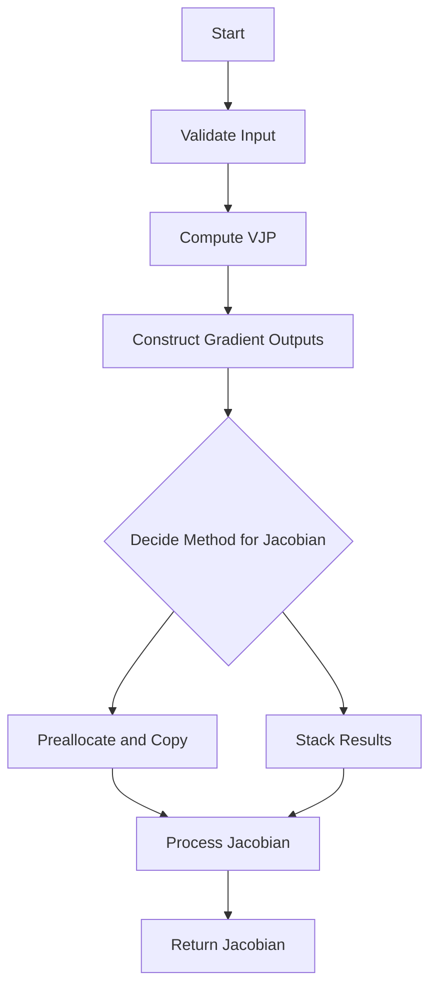

This document will cover the purpose and flow of the `wrapper_fn` function, which is responsible for orchestrating the computation of the Jacobian matrix. We'll cover:

1. Validating the input
2. Computing the vector-Jacobian product (VJP)
3. Constructing gradient outputs
4. Deciding the method for computing the Jacobian
5. Processing and returning the Jacobian.

Technical document: <SwmLink doc-title="Overview of wrapper_fn">[Overview of wrapper_fn](/.swm/overview-of-wrapper_fn.4i5qtom2.sw.md)</SwmLink>

# [Validating the Input](https://app.swimm.io/repos/Z2l0aHViJTNBJTNBcHl0b3JjaC1hdXRvZG9jcy1kZW1vJTNBJTNBU3dpbW0tRGVtbw==/docs/4i5qtom2#the-wrapper_fn-function-starts-by-checking-if-the-input-is-complex)

The first step in the `wrapper_fn` function is to validate the input to ensure it is not complex. This is important because complex inputs can lead to incorrect computations of the Jacobian matrix. By validating the input early, we prevent potential errors and ensure that the subsequent steps operate on valid data.

# [Computing the Vector-Jacobian Product (VJP)](https://app.swimm.io/repos/Z2l0aHViJTNBJTNBcHl0b3JjaC1hdXRvZG9jcy1kZW1vJTNBJTNBU3dpbW0tRGVtbw==/docs/4i5qtom2#it-then-computes-the-vector-jacobian-product-vjp-and-extracts-the-necessary-components)

After validating the input, the function computes the vector-Jacobian product (VJP). This involves applying the function to the input and obtaining the output along with a function that can compute the gradient of the output with respect to the input. If auxiliary outputs are present, they are also extracted at this stage. This step is crucial for setting up the data needed to compute the Jacobian matrix.

# [Constructing Gradient Outputs](https://app.swimm.io/repos/Z2l0aHViJTNBJTNBcHl0b3JjaC1hdXRvZG9jcy1kZW1vJTNBJTNBU3dpbW0tRGVtbw==/docs/4i5qtom2#the-function-flattens-the-output-validates-it-and-constructs-gradient-outputs)

The next step involves flattening the output to ensure it is in a standard format. This flattened output is then validated again to ensure it meets the necessary criteria. Gradient outputs are constructed by splitting the standard basis, which involves creating a set of vectors that will be used to compute the Jacobian. This step ensures that the gradient outputs are correctly structured for the subsequent computation.

# [Deciding the Method for Computing the Jacobian](https://app.swimm.io/repos/Z2l0aHViJTNBJTNBcHl0b3JjaC1hdXRvZG9jcy1kZW1vJTNBJTNBU3dpbW0tRGVtbw==/docs/4i5qtom2#it-decides-whether-to-compute-the-jacobian-using-preallocation-and-copying-or-by-stacking-the-results)

At this stage, the function decides on the method to compute the Jacobian matrix. There are two main methods: preallocation and copying, or stacking the results. The choice of method depends on factors such as the size of the output vector and the chunk size. Preallocation and copying involve allocating memory for the Jacobian in advance and copying the results into this preallocated space. Stacking results involves computing the Jacobian in chunks and then concatenating these chunks. This decision impacts the efficiency and memory usage of the computation.

# [Processing and Returning the Jacobian](https://app.swimm.io/repos/Z2l0aHViJTNBJTNBcHl0b3JjaC1hdXRvZG9jcy1kZW1vJTNBJTNBU3dpbW0tRGVtbw==/docs/4i5qtom2#finally-it-processes-the-jacobian-and-returns-it-in-the-required-format)

The final step involves processing the computed Jacobian matrix to ensure it is in the required format. This may involve additional validation and restructuring of the data. Once processed, the Jacobian matrix is returned as the output of the function. This step ensures that the end user receives the Jacobian matrix in a format that can be easily used for further analysis or computation.

&nbsp;

*This is an auto-generated document by Swimm AI 🌊 and has not yet been verified by a human*

<SwmMeta version="3.0.0" repo-id="Z2l0aHViJTNBJTNBcHl0b3JjaC1hdXRvZG9jcy1kZW1vJTNBJTNBU3dpbW0tRGVtbw==" repo-name="pytorch-autodocs-demo">Powered by [Swimm](https://app.swimm.io/)</SwmMeta>
