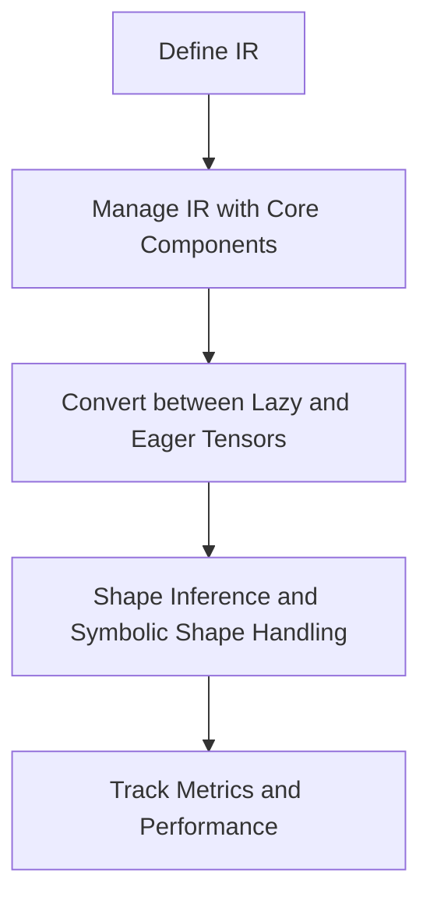

## Overview

Lazy Core in PyTorch refers to the fundamental components and utilities that support the lazy execution model. It includes various data structures, such as `TrieNode` and `TrieCache`, which are used for caching and managing intermediate representations (IR) of computations. The core also defines the `LazyTensor` class, which represents tensors in the lazy execution model and provides methods for converting between lazy and eager tensors. Additionally, it includes utilities for shape inference, symbolic shape handling, and other helper functions that facilitate the lazy execution model.

## Core Components

Core includes various data structures and utilities for managing intermediate representations (IR) of computations.

<SwmSnippet path="/torch/csrc/lazy/core/ir.h" line="85">

---

The `Node` class in `ir.h` is used to construct nodes with operands and shapes, or with a shape generated from a function. This is crucial for defining operations and managing their outputs.

```c
  // for the operation. The num_outputs tells how many outputs a given operation
  // generates.
  //
  // None leaf node's node_hash does not contains shape information always.
  // So we pass in the hash value rather than a function.
  Node(OpKind op, size_t num_outputs);

  // Construct node with operands and shapes
  Node(
      OpKind op,
      OpList operands,
      std::vector<Shape>&& shapes,
      size_t num_outputs = 1);

  // Construct node with operands and shape generated from a function
  Node(
      OpKind op,
      OpList operands,
      const std::function<Shape()>& shape_fn,
      size_t num_outputs = 1);
```

---

</SwmSnippet>

## LazyTensor Class

The `LazyTensor` class represents tensors in the lazy execution model and provides methods for converting between lazy and eager tensors.

<SwmSnippet path="/torch/csrc/lazy/core/tensor.h" line="79">

---

The `LazyTensor` class includes methods like `size`, `ToTensor`, `ShallowCopyTo`, `SetTensor`, `UpdateFromTensor`, and `shape`. These methods are essential for tensor manipulation and conversion in the lazy execution model.

```c
  // Override it to use your own Shape.
  virtual int64_t size(int64_t dim) const;

  // Override it to use your own graph executor.
  virtual at::Tensor ToTensor(bool detached);

  void ShallowCopyTo(LazyTensorPtr dest) const;

  // Assigns the tensor value to the lazy tensor.
  void SetTensor(at::Tensor tensor);

  void UpdateFromTensor(at::Tensor tensor, bool sync);
  void UpdateFromTensorOut(at::Tensor tensor);
  void UpdateFromTensorOut(const LazyTensorPtr& tensor);

  const std::shared_ptr<Data>& data() const;

  // Override it to use your own type conversion.
  virtual at::ScalarType dtype() const;

  MaybeRef<Shape> shape() const;
```

---

</SwmSnippet>

## Shape Inference and Symbolic Shape Handling

Core includes utilities for shape inference and symbolic shape handling, which are essential for the lazy execution model.

<SwmSnippet path="/torch/csrc/lazy/core/shape_inference.cpp" line="7">

---

The `shape_inference.cpp` file contains functions for shape inference and symbolic shape handling. These functions are considered technical debt and are intended to be replaced by structured kernels in the long term.

```c++
 * for which there _are_ structured kernels can use meta::op() to infer
 * shape/dtype, and codegen makes use of this.  Ops for which there are not
 * yet structured kernels can still be used with lazy_tensor codegen, but
 * require manual intervention to implement compute_shape_{op} and
 * compute_dtype_{op}.
 *
 * READ THIS!
 *
 * 1. Beware: Tech Debt!
 * ---------------------
 * These functions are tech debt.  We want to delete them all and use structured
 * kernels instead, but it's a lot faster to write these so we're decoupling the
 * two efforts to move fast for adding support for codegenned Lazy Tensor ops.
 *
 * Codegenned Lazy Tensor ops with handwritten shape formulae are still better
 * than fully handwritten Lazy Tensor ops (which also have handwritten shape
 * formulae).
 *
 * 2. Structured Kernels For The Win
 * ---------------------------------
 * Long term, more and more ops should be supported as 'structured kernels'.
```

---

</SwmSnippet>

## Metrics and Performance

Core also includes metrics and performance tracking utilities to monitor and optimize the lazy execution model.

<SwmSnippet path="/torch/csrc/lazy/core/metrics.h" line="145">

---

The `Metric` class in `metrics.h` is used for performance tracking. It allows for the creation of metrics in both global and function scopes, and includes methods for adding samples and retrieving accumulated values.

```c
// The typical use of a Metric is one in which it gets created either in a
// global scope context:
//   static Metric* metric = new Metric("RpcCount");
// Or within a function scope:
//   void MyFunction(...) {
//     static Metric* metric = new Metric("RpcCount");
//     ...
//     metric->AddSample(ts_nanos, some_value);
//   }
class TORCH_API Metric {
 public:
  explicit Metric(
      std::string name,
      MetricReprFn repr_fn = MetricFnValue,
      size_t max_samples = 0);

  const std::string& Name() const {
    return name_;
  }

  double Accumulator() const;
```

---

</SwmSnippet>

## Main Functions

There are several main functions in this folder. Some of them are `computeShape`, `TraverseTrie`, `Insert`, `numel`, and `applySymbolicShapesOnLT`. We will dive a little into `computeShape` and `applySymbolicShapesOnLT`.

### computeShape

The `computeShape` function calculates the shape of a node using a provided shape function. It utilizes a shape cache to store and retrieve shapes, optimizing the computation process.

<SwmSnippet path="/torch/csrc/lazy/core/ir.cpp" line="129">

---

The `computeShape` function in `ir.cpp` uses a shape cache to optimize shape computation. It retrieves the shape from the cache if available, otherwise, it computes and stores the shape.

```c++
Shape Node::computeShape(const std::function<Shape()>& shape_fn) {
  static ShapeCache* cache = new ShapeCache(FLAGS_torch_lazy_shape_cache_size);

  auto hash = shapeHash();
  auto shape = cache->Get(hash);
  if (shape == nullptr) {
    shape = cache->Add(hash, std::make_shared<Shape>(shape_fn()));
  }
  return *shape;
```

---

</SwmSnippet>

### applySymbolicShapesOnLT

The `applySymbolicShapesOnLT` function calculates and applies symbolic shapes onto the Shape objects passed to `result_shapes`. It handles various argument types and ensures the consistency of symbolic dimensions.

<SwmSnippet path="/torch/csrc/lazy/core/shape.cpp" line="89">

---

The `applySymbolicShapesOnLT` function in `shape.cpp` processes arguments to apply symbolic shapes. It handles lists of tensors and individual tensors, ensuring symbolic dimensions are consistent.

```c++
void applySymbolicShapesOnLT(
    const char* schema_str,
    std::vector<c10::IValue> args,
    std::vector<Shape>& result_shapes) {
  std::vector<jit::SSAInput> converted_args;
  // TODO: Determine if there are any unknown values in LazyTensor
  const c10::FunctionSchema& schema =
      jit::getOperatorForLiteral(schema_str)->schema();

  for (auto& arg : args) {
    // Handle list of tensors
    if (arg.isTensorList()) {
      at::List<at::Tensor> tensor_list = arg.toTensorList();
      for (at::Tensor tensor : tensor_list) {
        converted_args.emplace_back(get_symbolic_shape(tensor));
      }
    } else if (arg.isTensor()) {
      auto ss = get_symbolic_shape(arg.toTensor());
      converted_args.emplace_back(ss);
    } else {
      // If we need to support symbolic ints, here is the place
```

---

</SwmSnippet>

&nbsp;

*This is an auto-generated document by Swimm AI 🌊 and has not yet been verified by a human*

<SwmMeta version="3.0.0" repo-id="Z2l0aHViJTNBJTNBcHl0b3JjaC1hdXRvZG9jcy1kZW1vJTNBJTNBU3dpbW0tRGVtbw==" repo-name="pytorch-autodocs-demo"><sup>Powered by [Swimm](https://app.swimm.io/)</sup></SwmMeta>
