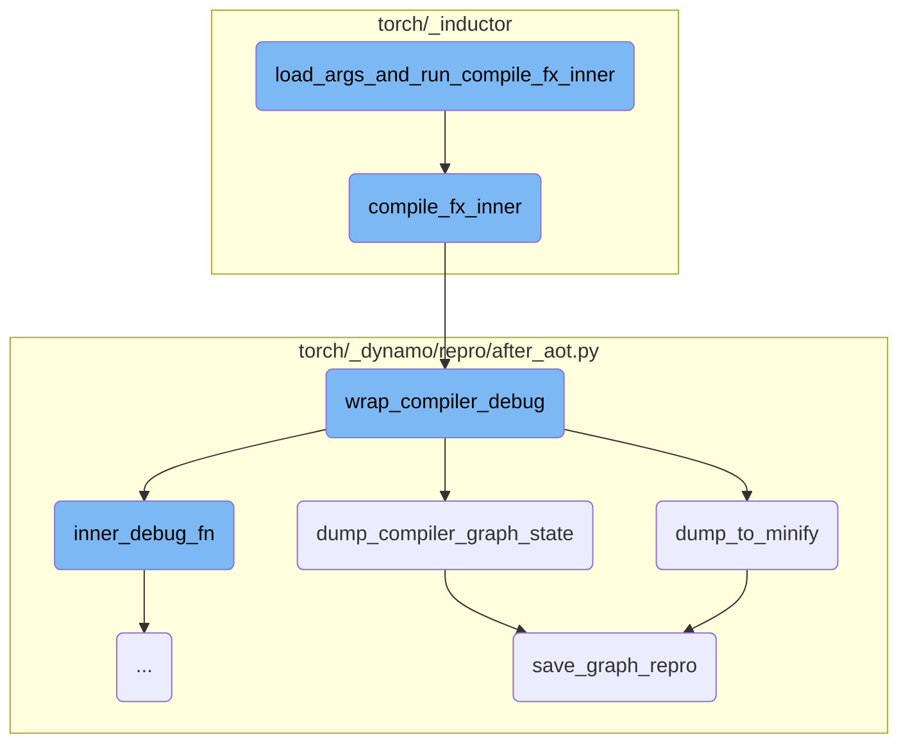
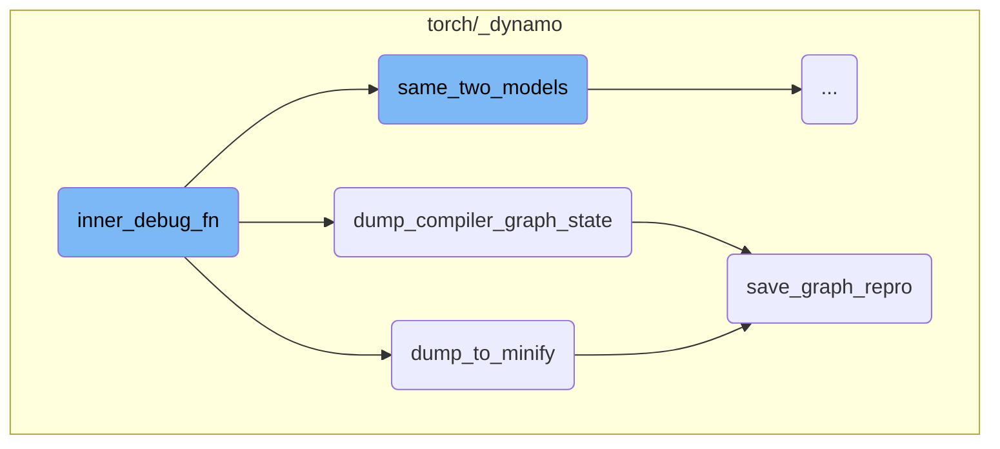
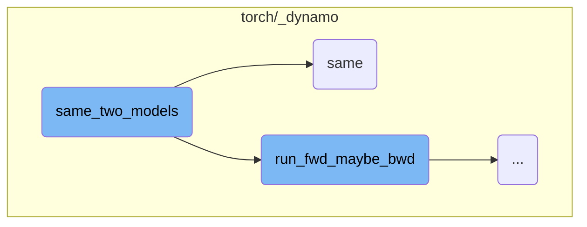

```mermaid
graph TD;
      subgraph torchdynamo["torch/_dynamo"]
45d3914ff219ac59d8791edb23592ffcf2198e42f21e9d2fa8d458122697dfbf(run_fwd_maybe_bwd):::mainFlowStyle --> b849fa0d966995c95bcc0dd289d11300f269a476fb0a889509ae0149e18ed3ef(reduce_to_scalar_loss):::mainFlowStyle
end

subgraph torchdynamo["torch/_dynamo"]
b849fa0d966995c95bcc0dd289d11300f269a476fb0a889509ae0149e18ed3ef(reduce_to_scalar_loss):::mainFlowStyle --> 155e3cc2d5c50ff89e280b9cdc1c9ae4e009632d190253b8d3364f817aed44c4(numel):::mainFlowStyle
end

subgraph torchdynamo["torch/_dynamo"]
155e3cc2d5c50ff89e280b9cdc1c9ae4e009632d190253b8d3364f817aed44c4(numel):::mainFlowStyle --> 0fe776e548d42ed0d2169b9051562848ccfee29509461e7e993ce542426370a7(call_function):::mainFlowStyle
end

subgraph torchdynamo["torch/_dynamo"]
0fe776e548d42ed0d2169b9051562848ccfee29509461e7e993ce542426370a7(call_function):::mainFlowStyle --> fde83ab941c6a2749f130ece53e7f65af2928d91723a63a01273d4e430a433bb(call_method):::mainFlowStyle
end

subgraph torchdynamo["torch/_dynamo"]
fde83ab941c6a2749f130ece53e7f65af2928d91723a63a01273d4e430a433bb(call_method):::mainFlowStyle --> 458008e74f18ebce47c64da5a4233a63dc2fd42ac18b14ae3f3aaea47313241b(inline_user_function_return):::mainFlowStyle
end

subgraph torchdynamo["torch/_dynamo"]
458008e74f18ebce47c64da5a4233a63dc2fd42ac18b14ae3f3aaea47313241b(inline_user_function_return):::mainFlowStyle --> fcd883700fffa007b56c5d346195884dc971b221f81f7154a62efec44b035ea5(inline_call):::mainFlowStyle
end

subgraph torchdynamo["torch/_dynamo"]
fcd883700fffa007b56c5d346195884dc971b221f81f7154a62efec44b035ea5(inline_call):::mainFlowStyle --> 15971f1e27fd627308a99bae241ac3eb113c6830b15353374d03323c5a30959c(inline_call_):::mainFlowStyle
end

subgraph torchdynamo["torch/_dynamo"]
15971f1e27fd627308a99bae241ac3eb113c6830b15353374d03323c5a30959c(inline_call_):::mainFlowStyle --> edf27ab967b775dcd6f62cb8a0fb2a87177da9406db5a99aad72cc627af839ac(run):::mainFlowStyle
end

subgraph torchdynamo["torch/_dynamo"]
edf27ab967b775dcd6f62cb8a0fb2a87177da9406db5a99aad72cc627af839ac(run):::mainFlowStyle --> 99e91bca7ea856f56e3f34579d72219ce35debd0d03d0aee37dedaffe5ac2a22(step):::mainFlowStyle
end

subgraph torchdynamo["torch/_dynamo"]
99e91bca7ea856f56e3f34579d72219ce35debd0d03d0aee37dedaffe5ac2a22(step):::mainFlowStyle --> a8cb423a5d16e220218eb2e3c35a54f64a0aaab6b5233dd0b33a8dae3657ca81(step_graph_break):::mainFlowStyle
end

subgraph torchdynamo["torch/_dynamo"]
a8cb423a5d16e220218eb2e3c35a54f64a0aaab6b5233dd0b33a8dae3657ca81(step_graph_break):::mainFlowStyle --> 2ba345a88495baf48df3654780e05d6be290f7d7a9d8f157cc7acee764a6ff02(compile_subgraph):::mainFlowStyle
end

subgraph torchdynamo["torch/_dynamo"]
2ba345a88495baf48df3654780e05d6be290f7d7a9d8f157cc7acee764a6ff02(compile_subgraph):::mainFlowStyle --> f04eb3af86dd9d49cdf4b5a53e7e367822569119516fff5eea0fed07fa4cd321(compile_and_call_fx_graph):::mainFlowStyle
end


      classDef mainFlowStyle color:#000000,fill:#7CB9F4
classDef rootsStyle color:#000000,fill:#00FFF4
classDef Style1 color:#000000,fill:#00FFAA
classDef Style2 color:#000000,fill:#FFFF00
classDef Style3 color:#000000,fill:#AA7CB9
```

This document provides an overview of the process involved in loading arguments and running the compilation process. The process includes loading arguments from a file, handling tensor metadata, and invoking the compilation function.

The process starts by loading arguments from a file. These arguments are then processed to handle any tensor metadata. Once the arguments are ready, the compilation function is called to compile the function graph. This involves setting up the necessary context and managing multiple context managers. The compilation function is wrapped for debugging purposes, allowing for detailed logging and error handling. If any issues arise during the compilation, the function can dump the function graph and its state for easier debugging.

Here is a high level diagram of the flow, showing only the most important functions:

```mermaid
graph TD;
      subgraph torchinductor["torch/_inductor"]
c291c5b417ba1c705fde6a14c6820e6228e37f35efa084b2a0e1662cb6269b3d(load_args_and_run_compile_fx_inner):::mainFlowStyle --> bc12a3bd952be6c9ded03cd147a216d91f7633e6b12bbc073023f774aec871cf(compile_fx_inner):::mainFlowStyle
end

subgraph torchdynamo["torch/_dynamo"]
bc12a3bd952be6c9ded03cd147a216d91f7633e6b12bbc073023f774aec871cf(compile_fx_inner):::mainFlowStyle --> cadb1021ea8be6dee559a8129b2f7f4b280a023977d3635868eec76a99448616(wrap_compiler_debug):::mainFlowStyle
end

subgraph torchdynamo["torch/_dynamo"]
cadb1021ea8be6dee559a8129b2f7f4b280a023977d3635868eec76a99448616(wrap_compiler_debug):::mainFlowStyle --> 4703e6ad8b428492edd9853148b75320a722949d547cf4cba2c4cd474e0cc195(dump_to_minify)
end

subgraph torchdynamo["torch/_dynamo"]
cadb1021ea8be6dee559a8129b2f7f4b280a023977d3635868eec76a99448616(wrap_compiler_debug):::mainFlowStyle --> cb634a00add2101934984dd33490166d61260c6d0e53443c52b4957fb21fb994(dump_compiler_graph_state)
end

subgraph torchdynamo["torch/_dynamo"]
cadb1021ea8be6dee559a8129b2f7f4b280a023977d3635868eec76a99448616(wrap_compiler_debug):::mainFlowStyle --> 9cecb781467cb293906b507dc37dadcc34e9be6d975365c8a3e3da265a364d5b(inner_debug_fn):::mainFlowStyle
end

subgraph torchdynamo["torch/_dynamo"]
9cecb781467cb293906b507dc37dadcc34e9be6d975365c8a3e3da265a364d5b(inner_debug_fn):::mainFlowStyle --> 4703e6ad8b428492edd9853148b75320a722949d547cf4cba2c4cd474e0cc195(dump_to_minify)
end

subgraph torchdynamo["torch/_dynamo"]
9cecb781467cb293906b507dc37dadcc34e9be6d975365c8a3e3da265a364d5b(inner_debug_fn):::mainFlowStyle --> cb634a00add2101934984dd33490166d61260c6d0e53443c52b4957fb21fb994(dump_compiler_graph_state)
end

subgraph torchdynamo["torch/_dynamo"]
9cecb781467cb293906b507dc37dadcc34e9be6d975365c8a3e3da265a364d5b(inner_debug_fn):::mainFlowStyle --> aeeefd782d30030b62d9079ee5b0d799932c917b6dddae9559db7cdbe67518ac(same_two_models):::mainFlowStyle
end

subgraph torchdynamo["torch/_dynamo"]
aeeefd782d30030b62d9079ee5b0d799932c917b6dddae9559db7cdbe67518ac(same_two_models):::mainFlowStyle --> eb0a9eb1d39824546c9563680642925b0af55a6c9bef3822592742b5943437b6(same)
end

subgraph torchdynamo["torch/_dynamo"]
aeeefd782d30030b62d9079ee5b0d799932c917b6dddae9559db7cdbe67518ac(same_two_models):::mainFlowStyle --> 45d3914ff219ac59d8791edb23592ffcf2198e42f21e9d2fa8d458122697dfbf(run_fwd_maybe_bwd):::mainFlowStyle
end

subgraph torchdynamo["torch/_dynamo"]
45d3914ff219ac59d8791edb23592ffcf2198e42f21e9d2fa8d458122697dfbf(run_fwd_maybe_bwd):::mainFlowStyle --> b849fa0d966995c95bcc0dd289d11300f269a476fb0a889509ae0149e18ed3ef(reduce_to_scalar_loss):::mainFlowStyle
end

subgraph torchdynamo["torch/_dynamo"]
b849fa0d966995c95bcc0dd289d11300f269a476fb0a889509ae0149e18ed3ef(reduce_to_scalar_loss):::mainFlowStyle --> 155e3cc2d5c50ff89e280b9cdc1c9ae4e009632d190253b8d3364f817aed44c4(numel):::mainFlowStyle
end

subgraph torchdynamo["torch/_dynamo"]
155e3cc2d5c50ff89e280b9cdc1c9ae4e009632d190253b8d3364f817aed44c4(numel):::mainFlowStyle --> 0fe776e548d42ed0d2169b9051562848ccfee29509461e7e993ce542426370a7(call_function):::mainFlowStyle
end

subgraph torchdynamo["torch/_dynamo"]
0fe776e548d42ed0d2169b9051562848ccfee29509461e7e993ce542426370a7(call_function):::mainFlowStyle --> fde83ab941c6a2749f130ece53e7f65af2928d91723a63a01273d4e430a433bb(call_method):::mainFlowStyle
end

subgraph torchdynamo["torch/_dynamo"]
fde83ab941c6a2749f130ece53e7f65af2928d91723a63a01273d4e430a433bb(call_method):::mainFlowStyle --> 458008e74f18ebce47c64da5a4233a63dc2fd42ac18b14ae3f3aaea47313241b(inline_user_function_return):::mainFlowStyle
end

subgraph torchdynamo["torch/_dynamo"]
458008e74f18ebce47c64da5a4233a63dc2fd42ac18b14ae3f3aaea47313241b(inline_user_function_return):::mainFlowStyle --> fcd883700fffa007b56c5d346195884dc971b221f81f7154a62efec44b035ea5(inline_call):::mainFlowStyle
end

subgraph torchdynamo["torch/_dynamo"]
fcd883700fffa007b56c5d346195884dc971b221f81f7154a62efec44b035ea5(inline_call):::mainFlowStyle --> 15971f1e27fd627308a99bae241ac3eb113c6830b15353374d03323c5a30959c(inline_call_):::mainFlowStyle
end

subgraph torchdynamo["torch/_dynamo"]
15971f1e27fd627308a99bae241ac3eb113c6830b15353374d03323c5a30959c(inline_call_):::mainFlowStyle --> edf27ab967b775dcd6f62cb8a0fb2a87177da9406db5a99aad72cc627af839ac(run):::mainFlowStyle
end

subgraph torchdynamo["torch/_dynamo"]
edf27ab967b775dcd6f62cb8a0fb2a87177da9406db5a99aad72cc627af839ac(run):::mainFlowStyle --> 99e91bca7ea856f56e3f34579d72219ce35debd0d03d0aee37dedaffe5ac2a22(step):::mainFlowStyle
end

subgraph torchdynamo["torch/_dynamo"]
99e91bca7ea856f56e3f34579d72219ce35debd0d03d0aee37dedaffe5ac2a22(step):::mainFlowStyle --> a8cb423a5d16e220218eb2e3c35a54f64a0aaab6b5233dd0b33a8dae3657ca81(step_graph_break):::mainFlowStyle
end

subgraph torchdynamo["torch/_dynamo"]
a8cb423a5d16e220218eb2e3c35a54f64a0aaab6b5233dd0b33a8dae3657ca81(step_graph_break):::mainFlowStyle --> 2ba345a88495baf48df3654780e05d6be290f7d7a9d8f157cc7acee764a6ff02(compile_subgraph):::mainFlowStyle
end

subgraph torchdynamo["torch/_dynamo"]
2ba345a88495baf48df3654780e05d6be290f7d7a9d8f157cc7acee764a6ff02(compile_subgraph):::mainFlowStyle --> f04eb3af86dd9d49cdf4b5a53e7e367822569119516fff5eea0fed07fa4cd321(compile_and_call_fx_graph):::mainFlowStyle
end


      classDef mainFlowStyle color:#000000,fill:#7CB9F4
classDef rootsStyle color:#000000,fill:#00FFF4
classDef Style1 color:#000000,fill:#00FFAA
classDef Style2 color:#000000,fill:#FFFF00
classDef Style3 color:#000000,fill:#AA7CB9
```



# Flow drill down

First, we'll zoom into this section of the flow:



<SwmSnippet path="/torch/_inductor/debug.py" line="671">

---

## Loading Arguments and Running Compilation

The function `load_args_and_run_compile_fx_inner` is responsible for loading the arguments from a file and then running the compilation process. It opens the file specified by the path, loads the arguments using `pickle`, and processes any tensor metadata. The function then calls `compile_fx_inner` with the processed arguments.

```python
def load_args_and_run_compile_fx_inner(path: str) -> Any:
    from torch._inductor.compile_fx import compile_fx_inner

    with open(path, "rb") as f:
        args, kwargs = pickle.load(f)

    def handle_tensor(x: Any) -> Any:
        if isinstance(x, TensorMetadataHolder):
            return torch._dynamo.testing.rand_strided(
                x.tensor_metadata.shape,
                x.tensor_metadata.stride,
                x.tensor_metadata.dtype,
                x.device,
            )
        else:
            return x

    fake_mode = torch._subclasses.FakeTensorMode(allow_non_fake_inputs=True)
    with fake_mode, config.patch("save_args", False):
        args, kwargs = tree_map(handle_tensor, (args, kwargs))
        return compile_fx_inner(*args, **kwargs)
```

---

</SwmSnippet>

<SwmSnippet path="/torch/_inductor/compile_fx.py" line="456">

---

## Compiling the Function Graph

The function `compile_fx_inner` sets up the necessary context for compiling the function graph. It uses an `ExitStack` to manage multiple context managers, including disabling current modes and using a lazy graph module. Finally, it calls `wrap_compiler_debug` to wrap the actual compilation function `_compile_fx_inner`.

```python
def compile_fx_inner(*args, **kwargs):
    # Need with_fresh_cache_if_config for compile_fx_inner even if we already have one for
    # compile_fx. The reason is the compilation for backward graph may happen after
    # compile_fx return and we may want to use the _LazyGraphModule for compiling
    # the backward graph as well.
    with contextlib.ExitStack() as stack:
        stack.enter_context(torch.utils._python_dispatch._disable_current_modes())
        stack.enter_context(_use_lazy_graph_module(dynamo_config.use_lazy_graph_module))
        stack.enter_context(
            dynamo_utils.dynamo_timed(
                "compile_fx_inner", phase_name="inductor_compile", fwd_only=False
            )
        )
        stack.enter_context(with_fresh_cache_if_config())
        stack.enter_context(DebugContext())

        return wrap_compiler_debug(_compile_fx_inner, compiler_name="inductor")(
            *args, **kwargs
        )
```

---

</SwmSnippet>

<SwmSnippet path="/torch/_dynamo/repro/after_aot.py" line="59">

---

## Wrapping the Compiler for Debugging

The function `wrap_compiler_debug` wraps the compiler function for debugging purposes. It defines an inner function `inner_debug_fn` that handles real inputs and can work with fake tensors. This setup allows for detailed debugging and logging during the compilation process.

```python
def wrap_compiler_debug(unconfigured_compiler_fn, compiler_name: str):
    """
    Minifier for Fx Graph modules after Aot Autograd has finished. We wrap both
    forward and backward call separately with the backend compiler_fn - like
    inductor or nvfuser. Intercepting after Aot Autograd presents neat
    abstraction, where all the params are lifted as graph inputs, making it easy
    to save the graph as a string.
    """

    @functools.wraps(unconfigured_compiler_fn)
    def debug_wrapper(gm, example_inputs, **kwargs):
        from torch._subclasses import FakeTensorMode

        compiler_fn = functools.partial(unconfigured_compiler_fn, **kwargs)

        from torch._functorch.aot_autograd import get_aot_graph_name

        graph_name = get_aot_graph_name()

        # TODO: why do we need to deepcopy the original graph?
        orig_graph = copy.deepcopy(gm.graph)
```

---

</SwmSnippet>

<SwmSnippet path="/torch/_dynamo/repro/after_aot.py" line="328">

---

### Dumping the Graph for Minification

The function `dump_to_minify` is used to dump the function graph to a file for minification. It saves the graph and its arguments to a specified directory, making it easier to reproduce and debug issues.

```python
# ~~~~~~~~~~~~~~~~~~~~~~~~~~~~~~~~~~~~~~~~~~~~~~~~~~~~~~~~~~~~~~~~~~~ #
#                           DUMP MINIFIER
# ~~~~~~~~~~~~~~~~~~~~~~~~~~~~~~~~~~~~~~~~~~~~~~~~~~~~~~~~~~~~~~~~~~~ #


def dump_to_minify(gm, args, compiler_name: str):
    out = io.StringIO()
    # TODO: factor this out
    subdir = os.path.join(minifier_dir(), "checkpoints")
    if not os.path.exists(subdir):
        os.makedirs(subdir, exist_ok=True)
    save_graph_repro(out, gm, args, compiler_name, save_dir=subdir, command="minify")
    return helper_for_dump_minify(out.getvalue())
```

---

</SwmSnippet>

<SwmSnippet path="/torch/_dynamo/repro/after_aot.py" line="305">

---

### Dumping the Compiler Graph State

The function `dump_compiler_graph_state` saves the current state of the compiler graph to a file. This is useful for creating checkpoints during the compilation process, allowing for easier debugging and state inspection.

```python
def dump_compiler_graph_state(gm, args, compiler_name, *, accuracy=None):
    subdir = os.path.join(minifier_dir(), "checkpoints")
    if not os.path.exists(subdir):
        os.makedirs(subdir, exist_ok=True)
    file_name = os.path.join(subdir, f"{len(gm.graph.nodes)}.py")
    log.warning(
        "Writing checkpoint with %s nodes to %s", len(gm.graph.nodes), file_name
    )
    with open(file_name, "w") as fd:
        save_graph_repro(
            fd, gm, args, compiler_name, save_dir=subdir, accuracy=accuracy
        )
    curdir = os.getcwd()
    repro_path = os.path.join(curdir, "repro.py")
    try:
        shutil.copyfile(file_name, repro_path)
        log.warning("Copying repro file for convenience to %s", repro_path)
        if use_buck:
            BuckTargetWriter(file_name).write()
    except OSError:
        log.warning("No write permissions for %s", repro_path)
```

---

</SwmSnippet>

<SwmSnippet path="/torch/_dynamo/repro/after_aot.py" line="257">

---

### Saving the Graph Reproduction

The function `save_graph_repro` generates a reproduction script for the function graph. It writes the necessary code to a file, allowing the graph to be reloaded and executed independently. This is crucial for debugging and verifying the correctness of the compiled graph.

```python
def save_graph_repro(
    fd,
    gm,
    args,
    compiler_name,
    *,
    stable_output=False,
    save_dir=None,
    command="run",
    accuracy=None,
    tracing_mode=None,
    check_str=None,
):
    if any(
        isinstance(arg, torch.fx.experimental._backward_state.BackwardState)
        for arg in args
    ):
        fd.write(
            "Repro is not generated due to existence of BackwardState in graph input"
        )
        return
```

---

</SwmSnippet>

Now, lets zoom into this section of the flow:



<SwmSnippet path="/torch/_dynamo/repro/after_aot.py" line="124">

---

## inner_debug_fn

The function `inner_debug_fn` starts by copying tensor attributes like shape and stride by converting them to Fake Tensors. This is necessary because the inductor clears the tensor list in its codegen, and example inputs are only available for the first invocation.

```python
            # Copy the tensor attrs like shape, stride etc by converting to Fake Tensor
            # because inductor clears the tensor list in its codegen. And example_inputs
            # are available only for the first invocation.
            fake_mode = FakeTensorMode()
            copy_tensor_attrs = [
                fake_mode.from_tensor(x) if isinstance(x, torch.Tensor) else x
                for x in real_inputs
            ]
```

---

</SwmSnippet>

<SwmSnippet path="/torch/_dynamo/repro/after_aot.py" line="132">

---

### Handling Repro Levels

Depending on the `config.repro_level`, the function performs different actions. For `repro_level` 3, it always dumps the original module to handle potential segfaults. For `repro_level` 4, it checks for accuracy issues with the compiled function and logs warnings or raises an `AccuracyError` if the accuracy check fails.

```python
            if config.repro_level == 3:
                # Always dump the original module in case we have segfaults
                dump_to_minify(
                    fx.GraphModule(gm, orig_graph), real_inputs, compiler_name
                )

            if config.repro_level == 4:
                if compiler_name != "inductor":
                    raise NotImplementedError(
                        "Accuracy minification is supported for inductor only"
                    )
                failed = not same_two_models(
                    gm,
                    inner_compiled_fn,
                    real_inputs,
                    only_fwd=True,
                    ignore_non_fp=config.repro_ignore_non_fp,
                )

                if failed:
                    log.warning(
```

---

</SwmSnippet>

<SwmSnippet path="/torch/_dynamo/repro/after_aot.py" line="167">

---

### Invoking the Compiled Function

If the `repro_level` is not 3 or 4, the function tries to call the compiled function with real inputs. It also ensures CUDA kernel synchronization to detect any issues.

```python
                    # Call the compiled function with real inputs
                    return inner_compiled_fn(real_inputs)
            else:
                try:
                    # Call the compiled function with real inputs
                    out = inner_compiled_fn(real_inputs)
                    # sync cuda kernels to ensure IMA detection
                    for arg in example_inputs:
                        if isinstance(arg, torch.Tensor) and arg.is_cuda:
                            torch.cuda.synchronize()
                            break
                    return out
```

---

</SwmSnippet>

<SwmSnippet path="/torch/_dynamo/repro/after_aot.py" line="179">

---

### Exception Handling

In case of an exception, the function handles it based on the `repro_level`. For `repro_level` 1, it dumps the compiler graph state. For `repro_level` 2, it dumps the state to minify. The exception is then raised.

```python
                except Exception as e:
                    if config.repro_level == 1:
                        dump_compiler_graph_state(
                            fx.GraphModule(gm, orig_graph),
                            copy_tensor_attrs,
                            compiler_name,
                        )
                    elif config.repro_level == 2:
                        dump_to_minify(
                            fx.GraphModule(gm, orig_graph),
                            copy_tensor_attrs,
                            compiler_name,
                        )
                    raise
```

---

</SwmSnippet>

Now, lets zoom into this section of the flow:



<SwmSnippet path="/torch/_dynamo/debug_utils.py" line="334">

---

## Comparing the accuracy of two models

The function `same_two_models` is responsible for checking if two models have the same accuracy. It first runs the forward (and optionally backward) pass on the first model to get a reference output. If configured, it also attempts to generate a higher precision (fp64) reference output. Then, it runs the forward (and optionally backward) pass on the second model to get the output to compare. Finally, it uses the `same` function to compare the outputs, taking into account various tolerances and conditions.

```python
def same_two_models(
    gm,
    opt_gm,
    example_inputs,
    only_fwd=False,
    *,
    require_fp64=False,
    ignore_non_fp=False,
):
    """
    Check two models have same accuracy.

    require_fp64: if True, raise an error if we unable to calculate the fp64 reference
    ignore_non_fp: if True, do not compare outputs which are not floating point.  This
        is mostly useful for the minifier (which wants to avoid quantizing floating point
        error into integer/boolean error)
    """
    from .utils import same

    ref = run_fwd_maybe_bwd(gm, example_inputs, only_fwd)

```

---

</SwmSnippet>

<SwmSnippet path="/torch/_dynamo/debug_utils.py" line="353">

---

### Running forward and backward passes

The function `run_fwd_maybe_bwd` is called to run the forward (and optionally backward) pass on both the original and optimized models. This is crucial for obtaining the outputs that will be compared for accuracy.

```python
    ref = run_fwd_maybe_bwd(gm, example_inputs, only_fwd)

    fp64_ref = None
    if config.same_two_models_use_fp64:
        try:
            fp64_model, fp64_examples = cast_to_fp64(
                copy.deepcopy(gm), clone_inputs_retaining_gradness(example_inputs)
            )
            fp64_ref = run_fwd_maybe_bwd(fp64_model, fp64_examples, only_fwd)
        except Exception:
            if require_fp64:
                raise RuntimeError("Could not generate fp64 outputs")  # noqa: B904
            log.warning("Could not generate fp64 outputs")

    try:
        res = run_fwd_maybe_bwd(opt_gm, example_inputs, only_fwd)
```

---

</SwmSnippet>

<SwmSnippet path="/torch/_dynamo/utils.py" line="1487">

---

## Checking output similarity

The function `same` is used to check if the outputs of the two models match. It supports various data types and structures, including lists, tuples, dictionaries, and tensors. The function can handle different levels of precision and can ignore non-floating point differences if configured. It also supports cosine similarity checks and can log errors for mismatches.

```python
def same(
    ref,
    res,
    fp64_ref=None,
    cos_similarity=False,
    tol=1e-4,
    equal_nan=False,
    exact_dtype=True,
    relax_numpy_equality=False,
    ignore_non_fp=False,
    log_error=log.error,
    use_larger_multiplier_for_smaller_tensor=False,
):
    """Check correctness to see if ref and res match"""
    if fp64_ref is None:
        fp64_ref = ref
    if isinstance(ref, (list, tuple, torch.nn.ParameterList, torch.Size)):
        assert isinstance(res, (list, tuple)), f"type mismatch {type(ref)} {type(res)}"
        if len(ref) != len(res):
            log_error("Length mismatch")
            return False
```

---

</SwmSnippet>

Now, lets zoom into this section of the flow:



<SwmSnippet path="/torch/_dynamo/debug_utils.py" line="307">

---

## run_fwd_maybe_bwd

The function `run_fwd_maybe_bwd` is responsible for running a forward and possibly backward iteration for a given model and arguments. It first deep copies the model and optionally clones the input arguments to retain their gradients. If the model has a `zero_grad` method, it is called to reset the gradients. The function then runs the model with the provided arguments and checks if only the forward pass is required. If a backward pass is needed, it reduces the model's output to a scalar loss using `reduce_to_scalar_loss` and calls `backward` to compute the gradients.

```python
def run_fwd_maybe_bwd(gm, args, only_fwd=False, disable_clone=False):
    """
    Runs a forward and possibly backward iteration for a given mod and args.

    When disable_clone is True, we will use args as-is without cloning.
    This is higher fidelity but we may destroy the args in the process.
    """
    from .testing import collect_results, reduce_to_scalar_loss, requires_bwd_pass

    gm = copy.deepcopy(gm)
    if not disable_clone:
        args = clone_inputs_retaining_gradness(args)

    if hasattr(gm, "zero_grad"):
        gm.zero_grad(True)

    # TorchInductor returned callable expects lists. So, may need a boxed calling convention.
    out = gm(args) if hasattr(gm, "_boxed_call") else gm(*args)

    if only_fwd:
        return out
```

---

</SwmSnippet>

<SwmSnippet path="/torch/_dynamo/testing.py" line="105">

---

### reduce_to_scalar_loss

The function `reduce_to_scalar_loss` reduces the output of a model to a scalar loss. It handles various types of outputs, including tensors, lists, tuples, and specific model output types. For tensors, it computes the mean of the tensor values. For lists and tuples, it recursively reduces each element and averages the results. For certain model output types, it reduces the logits. This function ensures that the output is in a form suitable for backpropagation.

```python
def reduce_to_scalar_loss(out):
    """Reduce the output of a model to get scalar loss"""
    if isinstance(out, torch.Tensor):
        # Mean does not work on integer tensors
        return out.sum() / out.numel()
    elif isinstance(out, (list, tuple)):
        return sum(reduce_to_scalar_loss(x) for x in out) / len(out)
    elif type(out).__name__ in (
        "MaskedLMOutput",
        "Seq2SeqLMOutput",
        "CausalLMOutputWithCrossAttentions",
    ):
        return reduce_to_scalar_loss(out.logits)
    elif type(out).__name__ == "SquashedNormal":
        return out.mean.sum()
    elif isinstance(out, dict):
        return sum(reduce_to_scalar_loss(value) for value in out.values()) / len(
            out.keys()
        )
    raise NotImplementedError("Don't know how to reduce", type(out))
```

---

</SwmSnippet>

&nbsp;

*This is an auto-generated document by Swimm AI 🌊 and has not yet been verified by a human*

<SwmMeta version="3.0.0" repo-id="Z2l0aHViJTNBJTNBcHl0b3JjaC1hdXRvZG9jcy1kZW1vJTNBJTNBU3dpbW0tRGVtbw==" repo-name="pytorch-autodocs-demo"><sup>Powered by [Swimm](https://app.swimm.io/)</sup></SwmMeta>
