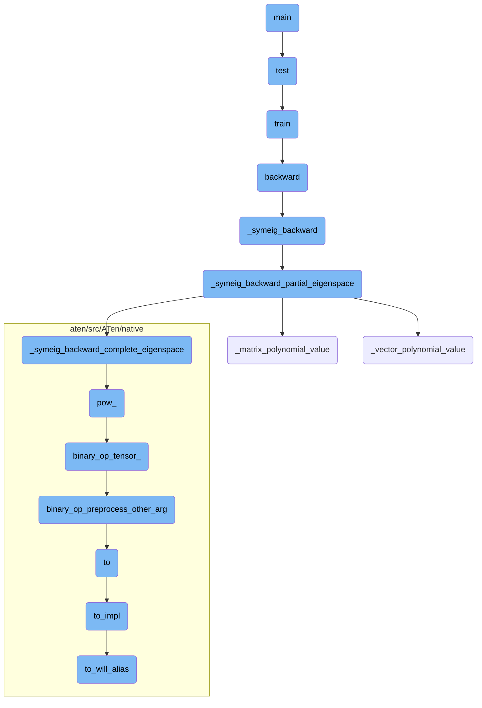
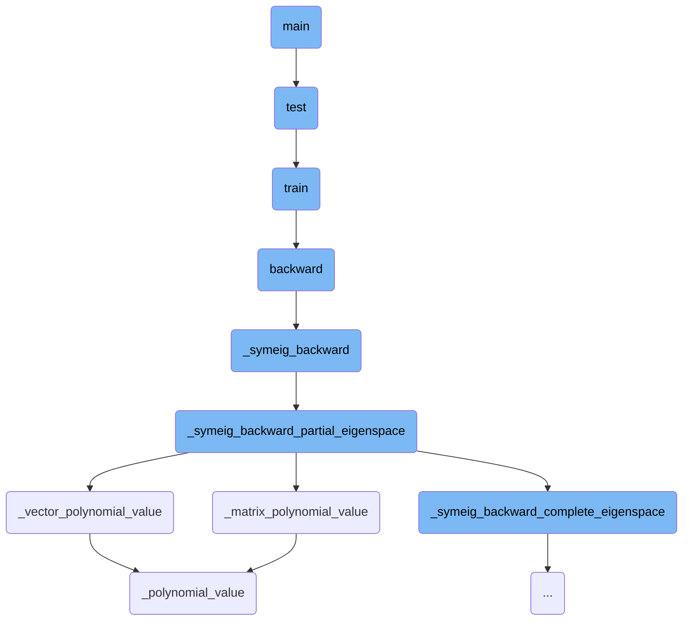

This document outlines the main function's flow, detailing the setup of command-line arguments, initialization of a neural network, and the training and testing process.

The main function starts by setting up command-line arguments to configure the meta-learning task. It then initializes a neural network with several layers, including convolutional and fully connected layers. The function enters a loop to train and test the model over multiple epochs, logging and plotting the results for analysis.

Here is a high level diagram of the flow, showing only the most important functions:



# Flow drill down

First, we'll zoom into this section of the flow:



<SwmSnippet path="/functorch/examples/maml_omniglot/maml-omniglot-higher.py" line="51">

---

## Setting up the argument parser

The `main` function begins by setting up an argument parser using `argparse.ArgumentParser()`. This parser is used to define and parse command-line arguments such as `n-way`, `k-spt`, `k-qry`, `device`, `task-num`, and `seed`. These arguments are essential for configuring the meta-learning task, including the number of classes (`n-way`), the number of support and query samples (`k-spt` and `k-qry`), the device to run on (`device`), the number of tasks in a batch (`task-num`), and the random seed (`seed`).

```python
    argparser = argparse.ArgumentParser()
    argparser.add_argument("--n-way", "--n_way", type=int, help="n way", default=5)
    argparser.add_argument(
        "--k-spt", "--k_spt", type=int, help="k shot for support set", default=5
    )
    argparser.add_argument(
        "--k-qry", "--k_qry", type=int, help="k shot for query set", default=15
    )
    argparser.add_argument("--device", type=str, help="device", default="cuda")
    argparser.add_argument(
        "--task-num",
        "--task_num",
        type=int,
        help="meta batch size, namely task num",
        default=32,
    )
    argparser.add_argument("--seed", type=int, help="random seed", default=1)
    args = argparser.parse_args()
```

---

</SwmSnippet>

<SwmSnippet path="/functorch/examples/maml_omniglot/maml-omniglot-higher.py" line="87">

---

## Initializing the neural network

The `main` function proceeds to initialize a neural network using `nn.Sequential`. This network consists of several convolutional layers, batch normalization layers, ReLU activations, and max-pooling layers. The final layer is a fully connected layer that outputs the logits for the `n-way` classification task. This network will later be used for meta-learning, where its parameters will be adapted to different tasks.

```python
    # Create a vanilla PyTorch neural network that will be
    # automatically monkey-patched by higher later.
    # Before higher, models could *not* be created like this
    # and the parameters needed to be manually updated and copied
    # for the updates.
    net = nn.Sequential(
        nn.Conv2d(1, 64, 3),
        nn.BatchNorm2d(64, momentum=1, affine=True),
        nn.ReLU(inplace=True),
        nn.MaxPool2d(2, 2),
        nn.Conv2d(64, 64, 3),
        nn.BatchNorm2d(64, momentum=1, affine=True),
        nn.ReLU(inplace=True),
        nn.MaxPool2d(2, 2),
        nn.Conv2d(64, 64, 3),
        nn.BatchNorm2d(64, momentum=1, affine=True),
        nn.ReLU(inplace=True),
        nn.MaxPool2d(2, 2),
        Flatten(),
        nn.Linear(64, args.n_way),
    ).to(device)
```

---

</SwmSnippet>

<SwmSnippet path="/functorch/examples/maml_omniglot/maml-omniglot-higher.py" line="114">

---

## Training and Testing

The `main` function then enters a loop that runs for a specified number of epochs (100 in this case). In each epoch, it calls the `train` function to train the model on the support set and the `test` function to evaluate the model on the query set. The results are logged and plotted for analysis.

```python
    for epoch in range(100):
        train(db, net, device, meta_opt, epoch, log)
        test(db, net, device, epoch, log)
        plot(log)
```

---

</SwmSnippet>

Now, lets zoom into this section of the flow:

```mermaid
graph TD;
      subgraph atensrcATennative["aten/src/ATen/native"]
41ebae70b68478483abbf1879d852d73064245d5136cd744623638d313c9936f(_symeig_backward_complete_eigenspace):::mainFlowStyle --> 6e90c70c8976a3088372a7eff81c4c012e668abde0f39c3bb427fc647494413e(pow_):::mainFlowStyle
end

subgraph atensrcATennative["aten/src/ATen/native"]
6e90c70c8976a3088372a7eff81c4c012e668abde0f39c3bb427fc647494413e(pow_):::mainFlowStyle --> 746bc7ea4da6b6d428c2f87aab9883da73320198e1c281f45a2783d68a45275a(binary_op_tensor_):::mainFlowStyle
end

subgraph atensrcATennative["aten/src/ATen/native"]
746bc7ea4da6b6d428c2f87aab9883da73320198e1c281f45a2783d68a45275a(binary_op_tensor_):::mainFlowStyle --> 2998c72de11092e45b8b7f217cfa60561f23a9338417f4895f77a359ad39855f(binary_op_preprocess_other_arg):::mainFlowStyle
end

subgraph atensrcATennative["aten/src/ATen/native"]
2998c72de11092e45b8b7f217cfa60561f23a9338417f4895f77a359ad39855f(binary_op_preprocess_other_arg):::mainFlowStyle --> bb7719c77d2cefb1b8a50cd80e92a322fa483d55f0c953b7e0b214fa58e6da6f(to):::mainFlowStyle
end

subgraph atensrcATennative["aten/src/ATen/native"]
bb7719c77d2cefb1b8a50cd80e92a322fa483d55f0c953b7e0b214fa58e6da6f(to):::mainFlowStyle --> b45ae6d7af4490a12513853ac6ee0c1f051818bc7d9a6e98d6cf5e983a482d38(to_impl):::mainFlowStyle
end

subgraph atensrcATennative["aten/src/ATen/native"]
b45ae6d7af4490a12513853ac6ee0c1f051818bc7d9a6e98d6cf5e983a482d38(to_impl):::mainFlowStyle --> feb53be770826b581f11d5c5067652460fd090707bc110d856720d44c46eb217(to_will_alias):::mainFlowStyle
end


      classDef mainFlowStyle color:#000000,fill:#7CB9F4
classDef rootsStyle color:#000000,fill:#00FFF4
classDef Style1 color:#000000,fill:#00FFAA
classDef Style2 color:#000000,fill:#FFFF00
classDef Style3 color:#000000,fill:#AA7CB9
```



<SwmSnippet path="/torch/_lobpcg.py" line="17">

---

## \_symeig_backward_complete_eigenspace

The function `_symeig_backward_complete_eigenspace` is responsible for computing the gradient of the symmetric eigenvalue decomposition. It calculates a matrix `F` where each element is the inverse of the difference between eigenvalues, except for the diagonal elements which are set to infinity. This matrix `F` is then used to compute the gradient of the input matrix `A` by performing a series of matrix multiplications involving the gradients of the eigenvalues (`D_grad`) and eigenvectors (`U_grad`).

```python
    # compute F, such that F_ij = (d_j - d_i)^{-1} for i != j, F_ii = 0
    F = D.unsqueeze(-2) - D.unsqueeze(-1)
    F.diagonal(dim1=-2, dim2=-1).fill_(float("inf"))
    F.pow_(-1)

    # A.grad = U (D.grad + (U^T U.grad * F)) U^T
    Ut = U.mT.contiguous()
    res = torch.matmul(
        U, torch.matmul(torch.diag_embed(D_grad) + torch.matmul(Ut, U_grad) * F, Ut)
    )

    return res
```

---

</SwmSnippet>

<SwmSnippet path="/aten/src/ATen/native/vulkan/ops/BinaryOp.cpp" line="537">

---

## pow\_

The `pow_` function performs an in-place power operation on a Vulkan tensor. It delegates the actual computation to the `binary_op_tensor_` function, passing along the necessary parameters including the Vulkan kernel for the power operation.

```c++
Tensor& pow_(Tensor& self, const Tensor& other) {
  return binary_op_tensor_(
      self, other, std::optional<Scalar>(), VK_KERNEL(pow_inplace));
}
```

---

</SwmSnippet>

<SwmSnippet path="/aten/src/ATen/native/vulkan/ops/BinaryOp.cpp" line="313">

---

## binary_op_tensor\_

The `binary_op_tensor_` function handles in-place binary operations on Vulkan tensors. It ensures that the dimensions of the input tensors are compatible and that the operation is performed on Vulkan tensors. The function prepares the necessary parameters and submits a compute job to the Vulkan context to execute the binary operation.

```c++
Tensor& binary_op_tensor_(
    Tensor& self_arg,
    const Tensor& other_arg,
    const std::optional<Scalar>& alpha_arg,
    const api::ShaderInfo& shader_descriptor) {
  TORCH_CHECK(
      get_dim<Dim4D::Batch>(self_arg) >= get_dim<Dim4D::Batch>(other_arg) &&
          get_dim<Dim4D::Channel>(self_arg) >=
              get_dim<Dim4D::Channel>(other_arg) &&
          get_dim<Dim4D::Height>(self_arg) >=
              get_dim<Dim4D::Height>(other_arg) &&
          get_dim<Dim4D::Width>(self_arg) >= get_dim<Dim4D::Width>(other_arg),
      "Dimensions of input tensor to Vulkan in-place binary elementwise op "
      "must be less than or equal the dimensions of the underlying tensor.");

  utils::is_broadcastable(self_arg, other_arg);

  TORCH_CHECK(
      self_arg.is_vulkan(),
      "Vulkan: In-place operator is only supported on Vulkan tensors.");

```

---

</SwmSnippet>

<SwmSnippet path="/aten/src/ATen/native/vulkan/ops/BinaryOp.cpp" line="69">

---

## binary_op_preprocess_other_arg

The `binary_op_preprocess_other_arg` function preprocesses the second argument for binary operations on Vulkan tensors. It converts integer tensors to float tensors if necessary and ensures that the tensor is moved to Vulkan before the operation.

```c++
Tensor binary_op_preprocess_other_arg(const Tensor& other_arg) {
  // Similar to binary_op_scalar where tensors is mapped to float, we
  // also map known integer types (but not quant types) tensor to float.

  // Such conversion can only to be done before moving to vulkan, since vulkan
  // doesn't yet support integer types.
  Tensor other = other_arg;
  if (!other.is_vulkan()) {
    switch (other.scalar_type()) {
      case at::kByte:
      case at::kChar:
      case at::kShort:
      case at::kInt:
      case at::kLong:
      case at::kDouble:
        other = other.to(kFloat);
        break;
      case at::kFloat:
        // No op for expected type.
        break;
      default:
```

---

</SwmSnippet>

<SwmSnippet path="/aten/src/ATen/native/TensorConversions.cpp" line="472">

---

## to

The `to` function is a high-level API for converting a tensor to a specified data type, layout, device, and memory format. It calls the `to_impl` function to perform the actual conversion.

```c++
Tensor to(
  const Tensor& self,
    std::optional<ScalarType> dtype,
    std::optional<Layout> layout,
    std::optional<Device> device,
    std::optional<bool> pin_memory,
  bool non_blocking,
  bool copy,
  std::optional<c10::MemoryFormat> optional_memory_format
) {
  return to_impl(
      self,
      dtype,
      layout,
      ensure_has_index(device),
      pin_memory,
      non_blocking,
      copy,
      optional_memory_format);
}
```

---

</SwmSnippet>

<SwmSnippet path="/aten/src/ATen/native/TensorConversions.cpp" line="417">

---

## to_impl

The `to_impl` function performs the actual conversion of a tensor to the specified data type, layout, device, and memory format. It first checks if the conversion can be done by aliasing the existing tensor using the `to_will_alias` function. If not, it performs a copy of the tensor with the new specifications.

```c++
static inline Tensor to_impl(
    const Tensor& self,
    std::optional<ScalarType> dtype,
    std::optional<Layout> layout,
    std::optional<Device> device,
    std::optional<bool> pin_memory,
    bool non_blocking,
    bool copy,
    std::optional<c10::MemoryFormat> optional_memory_format) {

  // fast path
  if (to_will_alias(self, dtype, layout, device, copy, optional_memory_format)) {
    return self;
  }
  return at::_to_copy(
      self, dtype, layout, device, pin_memory, non_blocking, optional_memory_format);
}
```

---

</SwmSnippet>

<SwmSnippet path="/aten/src/ATen/native/TensorConversions.cpp" line="400">

---

## to_will_alias

The `to_will_alias` function checks if the conversion of a tensor can be done by aliasing the existing tensor. It compares the current properties of the tensor with the desired properties and returns true if they match, indicating that no actual data copy is needed.

```c++
bool to_will_alias(
    const Tensor& self,
    std::optional<ScalarType> dtype,
    std::optional<Layout> layout,
    std::optional<Device> device,
    bool copy,
    std::optional<c10::MemoryFormat> optional_memory_format) {
  auto memory_format = optional_memory_format.value_or(MemoryFormat::Preserve);

  return is_null_or_equal_to(dtype, self.dtype().toScalarType()) &&
    is_null_or_equal_to(layout, self.layout()) &&
    is_null_or_equal_to(device, self.device()) &&
    !copy &&
    (memory_format == MemoryFormat::Preserve ||
     self.suggest_memory_format() == memory_format);
}
```

---

</SwmSnippet>

&nbsp;

*This is an auto-generated document by Swimm AI 🌊 and has not yet been verified by a human*

<SwmMeta version="3.0.0" repo-id="Z2l0aHViJTNBJTNBcHl0b3JjaC1hdXRvZG9jcy1kZW1vJTNBJTNBU3dpbW0tRGVtbw==" repo-name="pytorch-autodocs-demo"><sup>Powered by [Swimm](https://app.swimm.io/)</sup></SwmMeta>
