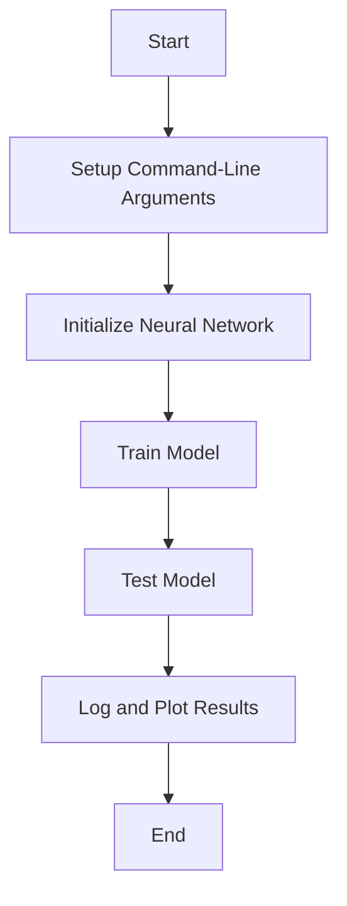

This document will cover the main function flow in the context of initializing and training a neural network for a meta-learning task. We'll cover:

1. Setting up command-line arguments
2. Initializing the neural network
3. Training and testing the model.

Technical document: <SwmLink doc-title="Main Function Flow">[Main Function Flow](/.swm/main-function-flow.grv4yeag.sw.md)</SwmLink>

# [Setting up Command-Line Arguments](https://app.swimm.io/repos/Z2l0aHViJTNBJTNBcHl0b3JjaC1hdXRvZG9jcy1kZW1vJTNBJTNBU3dpbW0tRGVtbw==/docs/grv4yeag#setting-up-the-argument-parser)

The main function begins by setting up command-line arguments to configure the meta-learning task. These arguments include:

- **n-way**: Number of classes for the classification task.
- **k-spt**: Number of support samples per class.
- **k-qry**: Number of query samples per class.
- **device**: The device to run the task on (e.g., CPU or GPU).
- **task-num**: Number of tasks in a batch.
- **seed**: Random seed for reproducibility.

These arguments allow users to customize the meta-learning task according to their specific needs, ensuring flexibility and control over the training process.

# [Initializing the Neural Network](https://app.swimm.io/repos/Z2l0aHViJTNBJTNBcHl0b3JjaC1hdXRvZG9jcy1kZW1vJTNBJTNBU3dpbW0tRGVtbw==/docs/grv4yeag#initializing-the-neural-network)

Next, the main function initializes a neural network. This network consists of several layers, including convolutional layers, batch normalization layers, ReLU activations, and max-pooling layers. The final layer is a fully connected layer that outputs the logits for the n-way classification task. This neural network will be used for meta-learning, where its parameters will be adapted to different tasks. The initialization ensures that the network is ready for training and testing, providing a structured and efficient model for the meta-learning process.

# [Training and Testing the Model](https://app.swimm.io/repos/Z2l0aHViJTNBJTNBcHl0b3JjaC1hdXRvZG9jcy1kZW1vJTNBJTNBU3dpbW0tRGVtbw==/docs/grv4yeag#training-and-testing)

The main function then enters a loop that runs for a specified number of epochs (100 in this case). During each epoch, the following steps occur:

1. **Train the Model**: The model is trained on the support set using the train function. This involves updating the model's parameters to minimize the loss on the support set.
2. **Test the Model**: The model is evaluated on the query set using the test function. This step assesses the model's performance and generalization to new tasks.
3. **Log and Plot Results**: The results of training and testing are logged and plotted for analysis. This provides insights into the model's performance over time and helps in identifying any issues or areas for improvement.

These steps ensure that the model is continuously improved and evaluated, providing a robust and effective meta-learning solution.

&nbsp;

*This is an auto-generated document by Swimm AI 🌊 and has not yet been verified by a human*

<SwmMeta version="3.0.0" repo-id="Z2l0aHViJTNBJTNBcHl0b3JjaC1hdXRvZG9jcy1kZW1vJTNBJTNBU3dpbW0tRGVtbw==" repo-name="pytorch-autodocs-demo">Powered by [Swimm](https://app.swimm.io/)</SwmMeta>
