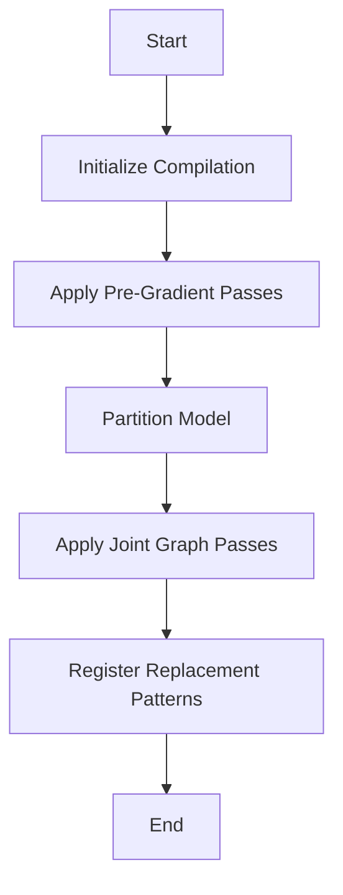

This document will cover the flow of compiling and optimizing a model using the `__call__` function. We'll cover:

1. Initializing the compilation process
2. Applying pre-gradient optimization passes
3. Partitioning the model for efficient computation
4. Applying joint graph passes
5. Registering replacement patterns.

Technical document: <SwmLink doc-title="Overview of the __call__ Flow">[Overview of the \__call_\_ Flow](/.swm/overview-of-the-__call__-flow.ynkr3or1.sw.md)</SwmLink>

# [Initializing the Compilation Process](https://app.swimm.io/repos/Z2l0aHViJTNBJTNBcHl0b3JjaC1hdXRvZG9jcy1kZW1vJTNBJTNBU3dpbW0tRGVtbw==/docs/ynkr3or1#__call__)

The compilation process begins when a model and its inputs are passed to the `__call__` function. This function initiates the compilation by calling the `compile_fx` function. The purpose of this step is to prepare the model for optimization and execution by setting up the necessary configurations and inputs.

# [Applying Pre-Gradient Optimization Passes](https://app.swimm.io/repos/Z2l0aHViJTNBJTNBcHl0b3JjaC1hdXRvZG9jcy1kZW1vJTNBJTNBU3dpbW0tRGVtbw==/docs/ynkr3or1#_recursive_pre_grad_passes)

The next step involves applying pre-gradient optimization passes to the model. This is done by the `_recursive_pre_grad_passes` function, which processes each subgraph within the model. These passes include normalization, fusion, and removal of unnecessary operations to optimize the graph for performance. The goal is to ensure that the model is in its most efficient form before gradient computations are performed.

# [Partitioning the Model for Efficient Computation](https://app.swimm.io/repos/Z2l0aHViJTNBJTNBcHl0b3JjaC1hdXRvZG9jcy1kZW1vJTNBJTNBU3dpbW0tRGVtbw==/docs/ynkr3or1#min_cut_rematerialization_partition)

The `min_cut_rematerialization_partition` function partitions the model's graph into forward and backward graphs. This partitioning helps in trading off memory bandwidth with computation by recomputing parts of the forward graph during the backward pass. The purpose of this step is to optimize the model's memory usage and computational efficiency during training.

# [Applying Joint Graph Passes](https://app.swimm.io/repos/Z2l0aHViJTNBJTNBcHl0b3JjaC1hdXRvZG9jcy1kZW1vJTNBJTNBU3dpbW0tRGVtbw==/docs/ynkr3or1#joint_graph_passes)

The `joint_graph_passes` function applies various transformations to the joint forward and backward graph. These transformations include custom pre and post passes, removal of no-op operations, constant folding, and replacement of random passes. The goal is to ensure that the graph is topologically sorted and optimized for both forward and backward computations.

# [Registering Replacement Patterns](https://app.swimm.io/repos/Z2l0aHViJTNBJTNBcHl0b3JjaC1hdXRvZG9jcy1kZW1vJTNBJTNBU3dpbW0tRGVtbw==/docs/ynkr3or1#gen_register_replacement)

The final step involves registering replacement patterns for various operations within the model. The `gen_register_replacement` function ensures that example inputs are materialized and checks for precompiled patterns. It then calls `register_replacement` to complete the registration. This step is crucial for optimizing code generation and ensuring safe indexing during model execution.

&nbsp;

*This is an auto-generated document by Swimm AI 🌊 and has not yet been verified by a human*

<SwmMeta version="3.0.0" repo-id="Z2l0aHViJTNBJTNBcHl0b3JjaC1hdXRvZG9jcy1kZW1vJTNBJTNBU3dpbW0tRGVtbw==" repo-name="pytorch-autodocs-demo">Powered by [Swimm](https://app.swimm.io/)</SwmMeta>
