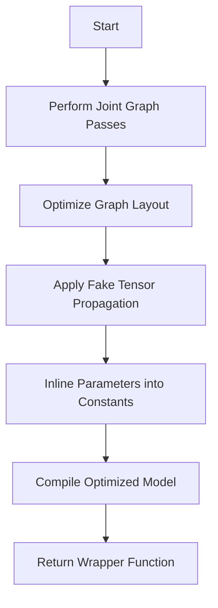

This document will cover the Model Freezing Process, which includes:

1. Performing joint graph passes
2. Optimizing the graph layout
3. Applying fake tensor propagation
4. Inlining parameters into constants
5. Compiling the optimized model

Technical document: <SwmLink doc-title="Model Freezing Process">[Model Freezing Process](/.swm/model-freezing-process.o7k3h4ay.sw.md)</SwmLink>

# [Performing Joint Graph Passes](https://app.swimm.io/repos/Z2l0aHViJTNBJTNBcHl0b3JjaC1hdXRvZG9jcy1kZW1vJTNBJTNBU3dpbW0tRGVtbw==/docs/o7k3h4ay#_recursive_joint_graph_passes)

The process begins with performing joint graph passes on the model. This step ensures that all subgraphs within the model are transformed consistently. By applying the same transformations across all subgraphs, we maintain uniformity and coherence in the model's structure, which is essential for subsequent optimization steps.

# [Optimizing the Graph Layout](https://app.swimm.io/repos/Z2l0aHViJTNBJTNBcHl0b3JjaC1hdXRvZG9jcy1kZW1vJTNBJTNBU3dpbW0tRGVtbw==/docs/o7k3h4ay#fw_compiler_freezing)

Next, the process involves deciding on the best layout for the graph to optimize its performance. This step is crucial as it determines the most efficient way to arrange the operations within the graph, which can significantly impact the model's execution speed and resource utilization.

# [Applying Fake Tensor Propagation](https://app.swimm.io/repos/Z2l0aHViJTNBJTNBcHl0b3JjaC1hdXRvZG9jcy1kZW1vJTNBJTNBU3dpbW0tRGVtbw==/docs/o7k3h4ay#fw_compiler_freezing)

Fake tensor propagation is applied to ensure that the metadata for all nodes in the graph is correctly set. This step is necessary for the accurate simulation of tensor operations, which helps in identifying potential issues and optimizing the graph further.

# [Inlining Parameters into Constants](https://app.swimm.io/repos/Z2l0aHViJTNBJTNBcHl0b3JjaC1hdXRvZG9jcy1kZW1vJTNBJTNBU3dpbW0tRGVtbw==/docs/o7k3h4ay#freeze)

In this step, parameters that are not expected to change (mutate) are inlined into constants. This means that these parameters are converted into fixed values within the graph, which simplifies the graph and allows for more aggressive optimization techniques such as constant propagation and common subexpression elimination.

# [Compiling the Optimized Model](https://app.swimm.io/repos/Z2l0aHViJTNBJTNBcHl0b3JjaC1hdXRvZG9jcy1kZW1vJTNBJTNBU3dpbW0tRGVtbw==/docs/o7k3h4ay#fw_compiler_freezing)

Finally, the optimized model is compiled. This involves generating a function that can handle the inputs and outputs of the model correctly. The compilation step ensures that the model is ready for efficient execution, taking advantage of all the optimizations applied in the previous steps.

&nbsp;

*This is an auto-generated document by Swimm AI 🌊 and has not yet been verified by a human*

<SwmMeta version="3.0.0" repo-id="Z2l0aHViJTNBJTNBcHl0b3JjaC1hdXRvZG9jcy1kZW1vJTNBJTNBU3dpbW0tRGVtbw==" repo-name="pytorch-autodocs-demo">Powered by [Swimm](https://app.swimm.io/)</SwmMeta>
