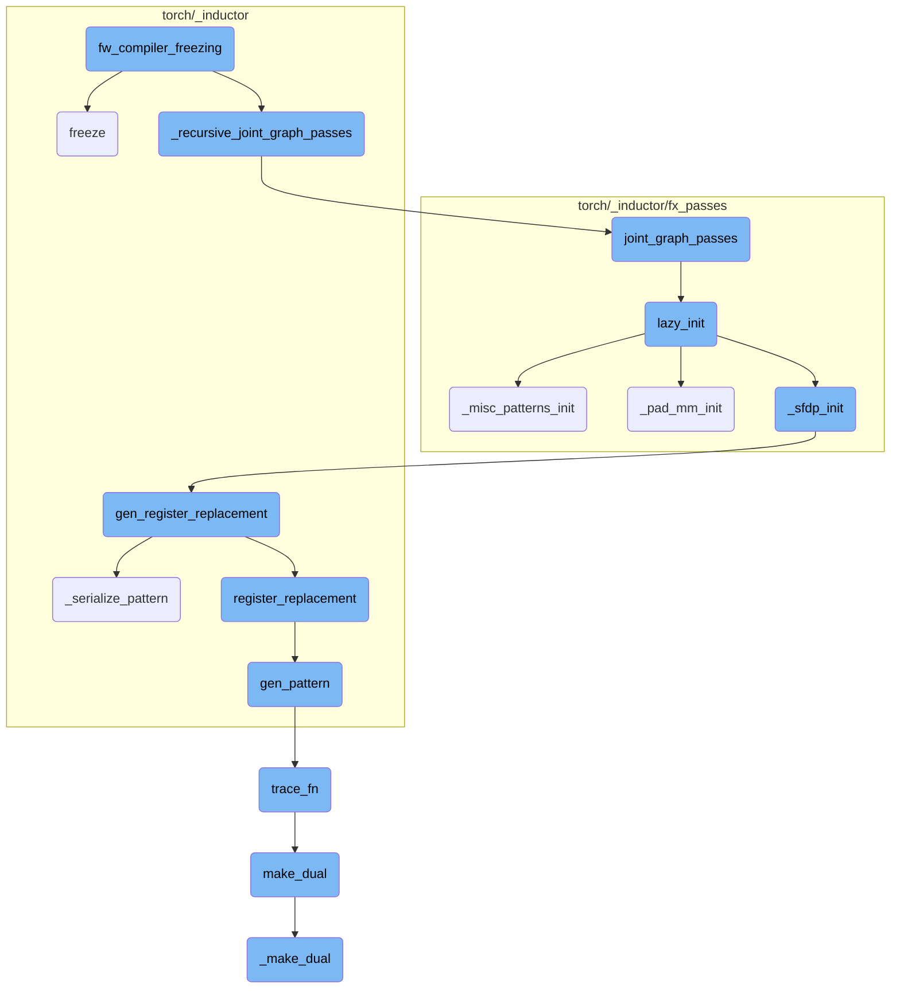
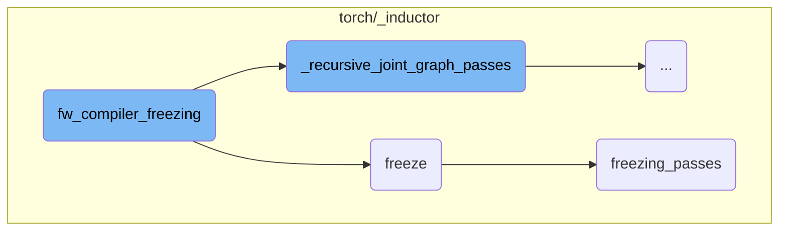
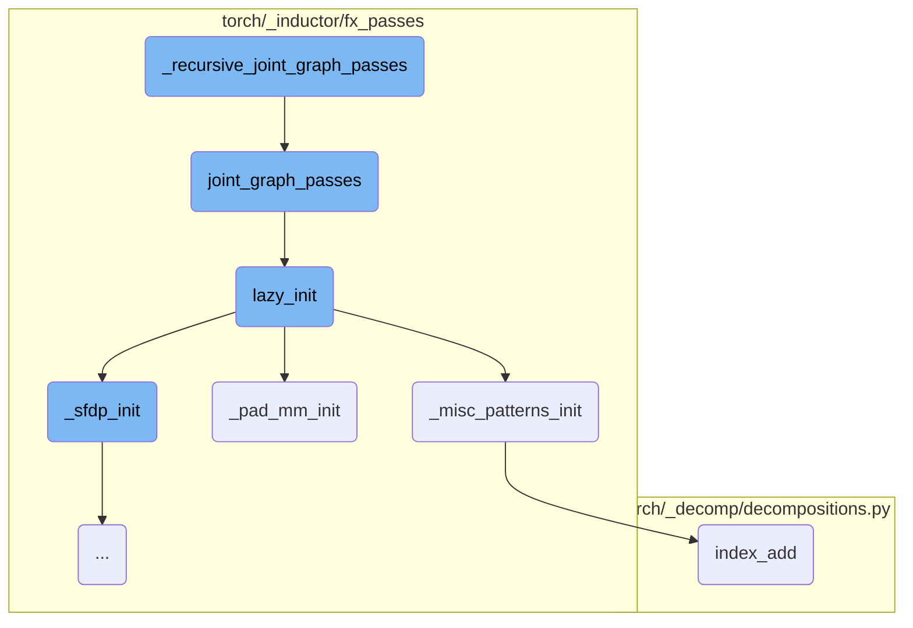
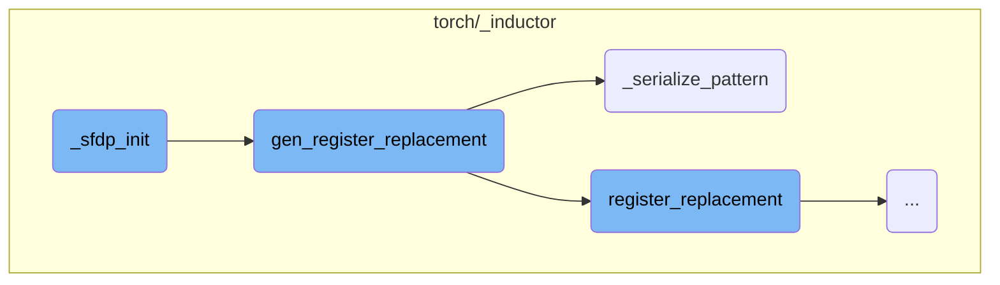
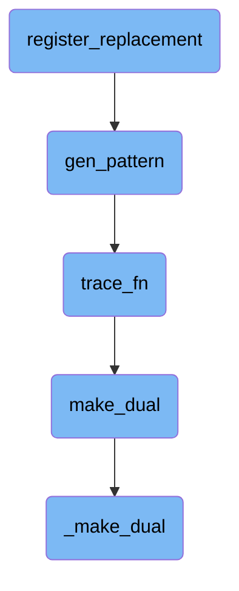

This document explains the process of freezing a model using the `fw_compiler_freezing` function. The process involves several steps, including performing joint graph passes, optimizing the graph layout, applying fake tensor propagation, and inlining parameters into constants. The final step is compiling the optimized model and returning a wrapper function to handle inputs and outputs correctly.

The freezing process starts by performing joint graph passes on the model to ensure all subgraphs are transformed consistently. Next, it decides on the best layout for optimization and applies fake tensor propagation if needed. The function then inlines parameters into constants and optimizes the graph. Finally, it compiles the optimized model and returns a function that correctly handles the inputs and outputs.

Here is a high level diagram of the flow, showing only the most important functions:



# Flow drill down

First, we'll zoom into this section of the flow:



<SwmSnippet path="/torch/_inductor/compile_fx.py" line="1152">

---

## fw_compiler_freezing

The `fw_compiler_freezing` function orchestrates the freezing process of a model. It starts by calling `_recursive_joint_graph_passes` to perform joint graph passes on the model. Then, it decides on the layout optimization and applies fake tensor propagation if needed. The function `freeze` is called to inline parameters into constants and optimize the graph. Finally, it compiles the optimized model using `inner_compile` and returns a wrapper function that handles the inputs and outputs correctly.

```python
def fw_compiler_freezing(
    aot_autograd_model: torch.fx.GraphModule,
    aot_example_inputs: List[torch.Tensor],
    dynamo_model: torch.fx.GraphModule,
    num_example_inputs: int,
    inner_compile: Callable[..., Any],
    cudagraphs: BoxedBool,
    graph_id: int,
    forward_device: BoxedDeviceIndex,
):
    from torch._inductor.freezing import convert_conv_weights_to_channels_last, freeze

    # partition_fn won't be called
    _recursive_joint_graph_passes(aot_autograd_model)

    layout_opt = GraphLowering.decide_layout_opt(aot_autograd_model, is_inference=True)
    if layout_opt:
        # make sure meta['val'] is properly setup
        fake_tensor_prop(aot_autograd_model, aot_example_inputs, True)
        convert_conv_weights_to_channels_last(aot_autograd_model)

```

---

</SwmSnippet>

<SwmSnippet path="/torch/_inductor/freezing.py" line="66">

---

## freeze

The `freeze` function inlines parameters that are not mutated into constants and optimizes the graph through constant propagation and other techniques. It converts view operations to reshape, replaces parameters with constants, and applies common subexpression elimination (CSE) to the graph. The function then calls `freezing_passes` to apply additional optimization passes and constant folding. If configured, it discards the original parameters for memory efficiency and logs the frozen graph.

```python
def freeze(
    dynamo_gm: torch.fx.GraphModule,
    aot_autograd_gm: torch.fx.GraphModule,
    example_inputs: List[torch._subclasses.FakeTensor],
) -> Tuple[torch.fx.GraphModule, List[int]]:
    """
    Inlines parameters that are not mutated into constants and optimizes the graph through constant propagation
    and other techniques. If enabled, the function also discards the original parameters of the module for memory efficiency.

    Assumes that this function is run in dynamo tracing post aot_autograd.

    Args:
        dynamo_gm (torch.fx.GraphModule): The Dynamo constructed GraphModule.
        aot_autograd_gm (torch.fx.GraphModule): The aot_autograd constructed GraphModule to be frozen.
        example_inputs (List[torch.Tensor]): A list of example input tensors to be used in the freezing process.

    Returns:
        Tuple[torch.fx.GraphModule, List[int]]: A tuple containing the frozen GraphModule and a list of indices
        of the inputs that were preserved (not turned into constants).
    """
    # We have convert conv's weight to channels last which may meet error for .view
```

---

</SwmSnippet>

<SwmSnippet path="/torch/_inductor/fx_passes/freezing_patterns.py" line="36">

---

## freezing_passes

The `freezing_passes` function applies a series of passes to the graph to optimize it for freezing. It initializes lazy operations, performs binary folding to remove unnecessary nodes, and applies constant folding multiple times. The function ensures that the metadata for all nodes is correctly set and applies various optimization patterns to the graph. It also handles CPU weight packing and performs a stable topological sort before recompiling and linting the graph.

```python
def freezing_passes(gm: torch.fx.GraphModule, aot_example_inputs):
    """
    Passes that are applied to the graph to freeze pass.
    """

    from ..freezing import constant_fold

    lazy_init()
    # We need a few rounds of binary folding to get rid of all the
    # unnecessary nodes, but may need a good method to chose the rounds number.
    # works like: conv+binary+binary.
    binary_folding = counters["inductor"]["binary_folding"]
    fake_tensor_prop(gm, aot_example_inputs, True)

    torch._inductor.fx_passes.binary_folding.mark_mixed_dtype_allowed_convs(gm)
    for _ in range(4):
        constant_fold(gm)
        # Make sure meta['val'] is properly set for all nodes
        fake_tensor_prop(gm, aot_example_inputs, True)
        binary_folding_pass.apply(gm.graph)  # type: ignore[arg-type]
        # If we don't have binary folding, we don't need to run the pass again.
```

---

</SwmSnippet>

Now, lets zoom into this section of the flow:



<SwmSnippet path="/torch/_inductor/compile_fx.py" line="275">

---

## \_recursive_joint_graph_passes

The function `_recursive_joint_graph_passes` is responsible for recursively applying the `joint_graph_passes` function to all subgraphs within a given graph module (`gm`). This ensures that all subgraphs undergo the necessary transformations defined in `joint_graph_passes`, maintaining consistency across the entire graph structure.

```python
    for subgraph_name in _get_subgraph_names(gm):
        subgraph = getattr(gm, subgraph_name)
        _recursive_joint_graph_passes(subgraph)
    joint_graph_passes(gm)
```

---

</SwmSnippet>

<SwmSnippet path="/torch/_inductor/fx_passes/joint_graph.py" line="434">

---

## joint_graph_passes

The `joint_graph_passes` function performs a series of transformations on the joint forwards and backwards graph. It initializes necessary components using `lazy_init`, applies custom pre and post passes if configured, removes no-op operations, performs constant folding, and applies pattern matching and random replacement passes. Finally, it sorts the graph topologically, checks for consistency, and recompiles it.

```python
def joint_graph_passes(graph: torch.fx.GraphModule):
    """
    Run FX transformations on the joint forwards+backwards graph.
    """
    lazy_init()
    count = 0
    if config.joint_custom_pre_pass is not None:
        with GraphTransformObserver(
            graph, "joint_custom_pre_pass", config.trace.log_url_for_graph_xform
        ):
            config.joint_custom_pre_pass(graph.graph)
            count += 1

    from .post_grad import remove_noop_ops

    remove_noop_ops(graph.graph)

    if config.joint_graph_constant_folding:
        with GraphTransformObserver(
            graph, "constant_fold_uniform_value", config.trace.log_url_for_graph_xform
        ):
```

---

</SwmSnippet>

<SwmSnippet path="/torch/_inductor/fx_passes/joint_graph.py" line="43">

---

### lazy_init

The `lazy_init` function initializes various components required for the graph transformations. It calls `_pad_mm_init`, `_sfdp_init`, and `_misc_patterns_init` to set up necessary patterns and replacements for the transformations.

```python
def lazy_init():
    from .fuse_attention import _sfdp_init
    from .misc_patterns import _misc_patterns_init
    from .pad_mm import _pad_mm_init

    _pad_mm_init()
    _sfdp_init()
    _misc_patterns_init()
```

---

</SwmSnippet>

<SwmSnippet path="/torch/_inductor/fx_passes/misc_patterns.py" line="16">

---

### \_misc_patterns_init

The `_misc_patterns_init` function registers replacement patterns for certain operations to optimize performance. For example, it replaces `index_add` operations with more efficient versions that use unsafe indexing and skip debug asserts, which can significantly speed up execution.

```python
def _misc_patterns_init():
    from .joint_graph import patterns as joint_graph_patterns
    from .post_grad import pass_patterns as post_grad_patterns_all

    post_grad_patterns = post_grad_patterns_all[1]  # medium priority

    if torch.cuda.is_available():
        # workaround https://github.com/pytorch/pytorch/issues/97894
        device = "cuda"
    else:
        device = "cpu"

    # These patterns do 2 things
    # 1. Since we know that index is completely unique, we can codegen it using
    # stores instead of atomic adds, which is quite a bit faster.
    # 2. Also, since we are guaranteed that they are completely within bounds,
    # we can use unsafe indexing and skip debug asserts
    def randperm_index_add_pattern(x, y):
        index = torch.randperm(x.shape[0], device=x.device)[: y.shape[0]]
        return torch.index_add(x, dim=0, source=y, index=index), index

```

---

</SwmSnippet>

<SwmSnippet path="/torch/_inductor/fx_passes/pad_mm.py" line="811">

---

### \_pad_mm_init

The `_pad_mm_init` function registers replacement patterns for matrix multiplication operations. It sets up initial traces with placeholder tensors and registers replacements for `mm`, `bmm`, and `addmm` operations, ensuring that these operations are optimized during both training and inference.

```python
def _pad_mm_init():
    from .joint_graph import patterns

    if torch.cuda.is_available():
        # workaround https://github.com/pytorch/pytorch/issues/97894
        device = "cuda"
    else:
        device = "cpu"

    # sizes/values dont actually matter for initial trace
    # once we get a possible match we re-trace with the actual values and verify the match still holds

    dim2a = functools.partial(torch.empty, (4, 4), device=device, requires_grad=True)
    dim2b = functools.partial(torch.empty, (4, 4), device=device, requires_grad=True)

    dim3a = functools.partial(torch.empty, (4, 4, 4), device=device, requires_grad=True)
    dim3b = functools.partial(torch.empty, (4, 4, 4), device=device, requires_grad=True)

    dim1a = functools.partial(torch.empty, (4), device=device, requires_grad=True)

    # workaround https://github.com/pytorch/pytorch/issues/97894
```

---

</SwmSnippet>

<SwmSnippet path="/torch/_decomp/decompositions.py" line="2588">

---

### index_add

The `index_add` function is a decomposition that performs an indexed addition operation on a tensor. It is used in the replacement patterns registered by `_misc_patterns_init` to provide a more efficient implementation of the `index_add` operation.

```python
def index_add(
    x: TensorLike,
    dim: int,
    index: TensorLike,
    tensor: TensorLike,
    *,
    alpha: NumberType = 1,
):
    return _index_add(x, dim, index, tensor, inplace=False, alpha=alpha)
```

---

</SwmSnippet>

Now, lets zoom into this section of the flow:



<SwmSnippet path="/torch/_inductor/fx_passes/fuse_attention.py" line="908">

---

## \_sfdp_init

The `_sfdp_init` function initializes the SFDP (Sparse Format Data Processing) patterns by iterating over the patterns obtained from `_get_sfdp_patterns` and calling `gen_register_replacement` for each pattern. This sets up the necessary replacements for the patterns.

```python
    for key, register_replacement_kwargs in _get_sfdp_patterns():
        gen_register_replacement(key, **register_replacement_kwargs)
```

---

</SwmSnippet>

<SwmSnippet path="/torch/_inductor/pattern_matcher.py" line="1478">

---

## gen_register_replacement

The `gen_register_replacement` function generates and registers a replacement pattern. If the `PYTORCH_GEN_PATTERNS` environment variable is set, it serializes the pattern using `_serialize_pattern`. Otherwise, it attempts to load a precompiled pattern module.

```python
    if "PYTORCH_GEN_PATTERNS" in os.environ:
        pat = _serialize_pattern(
            unique_name, search_fn, example_inputs, trace_fn, scalar_workaround
        )
```

---

</SwmSnippet>

<SwmSnippet path="/torch/_inductor/pattern_matcher.py" line="1374">

---

## \_serialize_pattern

The `_serialize_pattern` function serializes a given pattern by generating a Python file with the pattern's details. This file includes necessary imports and the pattern itself, which can be used for later reference or optimization.

```python
def _serialize_pattern(
    unique_name: str,
    search_fn: SearchFn,
    example_inputs: Iterable[Any],
    trace_fn: TraceFn,
    scalar_workaround: Union[Dict[str, Union[float, int]], None],
) -> PatternExpr:
    def get_file_template() -> str:
        auto_generated_msg = textwrap.dedent(
            """\
            # This is an auto-generated file. Please do not modify it by hand.
            # To re-generate, run:
            # cd ~/pytorch && python torchgen/fuse/gen_patterns.py
            """
```

---

</SwmSnippet>

Now, lets zoom into this section of the flow:



<SwmSnippet path="/torch/_inductor/pattern_matcher.py" line="1220">

---

## register_replacement

The `register_replacement` function is responsible for registering a replacement pattern in the pattern matcher. This function ensures that the shapes are correctly matched by running an initial match with `ignore_types` set to include integers and other types that might be burned into the pattern.

```python
    def check_fn(match: Match) -> bool:
        """
        Often shapes get burned into the pattern, so our initial match ran with
        `ignore_types=(int, ...)`.
```

---

</SwmSnippet>

<SwmSnippet path="/torch/_inductor/pattern_matcher.py" line="1274">

---

The `search_fn_new` function within `register_replacement` adjusts the arguments for the search function to ensure they match the expected input format.

```python
                    def search_fn_new(*args_new: Any) -> Any:
                        return search_fn(*args_new[len(args_new) - len(args) :])
```

---

</SwmSnippet>

<SwmSnippet path="/torch/_inductor/pattern_matcher.py" line="1326">

---

The `normalize_args` function within `register_replacement` normalizes the arguments by extracting them from the keyword arguments and appending them to a list in the correct order.

```python
    def normalize_args(**kwargs: Any) -> List[Any]:
        args = []
        for name in argnames_static:
            args.append(kwargs.pop(name))
```

---

</SwmSnippet>

&nbsp;

*This is an auto-generated document by Swimm AI 🌊 and has not yet been verified by a human*

<SwmMeta version="3.0.0" repo-id="Z2l0aHViJTNBJTNBcHl0b3JjaC1hdXRvZG9jcy1kZW1vJTNBJTNBU3dpbW0tRGVtbw==" repo-name="pytorch-autodocs-demo"><sup>Powered by [Swimm](https://app.swimm.io/)</sup></SwmMeta>
