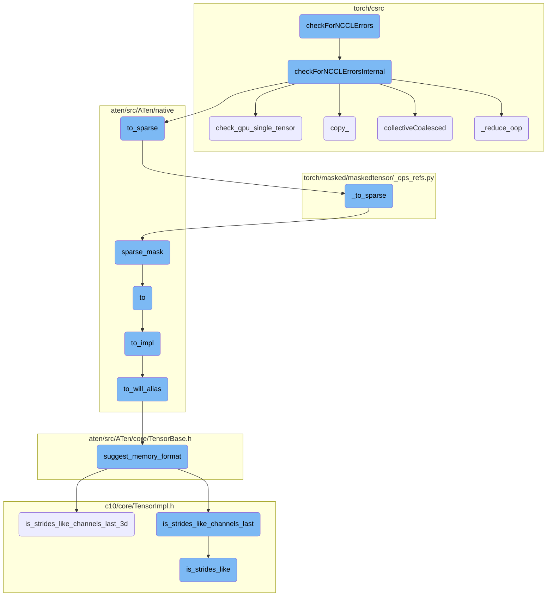
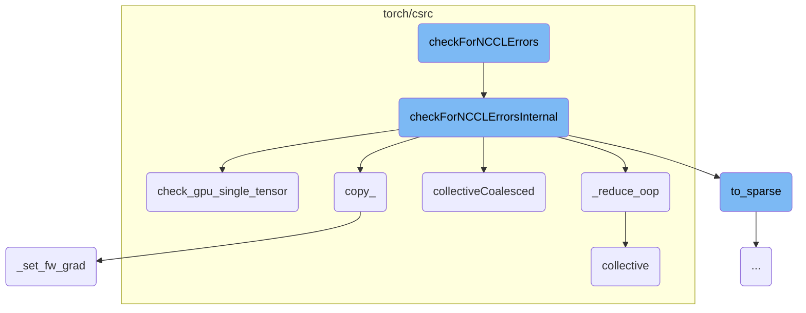
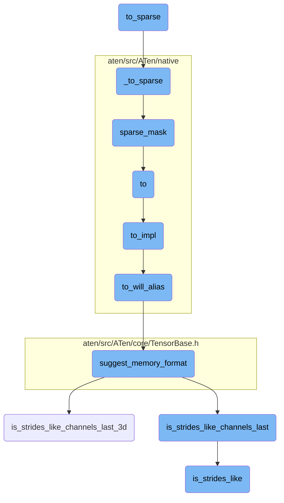

This document provides an overview of the error-checking process for NCCL operations. It outlines the main functions involved and their roles in ensuring that any errors in the NCCL communication are caught and handled appropriately.

The error-checking process for NCCL operations starts with initiating the error check, which then calls an internal function to perform the actual error verification. This internal function checks the status of NCCL communicators and captures any errors. If an error is detected, it is reported and handled to maintain the integrity of distributed operations. The process also involves validating GPU tensors to ensure they meet the requirements for NCCL operations, copying tensors while maintaining gradient information, and managing collective operations to optimize communication.

Here is a high level diagram of the flow, showing only the most important functions:



# Flow drill down

First, we'll zoom into this section of the flow:



<SwmSnippet path="/torch/csrc/distributed/c10d/ProcessGroupNCCL.cpp" line="1939">

---

## checkForNCCLErrors

The `checkForNCCLErrors` function initiates the error-checking process for NCCL operations by calling `checkForNCCLErrorsInternal`. This function is crucial for ensuring that any errors in the NCCL communication are caught and handled appropriately.

```c++
std::exception_ptr ProcessGroupNCCL::checkForNCCLErrors(
    std::shared_ptr<NCCLComm>& ncclComm) {
  return checkForNCCLErrorsInternal(ncclComm);
}
```

---

</SwmSnippet>

<SwmSnippet path="/torch/csrc/distributed/c10d/ProcessGroupNCCL.cpp" line="1944">

---

## checkForNCCLErrorsInternal

The `checkForNCCLErrorsInternal` function performs the actual error-checking for NCCL operations. It verifies the status of NCCL communicators and ensures that any errors are captured and reported. This function is essential for maintaining the integrity of distributed operations using NCCL.

```c++
std::exception_ptr ProcessGroupNCCL::checkForNCCLErrorsInternal(
    std::shared_ptr<NCCLComm>& ncclComm) {
  // Prioritize commFailureReason over checkForNcclError() result if
  // commFailureReason is set.
  auto commFailureReason = ncclComm->getNcclCommFailureReason();
  if (commFailureReason != std::nullopt) {
    return std::make_exception_ptr(C10_BUILD_ERROR(
        DistBackendError,
        c10::str(
            "NCCL communicator encountered error set by ProcessGroupNCCL: ",
            *commFailureReason)));
  }
  ncclResult_t ncclAsyncErr = ncclComm->checkForNcclError();
  // When nonblocking mode is enabled by TORCH_NCCL_USE_COMM_NONBLOCKING,
  // ncclInProgress could be returned when there are pending NCCL calls.
  // In this case, no exception should be thrown
#ifdef NCCL_HAS_COMM_NONBLOCKING
  // ncclInProgress is defined only if NCCL_HAS_COMM_NONBLOCKING is defined
  if (ncclAsyncErr != ncclSuccess && ncclAsyncErr != ncclInProgress) {
#else
  if (ncclAsyncErr != ncclSuccess) {
```

---

</SwmSnippet>

<SwmSnippet path="/torch/csrc/distributed/c10d/ProcessGroupNCCL.cpp" line="2317">

---

## check_gpu_single_tensor

The `check_gpu_single_tensor` function validates a single GPU tensor to ensure it meets the requirements for NCCL operations. It checks if the tensor is on a CUDA device, is dense, and is contiguous. This validation is necessary to prevent errors during NCCL communication.

```c++
// Check validity of tensor
void check_gpu_single_tensor(
    const at::Tensor& tensor,
    const bool p2p = false // whether operation is a P2P operation
) {
  if (!tensor.is_cuda() || tensor.is_sparse()) {
    C10_THROW_ERROR(ValueError, "Tensors must be CUDA and dense");
  }
  // Skip the following requirements for P2P operations
  if (!tensor.is_contiguous(tensor.suggest_memory_format())) {
    if (p2p) {
      TORCH_WARN_ONCE(
          "Detected non-contiguous tensor in P2P operations. It is user "
          "responsibility to guarantee that source and destination tensors have "
          "the same contiguity format.");
    } else {
      C10_THROW_ERROR(ValueError, "Tensors must be contiguous");
    }
  }
}
```

---

</SwmSnippet>

<SwmSnippet path="/torch/csrc/autograd/VariableTypeManual.cpp" line="189">

---

## copy\_

The `copy_` function performs an in-place copy of one tensor to another. It handles the autograd metadata and ensures that the forward gradients are correctly set. This function is important for tensor operations that require copying data while maintaining gradient information.

```c++
// We don't have an outplace copy, so this can't be generated automatically
Tensor& copy_(
    c10::DispatchKeySet ks,
    Tensor& self,
    const Tensor& src,
    bool non_blocking) {
  // TODO: once copy is exposed in Declarations.yaml we may be able to bind
  // it automatically
  auto& self_ = unpack(self, "self", 0);
  auto& src_ = unpack(src, "src", 1);
  std::shared_ptr<CopyBackwards> grad_fn;
  auto requires_grad = compute_requires_grad(self, src);
  requires_grad &= isDifferentiableType(self.scalar_type());
  check_inplace(self, requires_grad);
  if (requires_grad) {
    grad_fn = std::make_shared<CopyBackwards>();
    grad_fn->set_next_edges(collect_next_edges(self, src));
    grad_fn->src_options = src.options();
  }
  {
    at::AutoDispatchBelowAutograd mode;
```

---

</SwmSnippet>

<SwmSnippet path="/torch/csrc/distributed/c10d/ProcessGroupNCCL.cpp" line="2763">

---

## collectiveCoalesced

The `collectiveCoalesced` function handles coalesced collective operations in NCCL. It manages multiple tensors in a single collective call, optimizing the communication by reducing the number of individual calls. This function is crucial for improving the performance of collective operations in distributed training.

```c++
c10::intrusive_ptr<Work> ProcessGroupNCCL::collectiveCoalesced(
    std::vector<at::Tensor>& inputs,
    std::vector<at::Tensor>& outputs,
    Fn fn,
    OpType opType,
    const char* profilingTitle,
    bool avoidRecordStreams) {
  // Environment setting by the user may add onto collective call's option
  avoidRecordStreams |= avoidRecordStreams_;
  c10::cuda::CaptureStatus capture_status =
      c10::cuda::currentStreamCaptureStatusMayInitCtx();
  errorIfCapturingNonCapturableNCCL(capture_status);

  // Bump collective counter
  seqCollective_++;

  // For coalescingManager collectives, there is no individual c++ call per
  // collective so there is no flight record and we increment seq*_ and op_id_
  // together. Compare this to startCoalesing/endCoalescing flow where we
  // increment seq_ once per group and increment op_id_ once per indvidual
  // operation within the group
```

---

</SwmSnippet>

<SwmSnippet path="/torch/csrc/distributed/c10d/ProcessGroupNCCL.cpp" line="3573">

---

## \_reduce_oop

The `_reduce_oop` function performs an out-of-place reduce operation using NCCL. It is used for custom collective operations that require reducing and scattering tensors unevenly among participating ranks. This function is essential for implementing advanced collective communication patterns.

```c++
// _reduce_oop exposes an out-of-place reduce from PGNCCL
// Custom collectives may be implemented by coalescing reduce operations
// One use-case is implementing a vector reduce_scatter (reduce_scatter_v)
// where inputs are reduced and scattered unevenly among participating ranks
// Since reduce_scatter provides an out-of-place API, a reduce_scatter_v
// semantic implemented inside pg_nccl.reduce_scatter also needs to support
// out-of-place, for which an out-of-place reduce is required to be added
c10::intrusive_ptr<Work> ProcessGroupNCCL::_reduce_oop(
    at::Tensor& outputTensor,
    at::Tensor& inputTensor,
    const ReduceOptions& opts) {
  if (outputTensor.numel() != inputTensor.numel()) {
    C10_THROW_ERROR(
        ValueError,
        "Tensor input and output of _reduce_oop must have the same number of elements ");
  }

  return collective(
      inputTensor,
      outputTensor,
      [&](at::Tensor& input,
```

---

</SwmSnippet>

<SwmSnippet path="/torch/csrc/distributed/c10d/ProcessGroupNCCL.cpp" line="2603">

---

## collective

The `collective` function manages a single collective operation in NCCL. It handles the preparation, execution, and post-processing of the collective call. This function is fundamental for executing standard collective operations like all-reduce, broadcast, and reduce in distributed training.

```c++
c10::intrusive_ptr<Work> ProcessGroupNCCL::collective(
    at::Tensor& input,
    at::Tensor& output,
    Fn fn,
    PreProcess pre,
    PostProcess post,
    OpType opType,
    const char* profilingTitle,
    bool avoidRecordStreams) {
  if (enableNanCheck_) {
    checkForNan(input);
  }
  // Environment setting by the user may add onto collective call's option
  avoidRecordStreams |= avoidRecordStreams_;
  c10::cuda::CaptureStatus capture_status =
      c10::cuda::currentStreamCaptureStatusMayInitCtx();
  errorIfCapturingNonCapturableNCCL(capture_status);

  // Bump collective counter
  seqCollective_++;
  op_id_++;
```

---

</SwmSnippet>

<SwmSnippet path="/c10/core/TensorImpl.cpp" line="67">

---

## \_set_fw_grad

The `_set_fw_grad` function sets the forward gradient for a tensor. It ensures that the autograd metadata is correctly updated with the new gradient information. This function is important for maintaining the gradient flow in tensor operations that involve forward-mode automatic differentiation.

```c++
void TensorImpl::_set_fw_grad(
    const at::TensorBase& new_grad,
    const at::TensorBase& self,
    uint64_t level,
    bool is_inplace_op) {
  if (!autograd_meta_)
    autograd_meta_ = impl::GetAutogradMetaFactory()->make();
  autograd_meta_->set_fw_grad(new_grad, self, level, is_inplace_op);
}
```

---

</SwmSnippet>

Now, lets zoom into this section of the flow:



<SwmSnippet path="/aten/src/ATen/native/TensorConversions.cpp" line="1961">

---

## Converting Dense Tensors to Sparse Format

The function `to_sparse` is responsible for converting a dense tensor to a sparse tensor format. It first checks if the tensor is already in a sparse layout and if so, it returns the tensor as is. Otherwise, it calls the `_to_sparse` function to perform the conversion.

```c++
Tensor to_sparse(const Tensor& self, const int64_t sparse_dim) {
  auto layout_to = kSparse;
  if (self.layout() == layout_to) {
    _to_sparse_check_arguments("to_sparse", self, sparse_dim);
    return self;
  }
  return self._to_sparse(sparse_dim);
}
```

---

</SwmSnippet>

<SwmSnippet path="/torch/masked/maskedtensor/_ops_refs.py" line="427">

---

### Handling Masked Tensors

The `_to_sparse` function handles the conversion of masked tensors. It ensures the input is a tensor and checks if it is already a masked tensor. If not, it creates a masked tensor and then performs the sparse conversion by applying a mask and coalescing the result.

```python
def _to_sparse(func, *args, **kwargs):
    _check_args_kwargs_length(
        args, kwargs, f"__torch_dispatch__, {func}", len_args=1, len_kwargs=0
    )
    if not torch.is_tensor(args[0]):
        raise TypeError("__torch_dispatch__, {func}: expected args[0] to be a tensor")
    mt = args[0]
    if not is_masked_tensor(mt):
        mt = MaskedTensor(mt, torch.ones_like(mt, dtype=torch.bool))
    if mt.is_sparse_coo():
        return mt
    new_mask = func(_maybe_get_mask(args[0])).coalesce()
    new_data = _get_data(args[0]).sparse_mask(new_mask)
    return MaskedTensor(new_data, new_mask)
```

---

</SwmSnippet>

<SwmSnippet path="/aten/src/ATen/native/sparse/SparseTensor.cpp" line="780">

---

### Applying Sparse Mask

The `sparse_mask` function applies a sparse mask to a tensor. It checks for size compatibility between the tensor and the mask, and then performs the masking operation. If the tensor is already sparse, it handles the intersection of sparse elements; otherwise, it multiplies the tensor with a template created from the mask.

```c++
SparseTensor sparse_mask(const Tensor& t, const SparseTensor& mask) {
  TORCH_CHECK(
      mask.sizes().equals(t.sizes()),
      "sparse_mask(): operands have incompatible sizes; self has size ",
      t.sizes(),
      " but mask has size ",
      mask.sizes());

  if (t.is_same(mask)) {
    return t;
  }

  if (!mask.numel() || !mask._nnz()) {
    return mask.clone().to(t.device(), t.scalar_type());
  }

  if (t.layout() == at::kSparse) {
    if (!t._nnz()) {
      auto res = mask.clone().to(t.device(), t.scalar_type());
      res._values().zero_();
      return res;
```

---

</SwmSnippet>

<SwmSnippet path="/aten/src/ATen/native/TensorConversions.cpp" line="472">

---

### Tensor Conversion

The `to` function is a general-purpose tensor conversion function that delegates the actual conversion to `to_impl`. It handles various optional parameters like data type, layout, device, and memory format.

```c++
Tensor to(
  const Tensor& self,
    std::optional<ScalarType> dtype,
    std::optional<Layout> layout,
    std::optional<Device> device,
    std::optional<bool> pin_memory,
  bool non_blocking,
  bool copy,
  std::optional<c10::MemoryFormat> optional_memory_format
) {
  return to_impl(
      self,
      dtype,
      layout,
      ensure_has_index(device),
      pin_memory,
      non_blocking,
      copy,
      optional_memory_format);
}
```

---

</SwmSnippet>

<SwmSnippet path="/aten/src/ATen/native/TensorConversions.cpp" line="417">

---

### Implementation of Tensor Conversion

The `to_impl` function performs the actual tensor conversion. It first checks if the conversion will result in an alias using `to_will_alias`. If so, it returns the original tensor; otherwise, it performs a copy conversion.

```c++
static inline Tensor to_impl(
    const Tensor& self,
    std::optional<ScalarType> dtype,
    std::optional<Layout> layout,
    std::optional<Device> device,
    std::optional<bool> pin_memory,
    bool non_blocking,
    bool copy,
    std::optional<c10::MemoryFormat> optional_memory_format) {

  // fast path
  if (to_will_alias(self, dtype, layout, device, copy, optional_memory_format)) {
    return self;
  }
  return at::_to_copy(
      self, dtype, layout, device, pin_memory, non_blocking, optional_memory_format);
}
```

---

</SwmSnippet>

<SwmSnippet path="/aten/src/ATen/native/TensorConversions.cpp" line="400">

---

### Checking for Aliasing

The `to_will_alias` function checks if the conversion will result in an alias. It compares the properties of the tensor with the requested properties and returns true if they match, indicating no conversion is needed.

```c++
bool to_will_alias(
    const Tensor& self,
    std::optional<ScalarType> dtype,
    std::optional<Layout> layout,
    std::optional<Device> device,
    bool copy,
    std::optional<c10::MemoryFormat> optional_memory_format) {
  auto memory_format = optional_memory_format.value_or(MemoryFormat::Preserve);

  return is_null_or_equal_to(dtype, self.dtype().toScalarType()) &&
    is_null_or_equal_to(layout, self.layout()) &&
    is_null_or_equal_to(device, self.device()) &&
    !copy &&
    (memory_format == MemoryFormat::Preserve ||
     self.suggest_memory_format() == memory_format);
}
```

---

</SwmSnippet>

<SwmSnippet path="/aten/src/ATen/core/TensorBase.h" line="271">

---

### Suggesting Memory Format

The `suggest_memory_format` function suggests an appropriate memory format for the tensor based on its strides. It checks if the tensor's strides match the channels-last format and returns the corresponding memory format.

```c
  at::MemoryFormat suggest_memory_format(
      bool channels_last_strides_exact_match = false) const {
    // Setting channels_last_strides_exact_match to true forces function to
    // check 0,1 - sized dimension strides.
    if (layout() == at::kStrided) {
      if (impl_->is_strides_like_channels_last()) {
        if (!channels_last_strides_exact_match ||
            get_channels_last_strides_2d(sizes()) == strides()) {
          return at::MemoryFormat::ChannelsLast;
        }
      }
      else if (impl_->is_strides_like_channels_last_3d()) {
        if (!channels_last_strides_exact_match ||
            get_channels_last_strides_3d(sizes()) == strides()) {
          return at::MemoryFormat::ChannelsLast3d;
        }
      }
    }
    return at::MemoryFormat::Contiguous;
  }
```

---

</SwmSnippet>

<SwmSnippet path="/c10/core/TensorImpl.h" line="2434">

---

### Checking for Channels Last 3D Strides

The `is_strides_like_channels_last_3d` function checks if the tensor's strides are like the channels-last 3D format by calling `is_strides_like` with the appropriate memory format.

```c
  bool is_strides_like_channels_last_3d() const {
    return is_strides_like(at::MemoryFormat::ChannelsLast3d);
  }
```

---

</SwmSnippet>

<SwmSnippet path="/c10/core/TensorImpl.h" line="2430">

---

### Checking for Channels Last Strides

The `is_strides_like_channels_last` function checks if the tensor's strides are like the channels-last format by calling `is_strides_like` with the appropriate memory format.

```c
  bool is_strides_like_channels_last() const {
    return is_strides_like(at::MemoryFormat::ChannelsLast);
  }
```

---

</SwmSnippet>

<SwmSnippet path="/c10/core/TensorImpl.h" line="2423">

---

### General Strides Check

The `is_strides_like` function checks if the tensor's strides match a given memory format. It handles both custom and default stride policies.

```c
  bool is_strides_like(at::MemoryFormat memory_format) const {
    if (C10_UNLIKELY(matches_policy(SizesStridesPolicy::CustomStrides))) {
      return is_strides_like_custom(memory_format);
    }
    return is_strides_like_default(memory_format);
  }
```

---

</SwmSnippet>

&nbsp;

*This is an auto-generated document by Swimm AI 🌊 and has not yet been verified by a human*

<SwmMeta version="3.0.0" repo-id="Z2l0aHViJTNBJTNBcHl0b3JjaC1hdXRvZG9jcy1kZW1vJTNBJTNBU3dpbW0tRGVtbw==" repo-name="pytorch-autodocs-demo"><sup>Powered by [Swimm](https://app.swimm.io/)</sup></SwmMeta>
