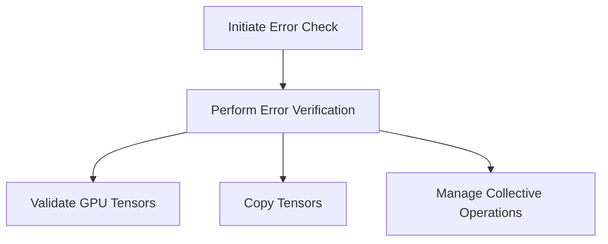

This document will cover the NCCL Error Checking Process, which includes:

1. Initiating the error check
2. Performing the actual error verification
3. Validating GPU tensors
4. Copying tensors while maintaining gradient information
5. Managing collective operations

Technical document: <SwmLink doc-title="NCCL Error Checking Process">[NCCL Error Checking Process](/.swm/nccl-error-checking-process.e35x8gc1.sw.md)</SwmLink>

# [Initiating the Error Check](https://app.swimm.io/repos/Z2l0aHViJTNBJTNBcHl0b3JjaC1hdXRvZG9jcy1kZW1vJTNBJTNBU3dpbW0tRGVtbw==/docs/e35x8gc1#checkforncclerrors)

The error-checking process for NCCL operations begins by initiating the error check. This step is crucial for ensuring that any errors in the NCCL communication are caught and handled appropriately. The process starts by calling an internal function that performs the actual error verification.

# [Performing the Actual Error Verification](https://app.swimm.io/repos/Z2l0aHViJTNBJTNBcHl0b3JjaC1hdXRvZG9jcy1kZW1vJTNBJTNBU3dpbW0tRGVtbw==/docs/e35x8gc1#checkforncclerrorsinternal)

The internal function verifies the status of NCCL communicators and captures any errors. If an error is detected, it is reported and handled to maintain the integrity of distributed operations. This step ensures that any issues in the NCCL communication are promptly addressed, preventing potential disruptions in the system.

# [Validating GPU Tensors](https://app.swimm.io/repos/Z2l0aHViJTNBJTNBcHl0b3JjaC1hdXRvZG9jcy1kZW1vJTNBJTNBU3dpbW0tRGVtbw==/docs/e35x8gc1#check_gpu_single_tensor)

This step involves validating GPU tensors to ensure they meet the requirements for NCCL operations. The validation process checks if the tensor is on a CUDA device, is dense, and is contiguous. This is necessary to prevent errors during NCCL communication, ensuring that only compatible tensors are used.

# [Copying Tensors While Maintaining Gradient Information](https://app.swimm.io/repos/Z2l0aHViJTNBJTNBcHl0b3JjaC1hdXRvZG9jcy1kZW1vJTNBJTNBU3dpbW0tRGVtbw==/docs/e35x8gc1#copy_)

This step involves performing an in-place copy of one tensor to another while maintaining gradient information. It handles the autograd metadata and ensures that the forward gradients are correctly set. This is important for tensor operations that require copying data while preserving the gradient flow.

# [Managing Collective Operations](https://app.swimm.io/repos/Z2l0aHViJTNBJTNBcHl0b3JjaC1hdXRvZG9jcy1kZW1vJTNBJTNBU3dpbW0tRGVtbw==/docs/e35x8gc1#collectivecoalesced)

This step handles coalesced collective operations in NCCL. It manages multiple tensors in a single collective call, optimizing the communication by reducing the number of individual calls. This improves the performance of collective operations in distributed training, making the process more efficient.

&nbsp;

*This is an auto-generated document by Swimm AI 🌊 and has not yet been verified by a human*

<SwmMeta version="3.0.0" repo-id="Z2l0aHViJTNBJTNBcHl0b3JjaC1hdXRvZG9jcy1kZW1vJTNBJTNBU3dpbW0tRGVtbw==" repo-name="pytorch-autodocs-demo">Powered by [Swimm](https://app.swimm.io/)</SwmMeta>
