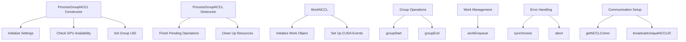

# Overview

The NCCL Process Group is a component within the <SwmToken path="test/inductor/test_snode_runtime.py" pos="17:0:0" line-data="c10d = torch.ops.c10d_functional">`c10d`</SwmToken> namespace that facilitates collective communication operations using the NVIDIA Collective Communication Library (NCCL). It ensures that reduce-scatters and all-gathers run serially on a single internal NCCL stream, which helps in managing concurrent operations on the same device over the same ranks.

# Constructor

The constructor of <SwmToken path="torch/csrc/distributed/c10d/ProcessGroupNCCL.cpp" pos="464:0:0" line-data="ProcessGroupNCCL::WorkNCCL::WorkNCCL(">`ProcessGroupNCCL`</SwmToken> initializes various settings and checks for GPU availability. It also sets the group UID and initializes intra-node communication.

<SwmSnippet path="/torch/csrc/distributed/c10d/ProcessGroupNCCL.cpp" line="764">

---

The constructor initializes settings, checks for GPU availability, and sets the group UID.

```c++
ProcessGroupNCCL::ProcessGroupNCCL(
    const c10::intrusive_ptr<Store>& store,
    int rank,
    int size,
    c10::intrusive_ptr<Options> options)
    : Backend(rank, size),
      store_(store),
      options_(options),
      ncclCommCounter_(0),
      traceKeyStart_(getTraceStartKey("NCCL", rank)),
      traceKeyEnd_(getTraceEndKey("NCCL", rank)),
      terminateProcessGroup_(false),
      terminateHeartbeatMonitorThread_(false),
      collectiveDebugInfoMode_(false),
      local_id_(process_group_id++),
      intraNodeComm_(initIntraNodeComm()) {
  TORCH_CHECK_WITH(
      ValueError,
      at::cuda::getNumGPUs() != 0,
      "ProcessGroupNCCL is only supported with GPUs, no GPUs found!");
  this->setGroupUid(options_->group_name);
```

---

</SwmSnippet>

# Destructor

The destructor of <SwmToken path="torch/csrc/distributed/c10d/ProcessGroupNCCL.cpp" pos="464:0:0" line-data="ProcessGroupNCCL::WorkNCCL::WorkNCCL(">`ProcessGroupNCCL`</SwmToken> ensures that any pending NCCL operations are finished and cleans up resources. It calls <SwmToken path="torch/csrc/distributed/c10d/ProcessGroupNCCL.cpp" pos="748:3:3" line-data="  ncclComm_-&gt;ncclCommAbort();">`ncclCommAbort`</SwmToken> to ensure that the communication is aborted in a consistent order across ranks, preventing hangs on exit.

<SwmSnippet path="/torch/csrc/distributed/c10d/ProcessGroupNCCL.cpp" line="1178">

---

The destructor ensures that pending operations are finished and resources are cleaned up.

```c++
ProcessGroupNCCL::~ProcessGroupNCCL() {
  LOG(INFO) << logPrefix() << "ProcessGroupNCCL destructor entered.";

  if (!terminateProcessGroup_.load()) {
    if (rank_ % localDeviceCount_ == 0) {
      TORCH_WARN_ONCE(
          "WARNING: process group has NOT been destroyed before we destruct ProcessGroupNCCL. ",
          "On normal program exit, the application should call destroy_process_group to ",
          "ensure that any pending NCCL operations have finished in this process. "
          "In rare cases this process can exit before this point and block the progress of "
          "another member of the process group. This constraint has always been present, "
          " but this warning has only been added since PyTorch 2.4");
    }
    // If user haven't explicitly destroy/shutdown process group, destructor
    // needs to do so
    shutdown();
  }

  // Wait for all threads to finish before returning
#ifdef ENABLE_NCCL_ERROR_CHECKING
  if (ncclCommWatchdogThread_.joinable()) {
```

---

</SwmSnippet>

# Group Operations

The <SwmToken path="torch/csrc/distributed/c10d/ProcessGroupNCCL.cpp" pos="4275:4:4" line-data="void ProcessGroupNCCL::groupStart() {">`groupStart`</SwmToken> method begins a new NCCL group operation, while the <SwmToken path="torch/csrc/distributed/c10d/ProcessGroupNCCL.cpp" pos="4280:4:4" line-data="void ProcessGroupNCCL::groupEnd() {">`groupEnd`</SwmToken> method ends the current NCCL group operation.

<SwmSnippet path="/torch/csrc/distributed/c10d/ProcessGroupNCCL.cpp" line="4275">

---

The <SwmToken path="torch/csrc/distributed/c10d/ProcessGroupNCCL.cpp" pos="4275:4:4" line-data="void ProcessGroupNCCL::groupStart() {">`groupStart`</SwmToken> method begins a new NCCL group operation.

```c++
void ProcessGroupNCCL::groupStart() {
  C10D_NCCL_CHECK(ncclGroupStart(), std::nullopt);
  ++ncclActiveGroupCounter_;
}
```

---

</SwmSnippet>

<SwmSnippet path="/torch/csrc/distributed/c10d/ProcessGroupNCCL.cpp" line="4280">

---

The <SwmToken path="torch/csrc/distributed/c10d/ProcessGroupNCCL.cpp" pos="4280:4:4" line-data="void ProcessGroupNCCL::groupEnd() {">`groupEnd`</SwmToken> method ends the current NCCL group operation.

```c++
void ProcessGroupNCCL::groupEnd() {
  C10D_NCCL_CHECK(ncclGroupEnd(), std::nullopt);
  --ncclActiveGroupCounter_;
}
```

---

</SwmSnippet>

# Work Management

The <SwmToken path="torch/csrc/distributed/c10d/ProcessGroupNCCL.cpp" pos="2479:4:4" line-data="void ProcessGroupNCCL::workEnqueue(">`workEnqueue`</SwmToken> method enqueues a new NCCL work item for processing. The <SwmToken path="torch/csrc/distributed/c10d/ProcessGroupNCCL.cpp" pos="464:2:2" line-data="ProcessGroupNCCL::WorkNCCL::WorkNCCL(">`WorkNCCL`</SwmToken> function initializes a work object for NCCL operations, setting up CUDA events and other necessary parameters.

<SwmSnippet path="/torch/csrc/distributed/c10d/ProcessGroupNCCL.cpp" line="2479">

---

The <SwmToken path="torch/csrc/distributed/c10d/ProcessGroupNCCL.cpp" pos="2479:4:4" line-data="void ProcessGroupNCCL::workEnqueue(">`workEnqueue`</SwmToken> method enqueues a new NCCL work item for processing.

```c++
void ProcessGroupNCCL::workEnqueue(
    c10::intrusive_ptr<ProcessGroupNCCL::WorkNCCL> work) {
  if (!terminateProcessGroup_.load()) {
    std::lock_guard<std::mutex> lock(workMetaListMutex_);
    // Avoid view tensors to be processed in cleanup thread.
    // View tensors' destruction invokes autograd_meta, which
    // needs to be destructed in user thread. Otherwise will
    // get deadlock. Here we enqueue work without outputs_.
    workMetaList_.emplace_back(*work);
    // update the PG status related to the last enqueued work
    pgStatus_->lastEnqueuedSeq = work->seq_;
    pgStatus_->lastEnqueuedWorkName = opTypeToString(work->opType_);
    pgStatus_->lastEnqueuedNumelIn = work->numelIn_;
    pgStatus_->lastEnqueuedNumelOut = work->numelOut_;
    lastWorkListUpdateTime_ = std::chrono::steady_clock::now();
  }
}
```

---

</SwmSnippet>

<SwmSnippet path="/torch/csrc/distributed/c10d/ProcessGroupNCCL.cpp" line="464">

---

The <SwmToken path="torch/csrc/distributed/c10d/ProcessGroupNCCL.cpp" pos="464:2:2" line-data="ProcessGroupNCCL::WorkNCCL::WorkNCCL(">`WorkNCCL`</SwmToken> function initializes a work object for NCCL operations.

```c++
ProcessGroupNCCL::WorkNCCL::WorkNCCL(
    at::Device& device,
    int rank,
    OpType opType,
    uint64_t seq,
    const char* profilingTitle,
    const std::optional<std::vector<at::Tensor>>& inputs,
    bool desyncDebug,
    bool enableTiming,
    DebugLevel distDebugLevel)
    : Work(rank, opType, profilingTitle, inputs),
      device_(device),
      workStartTime_(std::chrono::steady_clock::now()),
      seq_(seq),
      timingEnabled_(enableTiming),
      distDebugLevel_(distDebugLevel) {
  // Creates the CUDA event wrappers
  // Note: The actual events are lazily created when first recorded to with
  // DEFAULT_FLAGS = cudaEventDisableTiming.
  if (enableTiming) {
    ncclStartEvent_ = std::make_shared<at::cuda::CUDAEvent>(cudaEventDefault);
```

---

</SwmSnippet>

# Error Handling

The <SwmToken path="torch/csrc/distributed/c10d/ProcessGroupNCCL.cpp" pos="642:6:6" line-data="void ProcessGroupNCCL::WorkNCCL::synchronize() {">`synchronize`</SwmToken> function ensures that NCCL operations are completed by synchronizing the CUDA streams involved. The <SwmToken path="torch/csrc/distributed/c10d/ProcessGroupNCCL.cpp" pos="746:6:6" line-data="void ProcessGroupNCCL::WorkNCCL::abort() {">`abort`</SwmToken> function aborts all NCCL communicators associated with a work object, ensuring that no further operations are performed.

<SwmSnippet path="/torch/csrc/distributed/c10d/ProcessGroupNCCL.cpp" line="642">

---

The <SwmToken path="torch/csrc/distributed/c10d/ProcessGroupNCCL.cpp" pos="642:6:6" line-data="void ProcessGroupNCCL::WorkNCCL::synchronize() {">`synchronize`</SwmToken> function ensures that NCCL operations are completed by synchronizing the CUDA streams involved.

```c++
void ProcessGroupNCCL::WorkNCCL::synchronize() {
  // Call Synchronize without a timeout. We use this method to avoid adding a
  // timeout argument to the public synchronize API.
  synchronizeInternal(kNoTimeout);
}
```

---

</SwmSnippet>

<SwmSnippet path="/torch/csrc/distributed/c10d/ProcessGroupNCCL.cpp" line="746">

---

The <SwmToken path="torch/csrc/distributed/c10d/ProcessGroupNCCL.cpp" pos="746:6:6" line-data="void ProcessGroupNCCL::WorkNCCL::abort() {">`abort`</SwmToken> function aborts all NCCL communicators associated with a work object.

```c++
void ProcessGroupNCCL::WorkNCCL::abort() {
  // Abort all communicators of this work
  ncclComm_->ncclCommAbort();

  ncclCommDevIdxMapMutex.lock();
  ncclCommDevIdxMap.erase(ncclComm_);
  ncclCommDevIdxMapMutex.unlock();
}
```

---

</SwmSnippet>

# Communication Setup

The <SwmToken path="torch/csrc/distributed/c10d/ProcessGroupNCCL.cpp" pos="2065:9:9" line-data="std::shared_ptr&lt;NCCLComm&gt; ProcessGroupNCCL::getNCCLComm(">`getNCCLComm`</SwmToken> function retrieves or creates an NCCL communicator for a given device and operation type, ensuring proper communication setup. The <SwmToken path="torch/csrc/distributed/c10d/ProcessGroupNCCL.cpp" pos="1975:4:4" line-data="void ProcessGroupNCCL::broadcastUniqueNCCLID(">`broadcastUniqueNCCLID`</SwmToken> function broadcasts a unique NCCL ID from rank 0 to all other ranks, ensuring that all processes have the same communicator ID.

<SwmSnippet path="/torch/csrc/distributed/c10d/ProcessGroupNCCL.cpp" line="2065">

---

The <SwmToken path="torch/csrc/distributed/c10d/ProcessGroupNCCL.cpp" pos="2065:9:9" line-data="std::shared_ptr&lt;NCCLComm&gt; ProcessGroupNCCL::getNCCLComm(">`getNCCLComm`</SwmToken> function retrieves or creates an NCCL communicator for a given device and operation type.

```c++
std::shared_ptr<NCCLComm> ProcessGroupNCCL::getNCCLComm(
    const std::string& deviceKey,
    at::Device& device,
    OpType opType,
    int p2pRank,
    bool isSendRecvSelf) {
  // Sanity check
  if (deviceKey.empty()) {
    C10_THROW_ERROR(
        DistBackendError,
        "Not able to create/get the NCCL Communicator since "
        "the GPU devices are not known");
  }
  if (bound_device_id_) {
    if (*bound_device_id_ != device) {
      LOG(ERROR) << logPrefix() << "Tensor found on device " << device
                 << " but backend constrained to " << *bound_device_id_;
      C10_THROW_ERROR(
          DistBackendError,
          "Attempt to perform collective on tensor not on device passed to init_process_group");
    }
```

---

</SwmSnippet>

<SwmSnippet path="/torch/csrc/distributed/c10d/ProcessGroupNCCL.cpp" line="1975">

---

The <SwmToken path="torch/csrc/distributed/c10d/ProcessGroupNCCL.cpp" pos="1975:4:4" line-data="void ProcessGroupNCCL::broadcastUniqueNCCLID(">`broadcastUniqueNCCLID`</SwmToken> function broadcasts a unique NCCL ID from rank 0 to all other ranks.

```c++
void ProcessGroupNCCL::broadcastUniqueNCCLID(
    ncclUniqueId* ncclID,
    bool isSingleP2POp,
    const std::string& p2pKey,
    int p2pRank) {
  // For collective operations:
  // For every NCCL communicator that we create we need to broadcast
  // a unique ID from rank 0 to all other ranks. This broadcast is
  // done by rank 0 setting a key in the store and all other ranks
  // retrieving the contents of that key. A single process group
  // may create multiple NCCL communicators, so we use a sequence
  // number to differentiate between them.
  // For single point-to-point operations:
  // The sequence number will only be increased on 2 out of all the
  // processes in a Process Group. So all following collective
  // operations will see different sequence numbers which will cause
  // runtime errors. To avoid that, use the src:target pair instead
  // of sequence number for p2p communications.

  std::string storeKey;
  if (!isSingleP2POp) {
```

---

</SwmSnippet>

&nbsp;

*This is an auto-generated document by Swimm AI 🌊 and has not yet been verified by a human*

<SwmMeta version="3.0.0" repo-id="Z2l0aHViJTNBJTNBcHl0b3JjaC1hdXRvZG9jcy1kZW1vJTNBJTNBU3dpbW0tRGVtbw==" repo-name="pytorch-autodocs-demo"><sup>Powered by [Swimm](/)</sup></SwmMeta>
