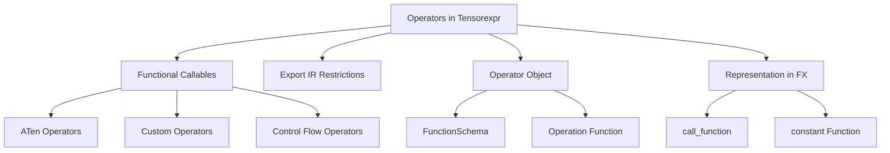

# Overview

Operators in Tensorexpr are functional callables with predefined schemas. They include functional <SwmToken path="benchmarks/dynamo/microbenchmarks/microbench.py" pos="18:0:0" line-data="aten = torch.ops.aten">`aten`</SwmToken> operators, custom operators, and control flow operators. These operators are essential for defining and executing various tensor operations within the framework.

# Export IR Restrictions

In the Export IR, operators are restricted to a select subset of <SwmToken path="benchmarks/dynamo/microbenchmarks/microbench.py" pos="18:0:0" line-data="aten = torch.ops.aten">`aten`</SwmToken> operators, custom operators, and control flow operators. This restriction ensures that only supported operations are included in the exported intermediate representation.

# Operator Object

The Operator object represents a single registered operator in the system. It combines a <SwmToken path="torchgen/model.py" pos="1369:2:2" line-data="class FunctionSchema:">`FunctionSchema`</SwmToken> that describes how an operation executes with a method to look up the corresponding operation given the `Node` representing the operator in a graph.

<SwmSnippet path="/torch/csrc/jit/tensorexpr/operators/misc.cpp" line="276">

---

The <SwmToken path="torch/csrc/jit/tensorexpr/operators/misc.cpp" pos="276:2:2" line-data="ExprHandle constant(const ArgValue&amp; v) {">`constant`</SwmToken> function demonstrates how different types of values are converted to constants within the operators. This function handles various data types and ensures they are appropriately converted to the corresponding constant expressions.

```c++
ExprHandle constant(const ArgValue& v) {
  if (auto s = std::get_if<tensorexpr::VarHandle>(&v)) {
    return *s;
  } else if (auto d = std::get_if<double>(&v)) {
    return DoubleImm::make(*d);
  } else if (auto i = std::get_if<int64_t>(&v)) {
    return LongImm::make(*i);
  } else if (auto b = std::get_if<bool>(&v)) {
    return BoolImm::make(*b);
  } else if (std::get_if<ArgNone>(&v)) {
    // This is just a placeholder so we don't throw.  None-handling
    // is operator-specific and should be handled properly in
    // the operator-specific lowering code.
    return IntImm::make(0);
  } else {
    throw unsupported_dtype("Trying to convert unsupported dtype to constant");
  }
}
```

---

</SwmSnippet>

# Representation in FX

In FX graph, a <SwmToken path="torch/_dynamo/symbolic_convert.py" pos="1562:3:3" line-data="    def CALL_FUNCTION(self, inst):">`CALL_FUNCTION`</SwmToken> can refer to any callable. However, in Export IR, it is restricted to only a select subset of <SwmToken path="benchmarks/dynamo/microbenchmarks/microbench.py" pos="18:0:0" line-data="aten = torch.ops.aten">`aten`</SwmToken> operators, custom operators, and control flow operators.

# Main Functions

There are several main functions in this folder. Some of them are <SwmToken path="torch/csrc/jit/tensorexpr/operators/norm.h" pos="9:2:2" line-data="Tensor computeBatchNorm(">`computeBatchNorm`</SwmToken>, <SwmToken path="torch/csrc/jit/tensorexpr/operators/pointwise.h" pos="9:4:4" line-data="TORCH_API Tensor computeSign(">`computeSign`</SwmToken>, <SwmToken path="torch/csrc/jit/tensorexpr/operators/pointwise.h" pos="14:2:2" line-data="Tensor computeOneOperand(">`computeOneOperand`</SwmToken>, and <SwmToken path="torch/csrc/jit/tensorexpr/operators/pointwise.h" pos="22:2:2" line-data="Tensor computeTwoOperand(">`computeTwoOperand`</SwmToken>. We will dive a little into <SwmToken path="torch/csrc/jit/tensorexpr/operators/norm.h" pos="9:2:2" line-data="Tensor computeBatchNorm(">`computeBatchNorm`</SwmToken> and <SwmToken path="torch/csrc/jit/tensorexpr/operators/pointwise.h" pos="9:4:4" line-data="TORCH_API Tensor computeSign(">`computeSign`</SwmToken>.

## <SwmToken path="torch/csrc/jit/tensorexpr/operators/norm.h" pos="9:2:2" line-data="Tensor computeBatchNorm(">`computeBatchNorm`</SwmToken>

The <SwmToken path="torch/csrc/jit/tensorexpr/operators/norm.h" pos="9:2:2" line-data="Tensor computeBatchNorm(">`computeBatchNorm`</SwmToken> function is used to compute batch normalization. It takes inputs, output shape, output strides, an optional output type, and a device as parameters. This function is essential for normalizing the input data across the batch dimension, which helps in stabilizing and accelerating the training process.

<SwmSnippet path="/torch/csrc/jit/tensorexpr/operators/norm.h" line="9">

---

The <SwmToken path="torch/csrc/jit/tensorexpr/operators/norm.h" pos="9:2:2" line-data="Tensor computeBatchNorm(">`computeBatchNorm`</SwmToken> function signature shows the parameters required for batch normalization.

```c
Tensor computeBatchNorm(
    const std::vector<ArgValue>& inputs,
    const std::vector<ExprHandle>& outputShape,
    const std::vector<ExprHandle>& outputStrides,
    const std::optional<ScalarType>& outputType,
    at::Device device);
```

---

</SwmSnippet>

## <SwmToken path="torch/csrc/jit/tensorexpr/operators/pointwise.h" pos="9:4:4" line-data="TORCH_API Tensor computeSign(">`computeSign`</SwmToken>

The <SwmToken path="torch/csrc/jit/tensorexpr/operators/pointwise.h" pos="9:4:4" line-data="TORCH_API Tensor computeSign(">`computeSign`</SwmToken> function computes the sign of the input tensor. It takes inputs, output shape, and optional output strides as parameters. This function is useful for determining the sign of each element in the input tensor, which can be used in various mathematical and logical operations.

<SwmSnippet path="/torch/csrc/jit/tensorexpr/operators/pointwise.h" line="9">

---

The <SwmToken path="torch/csrc/jit/tensorexpr/operators/pointwise.h" pos="9:4:4" line-data="TORCH_API Tensor computeSign(">`computeSign`</SwmToken> function signature shows the parameters required for computing the sign of the input tensor.

```c
TORCH_API Tensor computeSign(
    const std::vector<ArgValue>& inputs,
    const std::vector<ExprHandle>& outputShape,
    const std::optional<std::vector<ExprHandle>>& outputStrides = std::nullopt);
```

---

</SwmSnippet>

&nbsp;

*This is an auto-generated document by Swimm AI 🌊 and has not yet been verified by a human*

<SwmMeta version="3.0.0" repo-id="Z2l0aHViJTNBJTNBcHl0b3JjaC1hdXRvZG9jcy1kZW1vJTNBJTNBU3dpbW0tRGVtbw==" repo-name="pytorch-autodocs-demo"><sup>Powered by [Swimm](/)</sup></SwmMeta>
