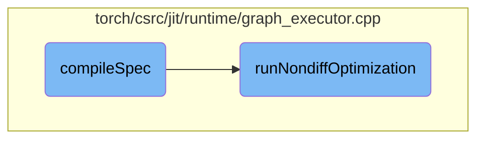

In this document, we will explain the process of optimizing a computational graph using the `compileSpec` function. The process involves several phases of optimization, including inlining functions, lowering gradients, specializing autograd zero, and constant pooling. Additionally, it handles shape propagation, constant propagation, and differentiable optimizations.

The flow starts with the `compileSpec` function, which takes a computational graph and makes a copy of it. It then performs a series of optimizations: inlining functions, lowering gradients, specializing autograd zero, and pooling constants. If the graph requires gradients, it creates autodiff subgraphs and applies further optimizations. Finally, it runs non-differentiable optimizations and eliminates any dead code before returning an execution plan.

# Flow drill down



<SwmSnippet path="/torch/csrc/jit/runtime/graph_executor.cpp" line="689">

---

## compileSpec

The `compileSpec` function is responsible for optimizing a computational graph based on a given specification. It performs several phases of optimization, including inlining functions, lowering gradients, specializing autograd zero, and constant pooling. The function also handles shape propagation, constant propagation, and differentiable optimizations. If the graph requires gradients, it creates autodiff subgraphs and applies further optimizations. Finally, it runs non-differentiable optimizations and eliminates any dead code before returning an execution plan.

```c++
  ExecutionPlan compileSpec(const ArgumentSpec& spec) {
    auto opt_graph = graph->copy();
    GRAPH_DUMP("Optimizing the following function:", opt_graph);
    arg_spec_creator_.specializeTypes(*opt_graph, spec);

    // Phase 0. Inline functions, then clean up any artifacts that the inliner
    //          left in that may inhibit optimization
    Inline(*opt_graph);
    GRAPH_DEBUG("After Inline, before LowerGradOf\n", *opt_graph);
    LowerGradOf(*opt_graph);
    GRAPH_DEBUG(
        "After LowerGradOf, before specializeAutogradZero\n", *opt_graph);
    specializeAutogradZero(opt_graph);
    GRAPH_DEBUG(
        "After specializeAutogradZero, before LowerSimpleTuples\n", *opt_graph);
    LowerSimpleTuples(opt_graph);
    GRAPH_DEBUG(
        "After LowerSimpleTuples, before ConstantPooling\n", *opt_graph);
    ConstantPooling(opt_graph);
    GRAPH_DEBUG(
        "After ConstantPooling, before runRequiredPasses\n", *opt_graph);
```

---

</SwmSnippet>

<SwmSnippet path="/torch/csrc/jit/runtime/graph_executor.cpp" line="924">

---

## runNondiffOptimization

The `runNondiffOptimization` function applies non-differentiable optimizations to the computational graph. It runs custom pre-passes, decomposes certain operations, lowers simple tuples, and performs batch matrix multiplications. The function also handles graph fusion, either through tensor expression fusion or standard graph fusion, depending on the executor mode. Finally, it runs custom post-fusion passes to complete the optimization process.

```c++
void runNondiffOptimization(
    std::shared_ptr<Graph>& graph,
    bool strict_fuser_check) {
  GRAPH_DEBUG(
      "Before customPrePasses (beginning of runNondiffOptimization)\n", *graph);
  // Run custom passes that different backends can register.
  for (const auto& passPair : getCustomPrePasses()) {
    passPair.first(graph);
  }
  GRAPH_DEBUG("After customPrePasses\n", *graph);

  // decomposition pass, decompose certain ops that will be used in the
  // following passes (like batchmm and jit fusion)
  DecomposeOps(graph);
  GRAPH_DEBUG("After DecomposeOps\n", *graph);

  // TupleConstruct / TupleUnpack pairs can still be present at this point
  // and must be removed for fusion.
  LowerSimpleTuples(graph);
  GRAPH_DEBUG("After LowerSimpleTuples, before BatchMM\n", *graph);

```

---

</SwmSnippet>

&nbsp;

*This is an auto-generated document by Swimm AI 🌊 and has not yet been verified by a human*

<SwmMeta version="3.0.0" repo-id="Z2l0aHViJTNBJTNBcHl0b3JjaC1hdXRvZG9jcy1kZW1vJTNBJTNBU3dpbW0tRGVtbw==" repo-name="pytorch-autodocs-demo"><sup>Powered by [Swimm](https://app.swimm.io/)</sup></SwmMeta>
