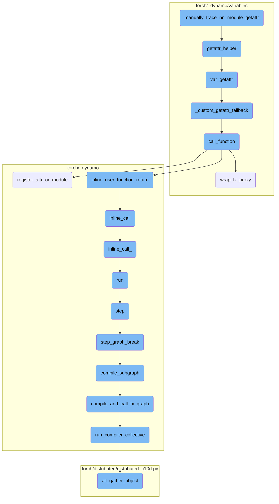
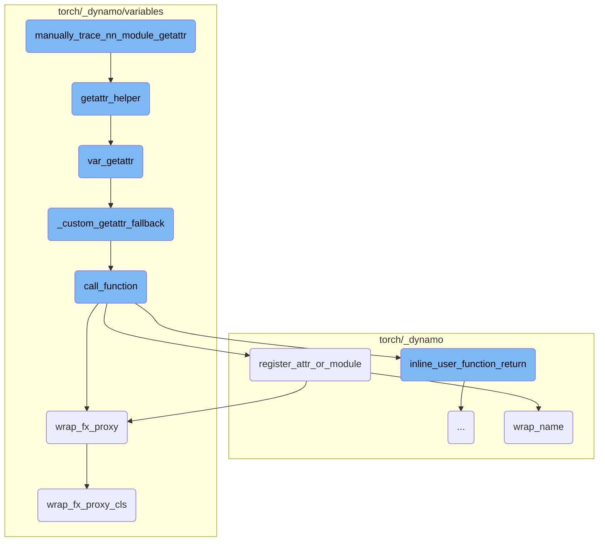
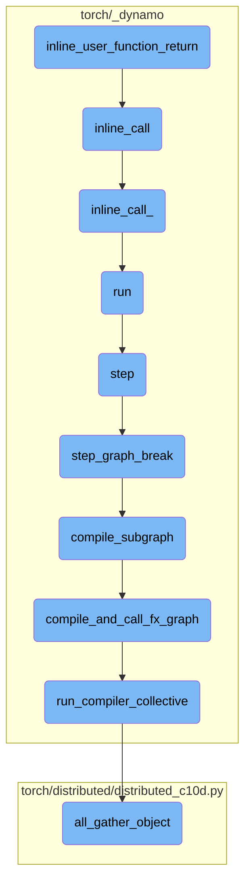

This document explains the purpose and flow of the `manually_trace_nn_module_getattr` function. The function is designed to optimize the tracing of `nn.Module` attributes by directly accessing underlying data structures. This avoids the overhead of repeatedly calling `__getattr__` in models with deep submodule hierarchies, thus saving compilation time.

The flow starts with the `manually_trace_nn_module_getattr` function, which tries to retrieve an attribute from `_parameters`, `_modules`, and `_buffers`. If it doesn't find the attribute, it raises an exception. The function uses `getattr_helper` to assist in retrieving the attribute from a specified field. `getattr_helper` uses `var_getattr` to get the dictionary variable and checks if the attribute exists within it. If a custom `__getattr__` method is implemented, `_custom_getattr_fallback` handles it. The `call_function` function is used to call a function or method on the module, ensuring the correct function is called and the module is properly initialized if necessary.

Here is a high level diagram of the flow, showing only the most important functions:



# Flow drill down

First, we'll zoom into this section of the flow:



<SwmSnippet path="/torch/_dynamo/variables/nn_module.py" line="1122">

---

## manually_trace_nn_module_getattr

The `manually_trace_nn_module_getattr` function is designed to optimize the tracing of `nn.Module` attributes by directly accessing underlying data structures. This avoids the overhead of repeatedly calling `__getattr__` in models with deep submodule hierarchies, thus saving compilation time. It attempts to retrieve the attribute from `_parameters`, `_modules`, and `_buffers` in that order.

```python
    def manually_trace_nn_module_getattr(self, tx: "InstructionTranslator", name):
        """
        Dynamo tracing of nn.Module __getattr__ can be expensive if the model
        has deep submodule hierarchy. Since the __getattr__ is stable, we can
        directly look into the underlying datastructures. This saves a lot of
        compilation time.
        """
        name_vt = variables.ConstantVariable(name)
        out = self.getattr_helper(tx, "_parameters", name_vt)
        if out is None:
            out = self.getattr_helper(tx, "_modules", name_vt)
        if out is None:
            out = self.getattr_helper(tx, "_buffers", name_vt)
        if out is None:
            raise ObservedException(f"object has no attribute {name}")
        return out
```

---

</SwmSnippet>

<SwmSnippet path="/torch/_dynamo/variables/nn_module.py" line="1053">

---

### getattr_helper

The `getattr_helper` function assists `manually_trace_nn_module_getattr` by attempting to retrieve the attribute from a specified field (like `_parameters`, `_modules`, or `_buffers`). It uses `var_getattr` to get the dictionary variable and checks if the attribute exists within it.

```python
    def getattr_helper(self, tx: "InstructionTranslator", field, name_vt):
        dict_vt = self.var_getattr(tx, field)
        if isinstance(dict_vt, variables.ConstDictVariable):
            return dict_vt.maybe_getitem_const(name_vt)
        return None
```

---

</SwmSnippet>

<SwmSnippet path="/torch/_dynamo/variables/nn_module.py" line="243">

---

### var_getattr

The `var_getattr` function is responsible for retrieving the attribute from the module's dictionary or falling back to a custom `__getattr__` if defined. It handles various cases, including properties, class methods, and static methods, and ensures that the correct attribute is returned.

```python
    def var_getattr(self, tx: "InstructionTranslator", name):
        from .builder import VariableBuilder

        if self.source:
            source = AttrSource(self.source, name)
        else:
            source = None

        base = tx.output.get_submodule(self.module_key)
        base_dict = object.__getattribute__(base, "__dict__")
        object_member = True
        all_class_attribute_names = set()
        for x in inspect.getmro(base.__class__):
            all_class_attribute_names.update(x.__dict__.keys())

        if not self.source:
            unimplemented("GETATTR with no source")

        if name == "__dict__":
            return variables.GetAttrVariable(self, name, source=source)

```

---

</SwmSnippet>

<SwmSnippet path="/torch/_dynamo/variables/nn_module.py" line="227">

---

### \_custom_getattr_fallback

The `_custom_getattr_fallback` function checks if a custom `__getattr__` method is implemented in the module and handles it accordingly. If a custom `__getattr__` is found, it calls the method to retrieve the attribute.

```python
    def _custom_getattr_fallback(self, base, tx, name, options):
        """Check for a __getattr__ and handle it specially if it is implemented"""
        if object_has_getattribute(base):
            unimplemented("torch.nn.Module with a custom __getattribute__ defined")

        getattr_fn = get_custom_getattr(base, ignore_nn_module_getattr=True)
        if getattr_fn is None:
            return None

        if not isinstance(getattr_fn, types.FunctionType):
            unimplemented("torch.nn.Module with a non-function custom __getattr__")

        return variables.UserMethodVariable(getattr_fn, self, **options).call_function(
            tx, [variables.ConstantVariable.create(name)], {}
        )
```

---

</SwmSnippet>

<SwmSnippet path="/torch/_dynamo/variables/nn_module.py" line="341">

---

### call_function

The `call_function` function is used to call a function or method on the module. It handles special cases like `torch.nn.Sequential` and lazy modules, ensuring that the correct function is called and the module is properly initialized if necessary.

```python
    def call_function(
        self,
        tx,
        args: "List[VariableTracker]",
        kwargs: "Dict[str, VariableTracker]",
    ) -> "VariableTracker":
        mod = tx.output.get_submodule(self.module_key)

        with record_nn_module_stack(
            self.module_key, self.get_nn_module_stack_source(), tx, mod
        ):
            is_lazy = is_lazy_module(mod)
            if (
                isinstance(mod, torch.nn.Sequential)
                and mod.__class__.forward is torch.nn.Sequential.forward
            ):
                if nnmodule_has_hooks(mod):
                    # We do not want to unroll sequential if it has hooks, since evaporating it
                    # will cause hooks to not fire!
                    # This terminates and restart the tracing process
                    self.convert_to_unspecialized(tx)
```

---

</SwmSnippet>

<SwmSnippet path="/torch/_dynamo/output_graph.py" line="753">

---

### register_attr_or_module

The `register_attr_or_module` function registers an attribute or module in the output graph. It ensures that the attribute or module is properly tracked and avoids duplicate registrations.

```python
    def register_attr_or_module(
        self,
        target: Union[torch.nn.Module, torch.Tensor, Any],
        *names,
        **options,
    ):
        if is_dynamic_nn_module(target, self.root_tx.export):
            # Instead of returning UnspecializedNNModuleVariable, call
            # VariableBuilder so that it is tracked for mutation.
            return VariableBuilder(self.current_tx, **options)(target)

        options = dict(options)
        assert "source" in options
        source = options["source"]
        assert not isinstance(source, ParamBufferSource)

        if isinstance(target, torch.Tensor):
            tracer = self.current_tracer
            if not self.is_root_tracer():
                # For higher order ops, we don't want to insert the get_attr in
                # innermost graph. Instead, we want to raise the params/buffers
```

---

</SwmSnippet>

<SwmSnippet path="/torch/_dynamo/variables/builder.py" line="1898">

---

### wrap_fx_proxy

The `wrap_fx_proxy` function wraps a proxy object for a tensor or other variable, ensuring that it is properly tracked in the FX graph. It handles both pre-existing tensors and the results of tensor operations.

```python
def wrap_fx_proxy(
    tx, proxy, example_value=None, subclass_type=None, **options
) -> VariableTracker:
    kwargs = {
        "tx": tx,
        "proxy": proxy,
        "example_value": example_value,
        "subclass_type": subclass_type,
        **options,
    }
    if subclass_type is None:
        return wrap_fx_proxy_cls(target_cls=TensorVariable, **kwargs)
    else:
        result = wrap_fx_proxy_cls(target_cls=TensorWithTFOverrideVariable, **kwargs)
        result.install_global(tx)
        return result
```

---

</SwmSnippet>

<SwmSnippet path="/torch/_dynamo/variables/builder.py" line="1916">

---

### wrap_fx_proxy_cls

The `wrap_fx_proxy_cls` function is a complex function that handles wrapping various types of variables into proxy objects for the FX graph. It ensures that the correct example values are set and handles special cases like tuples, lists, and symbolic values.

```python
# Note: Unfortunate split due to some gross classes existing that subclass TensorVariable
# Should be compositional instead
#
# This is a horribly complicated function that does too many things, to
# explain what it does, let's first talk about the classic usage wrap_fx_proxy
# for a TensorVariable.  There are two primary modes of use:
#
#   1. Wrapping a pre-existing Tensor.  In this case, example_value is set
#      to the pre-existing Tensor.  (Note that this example_value will NOT
#      be the final example_value we put into node.meta['example_value'],
#      instead it is converted into a fake tensor using
#      wrap_to_fake_tensor_and_record and registered as a graph input.)
#
#   2. "Wrapping" the result of some Tensor operation Dynamo traced over. In
#      this case, example_value is None (and we are going to figure it out
#      ourselves using FakeTensors, via get_fake_value, which will run
#      the operation represented by the (singular!) FX node referenced by
#      the passed in proxy.)
#
# The expectation is you end up with a Tensor output, and everything is
# straightforwardly traced into the graph.
```

---

</SwmSnippet>

<SwmSnippet path="/torch/_dynamo/output_graph.py" line="785">

---

### wrap_name

The `wrap_name` function wraps a name for an attribute or module, ensuring that it is properly tracked and registered in the output graph. It handles various cases, including guarded and constant sources.

```python
            def wrap_name(module_key):
                assert self.param_name_to_source is not None
                self.param_name_to_source[module_key] = source

                # Check if the attr has already been registered. This can happen
                # when two different sources point to the same tensor.
                if target in self.root_tx.output.side_effects:
                    return self.root_tx.output.side_effects[target]

                if get_static_address_type(target) == "guarded":
                    install_guard(source.make_guard(GuardBuilder.ID_MATCH))
                elif not is_constant_source(source):
                    install_guard(source.make_guard(GuardBuilder.TENSOR_MATCH))

                vt = wrap_fx_proxy(
                    self.root_tx,
                    tracer.create_proxy("get_attr", module_key, (), {}),
                    example_value=target,
                    **options,
                )

```

---

</SwmSnippet>

Now, lets zoom into this section of the flow:



<SwmSnippet path="/torch/_dynamo/symbolic_convert.py" line="807">

---

## inline_user_function_return

The `inline_user_function_return` function is responsible for inlining a user-defined function call. This means that instead of calling the function directly, the function's code is inserted into the caller's code. This can help with optimization by reducing function call overhead and enabling further compiler optimizations.

```python
    def inline_user_function_return(self, fn, args, kwargs):
        """
        A call to some user defined function by inlining it.
        """
        return InliningInstructionTranslator.inline_call(self, fn, args, kwargs)
```

---

</SwmSnippet>

<SwmSnippet path="/torch/_dynamo/symbolic_convert.py" line="2943">

---

## inline_call

The `inline_call` function is a class method that sets up the context for inlining a function call. It uses a context manager to patch the counters and then delegates the actual inlining work to the `inline_call_` function.

```python
    @classmethod
    def inline_call(cls, parent, func, args, kwargs):
        with patch.dict(counters, {"unimplemented": counters["inline_call"]}):
            return cls.inline_call_(parent, func, args, kwargs)
```

---

</SwmSnippet>

<SwmSnippet path="/torch/_dynamo/symbolic_convert.py" line="2981">

---

## inline_call\_

The `inline_call_` function performs the actual inlining of the function. It checks if the function can be inlined, binds the arguments, and then runs the inlined code using an `InliningInstructionTranslator`. This function handles various edge cases and ensures that the inlined code is correctly integrated into the caller's code.

```python
    def inline_call_(
        parent, func: VariableTracker, args: List[VariableTracker], kwargs
    ):
        if isinstance(func, SkipFunctionVariable):
            unimplemented("inline with functions in skip files")
        assert isinstance(
            func,
            (UserFunctionVariable, NestedUserFunctionVariable),
        )
        result = InliningInstructionTranslator.check_inlineable(func)
        assert result.skipped is False
        try:
            sub_locals, closure_cells = func.bind_args(parent, args, kwargs)
        except TypeError as e:
            # Wrap the general TypeError during bind_args() to the internal ArgsMismatchError with detailed info
            raise ArgsMismatchError(  # noqa: B904
                "{reason}.\n  func = {func}, args = {args}, kwargs = {kwargs}".format(
                    reason=str(e),
                    func=f"'{func.get_name()}' {func.get_filename()}:{func.get_code().co_firstlineno}",
                    args=[arg.python_type() for arg in args],
                    kwargs=kwargs,
```

---

</SwmSnippet>

<SwmSnippet path="/torch/_dynamo/symbolic_convert.py" line="954">

---

## run

The `run` function is responsible for executing the inlined code. It manages the execution context, handles exceptions, and ensures that the output graph is cleaned up after execution.

```python
    def run(self):
        with self.run_ctx_mgr():
            try:
                self.output.push_tx(self)
                while self.step():
                    pass
            except BackendCompilerFailed:
                raise
            except Exception as e:
                if self.exec_recorder:
                    e.exec_record = self.exec_recorder.get_record()  # type: ignore[attr-defined]
                raise
            finally:
                self.output.pop_tx()
                # Cleanup the outputGraph to delete the held tensors. We perform the
                # cleanup only for InstructionTranslator and not
                # InliningInstructionTranslator. The InliningInstructionTranslator
                # mutates the output object and is restored to original state if
                # there was an exception.
                if isinstance(self, InstructionTranslator):
                    self.output.cleanup()
```

---

</SwmSnippet>

<SwmSnippet path="/torch/_dynamo/symbolic_convert.py" line="842">

---

## step

The `step` function processes a single instruction in the inlined code. It updates the instruction pointer, handles line starts, and dispatches the instruction to the appropriate handler. If a graph break is needed, it calls the `step_graph_break` function.

```python
    def step(self):
        """Process exactly one instruction, return False we should exit"""
        ip = self.instruction_pointer
        if ip is None:
            return False
        self.current_instruction = inst = self.instructions[ip]
        self.instruction_pointer = ip + 1

        if inst.starts_line:
            self.starts_line(inst.starts_line)

        if (
            not self.stack
            and self.should_compile_partial_graph()
            and self.is_non_empty_graph()
        ):
            self.current_speculation = self.speculate()
            if self.current_speculation.failed:
                return self.step_graph_break(inst)

        if trace_bytecode_log.isEnabledFor(logging.DEBUG):
```

---

</SwmSnippet>

<SwmSnippet path="/torch/_dynamo/symbolic_convert.py" line="935">

---

## step_graph_break

The `step_graph_break` function handles cases where the inlined code needs to be compiled into a subgraph. It generates the necessary code to continue execution and adds the output instructions to the output graph.

```python
    def step_graph_break(self, continue_inst):
        # generate code from checkpoint
        assert not self.output.output_instructions
        assert self.current_speculation is not None
        self.output.compile_subgraph(
            self,
            partial_convert=True,
            reason=GraphCompileReason("step_unsupported", [self.frame_summary()]),
        )
        self.output.add_output_instructions(
            [create_jump_absolute(continue_inst)] + self.instructions
        )
```

---

</SwmSnippet>

<SwmSnippet path="/torch/_dynamo/output_graph.py" line="968">

---

## compile_subgraph

The `compile_subgraph` function generates a subgraph to continue execution on user code. It restores live variables, handles aliases, and generates the necessary instructions to call the compiled subgraph.

```python
    def compile_subgraph(
        self, tx, partial_convert=False, reason: Optional[GraphCompileReason] = None
    ):
        """
        Generate a subgraph to continue execution on user code.
        Automatically restore live variables.
        """
        assert reason is not None

        from .decorators import disable

        self.partial_convert = partial_convert
        self.compile_subgraph_reason = reason
        self.should_exit = True

        log.debug("COMPILING GRAPH due to %s", reason)

        if not all(block.can_restore() for block in tx.block_stack):
            unimplemented("compile_subgraph with block_depth != 0")

        prefix_insts: List[Instruction] = []
```

---

</SwmSnippet>

<SwmSnippet path="/torch/_dynamo/output_graph.py" line="1285">

---

## compile_and_call_fx_graph

The `compile_and_call_fx_graph` function generates code from the current graph and returns the instructions to call the generated code. It handles various optimizations and ensures that the generated code is correctly integrated into the caller's code.

```python
    def compile_and_call_fx_graph(self, tx, rv, root):
        """
        Generate code from self.graph and return the Instruction()s to
        call that generated code.
        """
        with torch._guards.TracingContext.clear_frame():
            from .decorators import disable

            assert self.should_exit

            self.run_compiler_collective(tx)

            name = unique_id("__compiled_fn")

            assert isinstance(rv, list)
            assert isinstance(root, FakeRootModule)
            output_node = self.create_node(
                "output",
                "output",
                (self.current_tracer.create_arg(tuple(x.as_proxy() for x in rv)),),
                {},
```

---

</SwmSnippet>

<SwmSnippet path="/torch/_dynamo/output_graph.py" line="1262">

---

## run_compiler_collective

The `run_compiler_collective` function handles the distributed state for the compiler. It gathers the local states from all processes and updates the speculation log to ensure consistent tracing.

```python
    def run_compiler_collective(self, tx):
        if (ds := tx.distributed_state) is not None and ds.all_states is None:
            compile_pg = ds.compile_pg
            log.info("compiler_collective %s", ds.local_state)
            torch._logging.trace_structured(
                "artifact",
                metadata_fn=lambda: {
                    "name": "compiler_collective",
                    "encoding": "json",
                },
                payload_fn=lambda: json.dumps(
                    dataclasses.asdict(ds.local_state),
                ),
            )
            with torch.cuda.device(compile_pg.rank() % torch.cuda.device_count()):
                all_states = [None] * compile_pg.size()
                dist.all_gather_object(all_states, ds.local_state, group=compile_pg)
                ds.all_states = all_states
            # Clear speculation log, because are tracing may diverge due to
            # this information from the compiler collective
            tx.speculation_log.clear()
```

---

</SwmSnippet>

<SwmSnippet path="/torch/distributed/distributed_c10d.py" line="2653">

---

## all_gather_object

The `all_gather_object` function gathers picklable objects from all processes in a group into a list. This is useful for distributed training where the state needs to be synchronized across multiple processes.

```python
def all_gather_object(object_list, obj, group=None):
    """
    Gathers picklable objects from the whole group into a list.

    Similar to :func:`all_gather`, but Python objects can be passed in.
    Note that the object must be picklable in order to be gathered.

    Args:
        object_list (list[Any]): Output list. It should be correctly sized as the
            size of the group for this collective and will contain the output.
        obj (Any): Pickable Python object to be broadcast from current process.
        group (ProcessGroup, optional): The process group to work on. If None,
            the default process group will be used. Default is ``None``.

    Returns:
        None. If the calling rank is part of this group, the output of the
        collective will be populated into the input ``object_list``. If the
        calling rank is not part of the group, the passed in ``object_list`` will
        be unmodified.

    .. note:: Note that this API differs slightly from the :func:`all_gather`
```

---

</SwmSnippet>

&nbsp;

*This is an auto-generated document by Swimm AI 🌊 and has not yet been verified by a human*

<SwmMeta version="3.0.0" repo-id="Z2l0aHViJTNBJTNBcHl0b3JjaC1hdXRvZG9jcy1kZW1vJTNBJTNBU3dpbW0tRGVtbw==" repo-name="pytorch-autodocs-demo"><sup>Powered by [Swimm](https://app.swimm.io/)</sup></SwmMeta>
