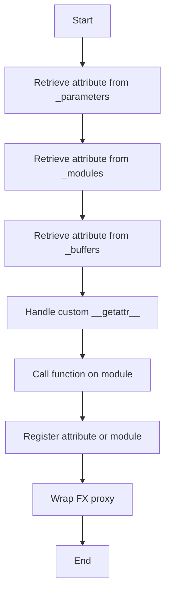

This document will cover the optimization of attribute tracing in nn.Module, which includes:

1. Understanding the purpose of optimizing attribute tracing
2. Detailed steps involved in the optimization process
3. How this optimization affects the end user

Technical document: <SwmLink doc-title="Optimizing Attribute Tracing in nn.Module">[Optimizing Attribute Tracing in nn.Module](/.swm/optimizing-attribute-tracing-in-nnmodule.3ujuez3z.sw.md)</SwmLink>

# [Understanding the purpose of optimizing attribute tracing](https://app.swimm.io/repos/Z2l0aHViJTNBJTNBcHl0b3JjaC1hdXRvZG9jcy1kZW1vJTNBJTNBU3dpbW0tRGVtbw==/docs/3ujuez3z#this-document-explains-the-purpose-and-flow-of-the-manually_trace_nn_module_getattr-function)

The purpose of optimizing attribute tracing in nn.Module is to reduce the overhead associated with repeatedly calling the `__getattr__` method in models that have deep submodule hierarchies. By directly accessing underlying data structures, the system can save significant compilation time, which improves overall performance and efficiency.

# [Detailed steps involved in the optimization process](https://app.swimm.io/repos/Z2l0aHViJTNBJTNBcHl0b3JjaC1hdXRvZG9jcy1kZW1vJTNBJTNBU3dpbW0tRGVtbw==/docs/3ujuez3z#the-flow-starts-with-the-manually_trace_nn_module_getattr-function)

The optimization process involves several key steps:

1. **Retrieve attribute from \_parameters**: The system first attempts to retrieve the attribute from the `_parameters` dictionary. This is a direct lookup that avoids the overhead of calling `__getattr__`.

2. **Retrieve attribute from \_modules**: If the attribute is not found in `_parameters`, the system then looks in the `_modules` dictionary. This step ensures that any submodules are also checked for the attribute.

3. **Retrieve attribute from \_buffers**: If the attribute is still not found, the system checks the `_buffers` dictionary. This step ensures that any buffer attributes are also considered.

4. **Handle custom getattr**: If a custom `__getattr__` method is implemented in the module, the system uses a fallback mechanism to handle it. This ensures that any custom logic defined in `__getattr__` is respected.

5. **Call function on module**: The system then calls the appropriate function or method on the module. This step ensures that the correct function is called and the module is properly initialized if necessary.

6. **Register attribute or module**: The system registers the attribute or module in the output graph. This step ensures that the attribute or module is properly tracked and avoids duplicate registrations.

7. **Wrap FX proxy**: Finally, the system wraps a proxy object for the attribute or module, ensuring that it is properly tracked in the FX graph. This step handles both pre-existing attributes and the results of attribute operations.

# [How this optimization affects the end user](https://app.swimm.io/repos/Z2l0aHViJTNBJTNBcHl0b3JjaC1hdXRvZG9jcy1kZW1vJTNBJTNBU3dpbW0tRGVtbw==/docs/3ujuez3z#this-avoids-the-overhead-of-repeatedly-calling-__getattr__-in-models-with-deep-submodule-hierarchies-thus-saving-compilation-time)

For the end user, this optimization translates to faster model compilation times and improved performance. Users working with complex models that have deep submodule hierarchies will particularly benefit from this optimization. By reducing the overhead associated with attribute tracing, the system can compile models more quickly, allowing users to iterate faster and deploy models more efficiently.

&nbsp;

*This is an auto-generated document by Swimm AI 🌊 and has not yet been verified by a human*

<SwmMeta version="3.0.0" repo-id="Z2l0aHViJTNBJTNBcHl0b3JjaC1hdXRvZG9jcy1kZW1vJTNBJTNBU3dpbW0tRGVtbw==" repo-name="pytorch-autodocs-demo">Powered by [Swimm](https://app.swimm.io/)</SwmMeta>
