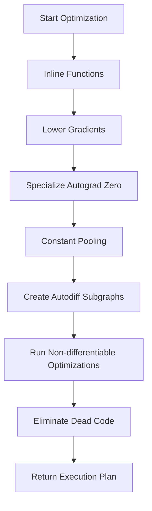

This document will cover the process of optimizing a computational graph, which includes:

1. Initializing the optimization process
2. Performing various optimization phases
3. Handling gradients and differentiable optimizations
4. Finalizing the optimization and generating an execution plan.

Technical document: <SwmLink doc-title="Optimizing a Computational Graph">[Optimizing a Computational Graph](/.swm/optimizing-a-computational-graph.83c2d2ab.sw.md)</SwmLink>

# [Initializing the Optimization Process](https://app.swimm.io/repos/Z2l0aHViJTNBJTNBcHl0b3JjaC1hdXRvZG9jcy1kZW1vJTNBJTNBU3dpbW0tRGVtbw==/docs/83c2d2ab#compilespec)

The optimization process begins with the `compileSpec` function, which takes a computational graph and makes a copy of it. This ensures that the original graph remains unchanged while the optimizations are applied to the copy. This step is crucial for maintaining the integrity of the original data and allows for safe experimentation with different optimization techniques.

# [Performing Various Optimization Phases](https://app.swimm.io/repos/Z2l0aHViJTNBJTNBcHl0b3JjaC1hdXRvZG9jcy1kZW1vJTNBJTNBU3dpbW0tRGVtbw==/docs/83c2d2ab#compilespec)

The copied graph undergoes several phases of optimization. These phases include:

1. **Inlining Functions**: This step replaces function calls with the actual function code. This can reduce the overhead of function calls and make the graph more efficient.
2. **Lowering Gradients**: This phase simplifies the gradient computations, making them more efficient to execute.
3. **Specializing Autograd Zero**: This step optimizes the handling of zero gradients, which are common in many computations.
4. **Constant Pooling**: This phase identifies and pools constant values to reduce redundancy and improve efficiency.

# [Handling Gradients and Differentiable Optimizations](https://app.swimm.io/repos/Z2l0aHViJTNBJTNBcHl0b3JjaC1hdXRvZG9jcy1kZW1vJTNBJTNBU3dpbW0tRGVtbw==/docs/83c2d2ab#compilespec)

If the computational graph requires gradients, the optimization process creates autodiff subgraphs. These subgraphs are specialized for automatic differentiation, which is essential for training machine learning models. Further optimizations are applied to these subgraphs to ensure that gradient computations are as efficient as possible.

# [Finalizing the Optimization and Generating an Execution Plan](https://app.swimm.io/repos/Z2l0aHViJTNBJTNBcHl0b3JjaC1hdXRvZG9jcy1kZW1vJTNBJTNBU3dpbW0tRGVtbw==/docs/83c2d2ab#runnondiffoptimization)

The final phase involves running non-differentiable optimizations. These optimizations include decomposing certain operations, lowering simple tuples, and performing batch matrix multiplications. The graph is also fused to improve execution efficiency. After these optimizations, any dead code is eliminated, and an execution plan is generated. This execution plan is the final optimized version of the computational graph, ready for efficient execution.

&nbsp;

*This is an auto-generated document by Swimm AI 🌊 and has not yet been verified by a human*

<SwmMeta version="3.0.0" repo-id="Z2l0aHViJTNBJTNBcHl0b3JjaC1hdXRvZG9jcy1kZW1vJTNBJTNBU3dpbW0tRGVtbw==" repo-name="pytorch-autodocs-demo">Powered by [Swimm](https://app.swimm.io/)</SwmMeta>
