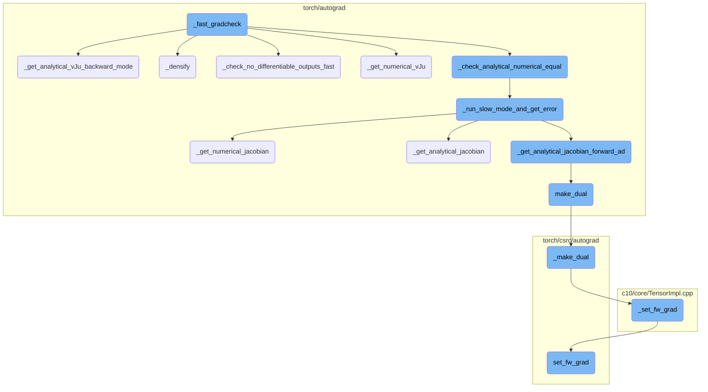
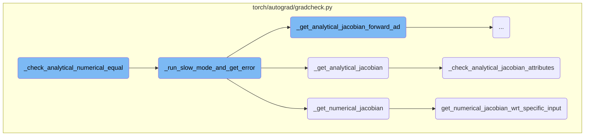
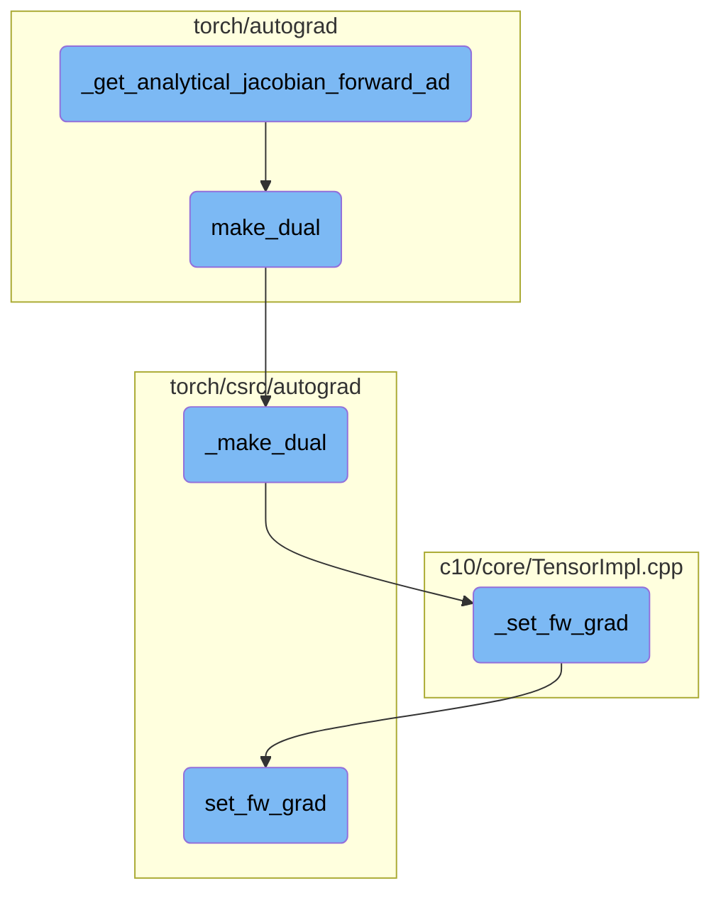

This document provides an overview of the `_fast_gradcheck` function. It explains the purpose of the function, which is to verify the correctness of gradients in a computational graph by comparing analytical and numerical gradients. The document also outlines the main steps involved in this process, including preparing input tensors, computing vectors for gradient checks, densifying inputs, calculating numerical gradients, and comparing them with analytical gradients.

The `_fast_gradcheck` function is designed to ensure that the gradients in a computational graph are correct. It does this by comparing two types of gradients: analytical gradients, which are calculated using a method called backward mode, and numerical gradients, which are calculated using a method called finite differences. The function first prepares the input data and computes the necessary vectors for the gradient checks. If needed, it converts sparse data into a dense format. Then, it calculates the numerical gradients and, depending on the mode, computes the analytical gradients. Finally, it compares the two sets of gradients to make sure they are similar enough, ensuring the correctness of the gradients in the computational graph.

Here is a high level diagram of the flow, showing only the most important functions:



# Flow drill down

First, we'll zoom into this section of the flow:

```mermaid
graph TD;
      cabf67eb5e3d3dae5594832bcb1cb242001fa24eb75bae243b852052416f55d3(_fast_gradcheck):::mainFlowStyle --> c3650ed933242a9abcf672aca7af56ccf6893f41bca6793dde288c22eaaac802(_get_analytical_vJu_backward_mode)

cabf67eb5e3d3dae5594832bcb1cb242001fa24eb75bae243b852052416f55d3(_fast_gradcheck):::mainFlowStyle --> a60022549c9a29c8a4b4e0aca05872bd994887c93954387dabfacac087f3b83f(_densify)

cabf67eb5e3d3dae5594832bcb1cb242001fa24eb75bae243b852052416f55d3(_fast_gradcheck):::mainFlowStyle --> f31fb3c73778d41e8d1a46892095405c9debb4a60fa01c1936c0268156f8d97a(_check_no_differentiable_outputs_fast)

cabf67eb5e3d3dae5594832bcb1cb242001fa24eb75bae243b852052416f55d3(_fast_gradcheck):::mainFlowStyle --> 39450d47f46f5844fbba556f9e2e26ff839f871b47783b81247da6c5e2eb6f5d(_get_numerical_vJu)

cabf67eb5e3d3dae5594832bcb1cb242001fa24eb75bae243b852052416f55d3(_fast_gradcheck):::mainFlowStyle --> 02a1f17bd54e4e5f66c757e43972b7b1d844ad4c3643023a592bf5b6b992a5eb(_check_analytical_numerical_equal):::mainFlowStyle

02a1f17bd54e4e5f66c757e43972b7b1d844ad4c3643023a592bf5b6b992a5eb(_check_analytical_numerical_equal):::mainFlowStyle --> a7kyz(...)

39450d47f46f5844fbba556f9e2e26ff839f871b47783b81247da6c5e2eb6f5d(_get_numerical_vJu) --> 3745cb1b805784b176ae9840b58087cc23282f7b5a55a71e3d243d7dab12319d(_get_numerical_jvp_wrt_specific_input)

f31fb3c73778d41e8d1a46892095405c9debb4a60fa01c1936c0268156f8d97a(_check_no_differentiable_outputs_fast) --> 3745cb1b805784b176ae9840b58087cc23282f7b5a55a71e3d243d7dab12319d(_get_numerical_jvp_wrt_specific_input)

a60022549c9a29c8a4b4e0aca05872bd994887c93954387dabfacac087f3b83f(_densify) --> 7c47e548111ee66e0a3dc89d8f66130d48379126f808076838ee79154a8ce50f(to_sparse)

c3650ed933242a9abcf672aca7af56ccf6893f41bca6793dde288c22eaaac802(_get_analytical_vJu_backward_mode) --> 54cff69f579210b1467ba979c05c4696fd79bff2701f27dc7956312de912ea33(_check_analytical_jacobian_attributes)


      classDef mainFlowStyle color:#000000,fill:#7CB9F4
classDef rootsStyle color:#000000,fill:#00FFF4
classDef Style1 color:#000000,fill:#00FFAA
classDef Style2 color:#000000,fill:#FFFF00
classDef Style3 color:#000000,fill:#AA7CB9
```



<SwmSnippet path="/torch/autograd/gradcheck.py" line="1862">

---

## \_fast_gradcheck

`_fast_gradcheck` is a function designed to verify the correctness of gradients in a computational graph. It does this by comparing analytical gradients (computed using backward mode) with numerical gradients (computed using finite differences). The function first prepares the input tensors and computes the vectors needed for the gradient checks. It then densifies the inputs if necessary and calculates the numerical gradients using `_get_numerical_vJu`. Depending on whether forward mode is used, it either computes the analytical gradients using `_get_analytical_jacobian_forward_ad` or `_get_analytical_vJu_backward_mode`. Finally, it compares the analytical and numerical gradients using `_check_analytical_numerical_equal` to ensure they are within a specified tolerance.

```python
def _fast_gradcheck(
    func,
    func_out,
    inputs,
    outputs,
    eps,
    rtol,
    atol,
    check_grad_dtypes,
    nondet_tol,
    *,
    use_forward_ad=False,
    complex_indices=None,
    test_imag=False,
    masked=False,
):
    # See https://github.com/pytorch/pytorch/issues/53876 for details
    inp_tensors_idx, inp_tensors = _get_inp_tensors(inputs)
    # Backward mode computes v^T * J (VJP)
    # Since we computed J * u (JVP) through finite difference method, we perform an equality check
    # between VJP * u, v * JVP
```

---

</SwmSnippet>

<SwmSnippet path="/torch/autograd/gradcheck.py" line="799">

---

### \_get_analytical_vJu_backward_mode

`_get_analytical_vJu_backward_mode` computes the analytical gradients using backward mode. It iterates over the outputs and computes the Jacobian-vector products (vJ) for each output. These products are then used to form the reduced Jacobians, which are returned for comparison with the numerical gradients.

```python
def _get_analytical_vJu_backward_mode(
    inputs, outputs, nondet_tol, check_grad_dtypes, all_v, all_u
):
    reduced_jacobians: List[List[torch.Tensor]] = []
    for output, v in zip(outputs, all_v):
        all_vJ = _check_analytical_jacobian_attributes(
            inputs, output, nondet_tol, check_grad_dtypes, fast_mode=True, v=v
        )
        jacobian_scalars: List[torch.Tensor] = []
        for vJ, u in zip(all_vJ, all_u):
            # Why do we need squeeze here? vJ is a 2-d tensor so that we can reuse
            # the error checking logic from slow mode
            vJ = vJ.T.squeeze(0)
            if vJ.is_complex():  # C -> R
                tv = torch.view_as_real(vJ.resolve_conj())
                tr = tv.select(-1, 0)
                ti = tv.select(-1, 1)
                jacobian_scalars.append(tr.dot(u[0]) + 1j * ti.dot(u[1]))
            else:  # R -> R
                jacobian_scalars.append(vJ.dot(u))
        reduced_jacobians.append(jacobian_scalars)
```

---

</SwmSnippet>

<SwmSnippet path="/torch/autograd/gradcheck.py" line="92">

---

### \_densify

`_densify` converts sparse tensors into dense tensors by replacing unspecified elements with zero-valued elements. This is necessary for certain gradient checks where sparse tensors need to be handled as dense tensors to ensure correctness.

```python
def _densify(x):
    # return a copy of sparse x with all unspecified elements
    # "replaced" with zero-valued elements
    if isinstance(x, (list, tuple)):
        return type(x)(map(_densify, x))
    elif not is_tensor_like(x) or x.layout in {torch.strided, torch._mkldnn}:  # type: ignore[attr-defined] # no attr _mkldnn
        return x
    elif x.layout is torch.sparse_coo:
        device = x.device
        indices_dtype = x._indices().dtype
        tmp = torch.ones(x.shape[: x.sparse_dim()], dtype=torch.int8, device=device)
        indices = tmp.nonzero().t().to(dtype=indices_dtype)
        values = torch.zeros(
            (tmp.numel(), *x.shape[x.sparse_dim() :]), dtype=x.dtype, device=device
        )
        x_coalesced = x.detach().coalesce()
        if x_coalesced.numel() > 0:
            stride = tmp.stride()
            flat_indices = (
                x_coalesced.indices()
                .mul(
```

---

</SwmSnippet>

<SwmSnippet path="/torch/autograd/gradcheck.py" line="986">

---

### \_check_no_differentiable_outputs_fast

`_check_no_differentiable_outputs_fast` ensures that there are no differentiable outputs for the given function. It computes the numerical Jacobian-vector products (JVPs) and checks if they are zero. If any JVP is non-zero beyond a specified tolerance, it raises a `GradcheckError`.

```python
def _check_no_differentiable_outputs_fast(
    func, func_out, all_inputs, inputs_indices, all_u, eps, nondet_tol
):
    for inp_idx, u in zip(inputs_indices, all_u):
        jvps = _get_numerical_jvp_wrt_specific_input(func, inp_idx, all_inputs, u, eps)
        for jvp in jvps:
            if jvp.numel() == 0:
                continue
            if (jvp - torch.zeros_like(jvp)).abs().max() > nondet_tol:
                raise GradcheckError(
                    "Numerical gradient for function expected to be zero"
                )
    return True
```

---

</SwmSnippet>

<SwmSnippet path="/torch/autograd/gradcheck.py" line="672">

---

### \_get_numerical_vJu

`_get_numerical_vJu` computes the numerical gradients using finite differences. It iterates over the inputs and computes the JVPs for each input. These JVPs are then filtered and, if necessary, combined with the vectors to form the reduced Jacobians, which are returned for comparison with the analytical gradients.

```python
def _get_numerical_vJu(
    fn, inputs, inp_indices, func_out, all_u, all_v, eps, is_forward_ad
):
    # Note that all_v can also be None, in that case, this function only computes Ju.
    reduced_jacobians: List[List[torch.Tensor]] = []
    for i, (inp_idx, u) in enumerate(zip(inp_indices, all_u)):
        all_Ju = _get_numerical_jvp_wrt_specific_input(
            fn, inp_idx, inputs, u, eps, is_forward_ad
        )
        # Filter out the Ju for non floating point outputs
        filtered_Ju = []
        func_out = _as_tuple(func_out)
        assert len(all_Ju) == len(func_out)
        for Ju, output in zip(all_Ju, func_out):
            if _is_float_or_complex_tensor(output):
                filtered_Ju.append(Ju)
            else:
                # TODO: handle the other Ju
                pass
        if all_v is not None:
            jacobian_scalars: List[torch.Tensor] = []
```

---

</SwmSnippet>

<SwmSnippet path="/torch/autograd/gradcheck.py" line="657">

---

### \_get_numerical_jvp_wrt_specific_input

`_get_numerical_jvp_wrt_specific_input` computes the numerical JVPs for a specific input by perturbing the input and evaluating the function. It uses finite differences to approximate the JVPs and returns them for further processing.

```python
def _get_numerical_jvp_wrt_specific_input(
    fn, input_idx, inputs, u, eps, is_forward_ad=False
) -> List[torch.Tensor]:
    input = inputs[input_idx]
    input_to_perturb = _get_input_to_perturb(input)
    wrapped_fn = _with_prepare_inputs(fn, inputs, input_idx, input_to_perturb, True)
    nbhd_checks_fn = functools.partial(_check_outputs_same_dtype_and_shape, eps=eps)
    jvp_fn = _get_numerical_jvp_fn(wrapped_fn, input_to_perturb, eps, nbhd_checks_fn)
    u = _reshape_tensor_or_tuple(u, input_to_perturb.shape)
    u = _mul_tensor_or_tuple(u, eps)
    return _compute_numerical_jvps_wrt_specific_input(
        jvp_fn, u, input.is_complex(), is_forward_ad
    )
```

---

</SwmSnippet>

<SwmSnippet path="/aten/src/ATen/native/TensorConversions.cpp" line="1961">

---

### to_sparse

`to_sparse` converts a dense tensor to a sparse tensor. If the tensor is already sparse, it simply returns the tensor. Otherwise, it performs the conversion and returns the sparse tensor.

```c++
Tensor to_sparse(const Tensor& self, const int64_t sparse_dim) {
  auto layout_to = kSparse;
  if (self.layout() == layout_to) {
    _to_sparse_check_arguments("to_sparse", self, sparse_dim);
    return self;
  }
  return self._to_sparse(sparse_dim);
}
```

---

</SwmSnippet>

<SwmSnippet path="/torch/autograd/gradcheck.py" line="752">

---

### \_check_analytical_jacobian_attributes

`_check_analytical_jacobian_attributes` verifies the attributes of the analytical Jacobian. It computes the Jacobian twice to check for non-determinism and ensures that the gradient types and sizes are correct. If any checks fail, it raises a `GradcheckError`.

```python
"""


def _check_analytical_jacobian_attributes(
    inputs, output, nondet_tol, check_grad_dtypes, fast_mode=False, v=None
) -> Tuple[torch.Tensor, ...]:
    # This is used by both fast and slow mode:
    #  - For slow mode, vjps[i][j] is the jth row of the Jacobian wrt the ith
    #    input.
    #  - For fast mode, vjps[i][0] is a linear combination of the rows
    #    of the Jacobian wrt the ith input
    diff_input_list = list(_iter_tensors(inputs, True))

    def vjp_fn(grad_output):
        return torch.autograd.grad(
            output, diff_input_list, grad_output, retain_graph=True, allow_unused=True
        )

    # Compute everything twice to check for nondeterminism (which we call reentrancy)
    if fast_mode:
        vjps1 = _get_analytical_vjps_wrt_specific_output(vjp_fn, output.clone(), v)
```

---

</SwmSnippet>

Now, lets zoom into this section of the flow:



<SwmSnippet path="/torch/autograd/gradcheck.py" line="1841">

---

## \_check_analytical_numerical_equal

The function `_check_analytical_numerical_equal` is responsible for comparing analytical and numerical Jacobians to ensure their closeness within specified tolerances. It iterates over the numerical Jacobians and compares them with the corresponding analytical Jacobians. If the values are not close enough, it calls `_run_slow_mode_and_get_error` to compute the Jacobians in slow mode for better error messages and raises a `GradcheckError` if the discrepancy persists.

```python
    for i, all_numerical_for_input_i in enumerate(all_numerical):
        for j, n in enumerate(all_numerical_for_input_i):
            # Forward AD generates the transpose of what this function expects
            if is_forward_ad:
                a = all_analytical[i][j]
            else:
                a = all_analytical[j][i]
            n = n.to(device=a.device)
            updated_atol = _adjusted_atol(atol, all_u[i], all_v[j] if all_v else None)
            if not _allclose_with_type_promotion(a, n.to(a.device), rtol, updated_atol):
                jacobians_str = _run_slow_mode_and_get_error(
                    func, tupled_inputs, outputs, i, j, rtol, atol, eps, is_forward_ad
                )
                raise GradcheckError(
                    _get_notallclose_msg(
                        a, n, j, i, complex_indices, test_imag, is_forward_ad
                    )
                    + jacobians_str
                )
```

---

</SwmSnippet>

<SwmSnippet path="/torch/autograd/gradcheck.py" line="1747">

---

## \_run_slow_mode_and_get_error

The function `_run_slow_mode_and_get_error` computes the Jacobians in slow mode to provide a more detailed error message when the fast mode check fails. It calculates both numerical and analytical Jacobians in slow mode and compares them. If they are close enough, it returns a message indicating that the slow mode check would have passed. Otherwise, it provides detailed information about the discrepancies.

```python
def _run_slow_mode_and_get_error(
    func, tupled_inputs, outputs, input_idx, output_idx, rtol, atol, eps, is_forward_ad
):
    # Compute jacobians in slow mode for better error message
    slow_numerical = _get_numerical_jacobian(
        func, tupled_inputs, outputs, eps=eps, is_forward_ad=is_forward_ad
    )[input_idx][output_idx]
    if is_forward_ad:

        def new_fn(inp):
            new_inputs = list(tupled_inputs)
            new_inputs[input_idx] = inp
            return _as_tuple(func(*new_inputs))[output_idx]

        slow_analytical = _get_analytical_jacobian_forward_ad(
            new_fn, (tupled_inputs[input_idx],), (outputs[output_idx],)
        )[0][0]
    else:
        slow_analytical = _get_analytical_jacobian(
            tupled_inputs, outputs, input_idx, output_idx
        )
```

---

</SwmSnippet>

<SwmSnippet path="/torch/autograd/gradcheck.py" line="257">

---

## \_get_numerical_jacobian

The function `_get_numerical_jacobian` computes the numerical Jacobian of a given function with respect to its inputs. It perturbs each input element slightly and observes the change in the output to estimate the Jacobian. This function is crucial for validating the correctness of analytical Jacobians by providing a numerical baseline for comparison.

```python
def _get_numerical_jacobian(
    fn, inputs, outputs=None, target=None, eps=1e-3, is_forward_ad=False
) -> List[Tuple[torch.Tensor, ...]]:
    """Compute the numerical Jacobian of `fn(inputs)` with respect to `target`.

    If not specified, targets are the input. Returns M * N Jacobians where N is the
    number of tensors in target that require grad and M is the number of non-integral
    outputs.

    Args:
        fn: the function to compute the jacobian for
        inputs: inputs to `fn`
        outputs: provide precomputed outputs to avoid one extra invocation of fn
        target: the Tensors wrt whom Jacobians are calculated (default=`inputs`)
        eps: the magnitude of the perturbation during finite differencing
             (default=`1e-3`)
        is_forward_ad: if this numerical jacobian is computed to be checked wrt
                       forward AD gradients (this is used for error checking only)

    Returns:
        A list of M N-tuples of tensors
```

---

</SwmSnippet>

<SwmSnippet path="/torch/autograd/gradcheck.py" line="867">

---

## \_get_analytical_jacobian

The function `_get_analytical_jacobian` computes the analytical Jacobian for a specific input-output pair in slow mode. It bypasses certain checks to focus on the core computation of the Jacobian, which is later used for comparison against the numerical Jacobian.

```python
def _get_analytical_jacobian(inputs, outputs, input_idx, output_idx):
    # Computes the analytical Jacobian in slow mode for a single input-output pair.
    # Forgoes performing checks on dtype, shape, and reentrancy.
    jacobians = _check_analytical_jacobian_attributes(
        inputs, outputs[output_idx], nondet_tol=float("inf"), check_grad_dtypes=False
    )
    return jacobians[input_idx]
```

---

</SwmSnippet>

<SwmSnippet path="/torch/autograd/gradcheck.py" line="465">

---

## get_numerical_jacobian_wrt_specific_input

The function `get_numerical_jacobian_wrt_specific_input` computes the numerical Jacobian with respect to a specific input tensor. It perturbs each element of the input tensor individually and calculates the resulting change in the output, assembling these changes into the Jacobian matrix. This function is used internally by `_get_numerical_jacobian` to handle each input tensor separately.

```python
def get_numerical_jacobian_wrt_specific_input(
    fn, input_idx, inputs, outputs, eps, input=None, is_forward_ad=False
) -> Tuple[torch.Tensor, ...]:
    # Computes the numerical jacobians wrt to a single input. Returns N jacobian
    # tensors, where N is the number of outputs. We use a dictionary for
    # jacobian_cols because indices aren't necessarily consecutive for sparse inputs
    # When we perturb only a single element of the input tensor at a time, the jvp
    # is equivalent to a single col of the Jacobian matrix of fn.
    jacobian_cols: Dict[int, List[torch.Tensor]] = {}
    input = inputs[input_idx] if input is None else input
    assert input.requires_grad
    for x, idx, d_idx in _iter_tensor(input):
        wrapped_fn = _with_prepare_inputs(fn, inputs, input_idx, x)
        input_to_perturb = x[idx]
        nbhd_checks_fn = functools.partial(
            _check_outputs_same_dtype_and_shape, idx=idx, eps=eps
        )
        jvp_fn = _get_numerical_jvp_fn(
            wrapped_fn, input_to_perturb, eps, nbhd_checks_fn
        )
        jacobian_cols[d_idx] = _compute_numerical_jvps_wrt_specific_input(
```

---

</SwmSnippet>

Now, lets zoom into this section of the flow:



<SwmSnippet path="/torch/autograd/gradcheck.py" line="491">

---

## \_get_analytical_jacobian_forward_ad

The function `_get_analytical_jacobian_forward_ad` computes the analytical Jacobian using forward mode automatic differentiation (AD). It processes the inputs to ensure they are suitable for differentiation, allocates space for the Jacobians, and then uses dual tensors to compute the Jacobian. This function is crucial for verifying the correctness of gradients in neural networks.

```python
def _get_analytical_jacobian_forward_ad(
    fn, inputs, outputs, *, check_grad_dtypes=False, all_u=None
) -> Tuple[Tuple[torch.Tensor, ...], ...]:
    """Compute the analytical Jacobian using forward mode AD of `fn(inputs)` using forward mode AD with respect to `target`.

    Return N * M Jacobians where N is the number of tensors in target that require grad and
    M is the number of non-integral outputs.
    Contrary to other functions here, this function requires "inputs" to actually be used by the function.
    The computed value is expected to be wrong if the function captures the inputs by side effect instead of
    using the passed ones (many torch.nn tests do this).

    Args:
        fn: the function to compute the jacobian for
        inputs: inputs to `fn`
        outputs: provide precomputed outputs to avoid one extra invocation of fn
        check_grad_dtypes: if True, will check that the gradient dtype are valid
        all_u (optional): if provided, the Jacobian will be right multiplied with this vector

    Returns:
        A tuple of M N-tuples of tensors
    """
```

---

</SwmSnippet>

<SwmSnippet path="/torch/autograd/forward_ad.py" line="70">

---

## make_dual

The function `make_dual` creates a dual tensor by associating a tensor with its tangent. This is used in forward mode AD to compute the Jacobian-vector product (jvp). The dual tensor allows the function to embed the tangent as an attribute, which can later be extracted using `unpack_dual`. This function is essential for performing forward mode differentiation.

```python
def make_dual(tensor, tangent, *, level=None):
    r"""Associate a tensor value with its tangent to create a "dual tensor" for forward AD gradient computation.

    The result is a new tensor aliased to :attr:`tensor` with :attr:`tangent` embedded
    as an attribute as-is if it has the same storage layout or copied otherwise.
    The tangent attribute can be recovered with :func:`unpack_dual`.

    This function is backward differentiable.

    Given a function `f` whose jacobian is `J`, it allows one to compute the Jacobian-vector product (`jvp`)
    between `J` and a given vector `v` as follows.

    Example::

        >>> # xdoctest: +SKIP("Undefined variables")
        >>> with dual_level():
        ...     inp = make_dual(x, v)
        ...     out = f(inp)
        ...     y, jvp = unpack_dual(out)

    Please see the `forward-mode AD tutorial <https://pytorch.org/tutorials/intermediate/forward_ad_usage.html>`__
```

---

</SwmSnippet>

<SwmSnippet path="/torch/csrc/autograd/VariableTypeManual.cpp" line="147">

---

### \_make_dual

The function `_make_dual` in C++ creates a dual tensor that holds a tangent for forward mode gradients. It ensures that the dual tensor's primal is a view of the given primal tensor and sets the forward gradient. This function is backward differentiable and is used internally by `make_dual`.

```c++
// NB: We need a manual variable type kernel so that set_fw_grad properly
// detects that _make_dual is not a forward-differentiable view
//
// This function can be used to create a dual Tensor that holds a tangent to
// compute forward mode gradients. Note that the dual Tensor's primal is a view
// of the given primal and the given tangent is used as-is. This function is
// backward differentiable.
Tensor _make_dual(
    c10::DispatchKeySet ks,
    const Tensor& primal,
    const Tensor& tangent,
    int64_t level) {
  TORCH_CHECK(
      !primal._fw_grad(level).defined(),
      "Making a dual Tensor based on a Tensor that "
      "already has a forward gradient at the same level ",
      level,
      " is not supported.");
  auto& primal_ = unpack(primal, "primal", 0);
  auto& tangent_ = unpack(tangent, "tangent", 0);
  std::shared_ptr<ViewBackward0> grad_fn;
```

---

</SwmSnippet>

<SwmSnippet path="/c10/core/TensorImpl.cpp" line="67">

---

### \_set_fw_grad

The method `_set_fw_grad` sets the forward gradient for a tensor at a specific level. It initializes the autograd metadata if it doesn't exist and then sets the forward gradient using the provided tensor. This method is used internally to manage forward gradients.

```c++
void TensorImpl::_set_fw_grad(
    const at::TensorBase& new_grad,
    const at::TensorBase& self,
    uint64_t level,
    bool is_inplace_op) {
  if (!autograd_meta_)
    autograd_meta_ = impl::GetAutogradMetaFactory()->make();
  autograd_meta_->set_fw_grad(new_grad, self, level, is_inplace_op);
}
```

---

</SwmSnippet>

<SwmSnippet path="/torch/csrc/autograd/autograd_meta.cpp" line="144">

---

### set_fw_grad

The method `set_fw_grad` ensures that the forward gradient is properly set as a view of the base tensor for in-place operations. It performs various checks to ensure the consistency and validity of the forward gradient and handles the propagation of tangents for differentiable views. This method is crucial for maintaining the integrity of forward gradients during in-place operations.

```c++
// This function is will ensure that the fw_grad_ is properly a view of the base
// for inplace ops on Tensors that do not have forward grad originally.
void AutogradMeta::set_fw_grad(
    const at::TensorBase& new_grad_base,
    const at::TensorBase& self_base,
    uint64_t level,
    bool is_inplace_op) {
  TORCH_CHECK(
      !new_grad_base._fw_grad(level).defined(),
      "Setting a forward grad that "
      "itself has a forward gradient at the same level",
      level,
      " is not supported.");
  TORCH_INTERNAL_ASSERT(
      (new_grad_base.is_floating_point() || new_grad_base.is_complex()) &&
          (self_base.is_floating_point() || self_base.is_complex()),
      "Expected both tensor and its forward grad to be floating point or complex");
  // Lazy initialization
  {
    std::lock_guard<std::mutex> lock(mutex_);
    if (!fw_grad_) {
```

---

</SwmSnippet>

&nbsp;

*This is an auto-generated document by Swimm AI 🌊 and has not yet been verified by a human*

<SwmMeta version="3.0.0" repo-id="Z2l0aHViJTNBJTNBcHl0b3JjaC1hdXRvZG9jcy1kZW1vJTNBJTNBU3dpbW0tRGVtbw==" repo-name="pytorch-autodocs-demo"><sup>Powered by [Swimm](https://app.swimm.io/)</sup></SwmMeta>
