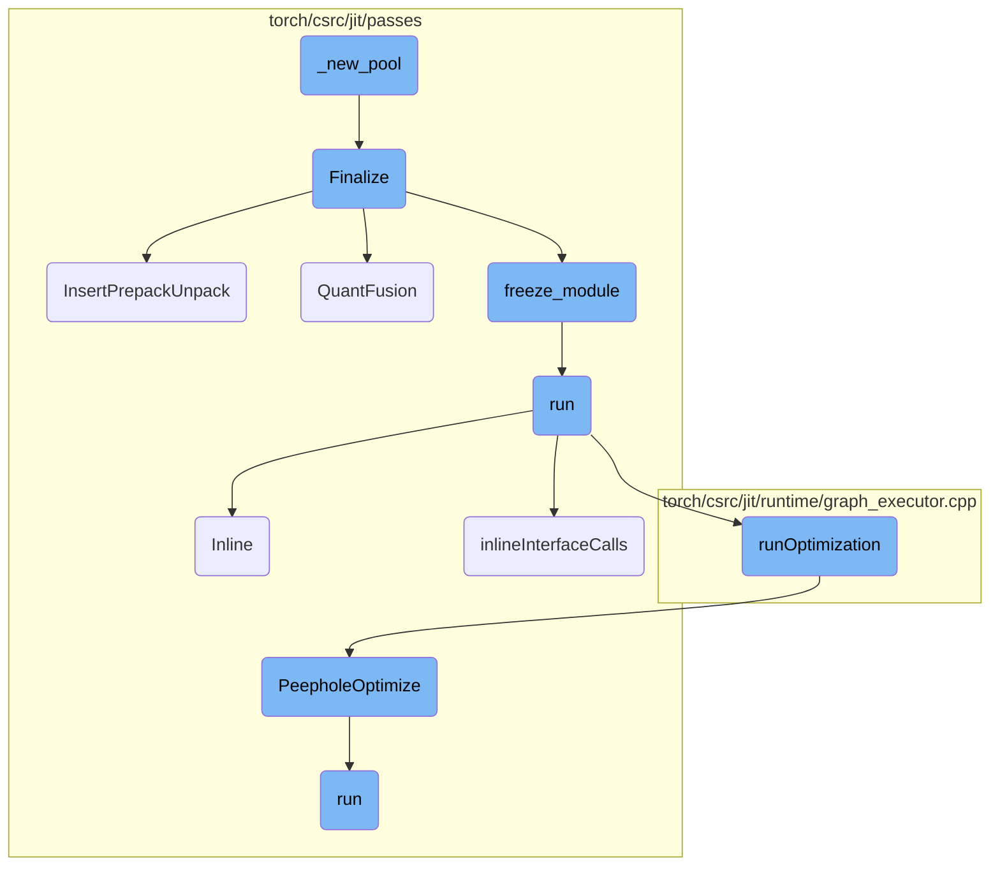
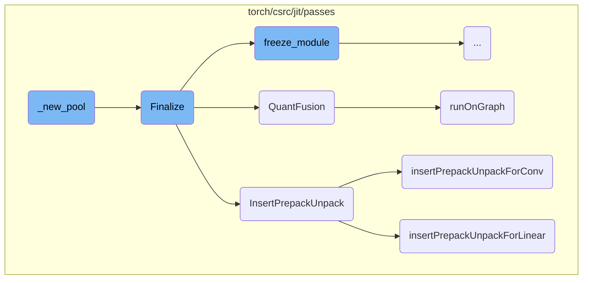
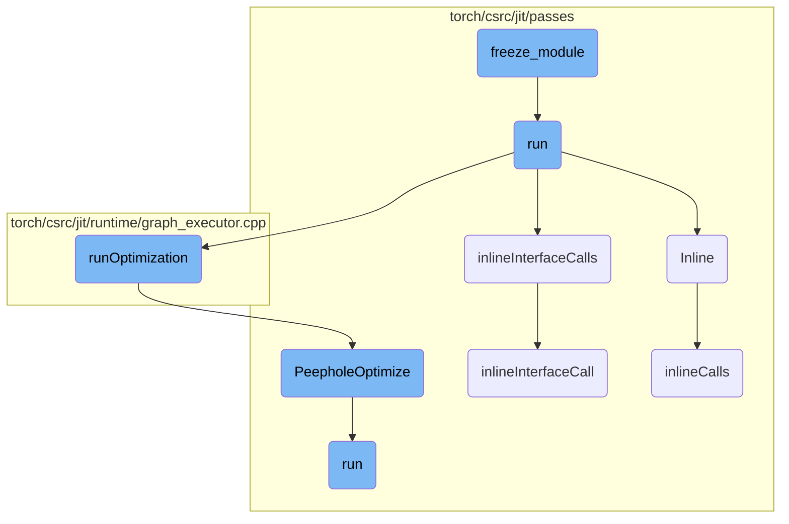

This document provides an overview of the `_new_pool` function, which is responsible for initializing a new process pool using `ProcessPoolExecutor`. The function sets up the multiprocessing context and an initializer for asynchronous compilation. Additionally, it includes an option to warm up the process pool if specified.

The `_new_pool` function starts by creating a new process pool using `ProcessPoolExecutor`. It sets up the necessary multiprocessing context and an initializer to handle asynchronous compilation tasks. If the `warm` parameter is set to true, the function will also warm up the process pool by calling another function designed for this purpose. Finally, the initialized process pool is returned for use.

Here is a high level diagram of the flow, showing only the most important functions:



# Flow drill down

First, we'll zoom into this section of the flow:



<SwmSnippet path="/torch/_inductor/compile_worker/subproc_pool.py" line="207">

---

## \_new_pool Initialization

The `_new_pool` function initializes a new process pool using `ProcessPoolExecutor`. It sets up the multiprocessing context and an initializer for asynchronous compilation. If the `warm` parameter is true, it warms up the process pool by invoking `_warm_process_pool`.

```python
    def _new_pool(self, nprocs, warm):
        pool = ProcessPoolExecutor(
            nprocs,
            mp_context=multiprocessing.get_context("fork"),
            initializer=functools.partial(_async_compile_initializer, os.getpid()),
        )
        multiprocessing.util.Finalize(None, pool.shutdown, exitpriority=sys.maxsize)
        if warm:
            _warm_process_pool(pool, nprocs)
        return pool
```

---

</SwmSnippet>

<SwmSnippet path="/torch/csrc/jit/passes/quantization/finalize.cpp" line="188">

---

## Finalize Process

The `Finalize` function prepares a module for quantization. It clears profiling information, inserts prepack and unpack operations, performs quantization fusion, freezes the module, and folds prepacking operations. This ensures the module is optimized and ready for deployment.

```c++
Module Finalize(
    Module& module,
    QuantType quant_type,
    const std::vector<std::string>& preserved_attrs) {
  // Tracing annotates the resulting graph with shape information. In many case,
  // user applies different input shapes to traced graph. It is on the user to
  // know it is correct to do so. The quantized module needs to be clean up and
  // To prevent the JIT optimizations from leveraging the annotated shape info,
  // clear shape information in the graph.
  for (auto func : module.type()->methods()) {
    ClearProfilingInformation(toGraphFunction(*func).graph());
  }

  auto graph = module.get_method("forward").graph();
  InsertPrepackUnpack(graph);
  GRAPH_DUMP("Before QuantFusion:", graph);
  QuantFusion(graph, quant_type);
  auto frozen = freeze_module(module, preserved_attrs);
  FoldQuantizedPrepackingOps(frozen);
  return frozen;
```

---

</SwmSnippet>

<SwmSnippet path="/torch/csrc/jit/passes/quantization/finalize.cpp" line="141">

---

### InsertPrepackUnpack

The `InsertPrepackUnpack` function inserts prepack and unpack operations into the graph. It calls `insertPrepackUnpackForLinear` and `insertPrepackUnpackForConv` to handle linear and convolutional layers, respectively.

```c++
void InsertPrepackUnpack(std::shared_ptr<Graph>& graph) {
  insertPrepackUnpackForLinear(graph);
  insertPrepackUnpackForConv(graph);
}
```

---

</SwmSnippet>

<SwmSnippet path="/torch/csrc/jit/passes/quantization/finalize.cpp" line="121">

---

### QuantFusion

The `QuantFusion` function performs quantization fusion on the graph. It registers rewrite patterns based on the quantization type and applies them to the graph using `SubgraphRewriter`.

```c++
void QuantFusion(std::shared_ptr<Graph>& graph, QuantType quant_type) {
  std::vector<QuantFusionInfo> patterns;
  if (quant_type == QuantType::DYNAMIC) {
    patterns = dynamic_quant_fusion_pattern_and_replacements();
    std::vector<QuantFusionInfo> patterns_wo_dynamic_activation_quant =
        dynamic_quantized_linear_pattern_and_replacements();
    patterns.insert(
        patterns.end(),
        patterns_wo_dynamic_activation_quant.begin(),
        patterns_wo_dynamic_activation_quant.end());
  } else {
    patterns = quant_fusion_pattern_and_replacements();
  }
  for (const auto& info : patterns) {
    SubgraphRewriter rewriter;
    rewriter.RegisterRewritePattern(info.pattern, info.replacement);
    rewriter.runOnGraph(graph, info.filters);
  }
}
```

---

</SwmSnippet>

<SwmSnippet path="/torch/csrc/jit/passes/subgraph_rewrite.cpp" line="71">

---

### runOnGraph

The `runOnGraph` method in `SubgraphRewriter` applies registered rewrite patterns to the graph. It iterates over the patterns and rewrites the graph accordingly.

```c++
void SubgraphRewriter::runOnGraph(
    std::shared_ptr<Graph>& graph,
    const std::vector<MatchFilter>& filters) {
  for (const RewritePatternDescr& pattern : patterns_) {
    rewriteSinglePatternOnGraph(graph, pattern, filters);
  }
}
```

---

</SwmSnippet>

<SwmSnippet path="/torch/csrc/jit/passes/quantization/finalize.cpp" line="35">

---

### insertPrepackUnpackForConv

The `insertPrepackUnpackForConv` function inserts prepack and unpack operations for convolutional layers. It registers rewrite patterns specific to convolutional layers and applies them to the graph.

```c++
void insertPrepackUnpackForConv(std::shared_ptr<Graph>& graph) {
  std::vector<QuantFusionInfo> patterns_and_replacements =
      conv_prepack_unpack_patterns();

  for (const auto& entry : patterns_and_replacements) {
    SubgraphRewriter rewriter;
    rewriter.RegisterRewritePattern(entry.pattern, entry.replacement);
    rewriter.runOnGraph(graph, entry.filters);
  }
}
```

---

</SwmSnippet>

<SwmSnippet path="/torch/csrc/jit/passes/quantization/finalize.cpp" line="24">

---

### insertPrepackUnpackForLinear

The `insertPrepackUnpackForLinear` function inserts prepack and unpack operations for linear layers. It registers rewrite patterns specific to linear layers and applies them to the graph.

```c++
void insertPrepackUnpackForLinear(std::shared_ptr<Graph>& graph) {
  std::vector<QuantFusionInfo> patterns_and_replacements =
      linear_prepack_unpack_patterns();

  for (const auto& entry : patterns_and_replacements) {
    SubgraphRewriter rewriter;
    rewriter.RegisterRewritePattern(entry.pattern, entry.replacement);
    rewriter.runOnGraph(graph, entry.filters);
  }
}
```

---

</SwmSnippet>

Now, lets zoom into this section of the flow:



<SwmSnippet path="/torch/csrc/jit/passes/freeze_module.cpp" line="1020">

---

## freeze_module

The `freeze_module` function is responsible for creating a frozen version of a given module. It clones the module and then uses an `AttributePropagator` to propagate attributes throughout the module. This process ensures that the module's attributes are correctly set and optimized for inference, making the module more efficient and reducing runtime overhead.

```c++
Module freeze_module(
    const Module& module,
    std::vector<std::string> preservedAttrs,
    bool freezeInterfaces,
    bool preserveParameters) {
  checkModuleDoesNotReturnSelf(module);

  auto moduleClone = module.clone(true);
  AttributePropagator attrPropagator(
      moduleClone, preservedAttrs, freezeInterfaces, preserveParameters);
  attrPropagator.run();
  return moduleClone;
}
```

---

</SwmSnippet>

<SwmSnippet path="/torch/csrc/jit/passes/freeze_module.cpp" line="111">

---

## run

The `run` function orchestrates the optimization process for the module's methods. It applies inlining and various optimizations to the subgraphs of the methods. Additionally, it handles the inlining of interface calls and records mutable attributes. This function ensures that the module is fully optimized and ready for efficient execution.

```c++
  void run() {
    auto applyInline = [](std::shared_ptr<Graph>& subgraph) {
      Inline(*subgraph);
      ClearProfilingInformation(subgraph);
    };
    auto applyOptimizations = [](std::shared_ptr<Graph>& subgraph) {
#ifndef C10_MOBILE
      Autocast(subgraph);
#endif
      runOptimization(
          subgraph,
          /* unroll_non_constant_loops? */ false,
          /* const_prop_user_classes? */ false);
      EliminateNoOps(subgraph);
      LowerSimpleTuples(subgraph);
    };

    std::unordered_map<std::string, std::unordered_set<std::string>>
        interfacesToReassignType;

    for (auto function : preservedMethods_) {
```

---

</SwmSnippet>

<SwmSnippet path="/torch/csrc/jit/passes/inliner.cpp" line="91">

---

## Inline

The `Inline` function performs inlining on a given graph. It processes the graph by inlining calls to functions and methods, which helps in reducing the overhead of function calls and can lead to more efficient execution.

```c++
void Inline(Graph& graph) {
  GRAPH_DUMP("Before Inlining: ", &graph);
  inlineCalls(graph.block());
  GRAPH_DUMP("After Inlining: ", &graph);
}
```

---

</SwmSnippet>

<SwmSnippet path="/torch/csrc/jit/passes/freeze_module.cpp" line="492">

---

## inlineInterfaceCalls

The `inlineInterfaceCalls` function handles the inlining of interface calls within a graph. It ensures that calls to methods on interface types are correctly inlined and checks for disallowed `SetAttr` calls. This step is crucial for simplifying the module's structure and ensuring that interface types are properly handled during the freezing process.

```c++
  //   [Note: Inlining interfaces strategy]
  // There's two structures that are relevant to freezing:
  // - the graph describing the computation in a method
  // - the module describing the data structure of the module instance.
  //
  // First, in inlineInterfaceCalls, we inline interfaces. This is done in a
  // separate step from normal inlining because CallMethod on an interface type
  // requires extra steps compared to inlining a normal CallMethod.
  //
  // Next we need to simplify the structure of the module data structure, which
  // is done for the most part by the usual steps in cleanupFrozenModule.
  //
  // However, there's a complication that comes from the fact that within a
  // method, you can change the value of an interface to another module that
  // implements that interface.
  //
  // For example:
  //
  // impl: MyInterface
  // ...
  // def forward(self, x):
```

---

</SwmSnippet>

<SwmSnippet path="/torch/csrc/jit/runtime/graph_executor.cpp" line="968">

---

## runOptimization

The `runOptimization` function applies a series of optimization passes to a given graph. These passes include eliminating dead code, common subexpression elimination, peephole optimizations, and constant propagation. The goal is to transform the graph into a more efficient form, reducing runtime overhead and improving performance.

```c++
void runOptimization(
    std::shared_ptr<Graph>& graph,
    bool unroll_non_constant_loops,
    bool const_prop_user_classes) {
  // Basic graph preprocessing to eliminate noise.
  GRAPH_DEBUG(
      "Before EliminateDeadCode (beginning of runOptimization)\n", *graph);
  EliminateDeadCode(graph);
  GRAPH_DEBUG(
      "After EliminateDeadCode, before EliminateCommonSubexpression\n", *graph);
  EliminateCommonSubexpression(graph);
  GRAPH_DEBUG(
      "After EliminateCommonSubexpression , before PeepholeOptimize\n", *graph);

  PeepholeOptimize(graph);
  GRAPH_DEBUG("After PeepholeOptimize, before ConstantPropagation\n", *graph);

  if (const_prop_user_classes) {
    ConstantPropagation(graph);
  } else {
    ConstantPropagation(graph, true);
```

---

</SwmSnippet>

<SwmSnippet path="/torch/csrc/jit/passes/peephole.cpp" line="456">

---

## PeepholeOptimize

The `PeepholeOptimize` function performs peephole optimizations on a given graph. These optimizations are small, localized transformations that simplify the graph and improve its efficiency. The function also eliminates any dead code created during the optimization process.

```c++
bool PeepholeOptimize(
    const std::shared_ptr<Graph>& graph,
    bool addmm_fusion_enabled) {
  PeepholeOptimizeImpl peephole(graph, addmm_fusion_enabled);
  bool changed = peephole.run();
  GRAPH_DUMP("After PeepholeOptimize: ", graph);
  // Eliminate dead code created by any peephole passes we've just done
  if (changed) {
    EliminateDeadCode(graph->block());
  }
  return changed;
}
```

---

</SwmSnippet>

<SwmSnippet path="/torch/csrc/jit/passes/freeze_module.cpp" line="465">

---

## inlineInterfaceCall

The `inlineInterfaceCall` function is invoked when the `freezeInterfaces` parameter is enabled. It retrieves the module associated with an interface and inlines the invoked method. This function ensures that interface methods are correctly inlined, contributing to the overall optimization of the module.

```c++
  // This method is invoked only when 'freezeInterfaces' parameter is on.
  // The module associated with Interface is retrieved and the invoked method
  // is inlined.
  bool inlineInterfaceCall(Node* n, const IValue& attr) {
    auto class_type = attr.type()->expect<ClassType>();
    bool inlined = false;
    for (auto use : n->output()->uses()) {
      auto user_node = use.user;
      if (user_node->kind() == prim::CallMethod) {
        const std::string& methodName = user_node->s(attr::name);
        Function& function = class_type->getMethod(methodName);
        if (auto graphFunction = tryToGraphFunction(function)) {
          GRAPH_UPDATE(
              "Inlining interface method '",
              function.name(),
              "' to ",
              *user_node);

          GRAPH_UPDATE("Function body: ", graphFunction->optimized_graph());
          inlineCallTo(user_node, graphFunction);
          inlined = true;
```

---

</SwmSnippet>

<SwmSnippet path="/torch/csrc/jit/passes/inliner.cpp" line="32">

---

## inlineCalls

The `inlineCalls` function recursively inlines calls within a block. It processes each node in the block, inlining function and method calls as it encounters them. This function helps in reducing the overhead of function calls and contributes to the overall optimization of the graph.

```c++
static void inlineCalls(Block* block) {
  for (auto it = block->nodes().begin(), end = block->nodes().end();
       it != end;) {
    Node* cur = *it++;
    switch (cur->kind()) {
      case prim::CallFunction: {
        if (auto graphFunction = tryToGraphFunction(cur)) {
          auto function_constant = cur->input(0)->node();
          auto fun_type =
              function_constant->output()->type()->expect<FunctionType>();

          cur->removeInput(0);
          GRAPH_UPDATE(
              "Inlining function '",
              fun_type->function()->name(),
              "' to ",
              *cur);

          std::shared_ptr<Graph> g = nullptr;
          // inline optimized graph for debugging/testing purposes.
          // we only insert fallback functions in JIT optimized graphs for
```

---

</SwmSnippet>

<SwmSnippet path="/torch/csrc/jit/passes/peephole.cpp" line="31">

---

## run

The `run` function in `peephole.cpp` applies various peephole optimizations to the graph. It optimizes blocks, list idioms, dictionary idioms, alias-sensitive patterns, and non-tensor operations. The function also combines concatenation operations, contributing to the overall efficiency of the graph.

```c++
  bool run() {
    bool changed = optimizeBlock(graph_->block());
    changed |= PeepholeOptimizeListIdioms(graph_);
    changed |= PeepholeOptimizeDictIdioms(graph_);
    changed |= PeepholeOptimizeAliasSensitive(graph_, shape_peepholes_);
    changed |= PeepholeOptimizeNonTensor(graph_);
    changed |= CombineConcats(graph_);
    return changed;
  }
```

---

</SwmSnippet>

&nbsp;

*This is an auto-generated document by Swimm AI 🌊 and has not yet been verified by a human*

<SwmMeta version="3.0.0" repo-id="Z2l0aHViJTNBJTNBcHl0b3JjaC1hdXRvZG9jcy1kZW1vJTNBJTNBU3dpbW0tRGVtbw==" repo-name="pytorch-autodocs-demo"><sup>Powered by [Swimm](https://app.swimm.io/)</sup></SwmMeta>
