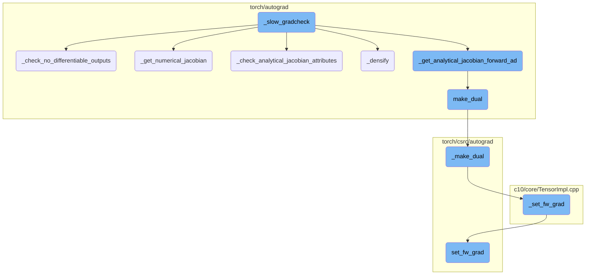
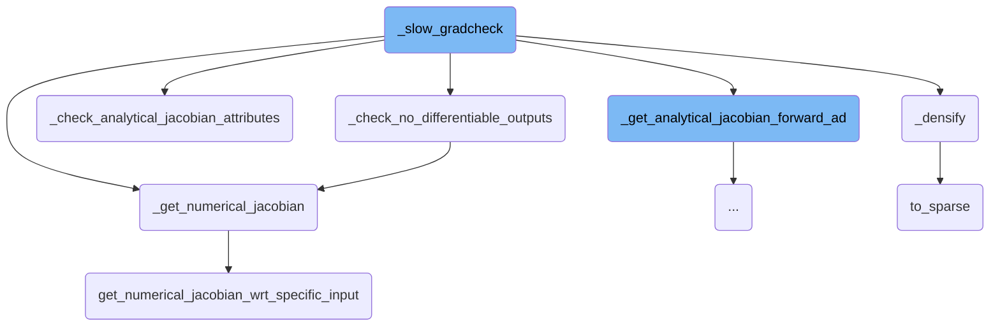
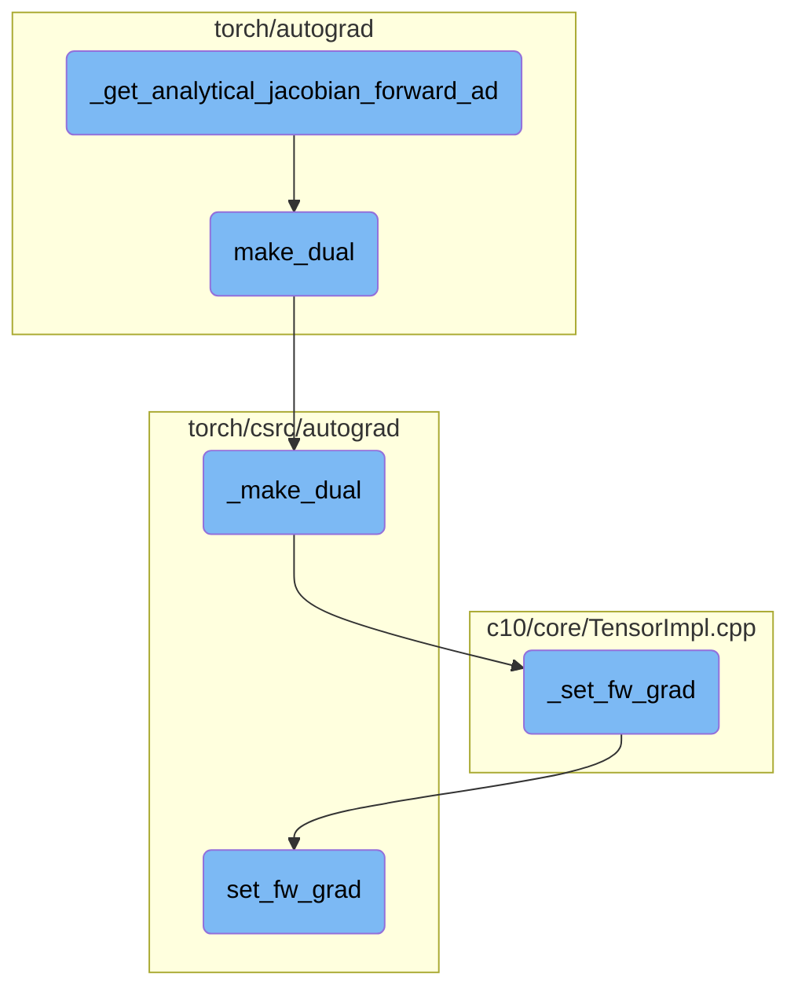

This document provides an overview of the `_slow_gradcheck` function. It explains the main steps involved in the function, including converting outputs to tuples, checking for differentiable outputs, computing numerical Jacobians, and verifying analytical Jacobian attributes.

The `_slow_gradcheck` function starts by converting the function outputs into a tuple. If there are no outputs, it ensures that there are no differentiable outputs. Then, it computes the numerical Jacobian of the function with respect to its inputs. It also checks the attributes of the analytical Jacobian to ensure correctness. Additionally, it converts sparse tensors to dense tensors for numerical gradient computation.

Here is a high level diagram of the flow, showing only the most important functions:



# Flow drill down

First, we'll zoom into this section of the flow:



<SwmSnippet path="/torch/autograd/gradcheck.py" line="1590">

---

## \_slow_gradcheck

The function `_slow_gradcheck` first converts `func_out` to a tuple using `_as_tuple`. If there are no outputs, it calls `_check_no_differentiable_outputs` to ensure that there are no differentiable outputs.

```python
    func_out = _as_tuple(func_out)
    if not outputs:
        return _check_no_differentiable_outputs(
            func, tupled_inputs, func_out, eps=eps, is_forward_ad=use_forward_ad
        )
```

---

</SwmSnippet>

<SwmSnippet path="/torch/autograd/gradcheck.py" line="969">

---

## \_check_no_differentiable_outputs

The function `_check_no_differentiable_outputs` verifies that the numerical gradient for a function is zero when there are no differentiable outputs. It does this by computing the numerical Jacobian and checking if all elements are zero.

```python
def _check_no_differentiable_outputs(
    func, inputs, func_out, eps, *, is_forward_ad
) -> bool:
    # When there are no differentiable outputs, numerical gradient for a function is
    # expected to be zero.
    jacobians_all_inputs_outputs = _get_numerical_jacobian(
        func, inputs, func_out, eps=eps, is_forward_ad=is_forward_ad
    )
    for jacobians_all_outputs_and_fixed_input in jacobians_all_inputs_outputs:
        for jacobian in jacobians_all_outputs_and_fixed_input:
            if torch.ne(jacobian, 0).sum() > 0:
                raise GradcheckError(
                    "Numerical gradient for function expected to be zero"
                )
    return True
```

---

</SwmSnippet>

<SwmSnippet path="/torch/autograd/gradcheck.py" line="257">

---

## \_get_numerical_jacobian

The function `_get_numerical_jacobian` computes the numerical Jacobian of a function with respect to its inputs. It returns a list of Jacobians for each input that requires gradients.

```python
def _get_numerical_jacobian(
    fn, inputs, outputs=None, target=None, eps=1e-3, is_forward_ad=False
) -> List[Tuple[torch.Tensor, ...]]:
    """Compute the numerical Jacobian of `fn(inputs)` with respect to `target`.

    If not specified, targets are the input. Returns M * N Jacobians where N is the
    number of tensors in target that require grad and M is the number of non-integral
    outputs.

    Args:
        fn: the function to compute the jacobian for
        inputs: inputs to `fn`
        outputs: provide precomputed outputs to avoid one extra invocation of fn
        target: the Tensors wrt whom Jacobians are calculated (default=`inputs`)
        eps: the magnitude of the perturbation during finite differencing
             (default=`1e-3`)
        is_forward_ad: if this numerical jacobian is computed to be checked wrt
                       forward AD gradients (this is used for error checking only)

    Returns:
        A list of M N-tuples of tensors
```

---

</SwmSnippet>

<SwmSnippet path="/torch/autograd/gradcheck.py" line="752">

---

## \_check_analytical_jacobian_attributes

The function `_check_analytical_jacobian_attributes` checks the attributes of the analytical Jacobian. It ensures that the gradient has the correct dtype, size, and is reentrant.

```python
"""


def _check_analytical_jacobian_attributes(
    inputs, output, nondet_tol, check_grad_dtypes, fast_mode=False, v=None
) -> Tuple[torch.Tensor, ...]:
    # This is used by both fast and slow mode:
    #  - For slow mode, vjps[i][j] is the jth row of the Jacobian wrt the ith
    #    input.
    #  - For fast mode, vjps[i][0] is a linear combination of the rows
    #    of the Jacobian wrt the ith input
    diff_input_list = list(_iter_tensors(inputs, True))

    def vjp_fn(grad_output):
        return torch.autograd.grad(
            output, diff_input_list, grad_output, retain_graph=True, allow_unused=True
        )

    # Compute everything twice to check for nondeterminism (which we call reentrancy)
    if fast_mode:
        vjps1 = _get_analytical_vjps_wrt_specific_output(vjp_fn, output.clone(), v)
```

---

</SwmSnippet>

<SwmSnippet path="/torch/autograd/gradcheck.py" line="92">

---

## \_densify

The function `_densify` converts sparse tensors to dense tensors by replacing unspecified elements with zero-valued elements. This is necessary for numerical gradient computation.

```python
def _densify(x):
    # return a copy of sparse x with all unspecified elements
    # "replaced" with zero-valued elements
    if isinstance(x, (list, tuple)):
        return type(x)(map(_densify, x))
    elif not is_tensor_like(x) or x.layout in {torch.strided, torch._mkldnn}:  # type: ignore[attr-defined] # no attr _mkldnn
        return x
    elif x.layout is torch.sparse_coo:
        device = x.device
        indices_dtype = x._indices().dtype
        tmp = torch.ones(x.shape[: x.sparse_dim()], dtype=torch.int8, device=device)
        indices = tmp.nonzero().t().to(dtype=indices_dtype)
        values = torch.zeros(
            (tmp.numel(), *x.shape[x.sparse_dim() :]), dtype=x.dtype, device=device
        )
        x_coalesced = x.detach().coalesce()
        if x_coalesced.numel() > 0:
            stride = tmp.stride()
            flat_indices = (
                x_coalesced.indices()
                .mul(
```

---

</SwmSnippet>

<SwmSnippet path="/aten/src/ATen/native/TensorConversions.cpp" line="1961">

---

## to_sparse

The function `to_sparse` converts a dense tensor to a sparse tensor. If the tensor is already sparse, it simply returns the tensor.

```c++
Tensor to_sparse(const Tensor& self, const int64_t sparse_dim) {
  auto layout_to = kSparse;
  if (self.layout() == layout_to) {
    _to_sparse_check_arguments("to_sparse", self, sparse_dim);
    return self;
  }
  return self._to_sparse(sparse_dim);
}
```

---

</SwmSnippet>

<SwmSnippet path="/torch/autograd/gradcheck.py" line="465">

---

## get_numerical_jacobian_wrt_specific_input

The function `get_numerical_jacobian_wrt_specific_input` computes the numerical Jacobian with respect to a specific input. It returns a tuple of Jacobian tensors for each output.

```python
def get_numerical_jacobian_wrt_specific_input(
    fn, input_idx, inputs, outputs, eps, input=None, is_forward_ad=False
) -> Tuple[torch.Tensor, ...]:
    # Computes the numerical jacobians wrt to a single input. Returns N jacobian
    # tensors, where N is the number of outputs. We use a dictionary for
    # jacobian_cols because indices aren't necessarily consecutive for sparse inputs
    # When we perturb only a single element of the input tensor at a time, the jvp
    # is equivalent to a single col of the Jacobian matrix of fn.
    jacobian_cols: Dict[int, List[torch.Tensor]] = {}
    input = inputs[input_idx] if input is None else input
    assert input.requires_grad
    for x, idx, d_idx in _iter_tensor(input):
        wrapped_fn = _with_prepare_inputs(fn, inputs, input_idx, x)
        input_to_perturb = x[idx]
        nbhd_checks_fn = functools.partial(
            _check_outputs_same_dtype_and_shape, idx=idx, eps=eps
        )
        jvp_fn = _get_numerical_jvp_fn(
            wrapped_fn, input_to_perturb, eps, nbhd_checks_fn
        )
        jacobian_cols[d_idx] = _compute_numerical_jvps_wrt_specific_input(
```

---

</SwmSnippet>

Now, lets zoom into this section of the flow:



<SwmSnippet path="/torch/autograd/gradcheck.py" line="491">

---

## \_get_analytical_jacobian_forward_ad

The function `_get_analytical_jacobian_forward_ad` computes the analytical Jacobian using forward mode automatic differentiation (AD). It processes the inputs to ensure they are suitable for differentiation, initializes the Jacobian matrices, and then uses forward AD to compute the Jacobian. The function handles both the full Jacobian computation and the Jacobian-vector product (JVP) computation, depending on whether the `all_u` parameter is provided. This function is crucial for verifying the correctness of gradients in neural networks.

```python
def _get_analytical_jacobian_forward_ad(
    fn, inputs, outputs, *, check_grad_dtypes=False, all_u=None
) -> Tuple[Tuple[torch.Tensor, ...], ...]:
    """Compute the analytical Jacobian using forward mode AD of `fn(inputs)` using forward mode AD with respect to `target`.

    Return N * M Jacobians where N is the number of tensors in target that require grad and
    M is the number of non-integral outputs.
    Contrary to other functions here, this function requires "inputs" to actually be used by the function.
    The computed value is expected to be wrong if the function captures the inputs by side effect instead of
    using the passed ones (many torch.nn tests do this).

    Args:
        fn: the function to compute the jacobian for
        inputs: inputs to `fn`
        outputs: provide precomputed outputs to avoid one extra invocation of fn
        check_grad_dtypes: if True, will check that the gradient dtype are valid
        all_u (optional): if provided, the Jacobian will be right multiplied with this vector

    Returns:
        A tuple of M N-tuples of tensors
    """
```

---

</SwmSnippet>

<SwmSnippet path="/torch/autograd/forward_ad.py" line="70">

---

## make_dual

The function `make_dual` creates a dual tensor by associating a tensor value with its tangent. This dual tensor is used for forward mode AD gradient computation. The function ensures that the tensor and tangent are of appropriate types and levels, and it returns a new tensor with the tangent embedded as an attribute. This is a key step in enabling forward mode AD in PyTorch.

```python
def make_dual(tensor, tangent, *, level=None):
    r"""Associate a tensor value with its tangent to create a "dual tensor" for forward AD gradient computation.

    The result is a new tensor aliased to :attr:`tensor` with :attr:`tangent` embedded
    as an attribute as-is if it has the same storage layout or copied otherwise.
    The tangent attribute can be recovered with :func:`unpack_dual`.

    This function is backward differentiable.

    Given a function `f` whose jacobian is `J`, it allows one to compute the Jacobian-vector product (`jvp`)
    between `J` and a given vector `v` as follows.

    Example::

        >>> # xdoctest: +SKIP("Undefined variables")
        >>> with dual_level():
        ...     inp = make_dual(x, v)
        ...     out = f(inp)
        ...     y, jvp = unpack_dual(out)

    Please see the `forward-mode AD tutorial <https://pytorch.org/tutorials/intermediate/forward_ad_usage.html>`__
```

---

</SwmSnippet>

<SwmSnippet path="/torch/csrc/autograd/VariableTypeManual.cpp" line="147">

---

## \_make_dual

The function `_make_dual` in C++ is responsible for creating a dual tensor that holds a tangent for forward mode gradient computation. It ensures that the primal tensor does not already have a forward gradient at the same level and sets the forward gradient for the dual tensor. This function is backward differentiable and integrates with PyTorch's autograd system.

```c++
// NB: We need a manual variable type kernel so that set_fw_grad properly
// detects that _make_dual is not a forward-differentiable view
//
// This function can be used to create a dual Tensor that holds a tangent to
// compute forward mode gradients. Note that the dual Tensor's primal is a view
// of the given primal and the given tangent is used as-is. This function is
// backward differentiable.
Tensor _make_dual(
    c10::DispatchKeySet ks,
    const Tensor& primal,
    const Tensor& tangent,
    int64_t level) {
  TORCH_CHECK(
      !primal._fw_grad(level).defined(),
      "Making a dual Tensor based on a Tensor that "
      "already has a forward gradient at the same level ",
      level,
      " is not supported.");
  auto& primal_ = unpack(primal, "primal", 0);
  auto& tangent_ = unpack(tangent, "tangent", 0);
  std::shared_ptr<ViewBackward0> grad_fn;
```

---

</SwmSnippet>

<SwmSnippet path="/c10/core/TensorImpl.cpp" line="67">

---

## \_set_fw_grad

The method `_set_fw_grad` sets the forward gradient for a tensor at a specified level. It initializes the autograd metadata if necessary and delegates the setting of the forward gradient to the `set_fw_grad` method of the autograd metadata. This method is essential for managing forward gradients in PyTorch's autograd system.

```c++
void TensorImpl::_set_fw_grad(
    const at::TensorBase& new_grad,
    const at::TensorBase& self,
    uint64_t level,
    bool is_inplace_op) {
  if (!autograd_meta_)
    autograd_meta_ = impl::GetAutogradMetaFactory()->make();
  autograd_meta_->set_fw_grad(new_grad, self, level, is_inplace_op);
}
```

---

</SwmSnippet>

<SwmSnippet path="/torch/csrc/autograd/autograd_meta.cpp" line="144">

---

## set_fw_grad

The method `set_fw_grad` ensures that the forward gradient (`fw_grad_`) is properly set as a view of the base tensor for in-place operations. It performs various checks to ensure the validity of the forward gradient and handles the propagation of tangents for differentiable views. This method is crucial for maintaining the integrity of forward gradients during in-place operations and view manipulations.

```c++
// This function is will ensure that the fw_grad_ is properly a view of the base
// for inplace ops on Tensors that do not have forward grad originally.
void AutogradMeta::set_fw_grad(
    const at::TensorBase& new_grad_base,
    const at::TensorBase& self_base,
    uint64_t level,
    bool is_inplace_op) {
  TORCH_CHECK(
      !new_grad_base._fw_grad(level).defined(),
      "Setting a forward grad that "
      "itself has a forward gradient at the same level",
      level,
      " is not supported.");
  TORCH_INTERNAL_ASSERT(
      (new_grad_base.is_floating_point() || new_grad_base.is_complex()) &&
          (self_base.is_floating_point() || self_base.is_complex()),
      "Expected both tensor and its forward grad to be floating point or complex");
  // Lazy initialization
  {
    std::lock_guard<std::mutex> lock(mutex_);
    if (!fw_grad_) {
```

---

</SwmSnippet>

&nbsp;

*This is an auto-generated document by Swimm AI 🌊 and has not yet been verified by a human*

<SwmMeta version="3.0.0" repo-id="Z2l0aHViJTNBJTNBcHl0b3JjaC1hdXRvZG9jcy1kZW1vJTNBJTNBU3dpbW0tRGVtbw==" repo-name="pytorch-autodocs-demo"><sup>Powered by [Swimm](https://app.swimm.io/)</sup></SwmMeta>
