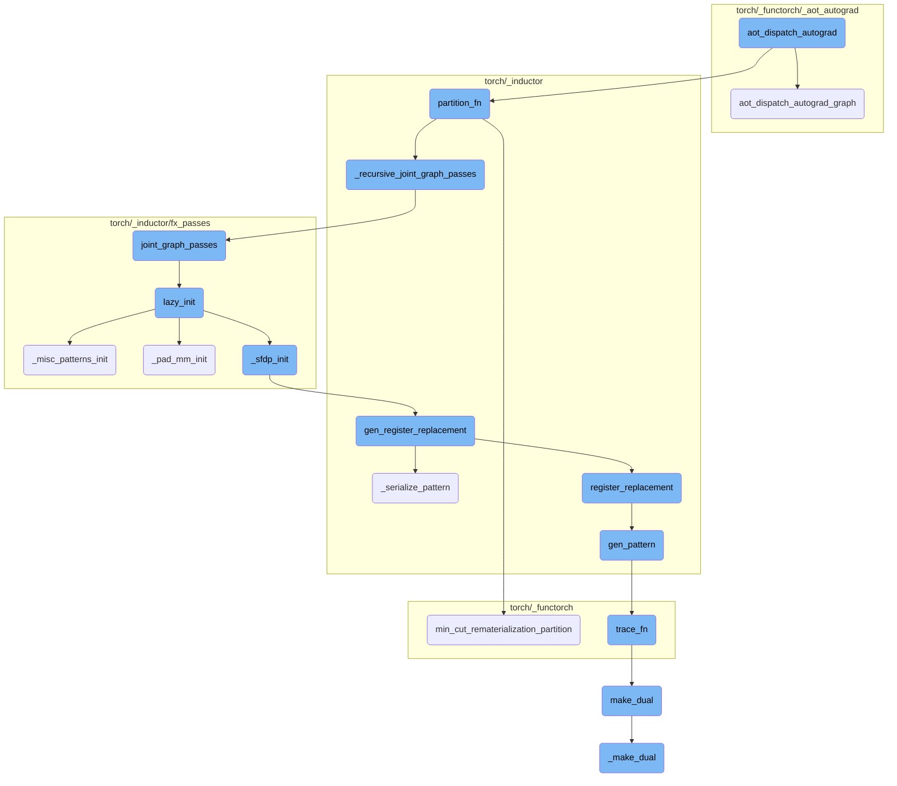
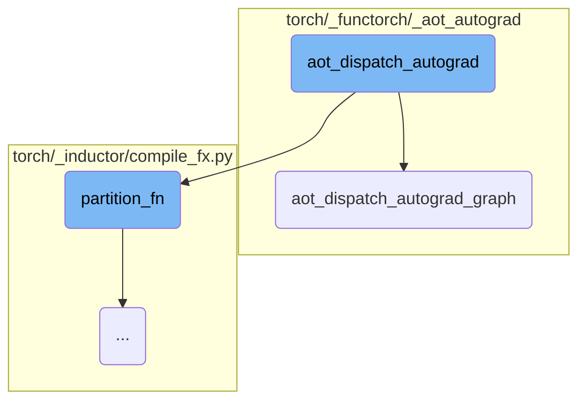
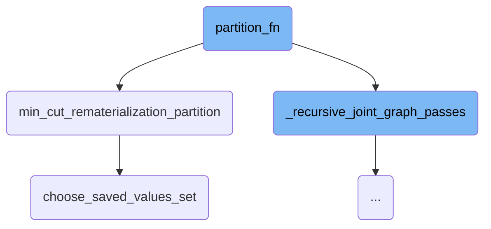
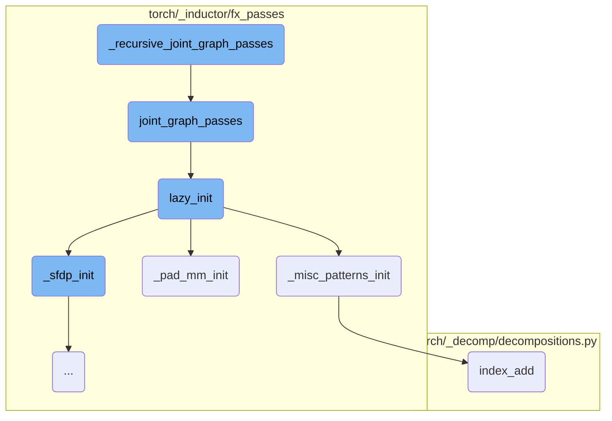
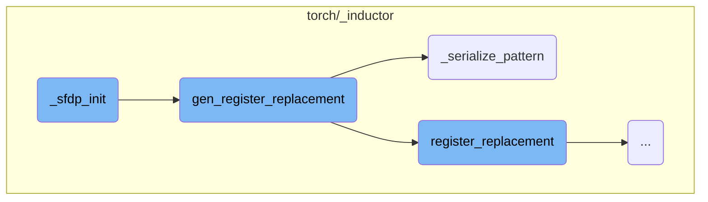
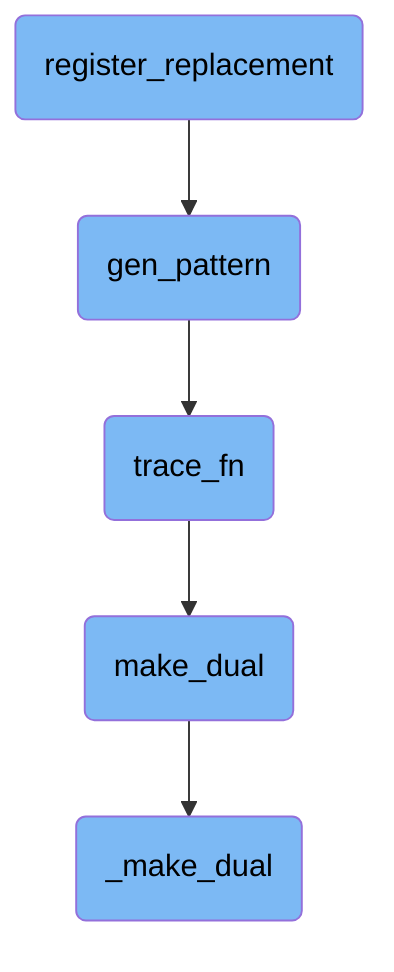

This document provides an overview of the `aot_dispatch_autograd` function, which is responsible for generating a joint graph, partitioning it, and manipulating the input with various wrappers. It then returns a wrapped `torch.autograd.Function` with both forward and backward passes. This function is crucial for handling the autograd logic and preparing the function for further processing.

The `aot_dispatch_autograd` function starts by creating necessary wrappers for dispatch. It then pre-compiles the function and its arguments, ensuring that the metadata is deterministic. Next, it calls the `aot_dispatch_autograd_graph` function to generate a joint graph and manage the inputs and metadata. This joint graph is then partitioned into forward and backward passes, optimizing for memory and computation trade-offs. Finally, the function returns a wrapped `torch.autograd.Function` that includes both the forward and backward passes, ready for further processing.

Here is a high level diagram of the flow, showing only the most important functions:



# Flow drill down

First, we'll zoom into this section of the flow:



<SwmSnippet path="/torch/_functorch/_aot_autograd/jit_compile_runtime_wrappers.py" line="312">

---

## aot_dispatch_autograd

The function `aot_dispatch_autograd` is responsible for generating a joint graph, partitioning it, and manipulating the input with various wrappers. It then returns a wrapped `torch.autograd.Function` with both forward and backward passes. This function is crucial for handling the autograd logic and preparing the function for further processing.

```python
def aot_dispatch_autograd(
    flat_fn,
    flat_args: List[Any],
    aot_config: AOTConfig,
    *,
    fw_metadata: ViewAndMutationMeta,
) -> DispatchReturn:
    """
    Autograd logic. Generates a joint graph, partitions it, manipulates the input with various wrappers,
    and returns a wrapped torch.autograd.Function with a forward and backward.
    """
    wrappers = _create_wrappers_for_dispatch(needs_autograd=True)
    flat_fn, flat_args, fw_metadata = pre_compile(
        wrappers,
        flat_fn,
        flat_args,
        aot_config,
        fw_metadata=fw_metadata,
    )

    fw_metadata.deterministic = torch.are_deterministic_algorithms_enabled()
```

---

</SwmSnippet>

<SwmSnippet path="/torch/_functorch/_aot_autograd/dispatch_and_compile_graph.py" line="228">

---

## aot_dispatch_autograd_graph

The function `aot_dispatch_autograd_graph` prepares the function for autograd by creating a joint function to trace and functionalizing it. It handles the inputs and metadata, ensuring that the function is ready for tracing and further processing. This function is essential for setting up the joint graph and managing the inputs and metadata correctly.

```python
# Has the precondition that there
# are no duplicate arguments in flat_args (e.g., the same Tensor
# object never shows up twice.  However, two tensor inputs MAY alias
# the same storage, so long as they have separate TensorImpls.)
def aot_dispatch_autograd_graph(
    flat_fn,
    flat_args: List[Any],
    aot_config: AOTConfig,
    *,
    fw_metadata: ViewAndMutationMeta,
) -> Tuple[torch.fx.GraphModule, Tuple[List[Any], List[Any]], Optional[SubclassMeta]]:
    # traced_tangents corresponds to the set of outputs in the traced forward that should get grad_outputs in the traced backward.
    # It includes outputs of the original forward, *and* any updated inputs due to input mutations.
    # However, it does *not* include any outputs that are aliases of inputs or intermediates, or any metadata-only input mutations.
    joint_inputs = (flat_args, fw_metadata.traced_tangents)

```

---

</SwmSnippet>

<SwmSnippet path="/torch/_functorch/_aot_autograd/jit_compile_runtime_wrappers.py" line="332">

---

### Interaction between aot_dispatch_autograd and aot_dispatch_autograd_graph

In `aot_dispatch_autograd`, the function `aot_dispatch_autograd_graph` is called to generate the joint graph and manage the inputs and metadata. This interaction is crucial as it sets up the necessary components for the autograd logic to function correctly.

```python
    fw_metadata.deterministic = torch.are_deterministic_algorithms_enabled()
    fx_g, joint_inputs, maybe_subclass_meta = aot_dispatch_autograd_graph(
        flat_fn, flat_args, aot_config, fw_metadata=fw_metadata
    )
```

---

</SwmSnippet>

Now, lets zoom into this section of the flow:



<SwmSnippet path="/torch/_inductor/compile_fx.py" line="1438">

---

## partition_fn

The function `partition_fn` is responsible for initiating the partitioning process of a computational graph. It first calls `_recursive_joint_graph_passes` to perform necessary transformations on the graph. Then, it invokes `min_cut_rematerialization_partition` to partition the graph into forward and backward passes, optimizing for memory and computation trade-offs.

```python
            _recursive_joint_graph_passes(graph)
            return min_cut_rematerialization_partition(
                graph, joint_inputs, **kwargs, compiler="inductor"
            )
```

---

</SwmSnippet>

<SwmSnippet path="/torch/_functorch/partitioners.py" line="1682">

---

## min_cut_rematerialization_partition

The function `min_cut_rematerialization_partition` partitions a joint computational graph into separate forward and backward graphs. This partitioning is done to enable recomputation of forward operations during the backward pass, which helps in trading off memory usage for computation. The function performs dead code elimination, classifies nodes, and uses a memory budget to determine which values to save for the backward pass. It ultimately returns the forward and backward graph modules.

```python
def min_cut_rematerialization_partition(
    joint_module: fx.GraphModule,
    _joint_inputs,
    compiler="inductor",
    *,
    num_fwd_outputs,
) -> Tuple[fx.GraphModule, fx.GraphModule]:
    """
    Partitions the joint graph such that the backward recomputes the forward.
    Recomputing helps in trading off memory bandwidth with computation.

    To create the fwd and bwd graph, we copy the joint graph, manually set the
    outputs to just original forward or backward outputs. And then we run the
    resulting graphs through dead code elimination.

    .. warning::
        This API is experimental and likely to change.

    Args:
        joint_module(fx.GraphModule): The joint forward and backward graph. This
            is the result of AOT Autograd tracing.
```

---

</SwmSnippet>

<SwmSnippet path="/torch/_functorch/partitioners.py" line="1499">

---

## choose_saved_values_set

The function `choose_saved_values_set` is used to select which values should be saved during the forward pass to be used in the backward pass. This selection is based on a memory budget and aims to minimize the memory footprint while ensuring that necessary values are available for gradient computation. The function employs various helper methods to estimate activation sizes, normalize sizes, and compute memory ratios.

```python
def choose_saved_values_set(
    joint_graph: fx.Graph, node_info: NodeInfo, memory_budget=1
) -> List[fx.Node]:
    if memory_budget > 1 or memory_budget < 0:
        raise RuntimeError(
            f"The valid ranges for memory budget are 0 <= m <= 1. The provided value is {memory_budget}"
        )
    min_cut_options = MinCutOptions(
        ban_if_used_far_apart=config.ban_recompute_used_far_apart,
        ban_if_long_fusible_chains=config.ban_recompute_long_fusible_chains,
        ban_if_materialized_backward=config.ban_recompute_materialized_backward,
        ban_if_not_in_allowlist=config.ban_recompute_not_in_allowlist,
        ban_if_reduction=config.ban_recompute_reductions,
    )

    if config.aggressive_recomputation:
        min_cut_options = replace(
            min_cut_options,
            ban_if_used_far_apart=False,
            ban_if_long_fusible_chains=False,
            ban_if_materialized_backward=False,
```

---

</SwmSnippet>

Now, lets zoom into this section of the flow:



<SwmSnippet path="/torch/_inductor/compile_fx.py" line="274">

---

## \_recursive_joint_graph_passes

The function `_recursive_joint_graph_passes` is responsible for recursively applying graph transformations to subgraphs within a given graph module. It first retrieves the names of all subgraphs within the graph module using `_get_subgraph_names`. For each subgraph, it calls itself recursively to ensure that all nested subgraphs are processed. Finally, it applies the `joint_graph_passes` function to the graph module, which performs various FX transformations on the joint forwards and backwards graph.

```python
def _recursive_joint_graph_passes(gm):
    for subgraph_name in _get_subgraph_names(gm):
        subgraph = getattr(gm, subgraph_name)
        _recursive_joint_graph_passes(subgraph)
    joint_graph_passes(gm)
```

---

</SwmSnippet>

<SwmSnippet path="/torch/_inductor/fx_passes/joint_graph.py" line="434">

---

### joint_graph_passes

The `joint_graph_passes` function runs FX transformations on the joint forwards and backwards graph. It initializes necessary components using `lazy_init`, applies custom pre and post passes if configured, removes no-op operations, performs constant folding, and applies pattern matching. If any transformations are applied, it ensures the graph is in a stable topological order, checks for errors, and recompiles the graph.

```python
def joint_graph_passes(graph: torch.fx.GraphModule):
    """
    Run FX transformations on the joint forwards+backwards graph.
    """
    lazy_init()
    count = 0
    if config.joint_custom_pre_pass is not None:
        with GraphTransformObserver(
            graph, "joint_custom_pre_pass", config.trace.log_url_for_graph_xform
        ):
            config.joint_custom_pre_pass(graph.graph)
            count += 1

    from .post_grad import remove_noop_ops

    remove_noop_ops(graph.graph)

    if config.joint_graph_constant_folding:
        with GraphTransformObserver(
            graph, "constant_fold_uniform_value", config.trace.log_url_for_graph_xform
        ):
```

---

</SwmSnippet>

<SwmSnippet path="/torch/_inductor/fx_passes/joint_graph.py" line="43">

---

### lazy_init

The `lazy_init` function initializes various components required for graph transformations. It calls `_pad_mm_init`, `_sfdp_init`, and `_misc_patterns_init` to set up necessary patterns and replacements for matrix multiplication, SFDP, and miscellaneous patterns, respectively.

```python
def lazy_init():
    from .fuse_attention import _sfdp_init
    from .misc_patterns import _misc_patterns_init
    from .pad_mm import _pad_mm_init

    _pad_mm_init()
    _sfdp_init()
    _misc_patterns_init()
```

---

</SwmSnippet>

<SwmSnippet path="/torch/_inductor/fx_passes/misc_patterns.py" line="16">

---

### \_misc_patterns_init

The `_misc_patterns_init` function sets up patterns and replacements for miscellaneous operations. It defines patterns for `randperm_index_add` and `randperm_index`, which optimize index addition and indexing operations by using unique indices and unsafe indexing. These patterns are registered with the `register_replacement` function to enable their use during graph transformations.

```python
def _misc_patterns_init():
    from .joint_graph import patterns as joint_graph_patterns
    from .post_grad import pass_patterns as post_grad_patterns_all

    post_grad_patterns = post_grad_patterns_all[1]  # medium priority

    if torch.cuda.is_available():
        # workaround https://github.com/pytorch/pytorch/issues/97894
        device = "cuda"
    else:
        device = "cpu"

    # These patterns do 2 things
    # 1. Since we know that index is completely unique, we can codegen it using
    # stores instead of atomic adds, which is quite a bit faster.
    # 2. Also, since we are guaranteed that they are completely within bounds,
    # we can use unsafe indexing and skip debug asserts
    def randperm_index_add_pattern(x, y):
        index = torch.randperm(x.shape[0], device=x.device)[: y.shape[0]]
        return torch.index_add(x, dim=0, source=y, index=index), index

```

---

</SwmSnippet>

<SwmSnippet path="/torch/_inductor/fx_passes/pad_mm.py" line="811">

---

### \_pad_mm_init

The `_pad_mm_init` function initializes patterns and replacements for padded matrix multiplication operations. It defines patterns for `mm`, `bmm`, and `addmm` operations and registers them using `gen_register_replacement`. This setup allows the graph transformation process to handle padded matrix multiplications efficiently.

```python
def _pad_mm_init():
    from .joint_graph import patterns

    if torch.cuda.is_available():
        # workaround https://github.com/pytorch/pytorch/issues/97894
        device = "cuda"
    else:
        device = "cpu"

    # sizes/values dont actually matter for initial trace
    # once we get a possible match we re-trace with the actual values and verify the match still holds

    dim2a = functools.partial(torch.empty, (4, 4), device=device, requires_grad=True)
    dim2b = functools.partial(torch.empty, (4, 4), device=device, requires_grad=True)

    dim3a = functools.partial(torch.empty, (4, 4, 4), device=device, requires_grad=True)
    dim3b = functools.partial(torch.empty, (4, 4, 4), device=device, requires_grad=True)

    dim1a = functools.partial(torch.empty, (4), device=device, requires_grad=True)

    # workaround https://github.com/pytorch/pytorch/issues/97894
```

---

</SwmSnippet>

<SwmSnippet path="/torch/_decomp/decompositions.py" line="2588">

---

### index_add

The `index_add` function performs an index addition operation on a tensor. It calls the `_index_add` function with the specified parameters, ensuring that the addition is performed correctly without modifying the original tensor.

```python
def index_add(
    x: TensorLike,
    dim: int,
    index: TensorLike,
    tensor: TensorLike,
    *,
    alpha: NumberType = 1,
):
    return _index_add(x, dim, index, tensor, inplace=False, alpha=alpha)
```

---

</SwmSnippet>

Now, lets zoom into this section of the flow:



<SwmSnippet path="/torch/_inductor/fx_passes/fuse_attention.py" line="906">

---

## \_sfdp_init Initialization

The `_sfdp_init` function initializes the SFDP (Subgraph Fusion and Decomposition Pass) by iterating over patterns obtained from `_get_sfdp_patterns`. For each pattern, it calls `gen_register_replacement` to register the replacement logic.

```python
@functools.lru_cache(None)
def _sfdp_init():
    for key, register_replacement_kwargs in _get_sfdp_patterns():
        gen_register_replacement(key, **register_replacement_kwargs)
```

---

</SwmSnippet>

<SwmSnippet path="/torch/_inductor/pattern_matcher.py" line="1463">

---

## Generating and Registering Replacements

The `gen_register_replacement` function is responsible for generating and registering replacement patterns. It first materializes the example inputs and checks if the environment variable `PYTORCH_GEN_PATTERNS` is set. If so, it serializes the pattern using `_serialize_pattern`. Otherwise, it attempts to import a precompiled pattern. The function then registers the replacement using `register_replacement`.

```python
def gen_register_replacement(
    unique_name: str,
    search_fn: SearchFn,
    replace_fn: ReplaceFn,
    example_inputs: Iterable[Any],
    trace_fn: TraceFn,
    pass_dicts: Union[_PassDictsType, Sequence[_PassDictsType]],
    extra_check: Callable[[Match], bool] = _return_true,
    scalar_workaround: Union[Dict[str, Union[float, int]], None] = None,
    exclusive_arg_names: Sequence[str] = (),
    skip_duplicates: bool = False,
) -> None:
    # Make sure the example_inputs is materialized.
    example_inputs = tuple(example_inputs)

    if "PYTORCH_GEN_PATTERNS" in os.environ:
        pat = _serialize_pattern(
            unique_name, search_fn, example_inputs, trace_fn, scalar_workaround
        )
    else:
        pattern_name = search_fn.__name__
```

---

</SwmSnippet>

<SwmSnippet path="/torch/_inductor/pattern_matcher.py" line="1374">

---

### Serializing Patterns

The `_serialize_pattern` function serializes a given pattern by generating a Python file template and writing the serialized pattern to a file. This function ensures that the pattern can be reused and imported in future runs, thus optimizing the pattern matching process.

```python
def _serialize_pattern(
    unique_name: str,
    search_fn: SearchFn,
    example_inputs: Iterable[Any],
    trace_fn: TraceFn,
    scalar_workaround: Union[Dict[str, Union[float, int]], None],
) -> PatternExpr:
    def get_file_template() -> str:
        auto_generated_msg = textwrap.dedent(
            """\
            # This is an auto-generated file. Please do not modify it by hand.
            # To re-generate, run:
            # cd ~/pytorch && python torchgen/fuse/gen_patterns.py
            """
        )

        file_template = textwrap.dedent(
            """\
            # mypy: ignore-errors

            # noqa: F401, E501
```

---

</SwmSnippet>

Now, lets zoom into this section of the flow:



<SwmSnippet path="/torch/_inductor/pattern_matcher.py" line="1220">

---

## Register Replacement

The function `register_replacement` is responsible for registering a replacement pattern in the pattern matcher. It ensures that shapes are correctly matched by ignoring certain types during the initial match.

```python
    def check_fn(match: Match) -> bool:
        """
        Often shapes get burned into the pattern, so our initial match ran with
        `ignore_types=(int, ...)`.
```

---

</SwmSnippet>

<SwmSnippet path="/torch/_inductor/pattern_matcher.py" line="1274">

---

The `search_fn_new` function is a helper within `register_replacement` that adjusts the arguments for the search function to ensure they match the expected format.

```python
                    def search_fn_new(*args_new: Any) -> Any:
                        return search_fn(*args_new[len(args_new) - len(args) :])
```

---

</SwmSnippet>

<SwmSnippet path="/torch/_inductor/pattern_matcher.py" line="1326">

---

The `normalize_args` function within `register_replacement` normalizes the arguments by extracting them from the keyword arguments and ensuring they are in the correct order.

```python
    def normalize_args(**kwargs: Any) -> List[Any]:
        args = []
        for name in argnames_static:
            args.append(kwargs.pop(name))
```

---

</SwmSnippet>

&nbsp;

*This is an auto-generated document by Swimm AI 🌊 and has not yet been verified by a human*

<SwmMeta version="3.0.0" repo-id="Z2l0aHViJTNBJTNBcHl0b3JjaC1hdXRvZG9jcy1kZW1vJTNBJTNBU3dpbW0tRGVtbw==" repo-name="pytorch-autodocs-demo"><sup>Powered by [Swimm](https://app.swimm.io/)</sup></SwmMeta>
