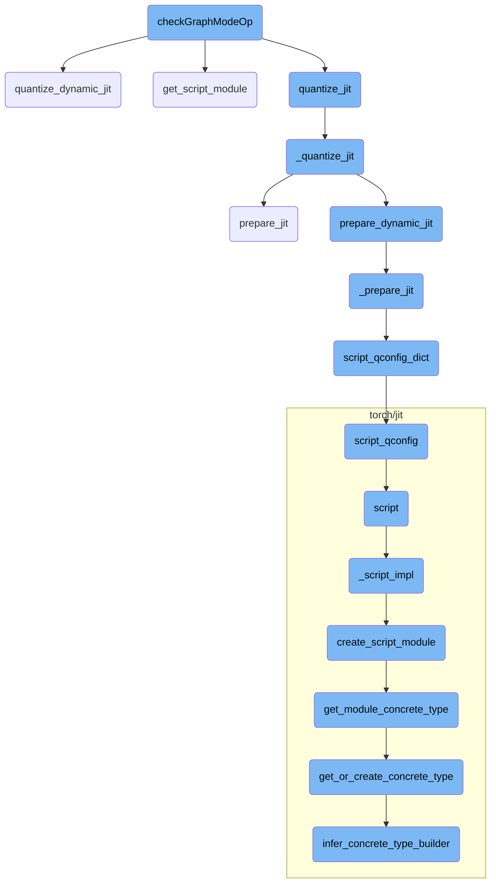
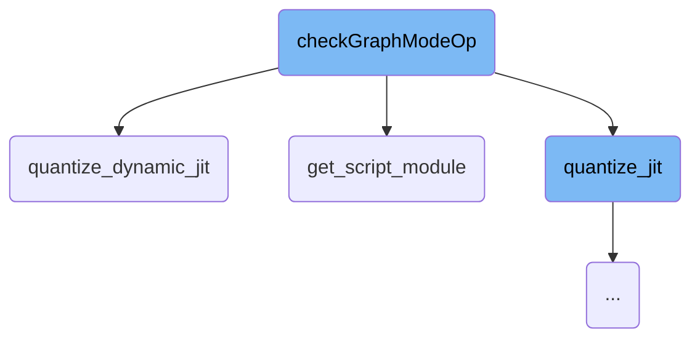
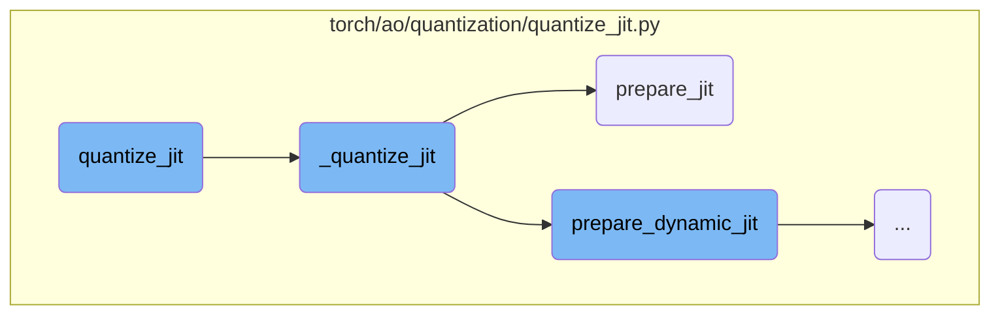
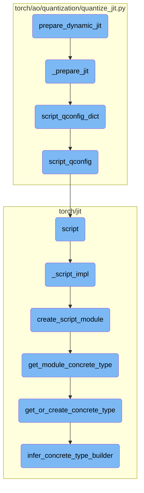

This document provides an overview of the `checkGraphModeOp` function, which is responsible for testing the quantization of a given module. The function sets up the quantization configuration, prepares the module for evaluation, and performs both dynamic and static quantization. It ensures that the quantized model runs correctly and verifies that the debug and non-debug versions produce the same results.

The `checkGraphModeOp` function is used to test how well a module can be quantized. First, it sets up the necessary configurations for quantization. Then, it prepares the module for evaluation. After that, it performs two types of quantization: dynamic and static. Finally, it checks if the quantized model works correctly and ensures that both debug and non-debug versions give the same results.

Here is a high level diagram of the flow, showing only the most important functions:



# Flow drill down

First, we'll zoom into this section of the flow:



<SwmSnippet path="/torch/testing/_internal/common_quantization.py" line="739">

---

## checkGraphModeOp

The `checkGraphModeOp` function is responsible for testing the quantization of a given module. It sets up the quantization configuration, prepares the module for evaluation, and performs both dynamic and static quantization using `quantize_dynamic_jit` and `quantize_jit` respectively. The function ensures that the quantized model runs correctly and verifies that the debug and non-debug versions produce the same results.

```python
    def checkGraphModeOp(self, module, inputs, quantized_op, tracing=False, debug=False,
                         check=True, eval_mode=True, dynamic=False, qconfig=None):
        if debug:
            print('Testing:', str(module))
        qconfig_dict = {'': get_default_qconfig(torch.backends.quantized.engine)}

        if eval_mode:
            module = module.eval()
        if dynamic:
            qconfig_dict = {'': default_dynamic_qconfig if qconfig is None else qconfig}
        model = get_script_module(module, tracing, inputs[0]).eval()
        if debug:
            print('input graph:', model.graph)
        models = {}
        outputs = {}
        for debug in [True, False]:
            if dynamic:
                models[debug] = quantize_dynamic_jit(model, qconfig_dict, debug=debug)
                # make sure it runs
                outputs[debug] = models[debug](inputs)
            else:
```

---

</SwmSnippet>

<SwmSnippet path="/torch/ao/quantization/quantize_jit.py" line="310">

---

### quantize_dynamic_jit

The `quantize_dynamic_jit` function applies post-training dynamic quantization to a TorchScript model. It supports qint8 quantization of `torch.nn.Linear` modules. The function takes a model and a quantization configuration dictionary, and returns a quantized TorchScript model. This function is called within `checkGraphModeOp` when dynamic quantization is required.

````python
def quantize_dynamic_jit(model, qconfig_dict, inplace=False, debug=False):
    r"""Quantize the input float TorchScript model with
    post training dynamic quantization.
    Currently only qint8 quantization of torch.nn.Linear is supported.

    Args:
        `model`: input float TorchScript model
        `qconfig_dict`: qconfig_dict is a dictionary with names of sub modules as key and
        qconfig for that module as value, please see detailed
        descriptions in :func:`~torch.ao.quantization.quantize_jit`
        `inplace`: carry out model transformations in-place, the original module is
        mutated
        `debug`: flag for producing a debug friendly model (preserve weight attribute)

    Return:
        Quantized TorchSciprt model.

    Example:
    ```python
    import torch
    from torch.ao.quantization import per_channel_dynamic_qconfig
````

---

</SwmSnippet>

<SwmSnippet path="/torch/testing/_internal/common_quantization.py" line="441">

---

### get_script_module

The `get_script_module` function converts a given model into a TorchScript module. It uses tracing or scripting based on the `tracing` parameter. This function is used within `checkGraphModeOp` to prepare the model for quantization.

```python
def get_script_module(model, tracing, data):
    return torch.jit.trace(model, data) if tracing else torch.jit.script(model)
```

---

</SwmSnippet>

Now, lets zoom into this section of the flow:



<SwmSnippet path="/torch/ao/quantization/quantize_jit.py" line="248">

---

## Quantizing a TorchScript model

The function `quantize_jit` is responsible for quantizing a given TorchScript model using post-training static quantization. It prepares the model for calibration, runs the calibration function, and then converts the model to a quantized version. This function is essential for optimizing models for deployment by reducing their size and improving inference speed.

```python
def quantize_jit(model, qconfig_dict, run_fn, run_args, inplace=False, debug=False):
    r"""Quantize the input float TorchScript model with
    post training static quantization.

    First it will prepare the model for calibration, then it calls
    `run_fn` which will run the calibration step, after that we will
    convert the model to a quantized model.

    Args:
        `model`: input float TorchScript model
        `qconfig_dict`: qconfig_dict is a dictionary with names of sub modules as key and
        qconfig for that module as value, empty key means the qconfig will be applied
        to whole model unless it's overwritten by more specific configurations, the
        qconfig for each module is either found in the dictionary or fallback to
         the qconfig of parent module.

        Right now qconfig_dict is the only way to configure how the model is quantized,
        and it is done in the granularity of module, that is, we only support one type
        of qconfig for each torch.nn.Module, and the qconfig for sub module will
        override the qconfig for parent module, empty string means global configuration.
        `run_fn`: a calibration function for calibrating the prepared model
```

---

</SwmSnippet>

<SwmSnippet path="/torch/ao/quantization/quantize_jit.py" line="218">

---

### Preparing the model for quantization

The function `_quantize_jit` handles the core logic for preparing and converting the model based on the quantization type. For static quantization, it ensures that a calibration function and dataset are provided, prepares the model using `prepare_jit`, runs the calibration, and then converts the model using `convert_jit`. This function is crucial for the actual transformation of the model into its quantized form.

```python
def _quantize_jit(
    model,
    qconfig_dict,
    run_fn=None,
    run_args=None,
    inplace=False,
    debug=False,
    quant_type=QuantType.STATIC,
):
    # Always do inplace convert because the Tensor is already
    # copied in prepare_jit when inplace is False
    if quant_type == QuantType.DYNAMIC:
        model = prepare_dynamic_jit(model, qconfig_dict, inplace)
        model = convert_dynamic_jit(model, True, debug)
    else:
        assert (
            run_fn
        ), "Must provide calibration function for post training static quantization"
        assert (
            run_args
        ), "Must provide calibration dataset for post training static quantization"
```

---

</SwmSnippet>

<SwmSnippet path="/torch/ao/quantization/quantize_jit.py" line="109">

---

### Preparing the model for calibration

The function `prepare_jit` logs the usage of the quantization API and calls `_prepare_jit` to prepare the model for calibration. This step is necessary to set up the model with the appropriate configurations before running the calibration function.

```python
def prepare_jit(model, qconfig_dict, inplace=False):
    torch._C._log_api_usage_once("quantization_api.quantize_jit.prepare_jit")
    return _prepare_jit(model, qconfig_dict, inplace, quant_type=QuantType.STATIC)
```

---

</SwmSnippet>

Now, lets zoom into this section of the flow:



<SwmSnippet path="/torch/ao/quantization/quantize_jit.py" line="115">

---

## prepare_dynamic_jit

The function `prepare_dynamic_jit` logs the usage of the quantization API and then calls `_prepare_jit` with the `QuantType.DYNAMIC` parameter. This function is crucial for setting up the model for dynamic quantization by preparing it with the necessary configurations.

```python
    torch._C._log_api_usage_once("quantization_api.quantize_jit.prepare_dynamic_jit")
    return _prepare_jit(model, qconfig_dict, inplace, quant_type=QuantType.DYNAMIC)
```

---

</SwmSnippet>

<SwmSnippet path="/torch/ao/quantization/quantize_jit.py" line="73">

---

## \_prepare_jit

The function `_prepare_jit` performs several checks on the model and the `qconfig_dict`. It then scripts the `qconfig_dict` using `script_qconfig_dict`, fuses convolution and batch normalization layers, and inserts observers into the model. This prepares the model for quantization by setting up the necessary configurations and transformations.

```python
    scripted_qconfig_dict = script_qconfig_dict(qconfig_dict)
    model = fuse_conv_bn_jit(model, inplace)
    model_c = torch._C._jit_pass_insert_observers(
        model._c, "forward", scripted_qconfig_dict, inplace, quant_type
    )
```

---

</SwmSnippet>

<SwmSnippet path="/torch/ao/quantization/quantize_jit.py" line="48">

---

## script_qconfig_dict

The function `script_qconfig_dict` applies `script_qconfig` to all entries in the `qconfig_dict` that are not `None`. This ensures that all configurations are properly scripted and ready for the quantization process.

```python
    return {k: script_qconfig(v) if v else None for k, v in qconfig_dict.items()}
```

---

</SwmSnippet>

<SwmSnippet path="/torch/ao/quantization/quantize_jit.py" line="37">

---

## script_qconfig

The function `script_qconfig` scripts the activation and weight observer modules. These observer module instances are then deep-copied during the `prepare_jit` step, ensuring that the model is properly configured for quantization.

```python
    return QConfig(
        activation=torch.jit.script(qconfig.activation())._c,
        weight=torch.jit.script(qconfig.weight())._c,
    )
```

---

</SwmSnippet>

&nbsp;

*This is an auto-generated document by Swimm AI 🌊 and has not yet been verified by a human*

<SwmMeta version="3.0.0" repo-id="Z2l0aHViJTNBJTNBcHl0b3JjaC1hdXRvZG9jcy1kZW1vJTNBJTNBU3dpbW0tRGVtbw==" repo-name="pytorch-autodocs-demo"><sup>Powered by [Swimm](https://app.swimm.io/)</sup></SwmMeta>
