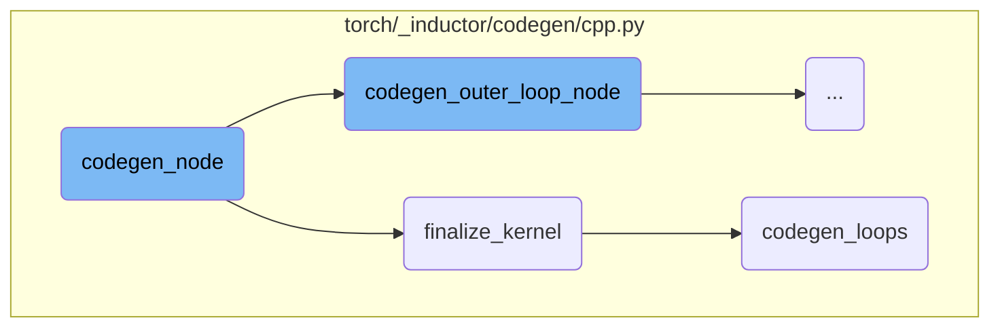
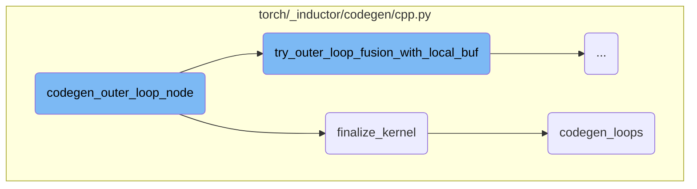
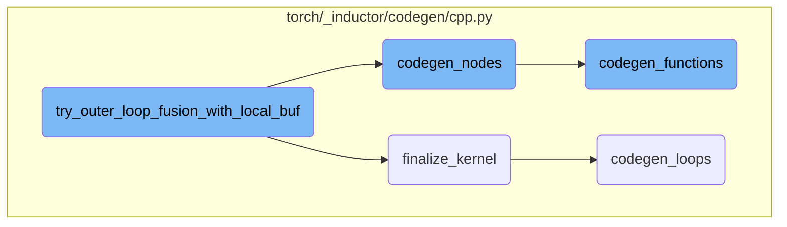

This document provides an overview of the `codegen_node` function, which is responsible for converting a set of pre-fused nodes into a C++ kernel. The document explains the main steps involved in this process, including checking the node type, generating nodes, and finalizing the kernel.

The `codegen_node` function starts by checking if the node is an instance of `OuterLoopFusedSchedulerNode`. If it is, it calls another function to handle the outer loop node. If not, it retrieves the nodes and creates a proxy to generate the nodes. Finally, it finalizes the kernel to ensure it is ready for execution. This process involves several steps to optimize performance and ensure the generated code is correct.

Here is a high level diagram of the flow, showing only the most important functions:

```mermaid
graph TD;
      subgraph torchinductorcodegencpppy["torch/_inductor/codegen/cpp.py"]
e4d8a59659e798c4f4df23f47e7595faf0d4aeb0ed63c83c2102b05fec72e07e(codegen_node):::mainFlowStyle --> 1a1a7ebae7cdc9addd83932349edb185b0f0812e9cec167b5ee7473bbc2eaeac(finalize_kernel)
end

subgraph torchinductorcodegencpppy["torch/_inductor/codegen/cpp.py"]
e4d8a59659e798c4f4df23f47e7595faf0d4aeb0ed63c83c2102b05fec72e07e(codegen_node):::mainFlowStyle --> 8587f202835ef036707d5bae34043bf93ed3e259b0677042d3fb18fb32d284cb(codegen_outer_loop_node):::mainFlowStyle
end

subgraph torchinductorcodegencpppy["torch/_inductor/codegen/cpp.py"]
8587f202835ef036707d5bae34043bf93ed3e259b0677042d3fb18fb32d284cb(codegen_outer_loop_node):::mainFlowStyle --> 1a1a7ebae7cdc9addd83932349edb185b0f0812e9cec167b5ee7473bbc2eaeac(finalize_kernel)
end

subgraph torchinductorcodegencpppy["torch/_inductor/codegen/cpp.py"]
8587f202835ef036707d5bae34043bf93ed3e259b0677042d3fb18fb32d284cb(codegen_outer_loop_node):::mainFlowStyle --> f26058df0b5a59e98ecdee1b0ed51d81c0e955fb3191ffddc48556ec1a8f6610(try_outer_loop_fusion_with_local_buf):::mainFlowStyle
end

subgraph torchinductorcodegencpppy["torch/_inductor/codegen/cpp.py"]
f26058df0b5a59e98ecdee1b0ed51d81c0e955fb3191ffddc48556ec1a8f6610(try_outer_loop_fusion_with_local_buf):::mainFlowStyle --> 1a1a7ebae7cdc9addd83932349edb185b0f0812e9cec167b5ee7473bbc2eaeac(finalize_kernel)
end

subgraph torchinductorcodegencpppy["torch/_inductor/codegen/cpp.py"]
f26058df0b5a59e98ecdee1b0ed51d81c0e955fb3191ffddc48556ec1a8f6610(try_outer_loop_fusion_with_local_buf):::mainFlowStyle --> c2861164ba76037213d09e8f3db070801c19281d57f6276b6ec397d7177cc092(codegen_nodes):::mainFlowStyle
end

subgraph torchinductorcodegencpppy["torch/_inductor/codegen/cpp.py"]
c2861164ba76037213d09e8f3db070801c19281d57f6276b6ec397d7177cc092(codegen_nodes):::mainFlowStyle --> 48132d8e335595b53cae6e51b0ae25157dc0ac673ff81f1069cdf94bebcbd161(codegen_functions):::mainFlowStyle
end


      classDef mainFlowStyle color:#000000,fill:#7CB9F4
classDef rootsStyle color:#000000,fill:#00FFF4
classDef Style1 color:#000000,fill:#00FFAA
classDef Style2 color:#000000,fill:#FFFF00
classDef Style3 color:#000000,fill:#AA7CB9
```



# Flow drill down

First, we'll zoom into this section of the flow:



<SwmSnippet path="/torch/_inductor/codegen/cpp.py" line="4211">

---

## Codegen Node

The `codegen_node` function is responsible for converting a set of pre-fused nodes into a C++ kernel. It first checks if the node is an instance of `OuterLoopFusedSchedulerNode` and calls `codegen_outer_loop_node` if true. Otherwise, it retrieves the nodes, creates a `CppKernelProxy`, and generates the nodes using `cpp_kernel_proxy.codegen_nodes`. Finally, it finalizes the kernel by calling `kernel_group.finalize_kernel`.

```python
    def codegen_node(
        self,
        node: Union[OuterLoopFusedSchedulerNode, FusedSchedulerNode, SchedulerNode],
    ):
        """
        Turn an set of pre-fused nodes into a C++ kernel.
        """
        kernel_group = self.kernel_group

        if isinstance(node, OuterLoopFusedSchedulerNode):
            self.codegen_outer_loop_node(node)
        else:
            nodes: List[SchedulerNode] = node.get_nodes()  # type: ignore[assignment]
            cpp_kernel_proxy = CppKernelProxy(kernel_group)
            cpp_kernel_proxy.codegen_nodes(nodes)
            kernel_group.finalize_kernel(cpp_kernel_proxy, nodes)

        args_num = self._get_scheduled_num_args()
        if args_num > CppScheduling.MAX_FUSED_KERNEL_ARGS_NUM:
            self._set_flush_status(True)
```

---

</SwmSnippet>

<SwmSnippet path="/torch/_inductor/codegen/cpp.py" line="4331">

---

## Finalize Kernel

The `finalize_kernel` function adds the nodes to the scheduled nodes list and generates the loops for the new kernel by calling `new_kernel.codegen_loops`. This function ensures that the kernel is properly finalized and ready for execution.

```python
    def finalize_kernel(self, new_kernel, nodes):
        self.scheduled_nodes += nodes
        code = self.loops_code
        ws = self.ws
        new_kernel.codegen_loops(code, ws)
```

---

</SwmSnippet>

<SwmSnippet path="/torch/_inductor/codegen/cpp.py" line="1931">

---

## Codegen Loops

The `codegen_loops` function builds a loop nest using `LoopNestWithSplit.build` and then calls `codegen_loops_impl` to generate the loops. This function is crucial for creating the loop structure required for the kernel's execution.

```python
    def codegen_loops(self, code, worksharing):
        loop_nest = LoopNestWithSplit.build(self)
        self.codegen_loops_impl(loop_nest, code, worksharing)
```

---

</SwmSnippet>

Now, lets zoom into this section of the flow:



<SwmSnippet path="/torch/_inductor/codegen/cpp.py" line="4022">

---

## Code Generation for Outer Loop Node

The function `codegen_outer_loop_node` is responsible for generating code for an outer loop node. This function is a crucial part of the code generation process as it handles the outer loop structure, which is essential for optimizing performance in nested loop scenarios.

```python
    def codegen_outer_loop_node(
        self,
        node: OuterLoopFusedSchedulerNode,
    ):
        """
        Generate the code for the outer loop fused scheduler node.
        1. Codegen with fused outer loop: depends on the analysis of
            the outer loop fused scheduler node, with or without the local buffer.
        2. If failed, fallback to standard codegen.
        """
        kernel_group = self.kernel_group
        generated_cpp_vec_kernel_count = metrics.generated_cpp_vec_kernel_count
        cpp_kernel_proxy_list: List[CppKernelProxy] = []
        nodes_list: List[List[SchedulerNode]] = []
        assert isinstance(node, OuterLoopFusedSchedulerNode)

        def try_outer_loop_fusion_with_local_buf(node: OuterLoopFusedSchedulerNode):
```

---

</SwmSnippet>

<SwmSnippet path="/torch/_inductor/codegen/cpp.py" line="4038">

---

### Finalizing the Kernel

The function `finalize_kernel` is called within `codegen_outer_loop_node` to finalize the kernel after the outer loop code has been generated. This step ensures that the generated code is correctly structured and optimized for execution.

```python
        def try_outer_loop_fusion_with_local_buf(node: OuterLoopFusedSchedulerNode):
            """
            Codegen code with fused outer loop and local Buffer.
            """
            assert isinstance(node, OuterLoopFusedSchedulerNode)
            cpp_kernel_proxy_list.clear()
            nodes_list.clear()

            def get_call_ranges(node: BaseSchedulerNode):
```

---

</SwmSnippet>

<SwmSnippet path="/torch/_inductor/codegen/cpp.py" line="4038">

---

### Trying Outer Loop Fusion with Local Buffer

The function `try_outer_loop_fusion_with_local_buf` attempts to fuse the outer loop with a local buffer. This optimization can significantly improve performance by reducing memory access overhead and enhancing data locality.

```python
        def try_outer_loop_fusion_with_local_buf(node: OuterLoopFusedSchedulerNode):
            """
            Codegen code with fused outer loop and local Buffer.
            """
            assert isinstance(node, OuterLoopFusedSchedulerNode)
            cpp_kernel_proxy_list.clear()
            nodes_list.clear()

            def get_call_ranges(node: BaseSchedulerNode):
```

---

</SwmSnippet>

Now, lets zoom into this section of the flow:



<SwmSnippet path="/torch/_inductor/codegen/cpp.py" line="4038">

---

## try_outer_loop_fusion_with_local_buf

The function `try_outer_loop_fusion_with_local_buf` attempts to fuse outer loops with local buffers. This optimization can improve performance by reducing memory access overhead and increasing data locality. It checks if the fusion is possible and beneficial, and if so, it modifies the loop structure accordingly.

```python
        def try_outer_loop_fusion_with_local_buf(node: OuterLoopFusedSchedulerNode):
            """
            Codegen code with fused outer loop and local Buffer.
            """
            assert isinstance(node, OuterLoopFusedSchedulerNode)
            cpp_kernel_proxy_list.clear()
            nodes_list.clear()

            def get_call_ranges(node: BaseSchedulerNode):
```

---

</SwmSnippet>

<SwmSnippet path="/torch/_inductor/codegen/cpp.py" line="3677">

---

## codegen_nodes

The function `codegen_nodes` is responsible for generating code for a list of scheduler nodes. It first legalizes the data types and propagates them through the nodes. Then, it creates a list of functions for each node, potentially localizing them if local buffers are used. Finally, it calls `codegen_functions` to generate the actual code.

```python
    def codegen_nodes(self, nodes: List[SchedulerNode]):
        # Legalize BF16 node by adding to_dtype explicitly
        self.legalize_lowp_fp_dtype(nodes)
        self.data_type_propagation(nodes)

        assert len(nodes) >= 1
        first_node = nodes[0]
        vec_dtype = (
            first_node._lowp_fp_type  # type: ignore[attr-defined]
            if all(
                hasattr(_node, "_lowp_fp_type")
                and _node._lowp_fp_type == first_node._lowp_fp_type  # type: ignore[attr-defined]
                for _node in nodes
            )
            else torch.float
        )

        def fn(node, *index_vars):
            node.decide_inplace_update()
            node.mark_run()
            if isinstance(V.kernel, NullKernelHandler):
```

---

</SwmSnippet>

<SwmSnippet path="/torch/_inductor/codegen/cpp.py" line="3449">

---

## codegen_functions

The function `codegen_functions` generates the final code for a list of functions. It handles various aspects of code generation, including setting ranges, selecting tiling indices, and managing kernel execution. This function ensures that the generated code is optimized for performance and correctness.

```python
    def codegen_functions(self, fn_list, var_sizes_list, vec_dtype=torch.float):
        # TODO(jgong5): remove vec_dtype arg with alternative tiling factors for various dtypes
        assert len(fn_list) == len(var_sizes_list)
        kernel_group = self.kernel_group
        group, reduction_group = max(var_sizes_list, key=lambda sizes: len(sizes[1]))

        self.set_ranges(group, reduction_group)

        def codegen_kernel(cls, *args):
            with kernel_group.new_kernel(cls, *args) as kernel:
                # Ugly hack to maintain the metrics kernel count since
                # we only count in CppKernelProxy, not those contained in it
                metrics.generated_kernel_count -= 1

                run(kernel)
                return kernel

        def run(kernel):
            vars, reduction_vars = kernel.set_ranges(group, reduction_group)
            in_suffix = False
            for fn, var_sizes in zip(fn_list, var_sizes_list):
```

---

</SwmSnippet>

&nbsp;

*This is an auto-generated document by Swimm AI 🌊 and has not yet been verified by a human*

<SwmMeta version="3.0.0" repo-id="Z2l0aHViJTNBJTNBcHl0b3JjaC1hdXRvZG9jcy1kZW1vJTNBJTNBU3dpbW0tRGVtbw==" repo-name="pytorch-autodocs-demo"><sup>Powered by [Swimm](https://app.swimm.io/)</sup></SwmMeta>
