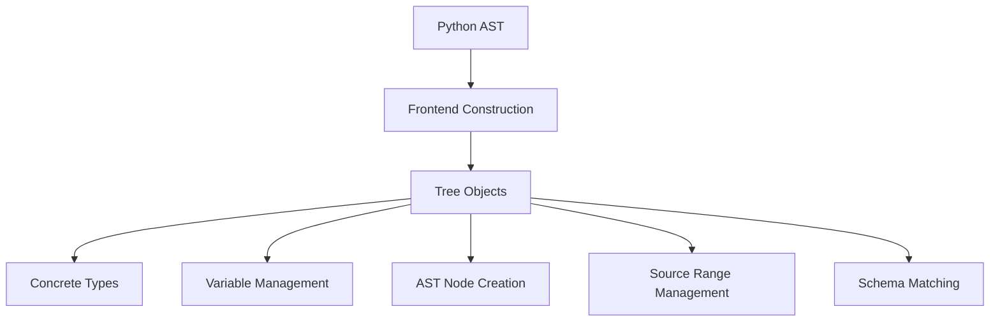

# Overview

Frontend in Jit refers to the construction of Tree objects directly from Python Abstract Syntax Trees (ASTs). The logic for this construction is contained within the <SwmPath>[torch/jit/frontend.py](torch/jit/frontend.py)</SwmPath> file and is intentionally kept minimal. The primary reason for keeping the JIT code minimal in Python is to ensure that most of the JIT functionality can still work without Python installed.

<SwmSnippet path="/torch/csrc/jit/frontend/concrete_module_type.h" line="55">

---

# Handling Concrete Types

Represents a concrete type during the construction process. This is part of the Frontend's role in handling types and ensuring they are correctly interpreted from the AST.

```c
// Represents a concrete type during in the process for construction. We use
```

---

</SwmSnippet>

<SwmSnippet path="/torch/csrc/jit/frontend/convert_to_ssa.cpp" line="131">

---

# Variable Management

Loads of the variable will use the loop carried value. This indicates how variables are managed and transformed during the JIT compilation process.

```c++
      // loads of the variable will use the loop carried value
```

---

</SwmSnippet>

<SwmSnippet path="/torch/csrc/jit/frontend/parser.cpp" line="54">

---

# AST Node Creation

Use its create method so that the accessors and the constructor. This highlights the methods used in the Frontend to create and manage AST nodes.

```c++
    // use its create method so that the accessors and the constructor
```

---

</SwmSnippet>

<SwmSnippet path="/torch/csrc/jit/frontend/source_range.cpp" line="229">

---

# Source Range Management

Use instead of 'end()' because some ranges extend past. This shows how source ranges are managed in the Frontend, ensuring accurate representation of code segments.

```c++
           : end()); // use instead of 'end()' because some ranges extend past
```

---

</SwmSnippet>

<SwmSnippet path="/torch/csrc/jit/frontend/schema_matching.cpp" line="443">

---

# Schema Matching

Argument has a default value and no value was provided, so use the. This demonstrates how default values are handled in the Frontend during the parsing and matching of schemas.

```c++
      // Argument has a default value and no value was provided, so use the
```

---

</SwmSnippet>

&nbsp;

*This is an auto-generated document by Swimm AI 🌊 and has not yet been verified by a human*

<SwmMeta version="3.0.0" repo-id="Z2l0aHViJTNBJTNBcHl0b3JjaC1hdXRvZG9jcy1kZW1vJTNBJTNBU3dpbW0tRGVtbw==" repo-name="pytorch-autodocs-demo"><sup>Powered by [Swimm](/)</sup></SwmMeta>
