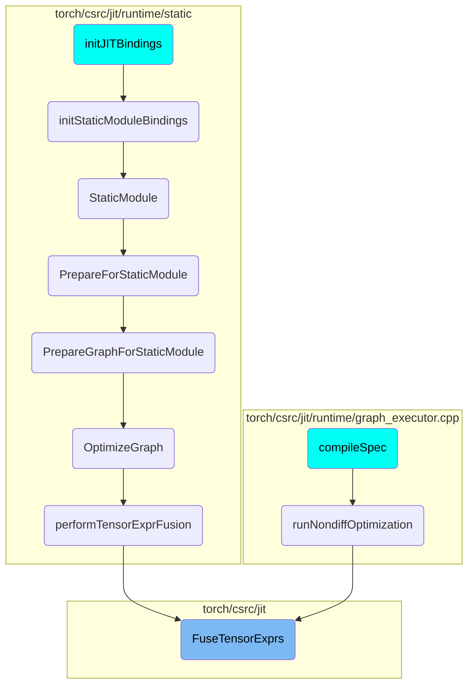

This document provides an overview of the `FuseTensorExprs` function, which is responsible for initiating the fusion process in a computational graph. The process involves several steps, including eliminating dead code, creating fusion groups, and handling dynamic shapes.

The `FuseTensorExprs` function starts by cleaning up unnecessary parts of the graph. It then creates a `TensorExprFuser` object and runs it to begin the fusion process. This involves grouping nodes that can be fused together, checking if nodes can be merged, and handling dynamic shapes if needed. The goal is to optimize the graph by merging compatible nodes into more efficient subgraphs.

# Flow drill down

```mermaid
graph TD;
      subgraph torchcsrcjit["torch/csrc/jit"]
b8b78bd21505e9248ee44d2ce7db57dac79f5dffb183b27919e4be1357e6b847(FuseTensorExprs):::mainFlowStyle --> 6830fdca911fcb2c6ed701e4ce6335f9d481743302888d42575e8f35c394d71f(run):::mainFlowStyle
end

subgraph torchcsrcjit["torch/csrc/jit"]
6830fdca911fcb2c6ed701e4ce6335f9d481743302888d42575e8f35c394d71f(run):::mainFlowStyle --> f182595c922f383d98717284ac8b0d2c98e3ae683d38d12998be8e6d0bc2060c(createFusionGroups):::mainFlowStyle
end

subgraph torchcsrcjit["torch/csrc/jit"]
f182595c922f383d98717284ac8b0d2c98e3ae683d38d12998be8e6d0bc2060c(createFusionGroups):::mainFlowStyle --> bcb8e667852f0000e330a31bf2071cf5d9a560542681de9b7b663454a2115fed(scanNode):::mainFlowStyle
end

subgraph torchcsrcjit["torch/csrc/jit"]
bcb8e667852f0000e330a31bf2071cf5d9a560542681de9b7b663454a2115fed(scanNode):::mainFlowStyle --> 7cd81b11762cbceafd83b7e755538c6ccd209930a546d33dfff5e4f8b417bf58(createFusionGroup):::mainFlowStyle
end

subgraph torchcsrcjit["torch/csrc/jit"]
7cd81b11762cbceafd83b7e755538c6ccd209930a546d33dfff5e4f8b417bf58(createFusionGroup):::mainFlowStyle --> 7273e86dad66f74118a3fa06636a025eb0654838a6857d93a4162cea0ee810a2(tryMerge):::mainFlowStyle
end

subgraph torchcsrcjit["torch/csrc/jit"]
7273e86dad66f74118a3fa06636a025eb0654838a6857d93a4162cea0ee810a2(tryMerge):::mainFlowStyle --> 89f2981aee47571a6b4c8c15e4243ba5cff71928990d4dfe6b3b06741570d3a1(canMerge):::mainFlowStyle
end

subgraph torchcsrcjit["torch/csrc/jit"]
89f2981aee47571a6b4c8c15e4243ba5cff71928990d4dfe6b3b06741570d3a1(canMerge):::mainFlowStyle --> 97f1cfd3019c7712b008acc0e60f620f11752c71b3440b6fabd0fbbc3b8268f5(canHandle):::mainFlowStyle
end

subgraph torchcsrcjit["torch/csrc/jit"]
97f1cfd3019c7712b008acc0e60f620f11752c71b3440b6fabd0fbbc3b8268f5(canHandle):::mainFlowStyle --> ba5bf7dcc196c58098d1d593230be16ca72848188aaa13ebc2015091c8b9efe9(shapeComputeGraphForSchema):::mainFlowStyle
end

subgraph torchcsrcjit["torch/csrc/jit"]
ba5bf7dcc196c58098d1d593230be16ca72848188aaa13ebc2015091c8b9efe9(shapeComputeGraphForSchema):::mainFlowStyle --> 768fca3cb009fbbbd3950f9c0c3fa44ada41832b9834eff324a0359e57bc4a81(loadFunctions):::mainFlowStyle
end

subgraph torchcsrcjit["torch/csrc/jit"]
768fca3cb009fbbbd3950f9c0c3fa44ada41832b9834eff324a0359e57bc4a81(loadFunctions):::mainFlowStyle --> 0840ac0b13b309038e57936ff04d29e205c548d60ccbd2dd30059ea37d610c02(loadModule):::mainFlowStyle
end

subgraph torchcsrcjit["torch/csrc/jit"]
0840ac0b13b309038e57936ff04d29e205c548d60ccbd2dd30059ea37d610c02(loadModule):::mainFlowStyle --> efbdd09d085c59918b9eaab547a5a6da6c33de7c542b0593a12aa311b488120a(conditionally_defined_ops):::mainFlowStyle
end


      classDef mainFlowStyle color:#000000,fill:#7CB9F4
classDef rootsStyle color:#000000,fill:#00FFF4
classDef Style1 color:#000000,fill:#00FFAA
classDef Style2 color:#000000,fill:#FFFF00
classDef Style3 color:#000000,fill:#AA7CB9
```



<SwmSnippet path="/torch/csrc/jit/passes/tensorexpr_fuser.cpp" line="1325">

---

## FuseTensorExprs

The function `FuseTensorExprs` initiates the fusion process by eliminating dead code and creating a `TensorExprFuser` object. It then calls the `run` method on this object to start the fusion process.

```c++
void FuseTensorExprs(
    std::shared_ptr<Graph>& graph,
    size_t min_group_size,
    bool add_composed_op,
    bool fuse_to_dynamic_shapes) {
  GRAPH_DUMP("Before TExprFuser: ", graph);

  // Temporary change for Block code generation.
  if (tensorexpr::getTEGenerateBlockCode()) {
    min_group_size = 1;
  }

  if (add_composed_op) {
    TORCH_INTERNAL_ASSERT(
        fuse_to_dynamic_shapes, "Fusing static shapes with composed op NYI");
  }

  // Get rid of dead code so that we don't waste effort fusing it.
  EliminateDeadCode(graph);

  TensorExprFuser fuser(
```

---

</SwmSnippet>

<SwmSnippet path="/torch/csrc/jit/passes/tensorexpr_fuser.cpp" line="549">

---

## run

The `run` function sets up the alias database and removes redundant profile nodes. It then calls `createFusionGroups` to merge fusible nodes into subgraphs and handles dynamic shapes if necessary.

```c++
  void run() {
    aliasDb_ = std::make_unique<AliasDb>(graph_);
    RemoveRedundantProfiles(graph_);
    GRAPH_DUMP("After removing redundant profile nodes: ", graph_);
    createFusionGroups(graph_->block());
    GRAPH_DUMP("After creating fusion groups: ", graph_);
    // we maintain alias db correctness during initial fusion, but it is
    // difficult to maintain correctness after inlining so inline only after
    // fusion is done.
    inlineSmallFusionGroups(graph_->block());
    GRAPH_DUMP("After inlining small fusion groups: ", graph_);
    if (fuse_to_dynamic_shapes_) {
      VLOG(1) << "TensorExpr fusion with dynamic shapes is enabled" << '\n';
      generalizeFusionGroups(graph_->block());
      GRAPH_DUMP("After generalizing fusion groups: ", graph_);
    } else {
      prepareFusionGroupAndGuardOutputs(graph_->block());
      GRAPH_DUMP("After guarding fusion groups: ", graph_);
    }
  }
```

---

</SwmSnippet>

<SwmSnippet path="/torch/csrc/jit/passes/tensorexpr_fuser.cpp" line="659">

---

## createFusionGroups

The `createFusionGroups` function iterates over the nodes in a block, attempting to merge fusible nodes into `prim::TensorExprGroup` subgraphs. It also tries to merge adjacent fusion groups to optimize the graph further.

```c++
  // Merge fusible nodes into subgraphs in prim::TensorExprGroup nodes.
  void createFusionGroups(Block* block) {
    bool any_changed = true;
    while (any_changed) {
      any_changed = false;
      for (auto it = block->nodes().rbegin(); it != block->nodes().rend();) {
        auto [tmp_it, changed] = scanNode(*it);
        it = tmp_it;
        any_changed |= changed;
      }
    }

    for (Node* n : block->nodes()) {
      for (Block* b : n->blocks()) {
        createFusionGroups(b);
      }
    }

    // Try to merge adjacent fusion groups together. Because we have only merged
    // by looking at graph inputs, without this we would not attempt to merge
    // adjacent fusion groups that don't have a dependency on each other
```

---

</SwmSnippet>

<SwmSnippet path="/torch/csrc/jit/passes/tensorexpr_fuser.cpp" line="643">

---

## scanNode

The `scanNode` function checks if a node can be handled for fusion. If it can, it calls `createFusionGroup` to start the fusion process from that node.

```c++
  std::pair<graph_node_list::iterator, bool> scanNode(Node* n) {
    GRAPH_DEBUG("Considering node:", *n)

    if (!canHandle(n)) {
      return std::make_pair(++n->reverseIterator(), false);
    }
    // There are some nodes that we can support, but we don't want to start a
    // fusion group from - skip them.
    if (n->kind() == prim::ListConstruct || n->kind() == aten::slice ||
        n->kind() == aten::unsqueeze || n->kind() == prim::ConstantChunk ||
        n->kind() == prim::Constant || unexecutedEagerOp(n)) {
      return std::make_pair(++n->reverseIterator(), false);
    }
    return createFusionGroup(n);
  }
```

---

</SwmSnippet>

<SwmSnippet path="/torch/csrc/jit/passes/tensorexpr_fuser.cpp" line="594">

---

## createFusionGroup

The `createFusionGroup` function creates a fusion group starting from a given node. It iteratively pulls input nodes into the fusion group until no more nodes can be merged.

```c++
  // Create a fusion group starting from the node N.
  // We then try to pull inputs into the fusion group and repeat that process
  // until there is nothing we can pull in.
  std::pair<graph_node_list::iterator, bool> createFusionGroup(
      Node* fusion_node) {
    // Allow single-node groups containing conv2d, since we'll only select
    // those in cases where the tensorexpr implementation is faster than the
    // aten implementation.
    if (min_group_size_ == 1 || fusion_node->kind() == aten::conv2d) {
      fusion_node = getOrCreateTensorExprSubgraph(fusion_node);
    }

    GRAPH_DEBUG("Iteratively pull input nodes into the fusion group...\n");
    auto inputs = sortReverseTopological(
        fusion_node->inputs(), fusion_node->owningBlock());
    for (auto input : inputs) {
      debugDumpFusionGroup("Current fusion group: ", fusion_node);
      GRAPH_DEBUG("Trying to merge: ", *input->node());
      if (auto maybe_fusion_group = tryMerge(fusion_node, input->node())) {
        // we successfully merged, so the new group's `inputs` may have
        // changed. So rescan the new group for more merging opportunities.
```

---

</SwmSnippet>

<SwmSnippet path="/torch/csrc/jit/passes/tensorexpr_fuser.cpp" line="777">

---

## tryMerge

The `tryMerge` function attempts to merge a node into an existing fusion group. It first moves the node next to the fusion group and then merges it into the fusion group's subgraph.

```c++
  std::optional<Node*> tryMerge(Node* fusion_group, Node* to_merge) {
    if (!canMerge(fusion_group, to_merge)) {
      return std::nullopt;
    }

    std::vector<Node*> nodes_to_merge = {to_merge};

    if (to_merge->kind() == aten::cat) {
      Node* listconstruct = to_merge->input(0)->node();
      nodes_to_merge.push_back(listconstruct);
    }

    // First, try to move all the nodes we want to fuse next to the fusion
    // group.
    Node* move_point = fusion_group;
    for (auto n : nodes_to_merge) {
      GRAPH_UPDATE("Trying to move node next to fusion group: ", getHeader(n));
      if (!aliasDb_->moveBeforeTopologicallyValid(n, move_point)) {
        GRAPH_UPDATE("Failed to move because of AliasDB checks!");
        return std::nullopt;
      }
```

---

</SwmSnippet>

<SwmSnippet path="/torch/csrc/jit/passes/tensorexpr_fuser.cpp" line="1158">

---

## canMerge

The `canMerge` function checks various conditions to determine if two nodes can be merged into a single fusion group. These conditions include symbolic checks, device checks, and alias checks.

```c++
  bool canMerge(Node* consumer, Node* producer) {
    // Only fuse within a block
    REQ(consumer->owningBlock() == producer->owningBlock());

    // Symbolic checks
    REQ(canHandle(producer) || producer->kind() == prim::TensorExprGroup);
    TORCH_INTERNAL_ASSERT(
        consumer->kind() == prim::TensorExprGroup || canHandle(consumer));

    // nvrtc has a limit on the number of arguments allowed in a CUDA kernel.
    // The specific limit is a function of constant memory size, amount
    // available to pass arguments, and some implementation dependence. Select a
    // safe limit here.
    constexpr size_t subgraphArgLimit = 128;
    auto const nInputs = consumer->inputs().size() +
        consumer->outputs().size() + producer->inputs().size() +
        producer->outputs().size();
    REQ(nInputs <= subgraphArgLimit);

    // Device checks
    if (consumer->kind() != aten::cat && producer->kind() != aten::cat) {
```

---

</SwmSnippet>

<SwmSnippet path="/torch/csrc/jit/passes/tensorexpr_fuser.cpp" line="1105">

---

## canHandle

The `canHandle` function checks if a node can be handled by the fusion process. It verifies that all shapes are known, the node is fusible on the device, and the node's type and operations are supported.

```c++
  bool canHandle(Node* node) {
    REQ(allShapesAreKnown(node));
    REQ(isFusableOnDevice(node));
    REQ(operators_not_to_fuse.find(node->kind()) ==
        operators_not_to_fuse.end());

    for (Value* input : node->inputs()) {
      if (auto const& tt = input->type()->cast<TensorType>()) {
        auto st = tt->scalarType();
        if (!st) {
          // All tensor types should be known.
          return false;
        }
        if (c10::isComplexType(*st) || c10::isQIntType(*st)) {
          return false;
        }
      }
    }
    if (node->kind() == aten::cat) {
      REQ(node->input(0)->node()->kind() == prim::ListConstruct);
      REQ(node->input(0)->uses().size() == 1);
```

---

</SwmSnippet>

<SwmSnippet path="/torch/csrc/jit/runtime/symbolic_shape_registry.cpp" line="380">

---

## shapeComputeGraphForSchema

The `shapeComputeGraphForSchema` function retrieves the shape compute graph for a given function schema. If the graph is not cached, it loads the necessary functions.

```c++
std::optional<std::shared_ptr<Graph>> shapeComputeGraphForSchema(
    const FunctionSchema& schema) {
  std::lock_guard<std::mutex> guard(lock);
  if (cached_schema_to_graph.empty()) {
    loadFunctions();
  }

  GRAPH_DEBUG("Trying to find schema: ", schema);
  auto cache_it = cached_schema_to_graph.find(&schema);
  if (cache_it != cached_schema_to_graph.end()) {
    return cache_it->second;
  }
  GRAPH_DEBUG("Could not find schema: ", schema);

  return std::nullopt;
}
```

---

</SwmSnippet>

<SwmSnippet path="/torch/csrc/jit/runtime/symbolic_shape_registry.cpp" line="354">

---

## loadFunctions

The `loadFunctions` function loads serialized shape compute functions and defines them in the compilation unit. It also handles errors by resetting the cache and compilation unit.

```c++
void loadFunctions() {
  try {
    auto shape_compute_functions =
        GetSerializedShapeFunctions() + _xnnpack_shape_compute_functions;

    auto src = std::make_shared<Source>(shape_compute_functions);
    std::stringstream ss;
    std::vector<at::IValue> constantTable;
    auto resolver = std::make_shared<SourceImporterImpl>(
        compilation_unit,
        &constantTable,
        [&](const std::string& name) -> std::shared_ptr<Source> { return src; },
        1);
    compilation_unit->define(
        std::nullopt, shape_compute_functions, resolver, nullptr);
    loadModule(*compilation_unit);
  } catch (...) {
    // Reset the cache and compilation unit so that we don't get weird errors
    // in later tests when one of the shape functions is invalid.
    compilation_unit = std::make_shared<CompilationUnit>();
    cached_schema_to_graph.clear();
```

---

</SwmSnippet>

<SwmSnippet path="/torch/csrc/jit/runtime/symbolic_shape_registry.cpp" line="301">

---

## loadModule

The `loadModule` function registers shape compute functions and their schemas in the compilation unit. It also handles the registration of bounded schemas for functions with common shape forms.

```c++
void loadModule(const CompilationUnit& module) {
  std::unordered_map<std::string, std::shared_ptr<Graph>> reused_functions;

  std::vector<std::pair<std::shared_ptr<Operator>, std::string>>
      operator_pairs = conditionally_defined_ops().getAllKeysAndValues();
  auto te_ops = get_tensorexpr_elementwise_set().getAllKeysAndValues();
  operator_pairs.insert(operator_pairs.end(), te_ops.begin(), te_ops.end());
  auto more_mappings = GetShapeFunctionMappings().getAllKeysAndValues();
  operator_pairs.insert(
      operator_pairs.end(), more_mappings.begin(), more_mappings.end());

  for (const auto& pair : operator_pairs) {
    const FunctionSchema* schema_string = &pair.first->schema();
    const std::string& shape_compute_function_name = pair.second;

    registerSchema(
        schema_string, shape_compute_function_name, reused_functions, module);

    // Register the inplace variant if any for functions with common shape forms
    if (shape_compute_function_name == "unary") {
      auto inplace_schema = getInplaceVariant(*schema_string);
```

---

</SwmSnippet>

<SwmSnippet path="/torch/csrc/jit/runtime/symbolic_shape_registry.cpp" line="59">

---

## conditionally_defined_ops

The `conditionally_defined_ops` function provides a map of conditionally defined operations. It includes various utility functions for handling shape compute graphs and registering schemas.

```c++
static const OperatorMap<std::string>& conditionally_defined_ops() {
  // clang-format off
  static const OperatorMap<std::string> schema_to_function_graph{
#ifdef USE_XNNPACK
      {"prepacked::conv2d_clamp_run(Tensor X, __torch__.torch.classes.xnnpack.Conv2dOpContext W_prepack) -> Tensor Y", "prepacked_conv2d_clamp_run"},
      {"prepacked::linear_clamp_run(Tensor X, __torch__.torch.classes.xnnpack.LinearOpContext W_prepack) -> Tensor Y", "prepacked_linear_clamp_run"},
#endif
  };
  // clang-format on
  return schema_to_function_graph;
}

std::unordered_map<const FunctionSchema*, std::shared_ptr<Graph>>
    cached_schema_to_graph;

std::unordered_map<const FunctionSchema*, BoundedShapeGraphs>
    cached_bounded_schema_to_graph;

// CompilationUnit that holds all these Functions and keeps them alive.
auto compilation_unit = std::make_shared<CompilationUnit>();

```

---

</SwmSnippet>

# Where is this flow used?

This flow is used multiple times in the codebase as represented in the following diagram:



&nbsp;

*This is an auto-generated document by Swimm AI 🌊 and has not yet been verified by a human*

<SwmMeta version="3.0.0" repo-id="Z2l0aHViJTNBJTNBcHl0b3JjaC1hdXRvZG9jcy1kZW1vJTNBJTNBU3dpbW0tRGVtbw==" repo-name="pytorch-autodocs-demo"><sup>Powered by [Swimm](https://app.swimm.io/)</sup></SwmMeta>
